# Glue opcodes report

Per-client NNLS fits of priced glue opcodes against their driver fixtures. Cycle-tier opcodes share one joint regression per client (shown once); pure-tier and mixed-tier opcodes each get a single-feature fit. Mixed-tier fits pre-adjust the LHS by subtracting the contribution of every priced upstream partner selected by the detector (pure ∪ cycle for `mixed_a`, plus `mixed_a` for `mixed_b`).

**Contents:** [besu](#besu) · [erigon](#erigon) · [ethrex](#ethrex) · [geth](#geth) · [nethermind](#nethermind) · [reth](#reth)

## besu

| glue_opcode | nobs | glue_runtime_ms | p_value | rsquared |
| --- | --- | --- | --- | --- |
| `ISZERO` | 3773 | 4.053e-06 | 1.00e-03 | 0.6127 |
| `JUMPDEST` | 3773 | 1.897e-06 | 1.00e-03 | 0.236 |
| `SWAP` | 60368 | 3.045e-06 | 1.00e-03 | 0.4767 |
| `CALLDATASIZE` | 224477 | 3.621e-06 | 1.00e-03 | 0.7918 |
| `DUP` | 224477 | 2.011e-06 | 1.00e-03 | 0.7918 |
| `GAS` | 224477 | 3.162e-06 | 1.00e-03 | 0.7918 |
| `MLOAD` | 224477 | 9.619e-06 | 1.00e-03 | 0.7918 |
| `PUSH` | 224477 | 2.462e-06 | 1.00e-03 | 0.7918 |
| `PUSH0` | 224477 | 1.916e-06 | 1.00e-03 | 0.7918 |
| `STATICCALL` | 224477 | 0.0007667 | 1.00e-03 | 0.7918 |
| `ADD` | 3773 | 8.036e-06 | 1.00e-03 | 0.579 |
| `AND` | 3773 | 6.455e-06 | 1.00e-03 | 0.4202 |
| `CALLDATACOPY` | 90552 | 8.644e-06 | 1.00e-03 | 0.3918 |
| `CALLDATALOAD` | 15092 | 0 | 1.00e+00 | 0 |
| `DIV` | 3773 | 1.314e-05 | 1.00e-03 | 0.6479 |
| `EXP` | 3773 | 0.001092 | 1.00e-03 | 0.7561 |
| `GT` | 3773 | 1.95e-05 | 1.00e-03 | 0.1545 |
| `JUMPI` | 3773 | 3.137e-06 | 1.00e-03 | 0.09332 |
| `LT` | 3773 | 1.96e-05 | 1.00e-03 | 0.1504 |
| `MSTORE` | 18865 | 1.234e-05 | 1.00e-03 | 0.7039 |
| `MSTORE8` | 18865 | 6.991e-06 | 1.00e-03 | 0.3184 |
| `MUL` | 3773 | 7.87e-06 | 1.00e-03 | 0.4045 |
| `PC` | 3773 | 2.852e-06 | 1.00e-03 | 0.4266 |
| `RETURNDATASIZE` | 15092 | 5.632e-06 | 1.00e-03 | 0.4 |
| `SELFBALANCE` | 3087 | 7.3e-06 | 1.00e-03 | 0.4414 |
| `SUB` | 3773 | 8.616e-06 | 1.00e-03 | 0.5454 |
| `JUMP` | 3773 | 1.738e-05 | 1.00e-03 | 0.2776 |
| `KECCAK256` | 60368 | 2.77e-05 | 1.00e-03 | 0.1074 |

### Cycle glue — joint fit · besu

<details><summary>Joint NNLS regression summary</summary>

```
==============================================================================
                           NNLS Regression Results                            
==============================================================================
Dep. Variable:          test_runtime_ms              R-squared:          0.792
Model:                  NNLS                    Adj. R-squared:          0.792
No. Observations:       224477                            RMSE:          72.82
Df Residuals:           224469                             MAE:          61.99
Df Model:               7      
==============================================================================
                      coef     std err     P-value      [0.025      0.975]
------------------------------------------------------------------------------
         const     68.2579      0.4805       0.001     67.3189     69.2561
  CALLDATASIZE      0.0000      0.0000       0.001      0.0000      0.0000
           DUP      0.0000      0.0000       0.001      0.0000      0.0000
           GAS      0.0000      0.0000       0.001      0.0000      0.0000
         MLOAD      0.0000      0.0000       0.001      0.0000      0.0000
          PUSH      0.0000      0.0000       0.001      0.0000      0.0000
         PUSH0      0.0000      0.0000       0.001      0.0000      0.0000
    STATICCALL      0.0008      0.0000       0.001      0.0008      0.0008
==============================================================================
Notes: Non-negative least squares with bootstrap inference (1000 iterations)
==============================================================================
```

</details>

<details><summary><code>CALLDATASIZE</code> · nobs=224477 · runtime_ms=3.621e-06 · p=1.00e-03 · R²=0.7918</summary>

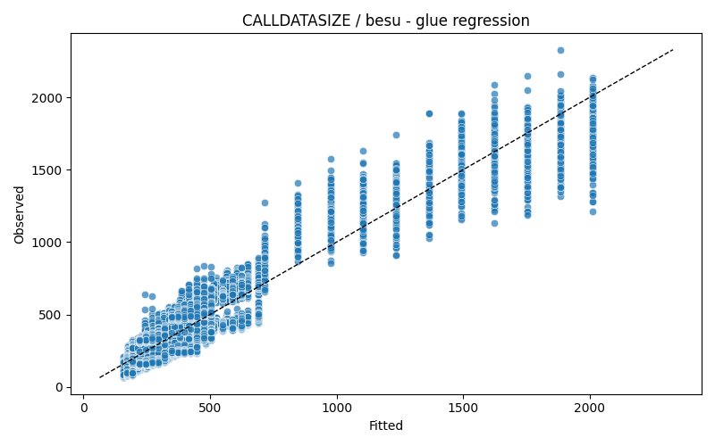

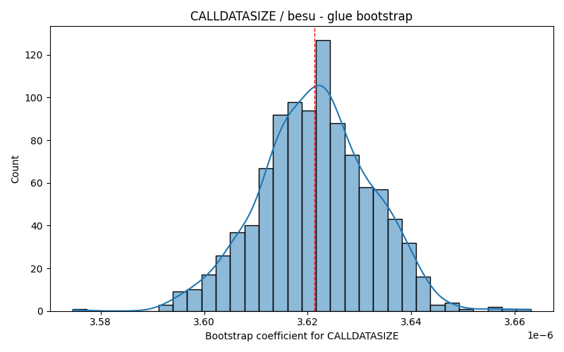


</details>

<details><summary><code>DUP</code> · nobs=224477 · runtime_ms=2.011e-06 · p=1.00e-03 · R²=0.7918</summary>


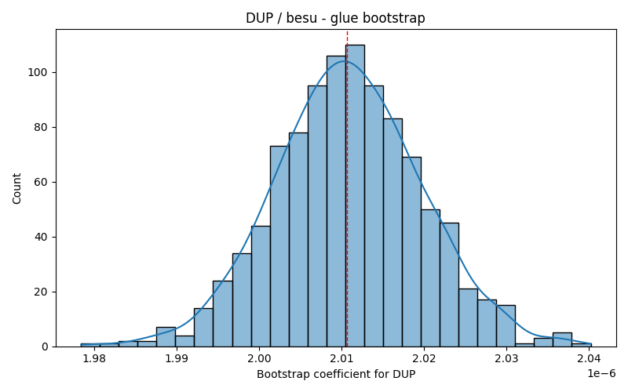


</details>

<details><summary><code>GAS</code> · nobs=224477 · runtime_ms=3.162e-06 · p=1.00e-03 · R²=0.7918</summary>


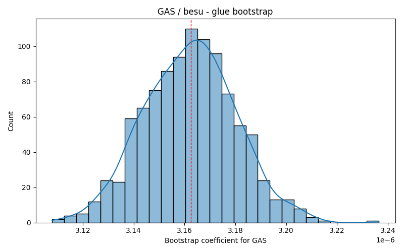


</details>

<details><summary><code>MLOAD</code> · nobs=224477 · runtime_ms=9.619e-06 · p=1.00e-03 · R²=0.7918</summary>


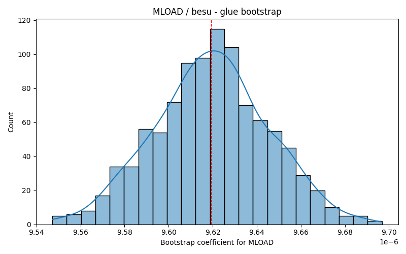


</details>

<details><summary><code>PUSH</code> · nobs=224477 · runtime_ms=2.462e-06 · p=1.00e-03 · R²=0.7918</summary>

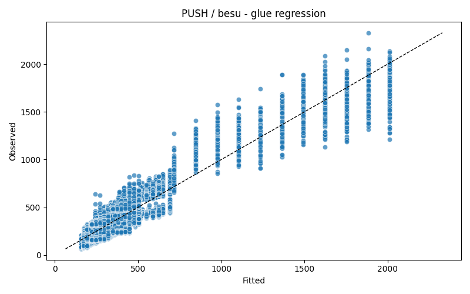

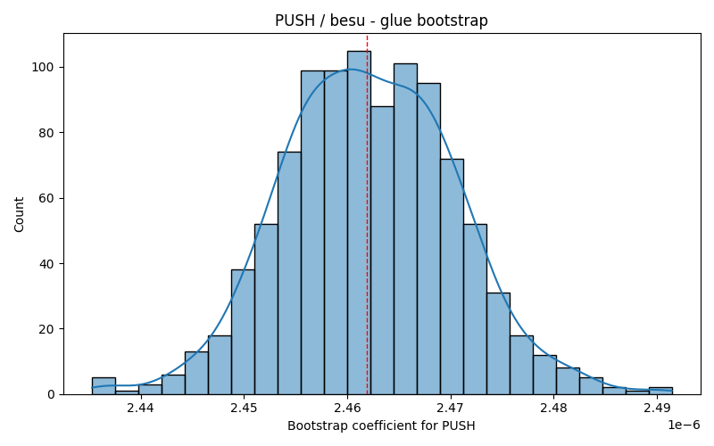


</details>

<details><summary><code>PUSH0</code> · nobs=224477 · runtime_ms=1.916e-06 · p=1.00e-03 · R²=0.7918</summary>


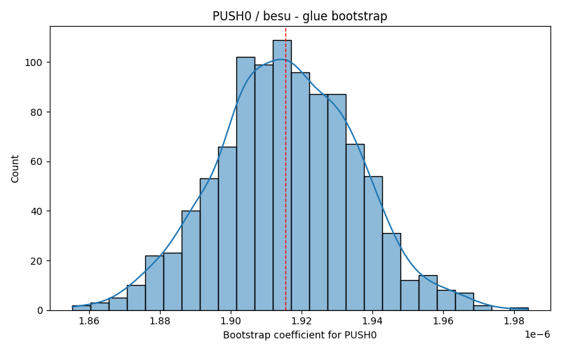


</details>

<details><summary><code>STATICCALL</code> · nobs=224477 · runtime_ms=0.0007667 · p=1.00e-03 · R²=0.7918</summary>

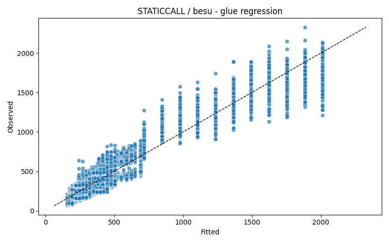

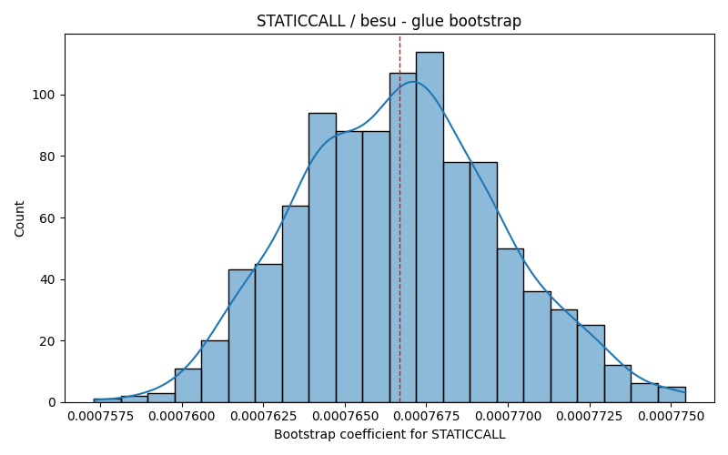

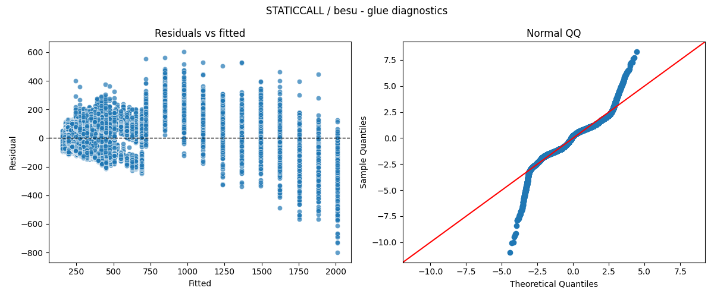

</details>

### Pure glue · besu

<details><summary><code>ISZERO</code> · nobs=3773 · runtime_ms=4.053e-06 · p=1.00e-03 · R²=0.6127</summary>

```
==============================================================================
                           NNLS Regression Results                            
==============================================================================
Dep. Variable:          test_runtime_ms              R-squared:          0.613
Model:                  NNLS                    Adj. R-squared:          0.613
No. Observations:       3773                              RMSE:          67.84
Df Residuals:           3771                               MAE:          59.20
Df Model:               1      
==============================================================================
                      coef     std err     P-value      [0.025      0.975]
------------------------------------------------------------------------------
         const     76.6323      3.4905       0.001     70.1612     83.1594
        ISZERO      0.0000      0.0000       0.001      0.0000      0.0000
==============================================================================
Notes: Non-negative least squares with bootstrap inference (1000 iterations)
==============================================================================
```

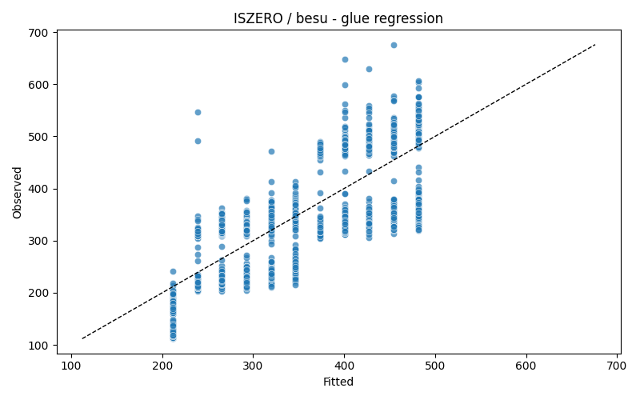

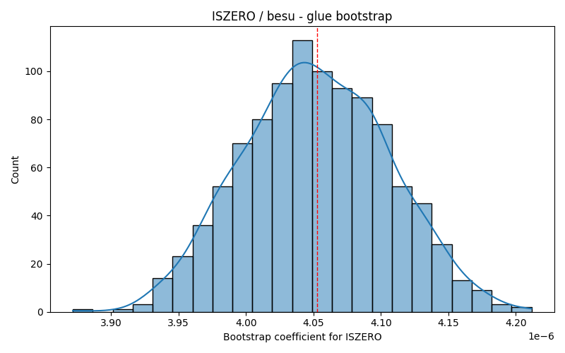

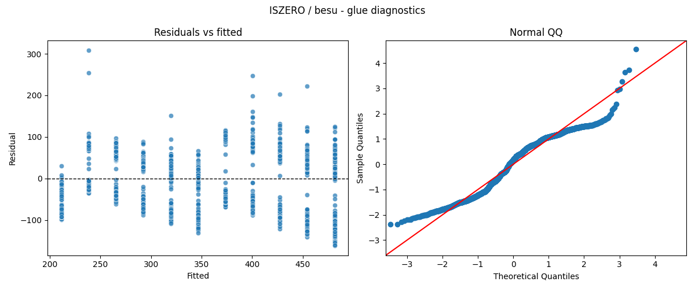

</details>

<details><summary><code>JUMPDEST</code> · nobs=3773 · runtime_ms=1.897e-06 · p=1.00e-03 · R²=0.236</summary>

```
==============================================================================
                           NNLS Regression Results                            
==============================================================================
Dep. Variable:          test_runtime_ms              R-squared:          0.236
Model:                  NNLS                    Adj. R-squared:          0.236
No. Observations:       3773                              RMSE:         215.58
Df Residuals:           3771                               MAE:         196.16
Df Model:               1      
==============================================================================
                      coef     std err     P-value      [0.025      0.975]
------------------------------------------------------------------------------
         const     66.7720     10.5972       0.001     46.4668     87.1674
      JUMPDEST      0.0000      0.0000       0.001      0.0000      0.0000
==============================================================================
Notes: Non-negative least squares with bootstrap inference (1000 iterations)
==============================================================================
```

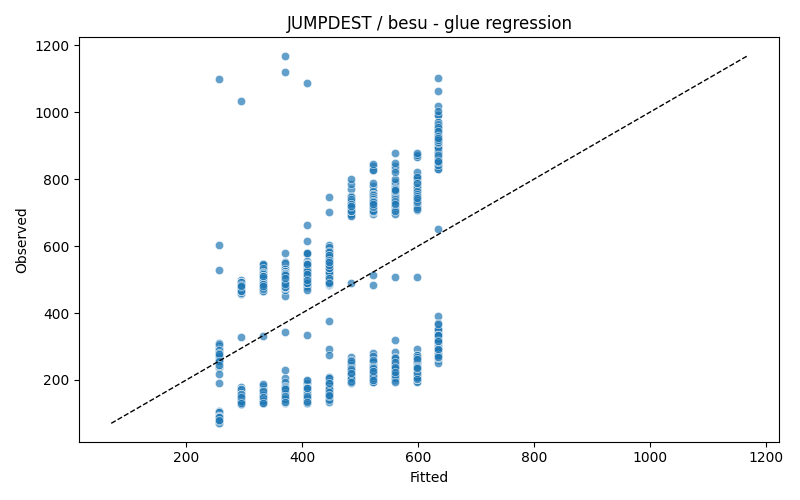

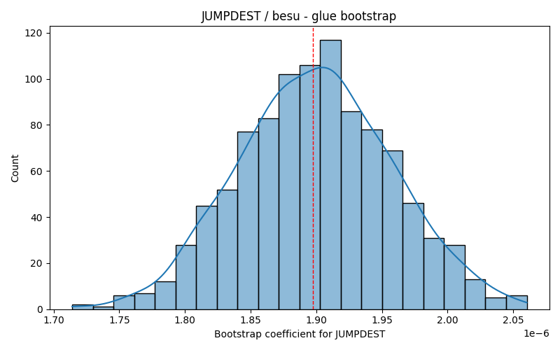

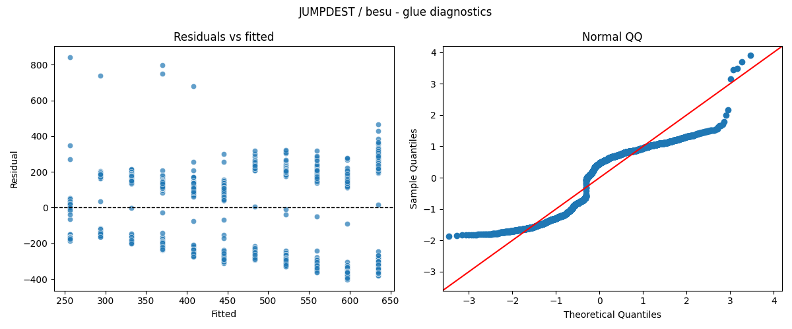

</details>

<details><summary><code>SWAP</code> · nobs=60368 · runtime_ms=3.045e-06 · p=1.00e-03 · R²=0.4767</summary>

```
==============================================================================
                           NNLS Regression Results                            
==============================================================================
Dep. Variable:          test_runtime_ms              R-squared:          0.477
Model:                  NNLS                    Adj. R-squared:          0.477
No. Observations:       60368                             RMSE:          67.18
Df Residuals:           60366                              MAE:          59.55
Df Model:               1      
==============================================================================
                      coef     std err     P-value      [0.025      0.975]
------------------------------------------------------------------------------
         const     61.5412      0.7966       0.001     59.9765     63.1069
          SWAP      0.0000      0.0000       0.001      0.0000      0.0000
==============================================================================
Notes: Non-negative least squares with bootstrap inference (1000 iterations)
==============================================================================
```

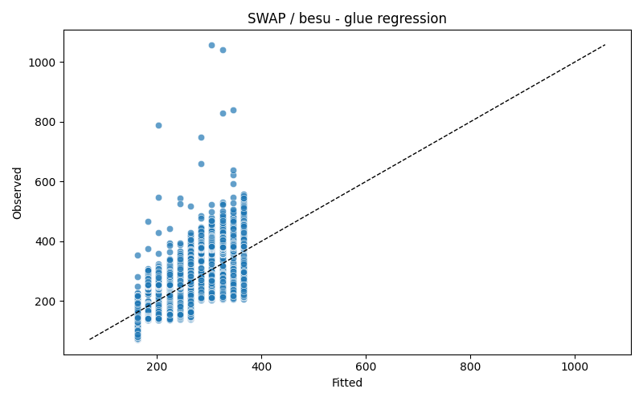

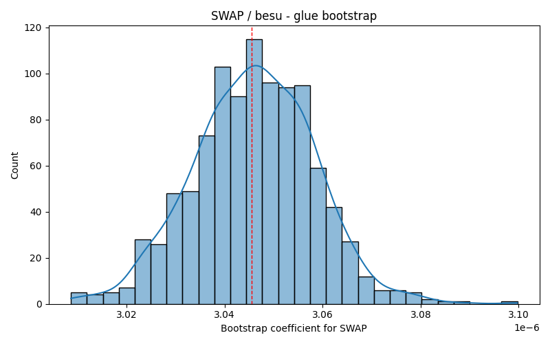

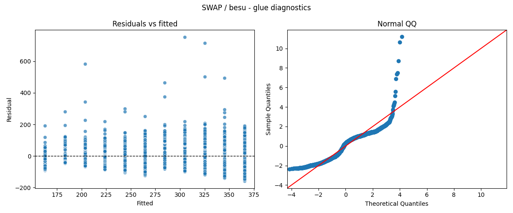

</details>

### Mixed glue (tier A) · besu

<details><summary><code>ADD</code> · nobs=3773 · runtime_ms=8.036e-06 · p=1.00e-03 · R²=0.579</summary>

```
==============================================================================
                           NNLS Regression Results                            
==============================================================================
Dep. Variable:          test_runtime_ms              R-squared:          0.579
Model:                  NNLS                    Adj. R-squared:          0.579
No. Observations:       3773                              RMSE:          72.12
Df Residuals:           3771                               MAE:          57.44
Df Model:               1      
==============================================================================
                      coef     std err     P-value      [0.025      0.975]
------------------------------------------------------------------------------
         const    116.9171      3.6765       0.001    109.6892    123.6816
           ADD      0.0000      0.0000       0.001      0.0000      0.0000
==============================================================================
Notes: Non-negative least squares with bootstrap inference (1000 iterations)
==============================================================================
```

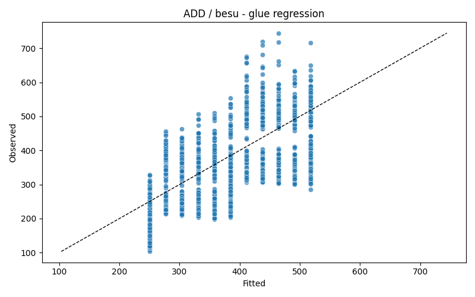

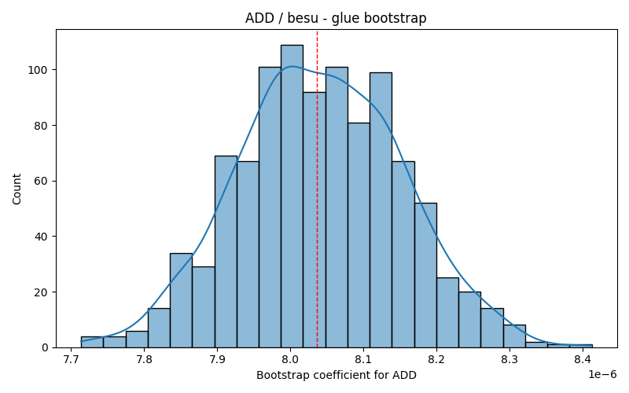

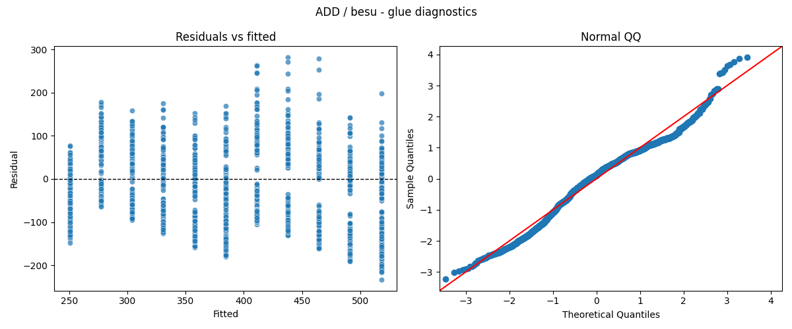

</details>

<details><summary><code>AND</code> · nobs=3773 · runtime_ms=6.455e-06 · p=1.00e-03 · R²=0.4202</summary>

```
==============================================================================
                           NNLS Regression Results                            
==============================================================================
Dep. Variable:          test_runtime_ms              R-squared:          0.420
Model:                  NNLS                    Adj. R-squared:          0.420
No. Observations:       3773                              RMSE:          79.80
Df Residuals:           3771                               MAE:          64.49
Df Model:               1      
==============================================================================
                      coef     std err     P-value      [0.025      0.975]
------------------------------------------------------------------------------
         const     84.2969      3.9843       0.001     76.6640     92.1031
           AND      0.0000      0.0000       0.001      0.0000      0.0000
==============================================================================
Notes: Non-negative least squares with bootstrap inference (1000 iterations)
==============================================================================
```

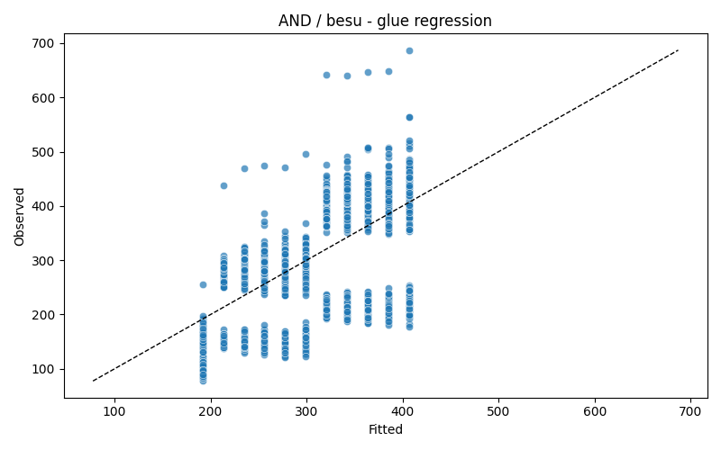

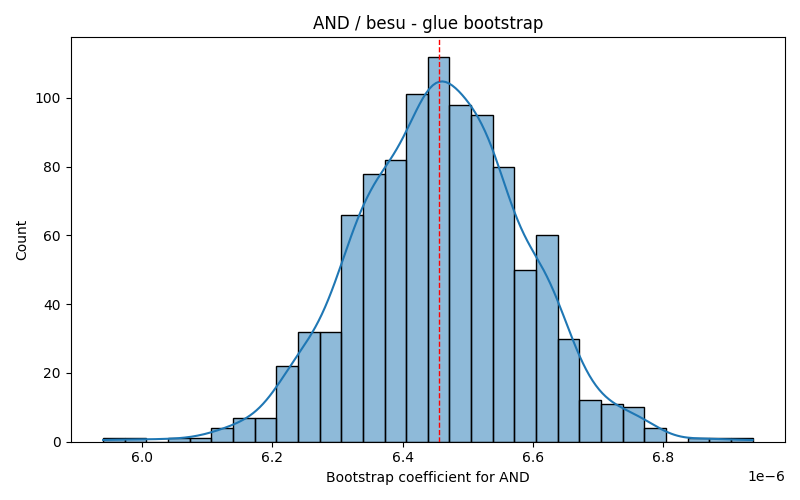

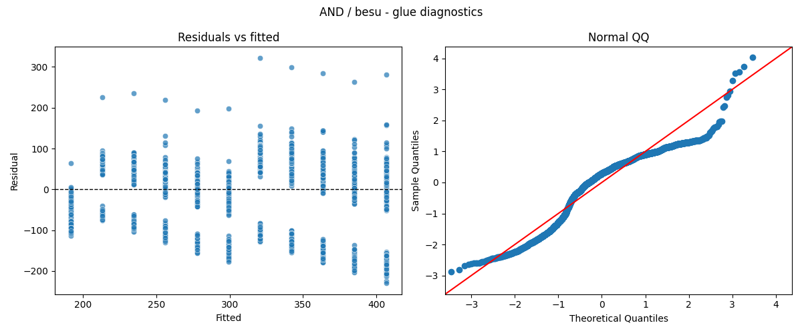

</details>

<details><summary><code>CALLDATACOPY</code> · nobs=90552 · runtime_ms=8.644e-06 · p=1.00e-03 · R²=0.3918</summary>

```
==============================================================================
                           NNLS Regression Results                            
==============================================================================
Dep. Variable:          test_runtime_ms              R-squared:          0.392
Model:                  NNLS                    Adj. R-squared:          0.392
No. Observations:       90552                             RMSE:          81.00
Df Residuals:           90550                              MAE:          59.58
Df Model:               1      
==============================================================================
                      coef     std err     P-value      [0.025      0.975]
------------------------------------------------------------------------------
         const    119.5759      0.3283       0.001    118.9560    120.1999
  CALLDATACOPY      0.0000      0.0000       0.001      0.0000      0.0000
==============================================================================
Notes: Non-negative least squares with bootstrap inference (1000 iterations)
==============================================================================
```

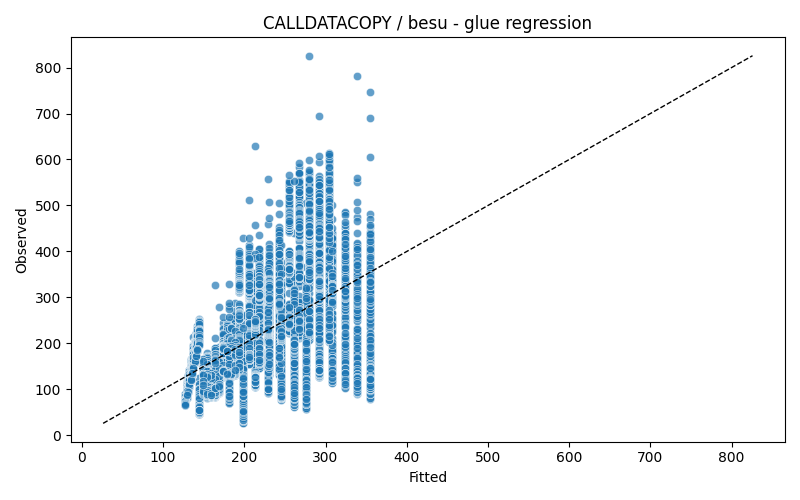

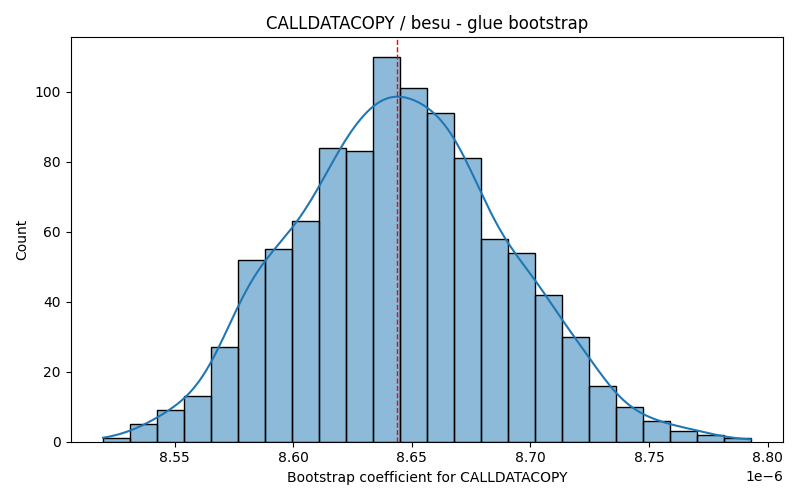

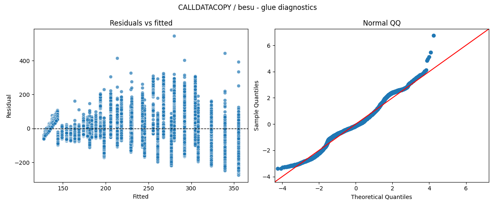

</details>

<details><summary><code>CALLDATALOAD</code> · nobs=15092 · runtime_ms=0 · p=1.00e+00 · R²=0</summary>

```
==============================================================================
                           NNLS Regression Results                            
==============================================================================
Dep. Variable:          test_runtime_ms              R-squared:          0.000
Model:                  NNLS                    Adj. R-squared:         -0.000
No. Observations:       15092                             RMSE:           0.82
Df Residuals:           15090                              MAE:           0.57
Df Model:               1      
==============================================================================
                      coef     std err     P-value      [0.025      0.975]
------------------------------------------------------------------------------
         const      3.7557      0.0074       0.001      3.7401      3.7693
  CALLDATALOAD      0.0000      0.0000       1.000      0.0000      0.0000
==============================================================================
Notes: Non-negative least squares with bootstrap inference (1000 iterations)
==============================================================================
```

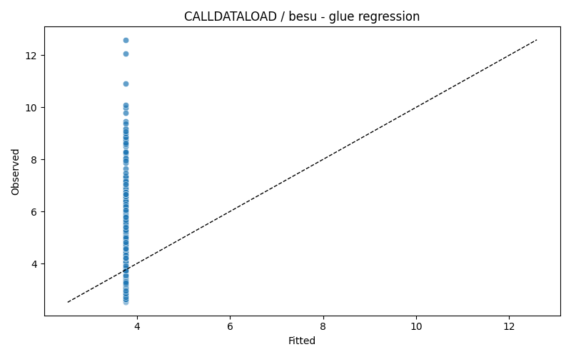

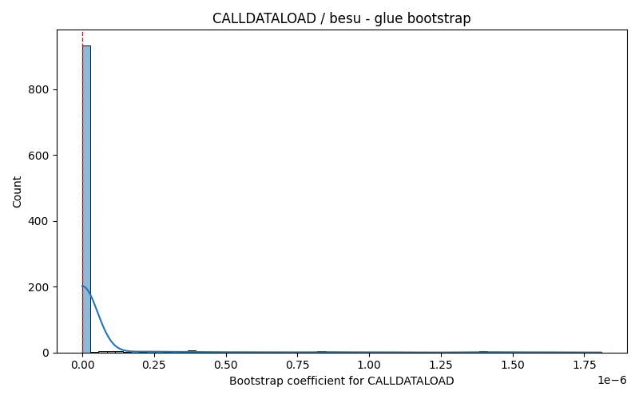

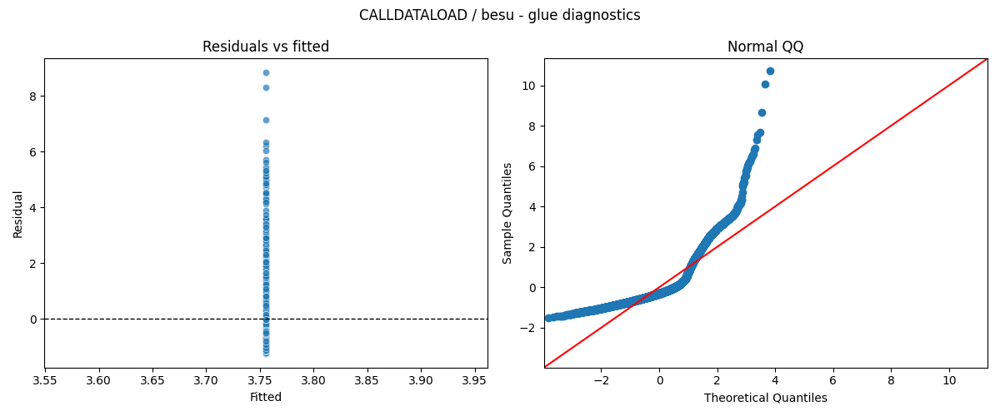

</details>

<details><summary><code>DIV</code> · nobs=3773 · runtime_ms=1.314e-05 · p=1.00e-03 · R²=0.6479</summary>

```
==============================================================================
                           NNLS Regression Results                            
==============================================================================
Dep. Variable:          test_runtime_ms              R-squared:          0.648
Model:                  NNLS                    Adj. R-squared:          0.648
No. Observations:       3773                              RMSE:          76.49
Df Residuals:           3771                               MAE:          62.38
Df Model:               1      
==============================================================================
                      coef     std err     P-value      [0.025      0.975]
------------------------------------------------------------------------------
         const    141.6081      3.4866       0.001    134.5772    148.2109
           DIV      0.0000      0.0000       0.001      0.0000      0.0000
==============================================================================
Notes: Non-negative least squares with bootstrap inference (1000 iterations)
==============================================================================
```

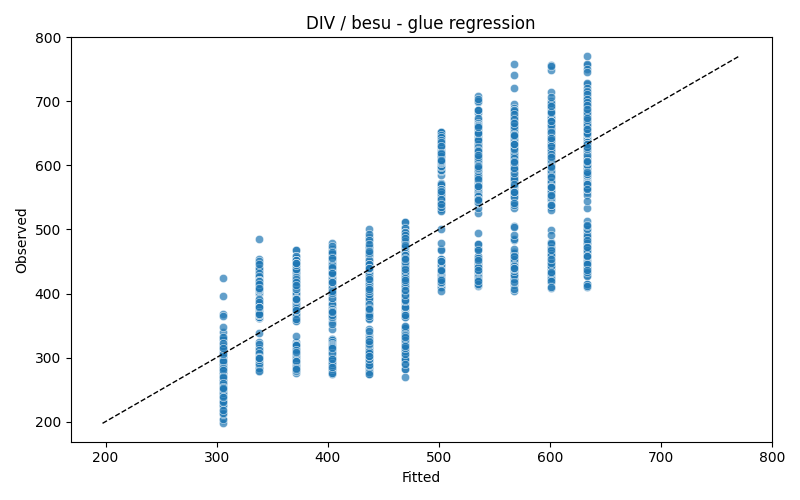

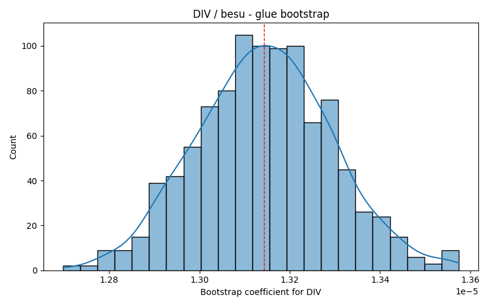

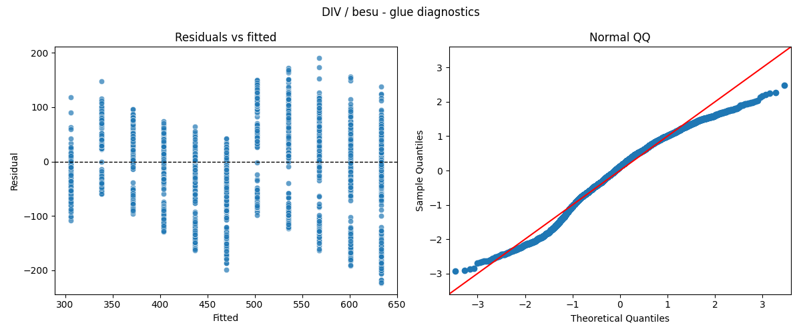

</details>

<details><summary><code>EXP</code> · nobs=3773 · runtime_ms=0.001092 · p=1.00e-03 · R²=0.7561</summary>

```
==============================================================================
                           NNLS Regression Results                            
==============================================================================
Dep. Variable:          test_runtime_ms              R-squared:          0.756
Model:                  NNLS                    Adj. R-squared:          0.756
No. Observations:       3773                              RMSE:          24.28
Df Residuals:           3771                               MAE:          18.45
Df Model:               1      
==============================================================================
                      coef     std err     P-value      [0.025      0.975]
------------------------------------------------------------------------------
         const     95.6895      1.5837       0.001     92.6378     98.6249
           EXP      0.0011      0.0000       0.001      0.0011      0.0011
==============================================================================
Notes: Non-negative least squares with bootstrap inference (1000 iterations)
==============================================================================
```

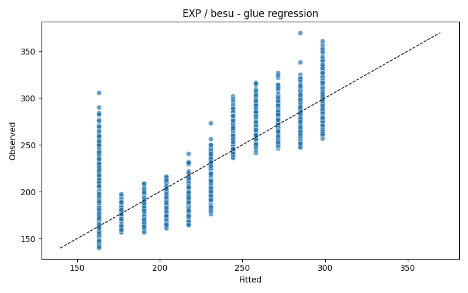

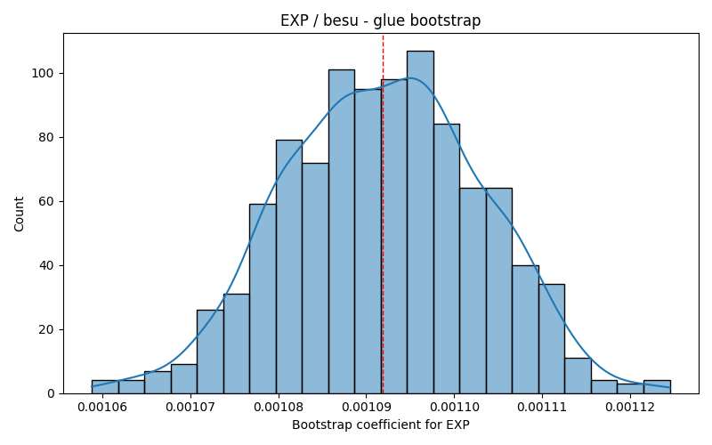

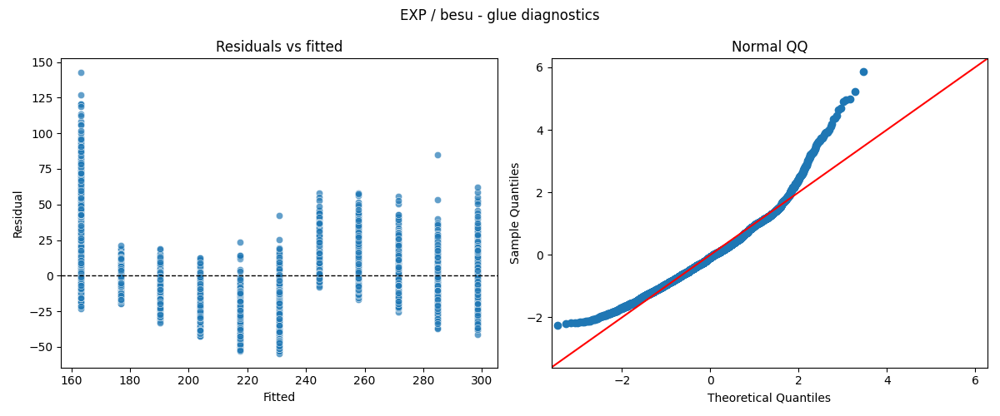

</details>

<details><summary><code>GT</code> · nobs=3773 · runtime_ms=1.95e-05 · p=1.00e-03 · R²=0.1545</summary>

```
==============================================================================
                           NNLS Regression Results                            
==============================================================================
Dep. Variable:          test_runtime_ms              R-squared:          0.155
Model:                  NNLS                    Adj. R-squared:          0.154
No. Observations:       3773                              RMSE:         479.96
Df Residuals:           3771                               MAE:         444.19
Df Model:               1      
==============================================================================
                      coef     std err     P-value      [0.025      0.975]
------------------------------------------------------------------------------
         const    140.0736     22.5585       0.001     97.8061    186.0613
            GT      0.0000      0.0000       0.001      0.0000      0.0000
==============================================================================
Notes: Non-negative least squares with bootstrap inference (1000 iterations)
==============================================================================
```

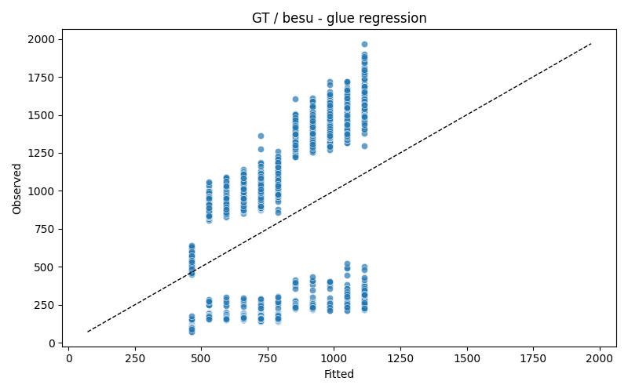

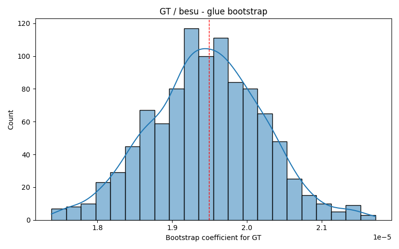

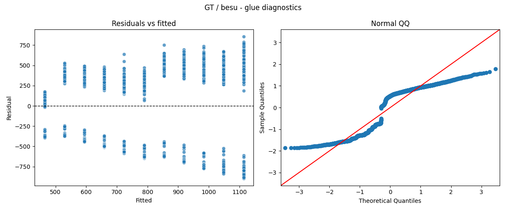

</details>

<details><summary><code>JUMPI</code> · nobs=3773 · runtime_ms=3.137e-06 · p=1.00e-03 · R²=0.09332</summary>

```
==============================================================================
                           NNLS Regression Results                            
==============================================================================
Dep. Variable:          test_runtime_ms              R-squared:          0.093
Model:                  NNLS                    Adj. R-squared:          0.093
No. Observations:       3773                              RMSE:          44.12
Df Residuals:           3771                               MAE:          40.02
Df Model:               1      
==============================================================================
                      coef     std err     P-value      [0.025      0.975]
------------------------------------------------------------------------------
         const     31.9697      2.0168       0.001     27.9813     35.9037
         JUMPI      0.0000      0.0000       0.001      0.0000      0.0000
==============================================================================
Notes: Non-negative least squares with bootstrap inference (1000 iterations)
==============================================================================
```

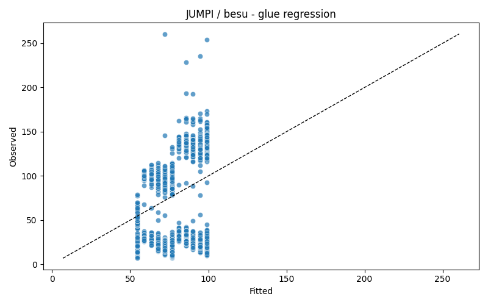

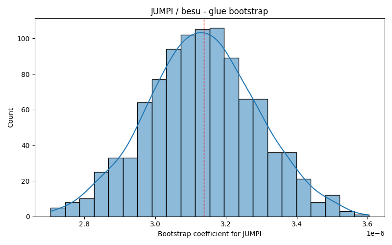

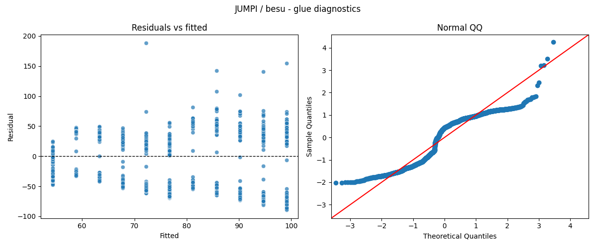

</details>

<details><summary><code>LT</code> · nobs=3773 · runtime_ms=1.96e-05 · p=1.00e-03 · R²=0.1504</summary>

```
==============================================================================
                           NNLS Regression Results                            
==============================================================================
Dep. Variable:          test_runtime_ms              R-squared:          0.150
Model:                  NNLS                    Adj. R-squared:          0.150
No. Observations:       3773                              RMSE:         490.18
Df Residuals:           3771                               MAE:         454.72
Df Model:               1      
==============================================================================
                      coef     std err     P-value      [0.025      0.975]
------------------------------------------------------------------------------
         const    170.0391     23.2138       0.001    127.0284    215.0015
            LT      0.0000      0.0000       0.001      0.0000      0.0000
==============================================================================
Notes: Non-negative least squares with bootstrap inference (1000 iterations)
==============================================================================
```

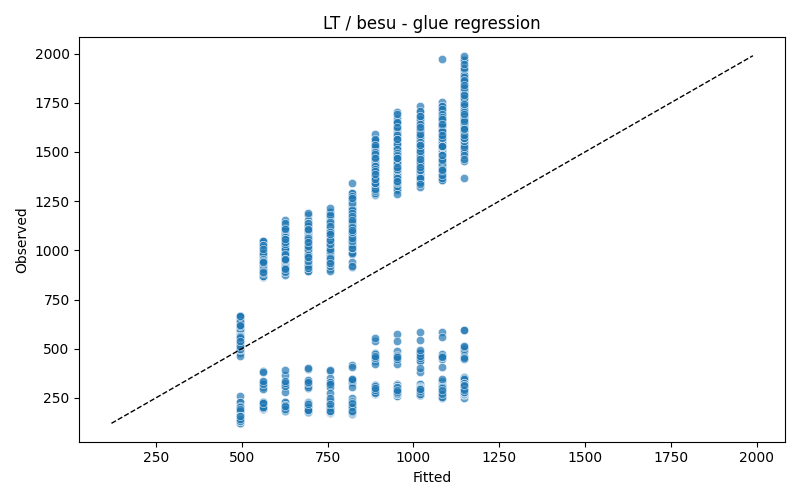

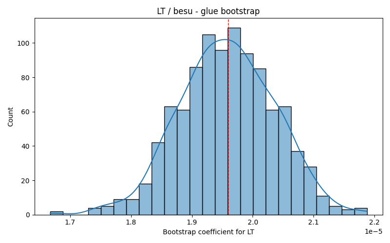

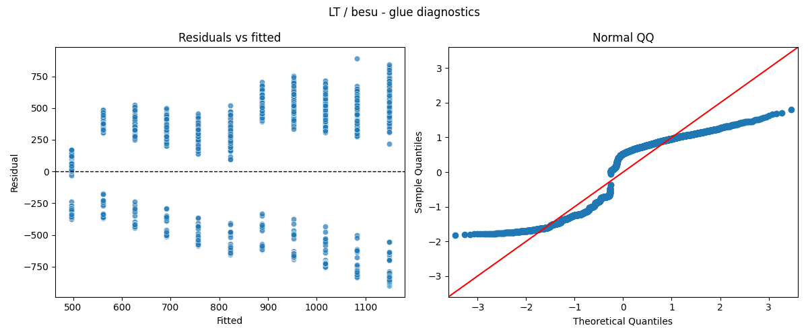

</details>

<details><summary><code>MSTORE</code> · nobs=18865 · runtime_ms=1.234e-05 · p=1.00e-03 · R²=0.7039</summary>

```
==============================================================================
                           NNLS Regression Results                            
==============================================================================
Dep. Variable:          test_runtime_ms              R-squared:          0.704
Model:                  NNLS                    Adj. R-squared:          0.704
No. Observations:       18865                             RMSE:          56.15
Df Residuals:           18863                              MAE:          45.92
Df Model:               1      
==============================================================================
                      coef     std err     P-value      [0.025      0.975]
------------------------------------------------------------------------------
         const    106.3334      1.4446       0.001    103.3241    109.0378
        MSTORE      0.0000      0.0000       0.001      0.0000      0.0000
==============================================================================
Notes: Non-negative least squares with bootstrap inference (1000 iterations)
==============================================================================
```

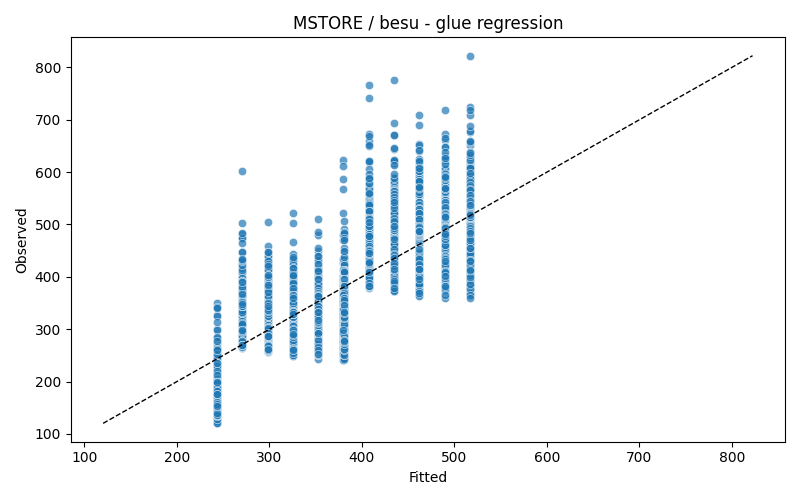

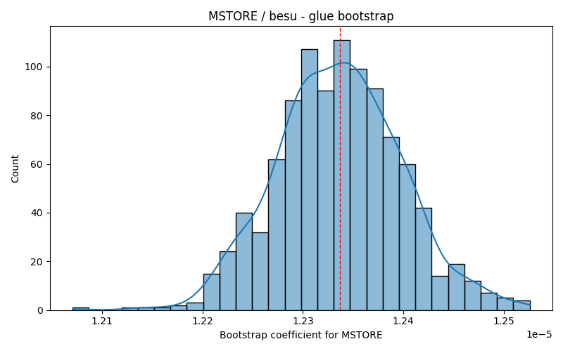

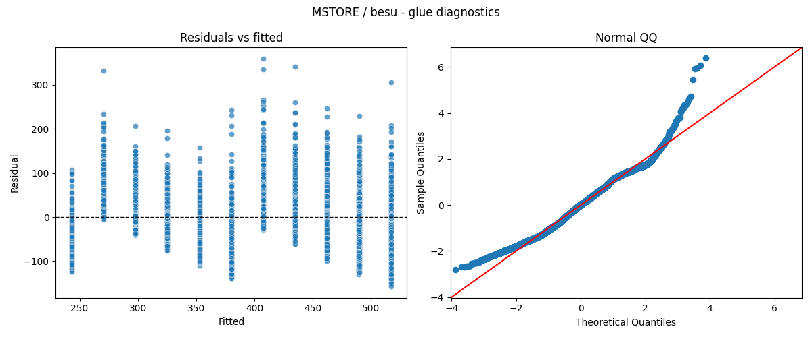

</details>

<details><summary><code>MSTORE8</code> · nobs=18865 · runtime_ms=6.991e-06 · p=1.00e-03 · R²=0.3184</summary>

```
==============================================================================
                           NNLS Regression Results                            
==============================================================================
Dep. Variable:          test_runtime_ms              R-squared:          0.318
Model:                  NNLS                    Adj. R-squared:          0.318
No. Observations:       18865                             RMSE:          71.78
Df Residuals:           18863                              MAE:          63.58
Df Model:               1      
==============================================================================
                      coef     std err     P-value      [0.025      0.975]
------------------------------------------------------------------------------
         const     73.1732      1.5560       0.001     70.1786     76.2017
       MSTORE8      0.0000      0.0000       0.001      0.0000      0.0000
==============================================================================
Notes: Non-negative least squares with bootstrap inference (1000 iterations)
==============================================================================
```

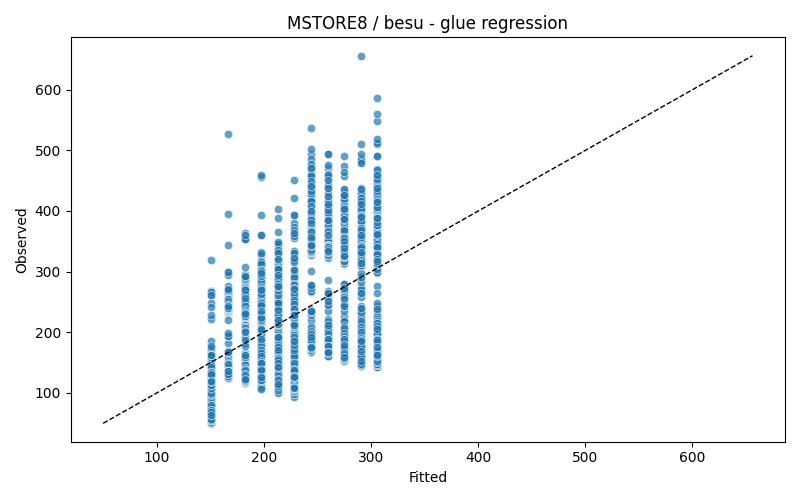

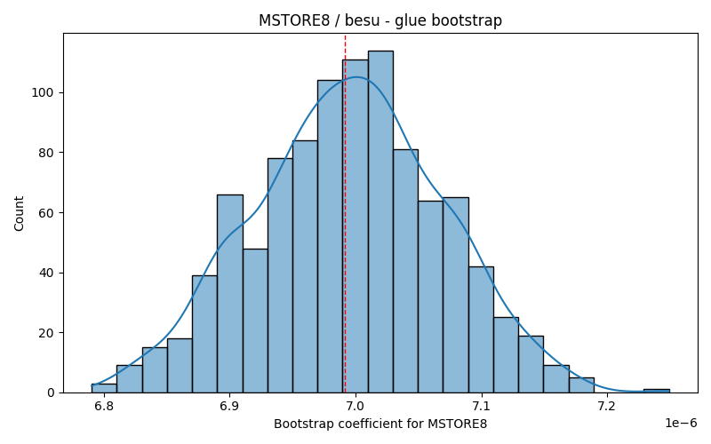

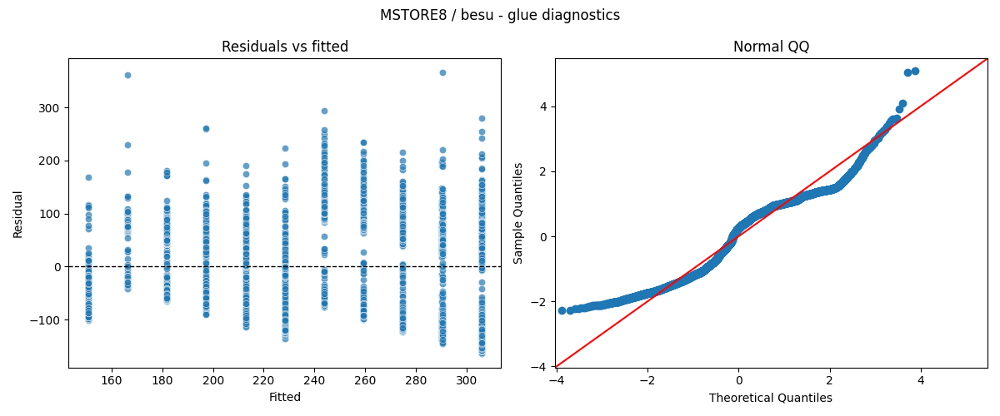

</details>

<details><summary><code>MUL</code> · nobs=3773 · runtime_ms=7.87e-06 · p=1.00e-03 · R²=0.4045</summary>

```
==============================================================================
                           NNLS Regression Results                            
==============================================================================
Dep. Variable:          test_runtime_ms              R-squared:          0.405
Model:                  NNLS                    Adj. R-squared:          0.404
No. Observations:       3773                              RMSE:          75.38
Df Residuals:           3771                               MAE:          57.19
Df Model:               1      
==============================================================================
                      coef     std err     P-value      [0.025      0.975]
------------------------------------------------------------------------------
         const    111.4368      3.5971       0.001    104.4123    118.1713
           MUL      0.0000      0.0000       0.001      0.0000      0.0000
==============================================================================
Notes: Non-negative least squares with bootstrap inference (1000 iterations)
==============================================================================
```

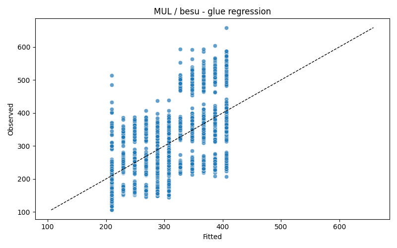

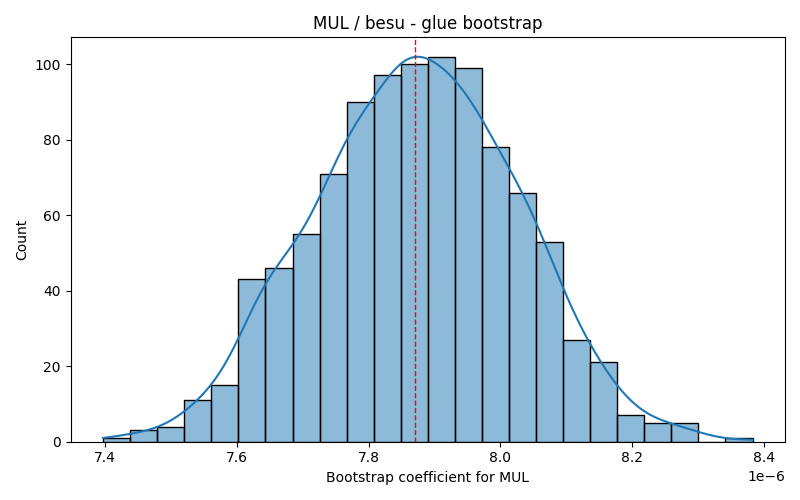

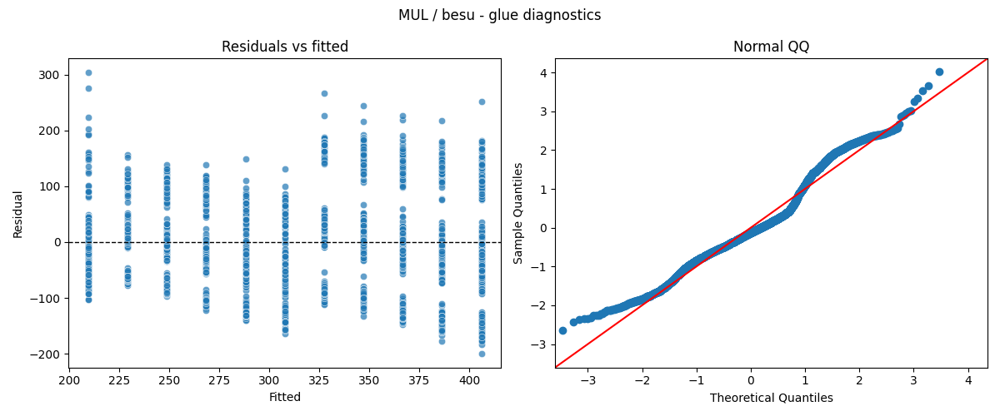

</details>

<details><summary><code>PC</code> · nobs=3773 · runtime_ms=2.852e-06 · p=1.00e-03 · R²=0.4266</summary>

```
==============================================================================
                           NNLS Regression Results                            
==============================================================================
Dep. Variable:          test_runtime_ms              R-squared:          0.427
Model:                  NNLS                    Adj. R-squared:          0.426
No. Observations:       3773                              RMSE:          98.86
Df Residuals:           3771                               MAE:          88.50
Df Model:               1      
==============================================================================
                      coef     std err     P-value      [0.025      0.975]
------------------------------------------------------------------------------
         const     97.5942      4.7223       0.001     87.9668    106.8493
            PC      0.0000      0.0000       0.001      0.0000      0.0000
==============================================================================
Notes: Non-negative least squares with bootstrap inference (1000 iterations)
==============================================================================
```

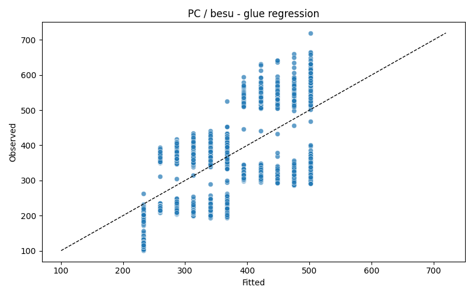

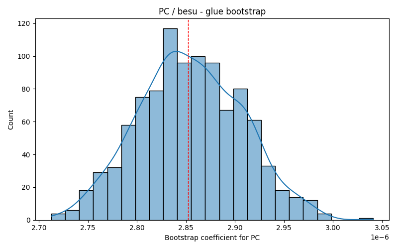

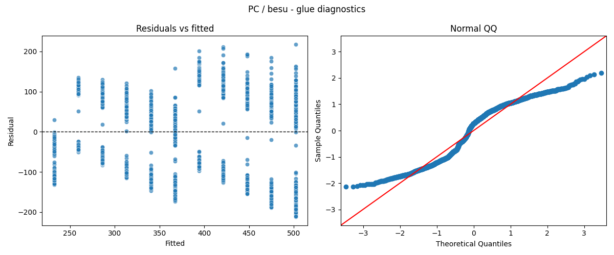

</details>

<details><summary><code>RETURNDATASIZE</code> · nobs=15092 · runtime_ms=5.632e-06 · p=1.00e-03 · R²=0.4</summary>

```
==============================================================================
                           NNLS Regression Results                            
==============================================================================
Dep. Variable:          test_runtime_ms              R-squared:          0.400
Model:                  NNLS                    Adj. R-squared:          0.400
No. Observations:       15092                             RMSE:         108.91
Df Residuals:           15090                              MAE:          97.77
Df Model:               1      
==============================================================================
                      coef     std err     P-value      [0.025      0.975]
------------------------------------------------------------------------------
         const     80.6664      2.6260       0.001     75.3320     85.7596
RETURNDATASIZE      0.0000      0.0000       0.001      0.0000      0.0000
==============================================================================
Notes: Non-negative least squares with bootstrap inference (1000 iterations)
==============================================================================
```

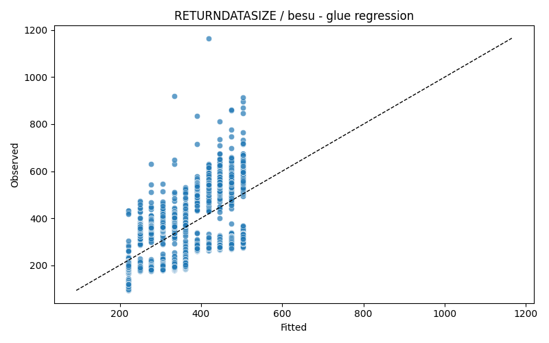

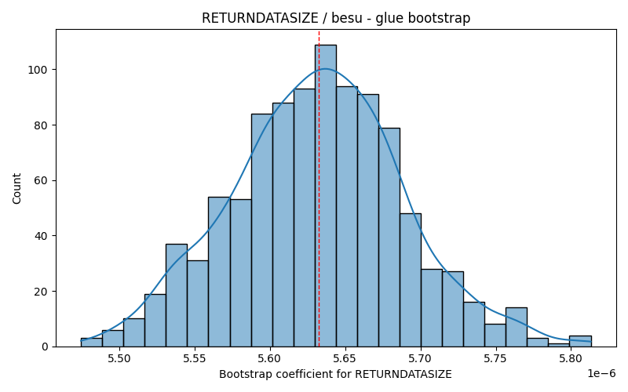

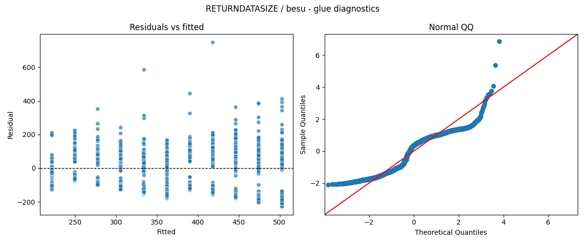

</details>

<details><summary><code>SELFBALANCE</code> · nobs=3087 · runtime_ms=7.3e-06 · p=1.00e-03 · R²=0.4414</summary>

```
==============================================================================
                           NNLS Regression Results                            
==============================================================================
Dep. Variable:          test_runtime_ms              R-squared:          0.441
Model:                  NNLS                    Adj. R-squared:          0.441
No. Observations:       3087                              RMSE:          82.83
Df Residuals:           3085                               MAE:          64.63
Df Model:               1      
==============================================================================
                      coef     std err     P-value      [0.025      0.975]
------------------------------------------------------------------------------
         const    402.6847      5.9299       0.001    391.2973    414.7039
   SELFBALANCE      0.0000      0.0000       0.001      0.0000      0.0000
==============================================================================
Notes: Non-negative least squares with bootstrap inference (1000 iterations)
==============================================================================
```

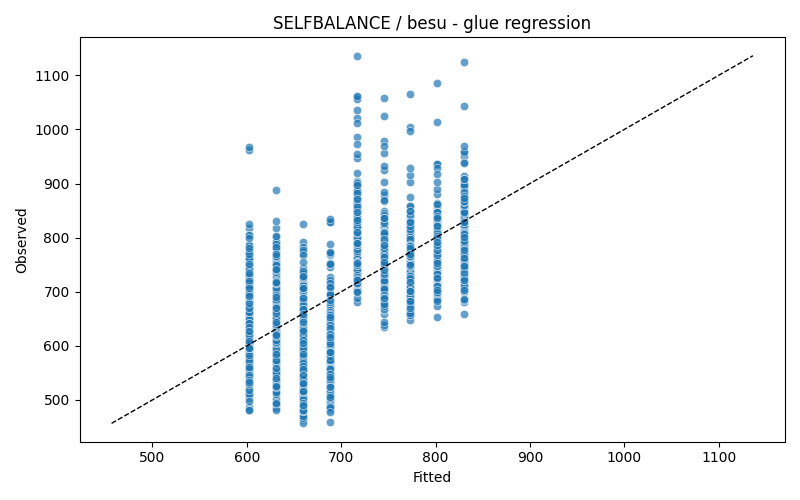

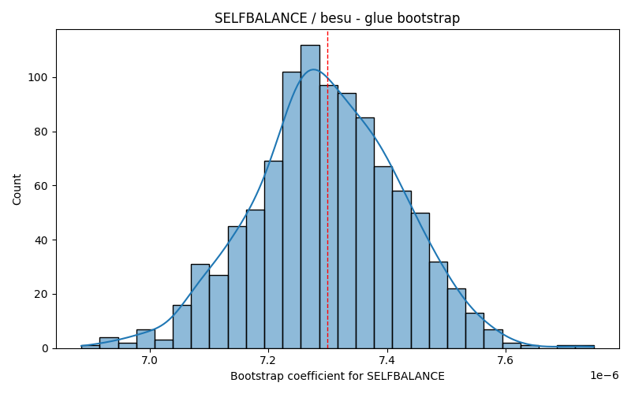

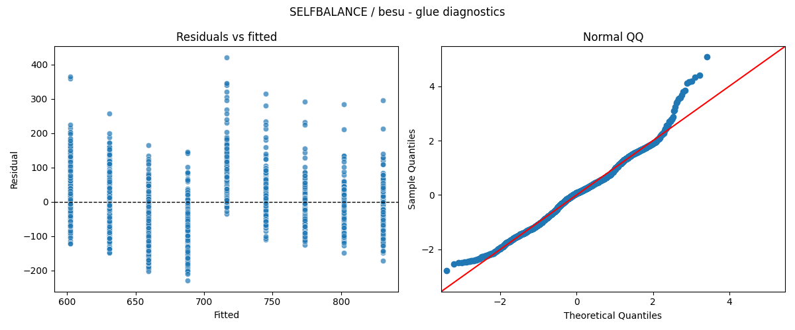

</details>

<details><summary><code>SUB</code> · nobs=3773 · runtime_ms=8.616e-06 · p=1.00e-03 · R²=0.5454</summary>

```
==============================================================================
                           NNLS Regression Results                            
==============================================================================
Dep. Variable:          test_runtime_ms              R-squared:          0.545
Model:                  NNLS                    Adj. R-squared:          0.545
No. Observations:       3773                              RMSE:          82.79
Df Residuals:           3771                               MAE:          68.02
Df Model:               1      
==============================================================================
                      coef     std err     P-value      [0.025      0.975]
------------------------------------------------------------------------------
         const    110.4450      3.9912       0.001    102.5301    117.7584
           SUB      0.0000      0.0000       0.001      0.0000      0.0000
==============================================================================
Notes: Non-negative least squares with bootstrap inference (1000 iterations)
==============================================================================
```

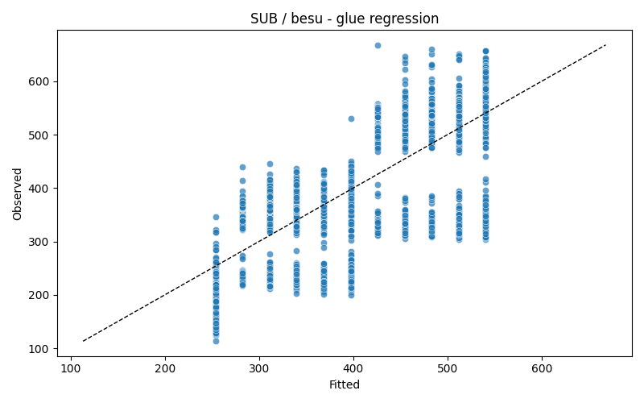

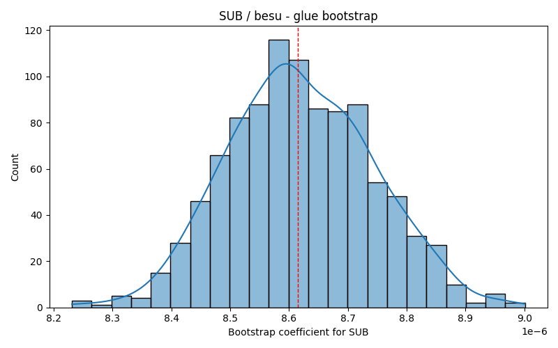

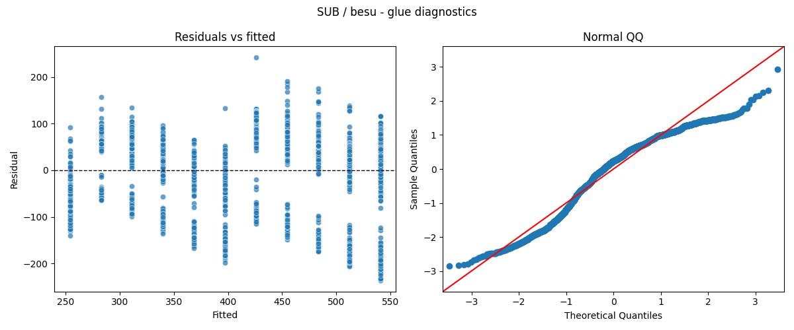

</details>

### Mixed glue (tier B) · besu

<details><summary><code>JUMP</code> · nobs=3773 · runtime_ms=1.738e-05 · p=1.00e-03 · R²=0.2776</summary>

```
==============================================================================
                           NNLS Regression Results                            
==============================================================================
Dep. Variable:          test_runtime_ms              R-squared:          0.278
Model:                  NNLS                    Adj. R-squared:          0.277
No. Observations:       3773                              RMSE:         104.19
Df Residuals:           3771                               MAE:          79.80
Df Model:               1      
==============================================================================
                      coef     std err     P-value      [0.025      0.975]
------------------------------------------------------------------------------
         const    111.3901      5.1371       0.001    102.0526    122.0065
          JUMP      0.0000      0.0000       0.001      0.0000      0.0000
==============================================================================
Notes: Non-negative least squares with bootstrap inference (1000 iterations)
==============================================================================
```

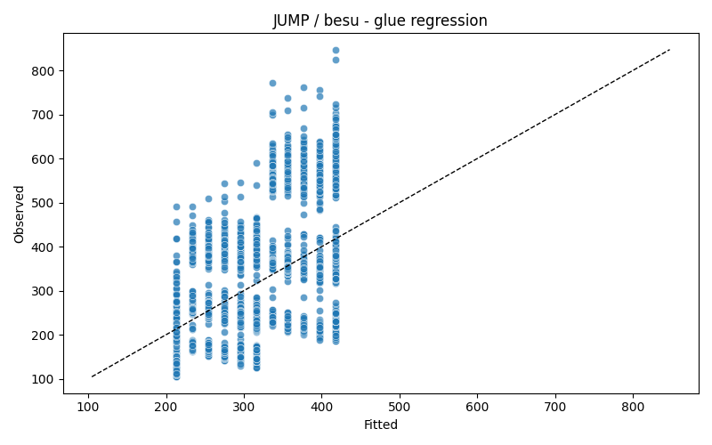

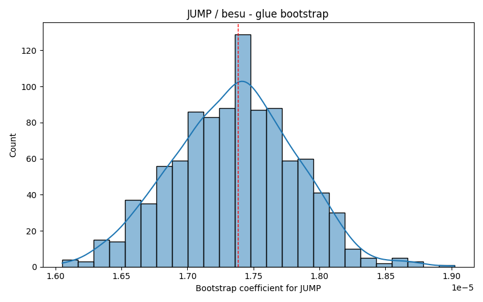

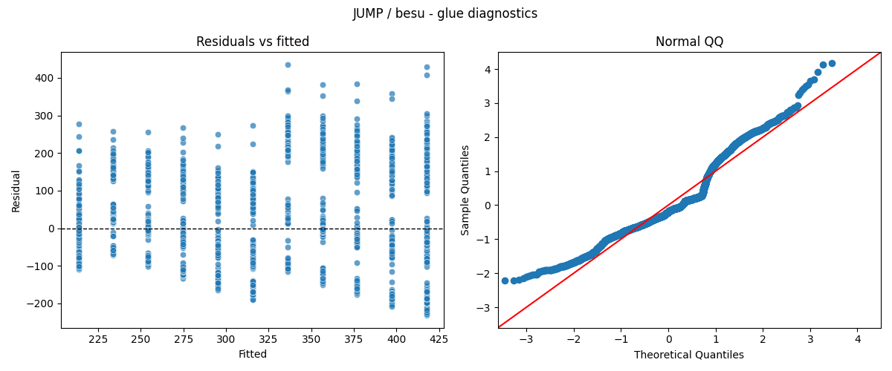

</details>

<details><summary><code>KECCAK256</code> · nobs=60368 · runtime_ms=2.77e-05 · p=1.00e-03 · R²=0.1074</summary>

```
==============================================================================
                           NNLS Regression Results                            
==============================================================================
Dep. Variable:          test_runtime_ms              R-squared:          0.107
Model:                  NNLS                    Adj. R-squared:          0.107
No. Observations:       60368                             RMSE:         158.65
Df Residuals:           60366                              MAE:         125.40
Df Model:               1      
==============================================================================
                      coef     std err     P-value      [0.025      0.975]
------------------------------------------------------------------------------
         const    500.7203      1.4119       0.001    497.9483    503.5503
     KECCAK256      0.0000      0.0000       0.001      0.0000      0.0000
==============================================================================
Notes: Non-negative least squares with bootstrap inference (1000 iterations)
==============================================================================
```

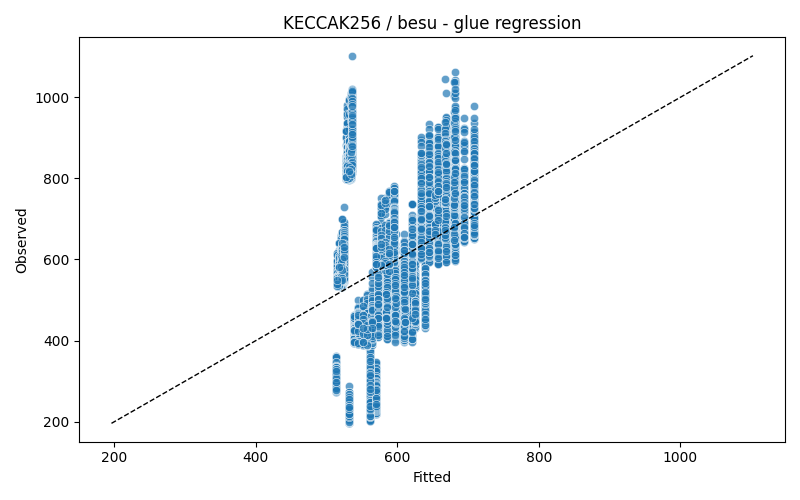

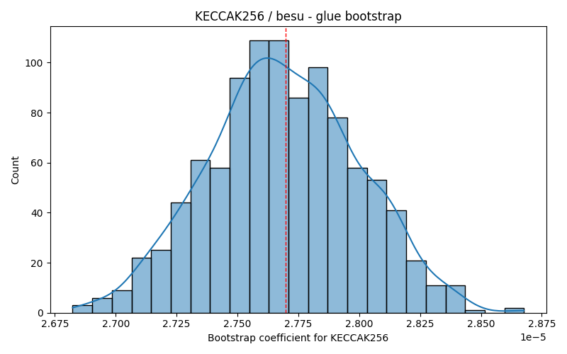

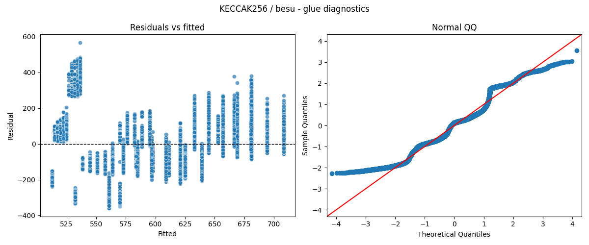

</details>

## erigon

| glue_opcode | nobs | glue_runtime_ms | p_value | rsquared |
| --- | --- | --- | --- | --- |
| `ISZERO` | 253 | 1.238e-06 | 1.00e-03 | 0.345 |
| `JUMPDEST` | 253 | 8.482e-07 | 1.00e-03 | 0.7979 |
| `SWAP` | 4048 | 1.263e-06 | 1.00e-03 | 0.4677 |
| `CALLDATASIZE` | 15400 | 8.298e-07 | 1.00e-03 | 0.94 |
| `DUP` | 15400 | 1.051e-06 | 1.00e-03 | 0.94 |
| `GAS` | 15400 | 8.92e-07 | 1.00e-03 | 0.94 |
| `MLOAD` | 15400 | 3.435e-06 | 1.00e-03 | 0.94 |
| `PUSH` | 15400 | 2.804e-06 | 1.00e-03 | 0.94 |
| `PUSH0` | 15400 | 8.28e-07 | 1.00e-03 | 0.94 |
| `STATICCALL` | 15400 | 0.0005669 | 1.00e-03 | 0.94 |
| `ADD` | 253 | 1.955e-06 | 1.00e-03 | 0.8601 |
| `AND` | 253 | 8.592e-07 | 4.30e-02 | 0.01991 |
| `CALLDATACOPY` | 6072 | 1.056e-06 | 1.00e-03 | 0.07311 |
| `CALLDATALOAD` | 1012 | 6.859e-05 | 1.00e-03 | 0.0423 |
| `DIV` | 253 | 9.099e-06 | 1.00e-03 | 0.875 |
| `EXP` | 253 | 0.0004809 | 1.00e-03 | 0.18 |
| `GT` | 253 | 1.88e-06 | 1.00e-03 | 0.4252 |
| `JUMPI` | 253 | 1.576e-06 | 8.00e-03 | 0.0613 |
| `LT` | 253 | 1.943e-06 | 1.00e-03 | 0.2726 |
| `MSTORE` | 1265 | 3.827e-06 | 1.00e-03 | 0.5145 |
| `MSTORE8` | 1265 | 2.989e-06 | 1.00e-03 | 0.3167 |
| `MUL` | 253 | 2.18e-06 | 1.00e-03 | 0.2648 |
| `PC` | 253 | 9.083e-07 | 1.00e-03 | 0.7505 |
| `RETURNDATASIZE` | 1012 | 1.757e-06 | 1.00e-03 | 0.4803 |
| `SELFBALANCE` | 207 | 1.517e-06 | 1.00e-03 | 0.8885 |
| `SUB` | 253 | 1.976e-06 | 1.00e-03 | 0.8483 |
| `JUMP` | 253 | 1.077e-06 | 1.00e-03 | 0.2708 |
| `KECCAK256` | 4048 | 1.3e-05 | 1.00e-03 | 0.03418 |

### Cycle glue — joint fit · erigon

<details><summary>Joint NNLS regression summary</summary>

```
==============================================================================
                           NNLS Regression Results                            
==============================================================================
Dep. Variable:          test_runtime_ms              R-squared:          0.940
Model:                  NNLS                    Adj. R-squared:          0.940
No. Observations:       15400                             RMSE:          41.56
Df Residuals:           15392                              MAE:          18.16
Df Model:               7      
==============================================================================
                      coef     std err     P-value      [0.025      0.975]
------------------------------------------------------------------------------
         const     33.3161      1.1027       0.001     31.2884     35.5569
  CALLDATASIZE      0.0000      0.0000       0.001      0.0000      0.0000
           DUP      0.0000      0.0000       0.001      0.0000      0.0000
           GAS      0.0000      0.0000       0.001      0.0000      0.0000
         MLOAD      0.0000      0.0000       0.001      0.0000      0.0000
          PUSH      0.0000      0.0000       0.001      0.0000      0.0000
         PUSH0      0.0000      0.0000       0.001      0.0000      0.0000
    STATICCALL      0.0006      0.0000       0.001      0.0006      0.0006
==============================================================================
Notes: Non-negative least squares with bootstrap inference (1000 iterations)
==============================================================================
```

</details>

<details><summary><code>CALLDATASIZE</code> · nobs=15400 · runtime_ms=8.298e-07 · p=1.00e-03 · R²=0.94</summary>


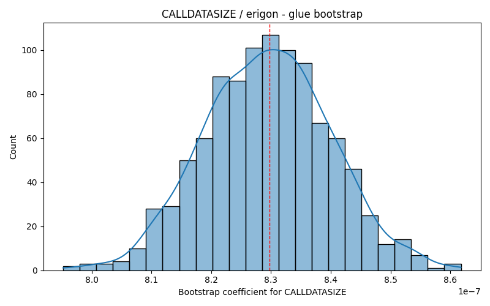

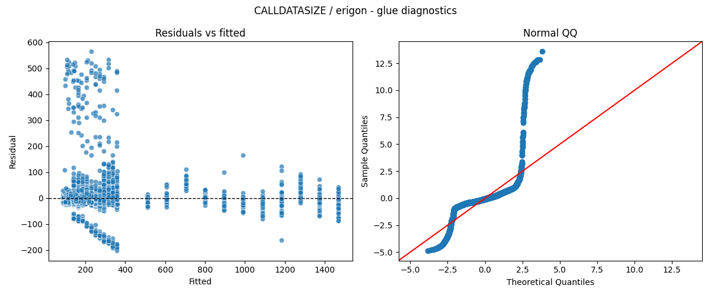

</details>

<details><summary><code>DUP</code> · nobs=15400 · runtime_ms=1.051e-06 · p=1.00e-03 · R²=0.94</summary>


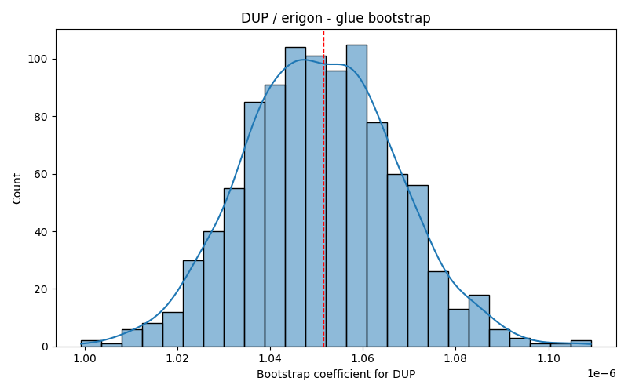


</details>

<details><summary><code>GAS</code> · nobs=15400 · runtime_ms=8.92e-07 · p=1.00e-03 · R²=0.94</summary>

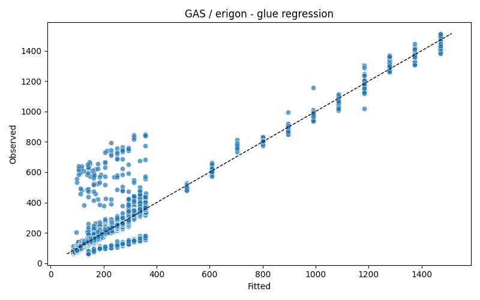

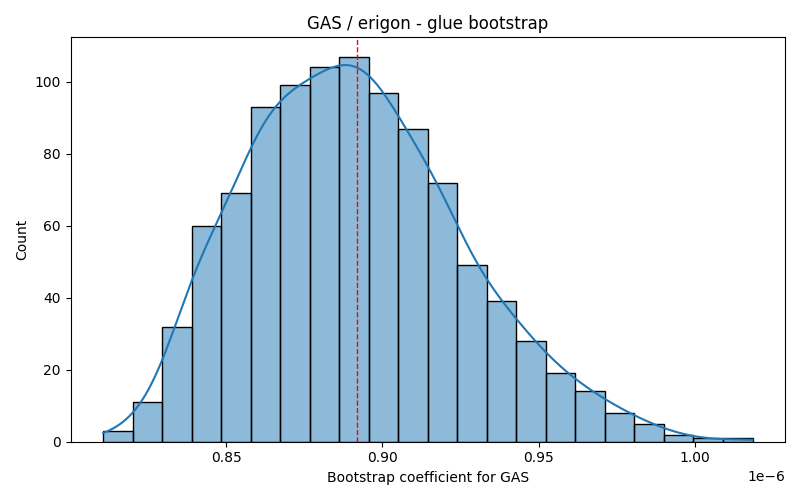

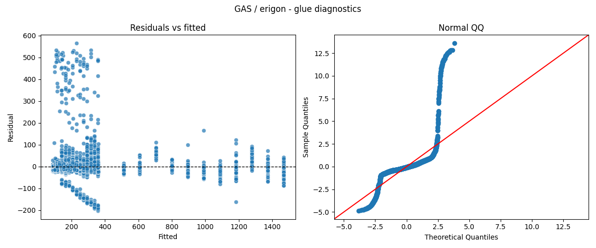

</details>

<details><summary><code>MLOAD</code> · nobs=15400 · runtime_ms=3.435e-06 · p=1.00e-03 · R²=0.94</summary>


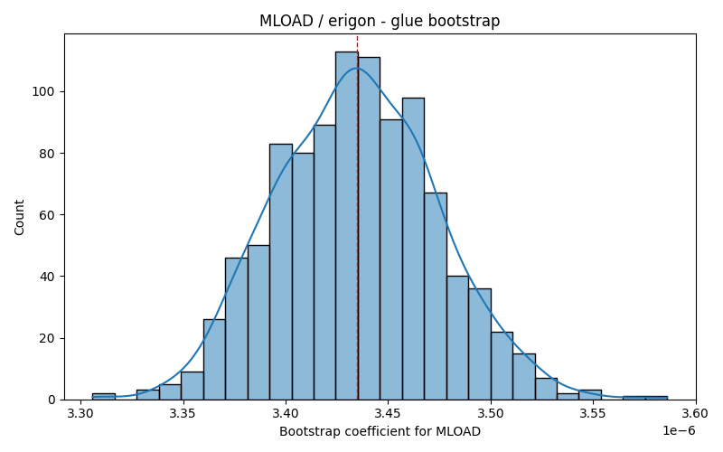

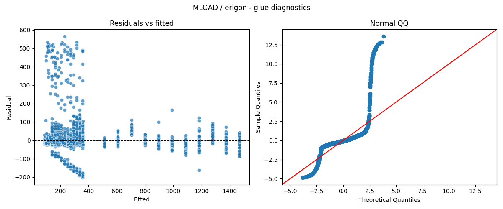

</details>

<details><summary><code>PUSH</code> · nobs=15400 · runtime_ms=2.804e-06 · p=1.00e-03 · R²=0.94</summary>


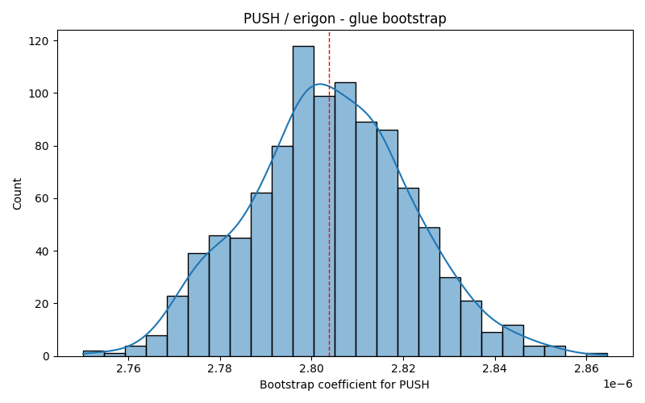


</details>

<details><summary><code>PUSH0</code> · nobs=15400 · runtime_ms=8.28e-07 · p=1.00e-03 · R²=0.94</summary>


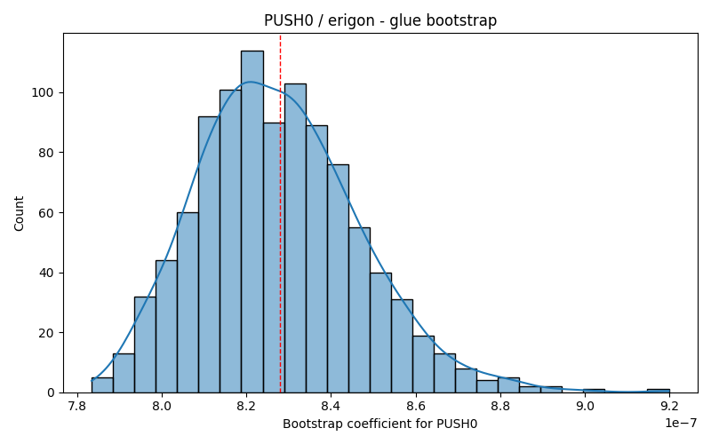


</details>

<details><summary><code>STATICCALL</code> · nobs=15400 · runtime_ms=0.0005669 · p=1.00e-03 · R²=0.94</summary>

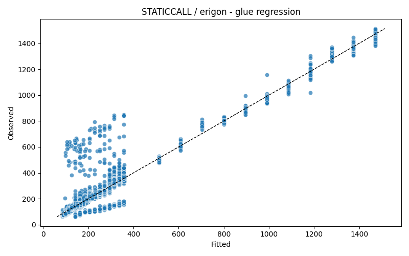

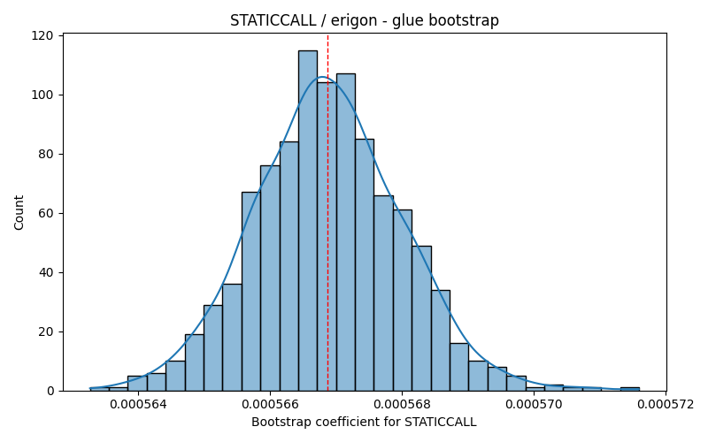


</details>

### Pure glue · erigon

<details><summary><code>ISZERO</code> · nobs=253 · runtime_ms=1.238e-06 · p=1.00e-03 · R²=0.345</summary>

```
==============================================================================
                           NNLS Regression Results                            
==============================================================================
Dep. Variable:          test_runtime_ms              R-squared:          0.345
Model:                  NNLS                    Adj. R-squared:          0.342
No. Observations:       253                               RMSE:          35.91
Df Residuals:           251                                MAE:           9.79
Df Model:               1      
==============================================================================
                      coef     std err     P-value      [0.025      0.975]
------------------------------------------------------------------------------
         const      8.8268      5.8848       0.113      0.0000     19.6146
        ISZERO      0.0000      0.0000       0.001      0.0000      0.0000
==============================================================================
Notes: Non-negative least squares with bootstrap inference (1000 iterations)
==============================================================================
```

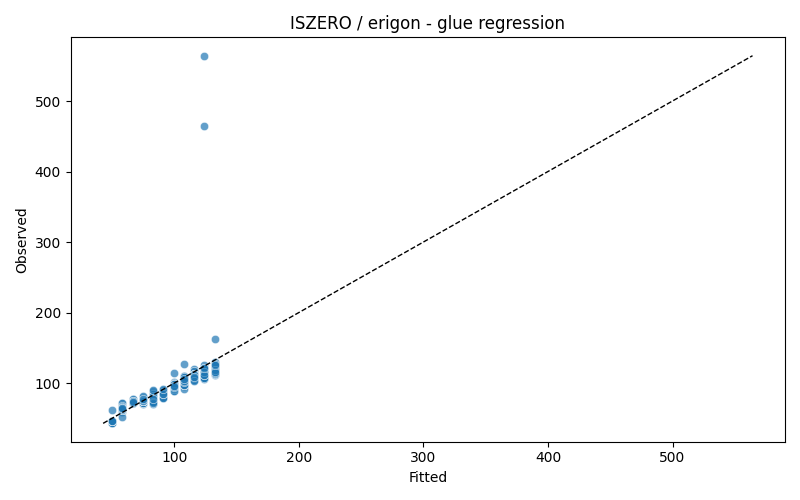

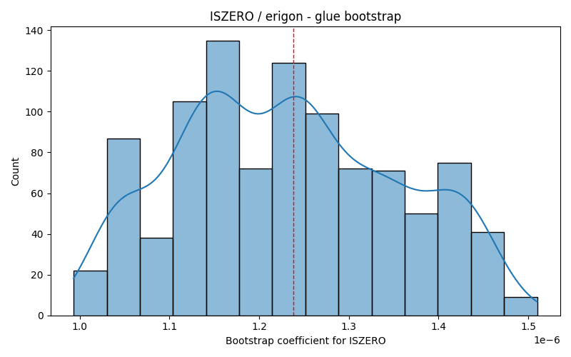

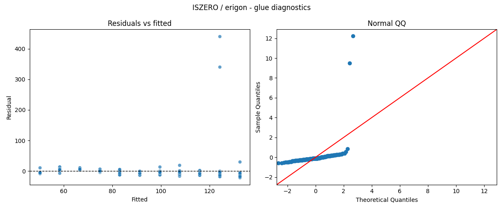

</details>

<details><summary><code>JUMPDEST</code> · nobs=253 · runtime_ms=8.482e-07 · p=1.00e-03 · R²=0.7979</summary>

```
==============================================================================
                           NNLS Regression Results                            
==============================================================================
Dep. Variable:          test_runtime_ms              R-squared:          0.798
Model:                  NNLS                    Adj. R-squared:          0.797
No. Observations:       253                               RMSE:          26.96
Df Residuals:           251                                MAE:          13.75
Df Model:               1      
==============================================================================
                      coef     std err     P-value      [0.025      0.975]
------------------------------------------------------------------------------
         const     17.9060      6.4014       0.009      4.2491     28.8172
      JUMPDEST      0.0000      0.0000       0.001      0.0000      0.0000
==============================================================================
Notes: Non-negative least squares with bootstrap inference (1000 iterations)
==============================================================================
```

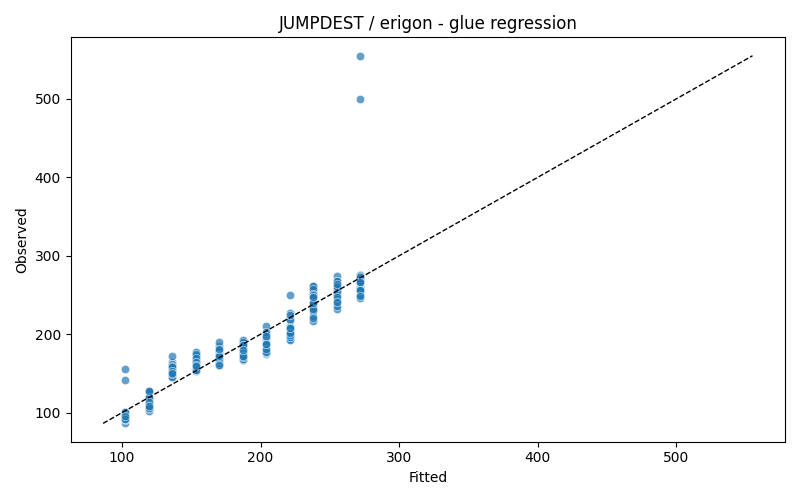

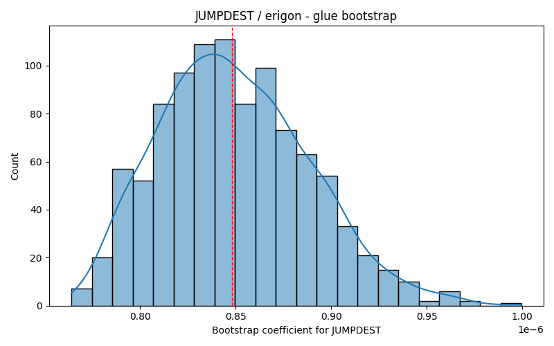

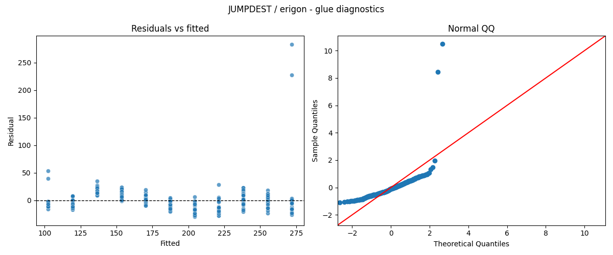

</details>

<details><summary><code>SWAP</code> · nobs=4048 · runtime_ms=1.263e-06 · p=1.00e-03 · R²=0.4677</summary>

```
==============================================================================
                           NNLS Regression Results                            
==============================================================================
Dep. Variable:          test_runtime_ms              R-squared:          0.468
Model:                  NNLS                    Adj. R-squared:          0.468
No. Observations:       4048                              RMSE:          28.37
Df Residuals:           4046                               MAE:           7.62
Df Model:               1      
==============================================================================
                      coef     std err     P-value      [0.025      0.975]
------------------------------------------------------------------------------
         const     27.3299      1.8702       0.001     23.9465     31.2130
          SWAP      0.0000      0.0000       0.001      0.0000      0.0000
==============================================================================
Notes: Non-negative least squares with bootstrap inference (1000 iterations)
==============================================================================
```

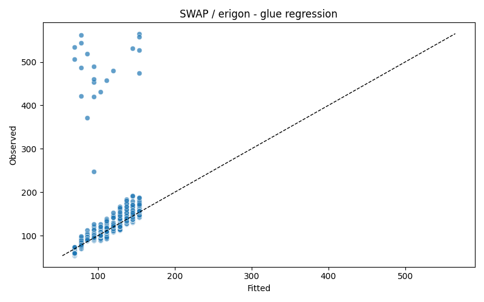

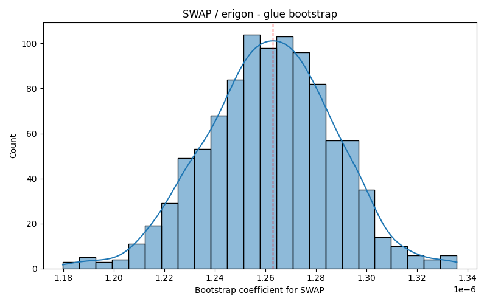

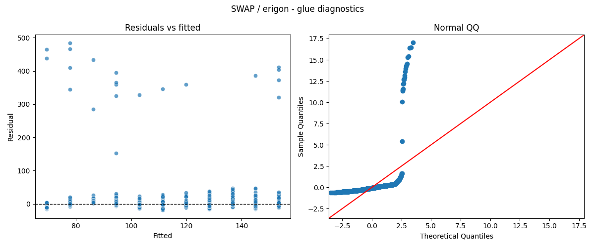

</details>

### Mixed glue (tier A) · erigon

<details><summary><code>ADD</code> · nobs=253 · runtime_ms=1.955e-06 · p=1.00e-03 · R²=0.8601</summary>

```
==============================================================================
                           NNLS Regression Results                            
==============================================================================
Dep. Variable:          test_runtime_ms              R-squared:          0.860
Model:                  NNLS                    Adj. R-squared:          0.860
No. Observations:       253                               RMSE:           8.30
Df Residuals:           251                                MAE:           6.65
Df Model:               1      
==============================================================================
                      coef     std err     P-value      [0.025      0.975]
------------------------------------------------------------------------------
         const     15.0197      1.7344       0.001     11.8601     18.5638
           ADD      0.0000      0.0000       0.001      0.0000      0.0000
==============================================================================
Notes: Non-negative least squares with bootstrap inference (1000 iterations)
==============================================================================
```

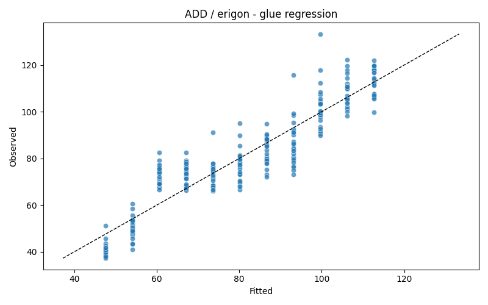

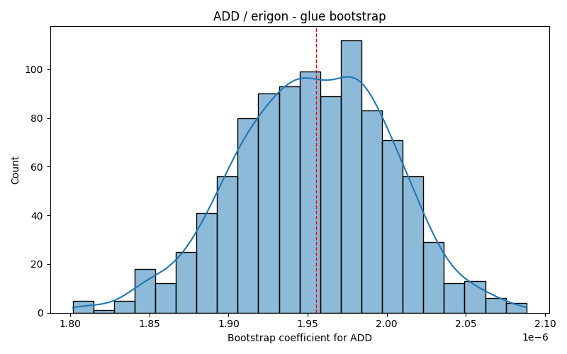

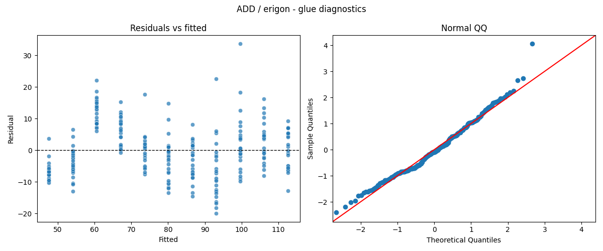

</details>

<details><summary><code>AND</code> · nobs=253 · runtime_ms=8.592e-07 · p=4.30e-02 · R²=0.01991</summary>

```
==============================================================================
                           NNLS Regression Results                            
==============================================================================
Dep. Variable:          test_runtime_ms              R-squared:          0.020
Model:                  NNLS                    Adj. R-squared:          0.016
No. Observations:       253                               RMSE:          63.45
Df Residuals:           251                                MAE:          22.65
Df Model:               1      
==============================================================================
                      coef     std err     P-value      [0.025      0.975]
------------------------------------------------------------------------------
         const     59.3106     17.6734       0.001     27.5187     96.8069
           AND      0.0000      0.0000       0.043      0.0000      0.0000
==============================================================================
Notes: Non-negative least squares with bootstrap inference (1000 iterations)
==============================================================================
```

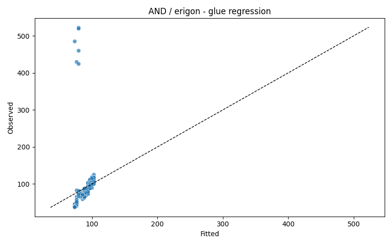

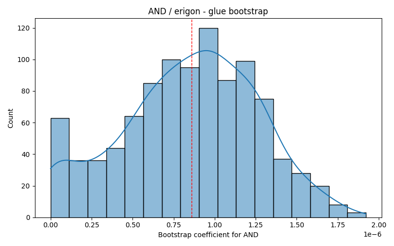

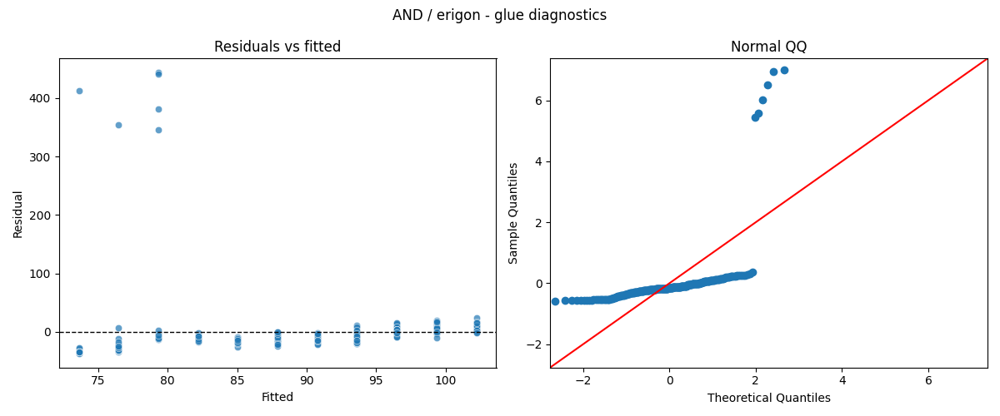

</details>

<details><summary><code>CALLDATACOPY</code> · nobs=6072 · runtime_ms=1.056e-06 · p=1.00e-03 · R²=0.07311</summary>

```
==============================================================================
                           NNLS Regression Results                            
==============================================================================
Dep. Variable:          test_runtime_ms              R-squared:          0.073
Model:                  NNLS                    Adj. R-squared:          0.073
No. Observations:       6072                              RMSE:          28.29
Df Residuals:           6070                               MAE:           8.47
Df Model:               1      
==============================================================================
                      coef     std err     P-value      [0.025      0.975]
------------------------------------------------------------------------------
         const     18.8258      0.3408       0.001     18.2046     19.5583
  CALLDATACOPY      0.0000      0.0000       0.001      0.0000      0.0000
==============================================================================
Notes: Non-negative least squares with bootstrap inference (1000 iterations)
==============================================================================
```

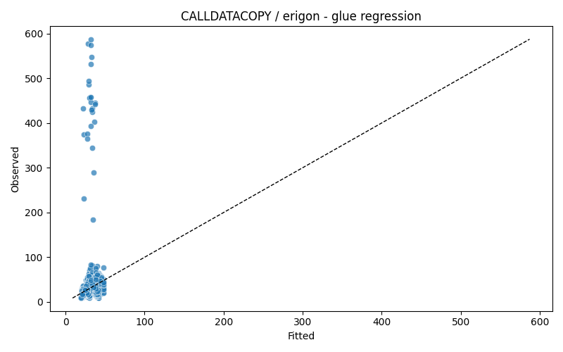

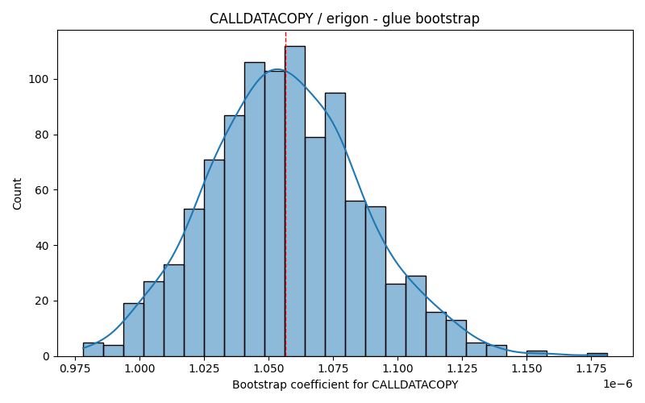

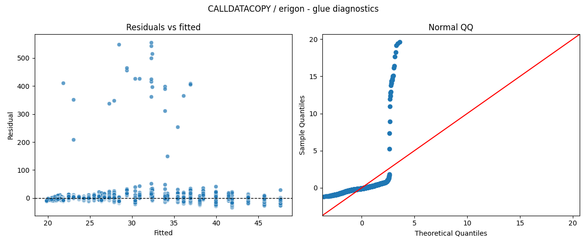

</details>

<details><summary><code>CALLDATALOAD</code> · nobs=1012 · runtime_ms=6.859e-05 · p=1.00e-03 · R²=0.0423</summary>

```
==============================================================================
                           NNLS Regression Results                            
==============================================================================
Dep. Variable:          test_runtime_ms              R-squared:          0.042
Model:                  NNLS                    Adj. R-squared:          0.041
No. Observations:       1012                              RMSE:           1.25
Df Residuals:           1010                               MAE:           0.42
Df Model:               1      
==============================================================================
                      coef     std err     P-value      [0.025      0.975]
------------------------------------------------------------------------------
         const      5.7818      0.0948       0.001      5.5934      5.9464
  CALLDATALOAD      0.0001      0.0000       0.001      0.0001      0.0001
==============================================================================
Notes: Non-negative least squares with bootstrap inference (1000 iterations)
==============================================================================
```

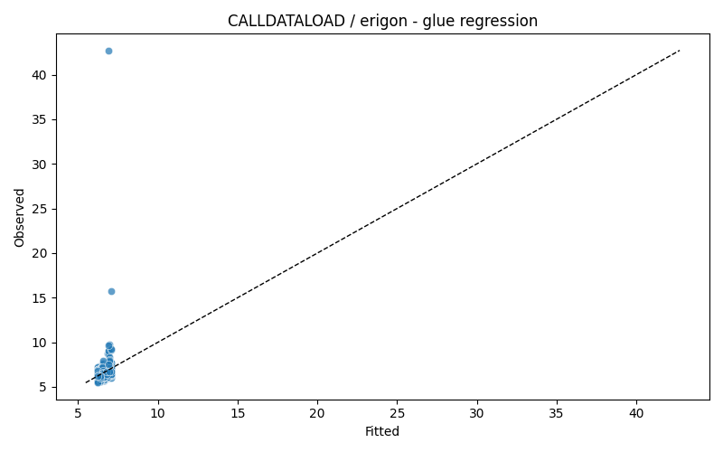

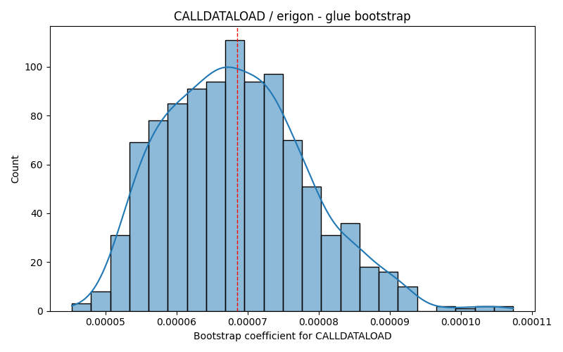

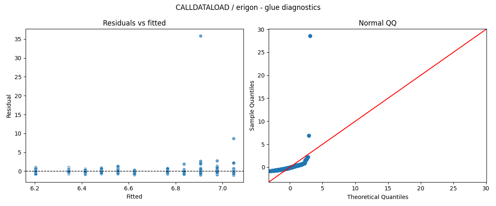

</details>

<details><summary><code>DIV</code> · nobs=253 · runtime_ms=9.099e-06 · p=1.00e-03 · R²=0.875</summary>

```
==============================================================================
                           NNLS Regression Results                            
==============================================================================
Dep. Variable:          test_runtime_ms              R-squared:          0.875
Model:                  NNLS                    Adj. R-squared:          0.875
No. Observations:       253                               RMSE:          27.15
Df Residuals:           251                                MAE:          23.23
Df Model:               1      
==============================================================================
                      coef     std err     P-value      [0.025      0.975]
------------------------------------------------------------------------------
         const     23.4342      5.3505       0.001     13.5381     34.0476
           DIV      0.0000      0.0000       0.001      0.0000      0.0000
==============================================================================
Notes: Non-negative least squares with bootstrap inference (1000 iterations)
==============================================================================
```

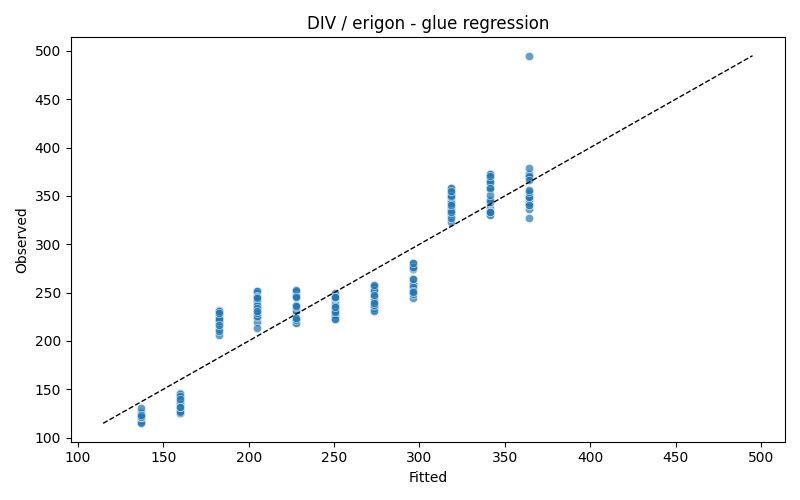

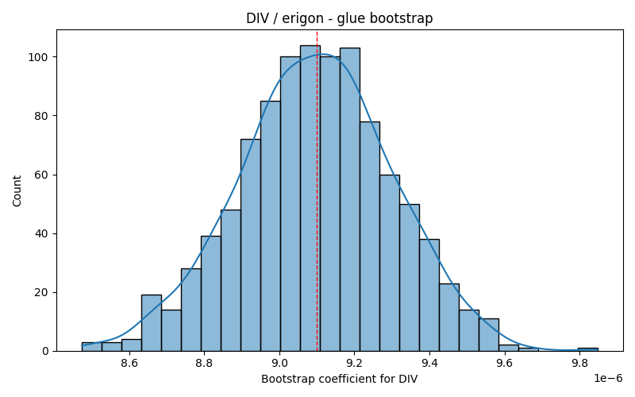

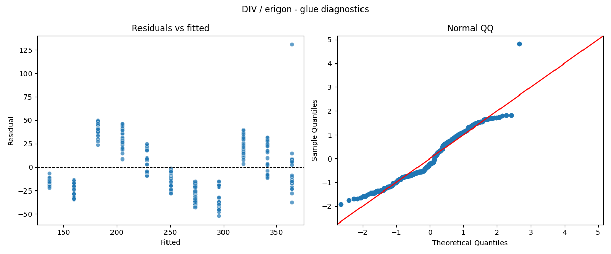

</details>

<details><summary><code>EXP</code> · nobs=253 · runtime_ms=0.0004809 · p=1.00e-03 · R²=0.18</summary>

```
==============================================================================
                           NNLS Regression Results                            
==============================================================================
Dep. Variable:          test_runtime_ms              R-squared:          0.180
Model:                  NNLS                    Adj. R-squared:          0.177
No. Observations:       253                               RMSE:          40.20
Df Residuals:           251                                MAE:           9.19
Df Model:               1      
==============================================================================
                      coef     std err     P-value      [0.025      0.975]
------------------------------------------------------------------------------
         const      0.9512      4.1307       0.391      0.0000     12.3446
           EXP      0.0005      0.0001       0.001      0.0004      0.0005
==============================================================================
Notes: Non-negative least squares with bootstrap inference (1000 iterations)
==============================================================================
```

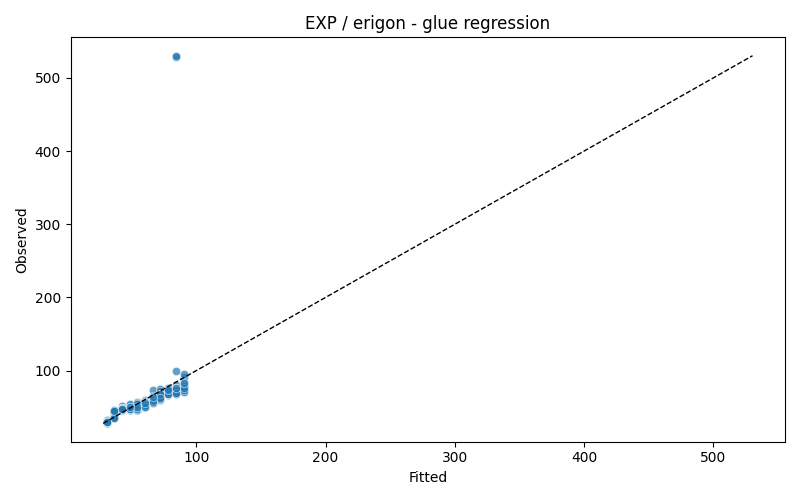

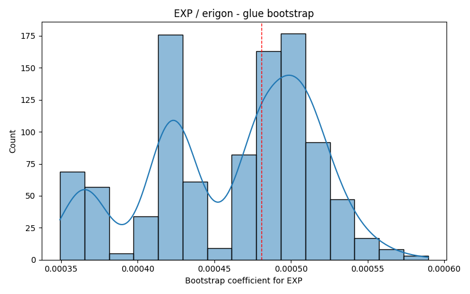

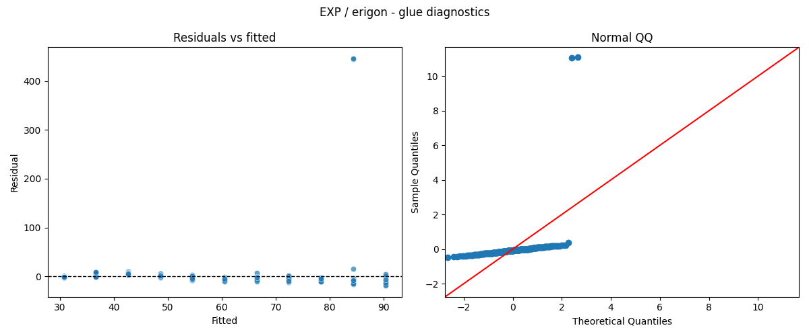

</details>

<details><summary><code>GT</code> · nobs=253 · runtime_ms=1.88e-06 · p=1.00e-03 · R²=0.4252</summary>

```
==============================================================================
                           NNLS Regression Results                            
==============================================================================
Dep. Variable:          test_runtime_ms              R-squared:          0.425
Model:                  NNLS                    Adj. R-squared:          0.423
No. Observations:       253                               RMSE:          23.01
Df Residuals:           251                                MAE:           7.54
Df Model:               1      
==============================================================================
                      coef     std err     P-value      [0.025      0.975]
------------------------------------------------------------------------------
         const     23.3530      3.2590       0.001     18.3262     31.0144
            GT      0.0000      0.0000       0.001      0.0000      0.0000
==============================================================================
Notes: Non-negative least squares with bootstrap inference (1000 iterations)
==============================================================================
```

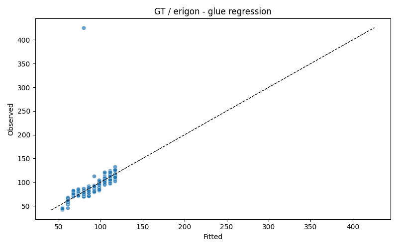

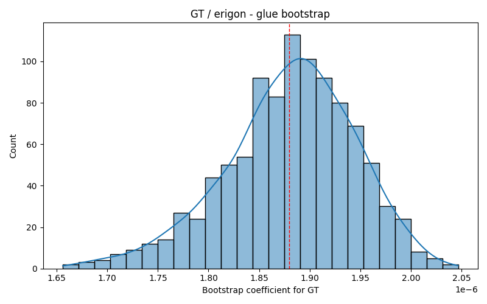

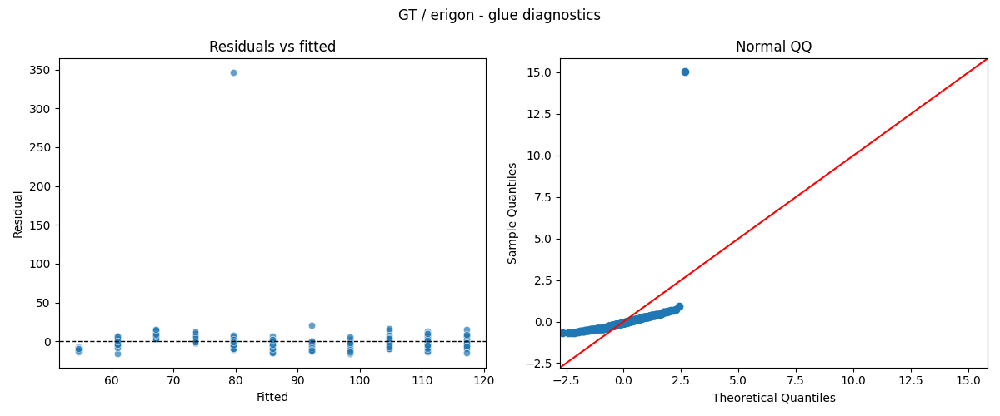

</details>

<details><summary><code>JUMPI</code> · nobs=253 · runtime_ms=1.576e-06 · p=8.00e-03 · R²=0.0613</summary>

```
==============================================================================
                           NNLS Regression Results                            
==============================================================================
Dep. Variable:          test_runtime_ms              R-squared:          0.061
Model:                  NNLS                    Adj. R-squared:          0.058
No. Observations:       253                               RMSE:          27.83
Df Residuals:           251                                MAE:           6.68
Df Model:               1      
==============================================================================
                      coef     std err     P-value      [0.025      0.975]
------------------------------------------------------------------------------
         const     27.2627      8.4784       0.001     16.8744     47.4142
         JUMPI      0.0000      0.0000       0.008      0.0000      0.0000
==============================================================================
Notes: Non-negative least squares with bootstrap inference (1000 iterations)
==============================================================================
```

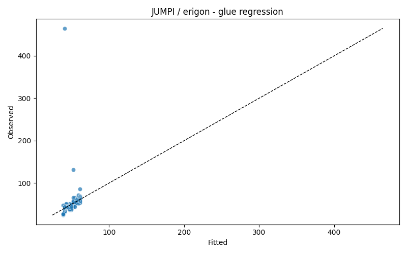

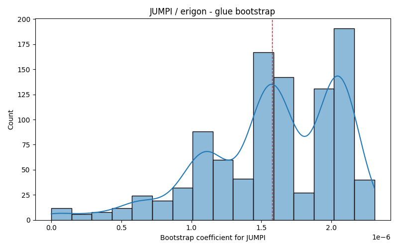

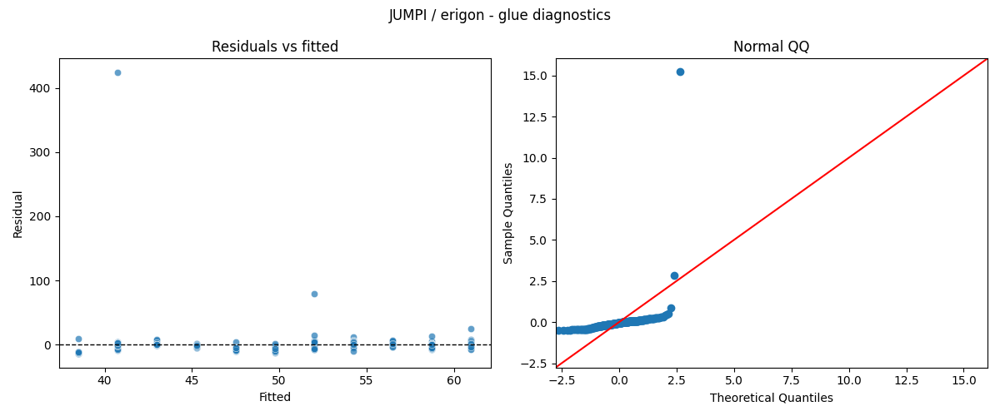

</details>

<details><summary><code>LT</code> · nobs=253 · runtime_ms=1.943e-06 · p=1.00e-03 · R²=0.2726</summary>

```
==============================================================================
                           NNLS Regression Results                            
==============================================================================
Dep. Variable:          test_runtime_ms              R-squared:          0.273
Model:                  NNLS                    Adj. R-squared:          0.270
No. Observations:       253                               RMSE:          33.40
Df Residuals:           251                                MAE:           9.69
Df Model:               1      
==============================================================================
                      coef     std err     P-value      [0.025      0.975]
------------------------------------------------------------------------------
         const     22.4331      3.4981       0.001     17.1208     30.0652
            LT      0.0000      0.0000       0.001      0.0000      0.0000
==============================================================================
Notes: Non-negative least squares with bootstrap inference (1000 iterations)
==============================================================================
```

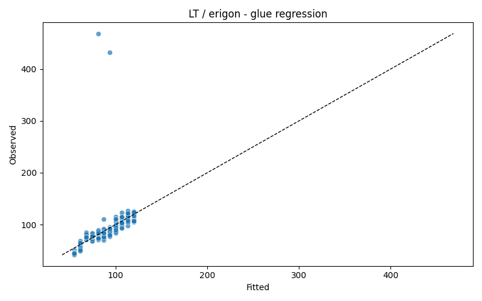

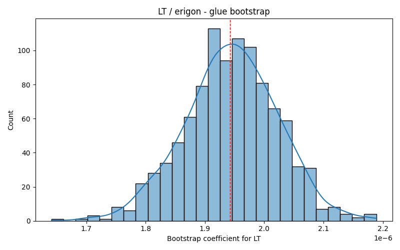

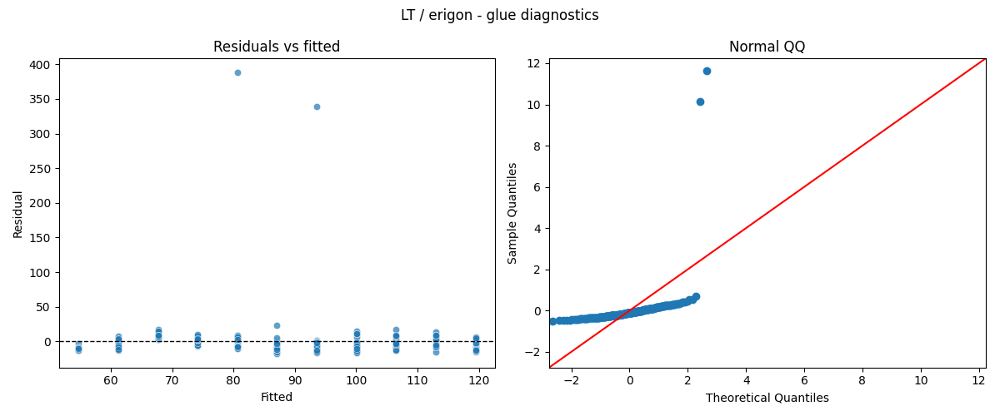

</details>

<details><summary><code>MSTORE</code> · nobs=1265 · runtime_ms=3.827e-06 · p=1.00e-03 · R²=0.5145</summary>

```
==============================================================================
                           NNLS Regression Results                            
==============================================================================
Dep. Variable:          test_runtime_ms              R-squared:          0.514
Model:                  NNLS                    Adj. R-squared:          0.514
No. Observations:       1265                              RMSE:          26.09
Df Residuals:           1263                               MAE:          10.03
Df Model:               1      
==============================================================================
                      coef     std err     P-value      [0.025      0.975]
------------------------------------------------------------------------------
         const     26.7486      2.2197       0.001     22.5456     31.6693
        MSTORE      0.0000      0.0000       0.001      0.0000      0.0000
==============================================================================
Notes: Non-negative least squares with bootstrap inference (1000 iterations)
==============================================================================
```

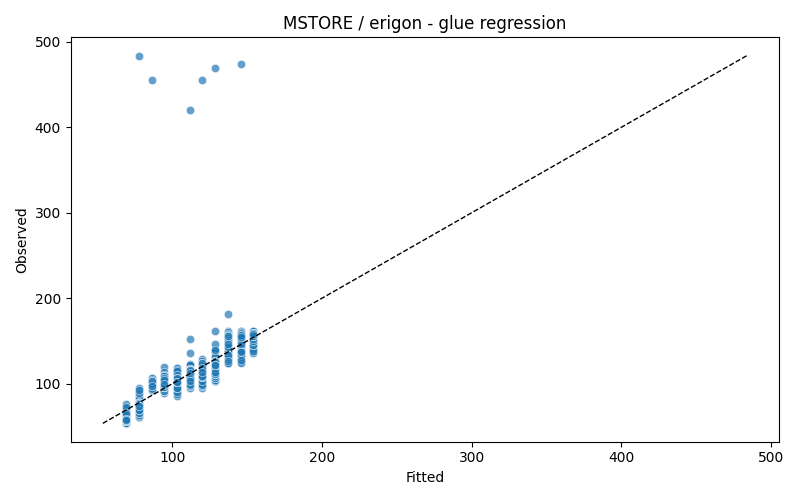

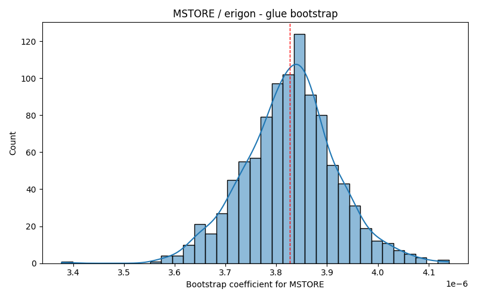

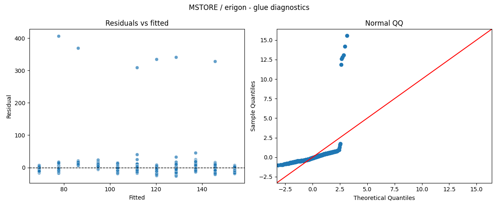

</details>

<details><summary><code>MSTORE8</code> · nobs=1265 · runtime_ms=2.989e-06 · p=1.00e-03 · R²=0.3167</summary>

```
==============================================================================
                           NNLS Regression Results                            
==============================================================================
Dep. Variable:          test_runtime_ms              R-squared:          0.317
Model:                  NNLS                    Adj. R-squared:          0.316
No. Observations:       1265                              RMSE:          30.80
Df Residuals:           1263                               MAE:           9.85
Df Model:               1      
==============================================================================
                      coef     std err     P-value      [0.025      0.975]
------------------------------------------------------------------------------
         const     31.2876      3.7407       0.001     24.4768     39.2370
       MSTORE8      0.0000      0.0000       0.001      0.0000      0.0000
==============================================================================
Notes: Non-negative least squares with bootstrap inference (1000 iterations)
==============================================================================
```

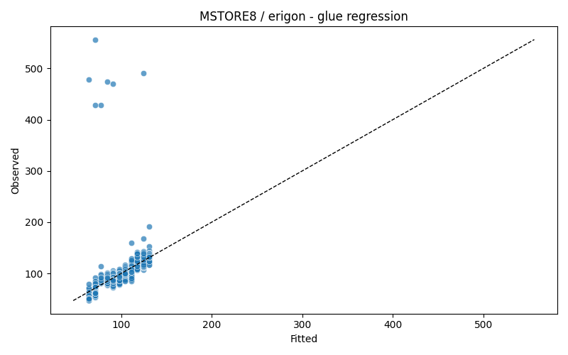

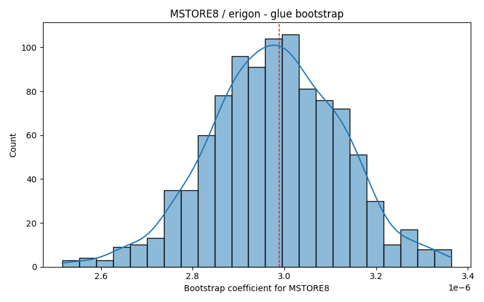

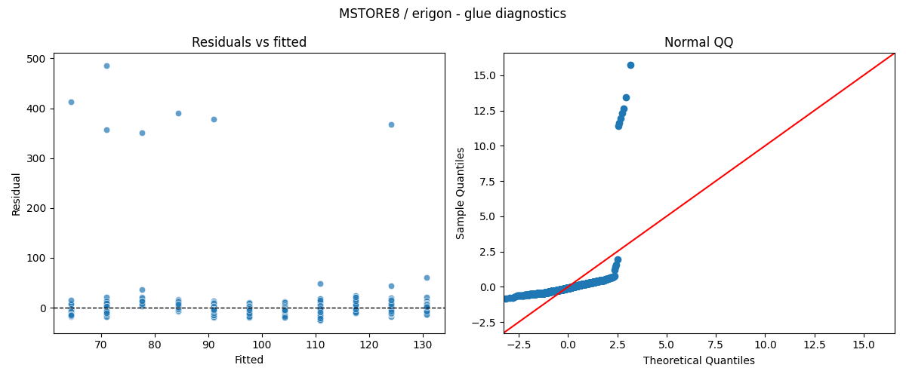

</details>

<details><summary><code>MUL</code> · nobs=253 · runtime_ms=2.18e-06 · p=1.00e-03 · R²=0.2648</summary>

```
==============================================================================
                           NNLS Regression Results                            
==============================================================================
Dep. Variable:          test_runtime_ms              R-squared:          0.265
Model:                  NNLS                    Adj. R-squared:          0.262
No. Observations:       253                               RMSE:          28.68
Df Residuals:           251                                MAE:           8.46
Df Model:               1      
==============================================================================
                      coef     std err     P-value      [0.025      0.975]
------------------------------------------------------------------------------
         const     26.6544     10.7991       0.001     14.0009     52.1421
           MUL      0.0000      0.0000       0.001      0.0000      0.0000
==============================================================================
Notes: Non-negative least squares with bootstrap inference (1000 iterations)
==============================================================================
```

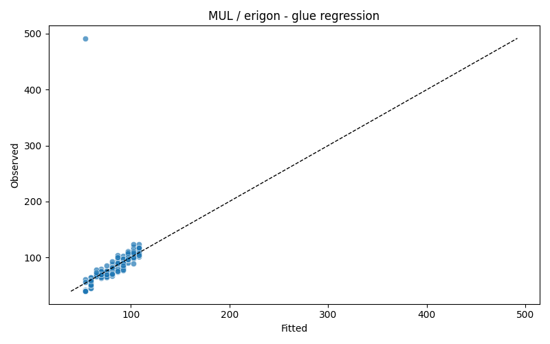

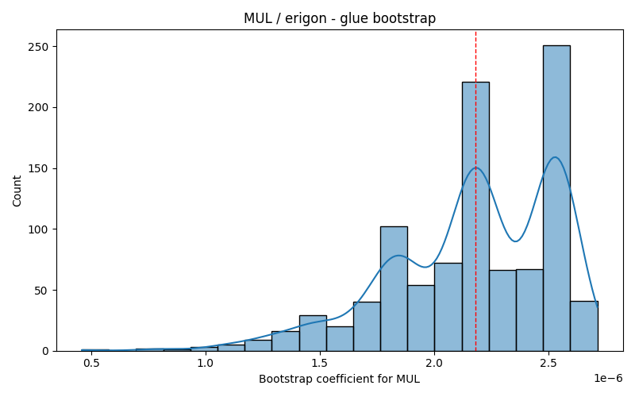

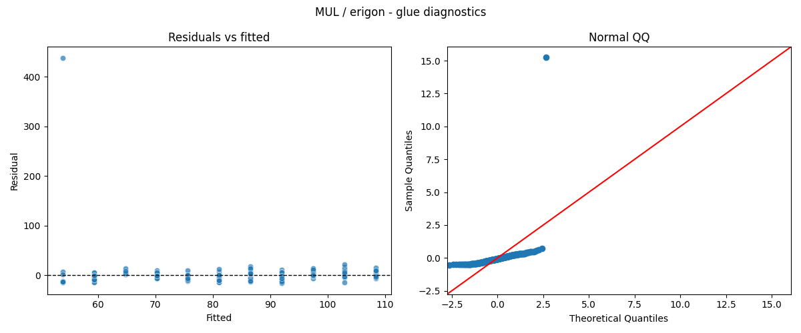

</details>

<details><summary><code>PC</code> · nobs=253 · runtime_ms=9.083e-07 · p=1.00e-03 · R²=0.7505</summary>

```
==============================================================================
                           NNLS Regression Results                            
==============================================================================
Dep. Variable:          test_runtime_ms              R-squared:          0.750
Model:                  NNLS                    Adj. R-squared:          0.749
No. Observations:       253                               RMSE:          15.66
Df Residuals:           251                                MAE:           9.52
Df Model:               1      
==============================================================================
                      coef     std err     P-value      [0.025      0.975]
------------------------------------------------------------------------------
         const     26.6924      3.2988       0.001     20.6898     33.4642
            PC      0.0000      0.0000       0.001      0.0000      0.0000
==============================================================================
Notes: Non-negative least squares with bootstrap inference (1000 iterations)
==============================================================================
```


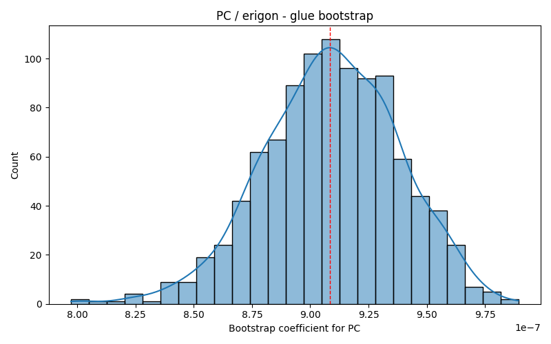

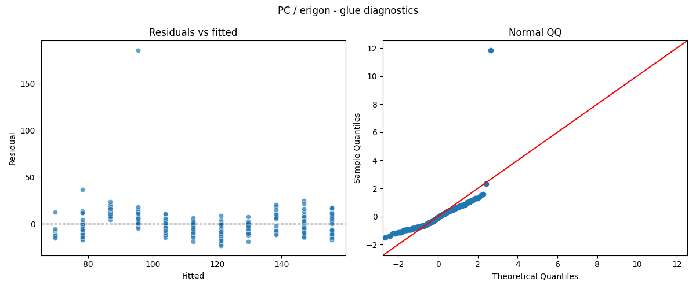

</details>

<details><summary><code>RETURNDATASIZE</code> · nobs=1012 · runtime_ms=1.757e-06 · p=1.00e-03 · R²=0.4803</summary>

```
==============================================================================
                           NNLS Regression Results                            
==============================================================================
Dep. Variable:          test_runtime_ms              R-squared:          0.480
Model:                  NNLS                    Adj. R-squared:          0.480
No. Observations:       1012                              RMSE:          28.86
Df Residuals:           1010                               MAE:           9.41
Df Model:               1      
==============================================================================
                      coef     std err     P-value      [0.025      0.975]
------------------------------------------------------------------------------
         const     27.2442      4.0525       0.001     20.2510     36.0439
RETURNDATASIZE      0.0000      0.0000       0.001      0.0000      0.0000
==============================================================================
Notes: Non-negative least squares with bootstrap inference (1000 iterations)
==============================================================================
```

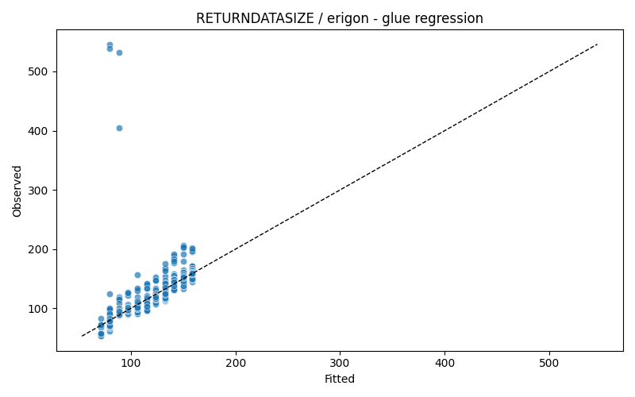

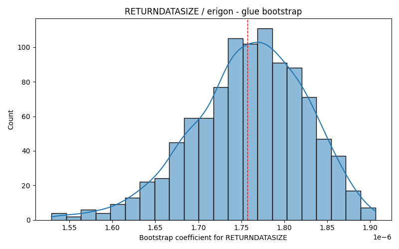

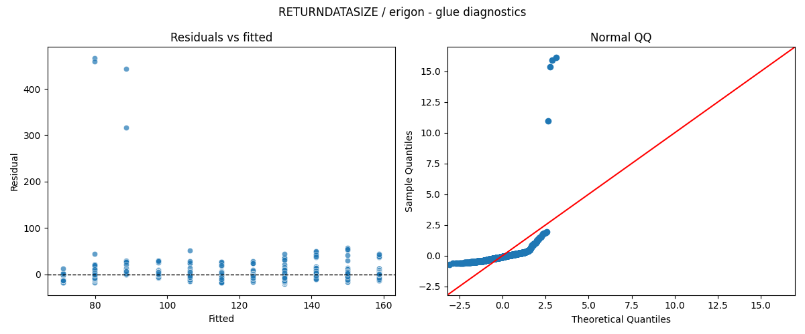

</details>

<details><summary><code>SELFBALANCE</code> · nobs=207 · runtime_ms=1.517e-06 · p=1.00e-03 · R²=0.8885</summary>

```
==============================================================================
                           NNLS Regression Results                            
==============================================================================
Dep. Variable:          test_runtime_ms              R-squared:          0.889
Model:                  NNLS                    Adj. R-squared:          0.888
No. Observations:       207                               RMSE:           5.42
Df Residuals:           205                                MAE:           4.12
Df Model:               1      
==============================================================================
                      coef     std err     P-value      [0.025      0.975]
------------------------------------------------------------------------------
         const     18.1910      1.3370       0.001     15.4436     20.7093
   SELFBALANCE      0.0000      0.0000       0.001      0.0000      0.0000
==============================================================================
Notes: Non-negative least squares with bootstrap inference (1000 iterations)
==============================================================================
```

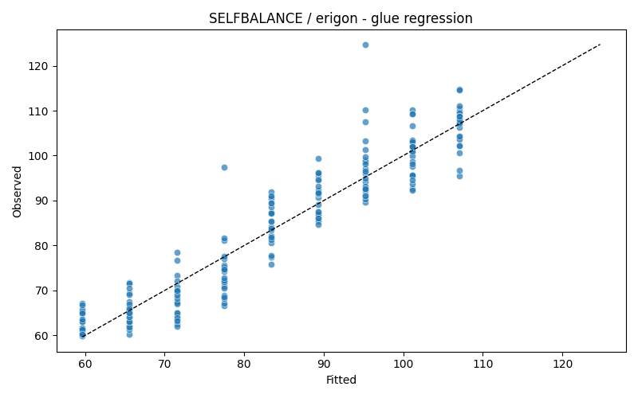

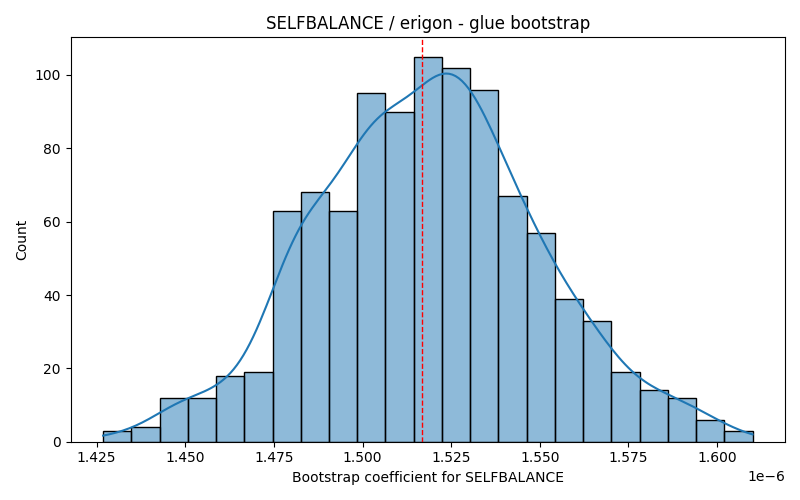

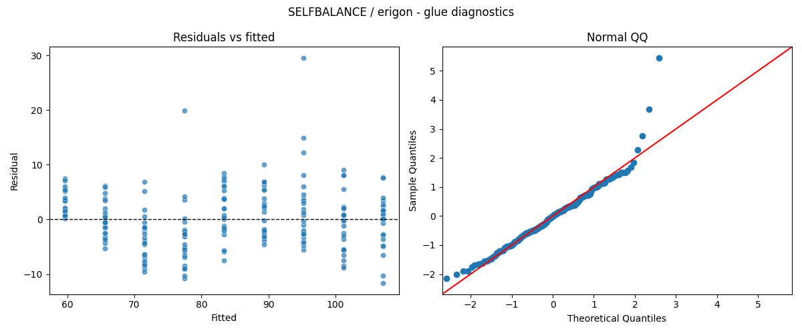

</details>

<details><summary><code>SUB</code> · nobs=253 · runtime_ms=1.976e-06 · p=1.00e-03 · R²=0.8483</summary>

```
==============================================================================
                           NNLS Regression Results                            
==============================================================================
Dep. Variable:          test_runtime_ms              R-squared:          0.848
Model:                  NNLS                    Adj. R-squared:          0.848
No. Observations:       253                               RMSE:           8.79
Df Residuals:           251                                MAE:           7.16
Df Model:               1      
==============================================================================
                      coef     std err     P-value      [0.025      0.975]
------------------------------------------------------------------------------
         const     15.1957      1.7507       0.001     12.0585     18.9444
           SUB      0.0000      0.0000       0.001      0.0000      0.0000
==============================================================================
Notes: Non-negative least squares with bootstrap inference (1000 iterations)
==============================================================================
```

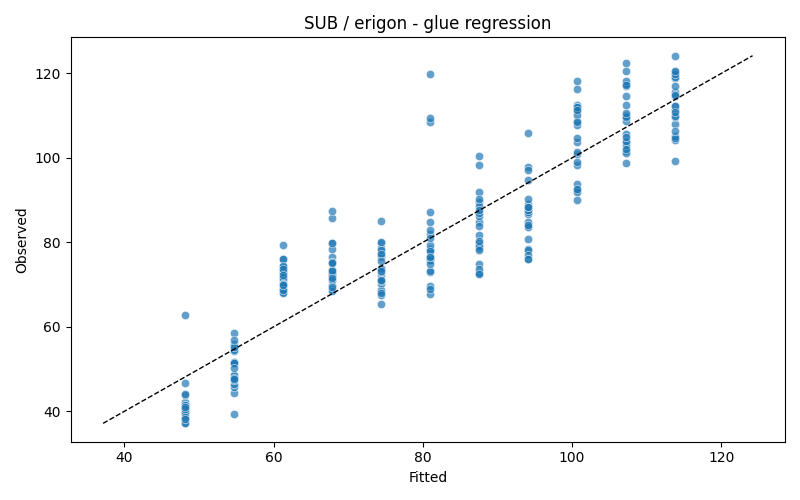

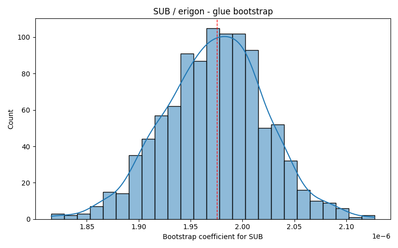

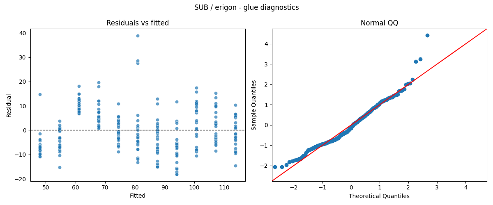

</details>

### Mixed glue (tier B) · erigon

<details><summary><code>JUMP</code> · nobs=253 · runtime_ms=1.077e-06 · p=1.00e-03 · R²=0.2708</summary>

```
==============================================================================
                           NNLS Regression Results                            
==============================================================================
Dep. Variable:          test_runtime_ms              R-squared:          0.271
Model:                  NNLS                    Adj. R-squared:          0.268
No. Observations:       253                               RMSE:           6.57
Df Residuals:           251                                MAE:           5.52
Df Model:               1      
==============================================================================
                      coef     std err     P-value      [0.025      0.975]
------------------------------------------------------------------------------
         const     18.7949      1.4044       0.001     16.2064     21.8018
          JUMP      0.0000      0.0000       0.001      0.0000      0.0000
==============================================================================
Notes: Non-negative least squares with bootstrap inference (1000 iterations)
==============================================================================
```

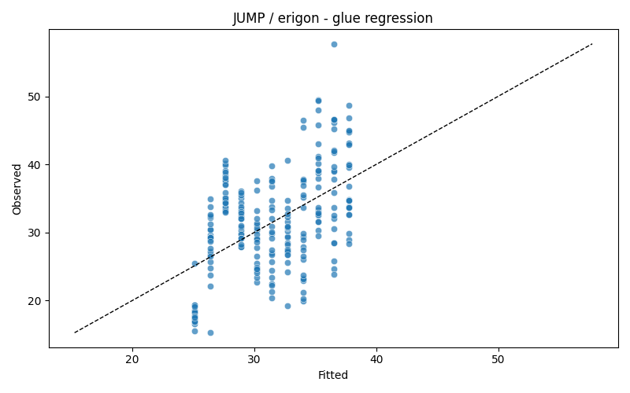

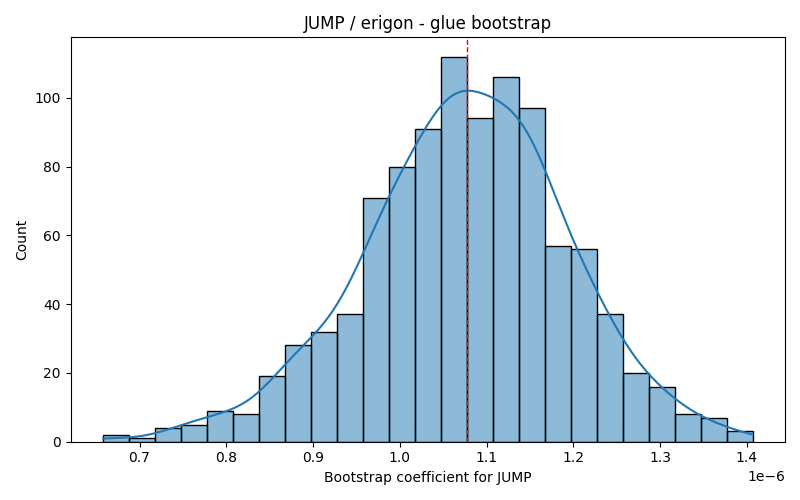

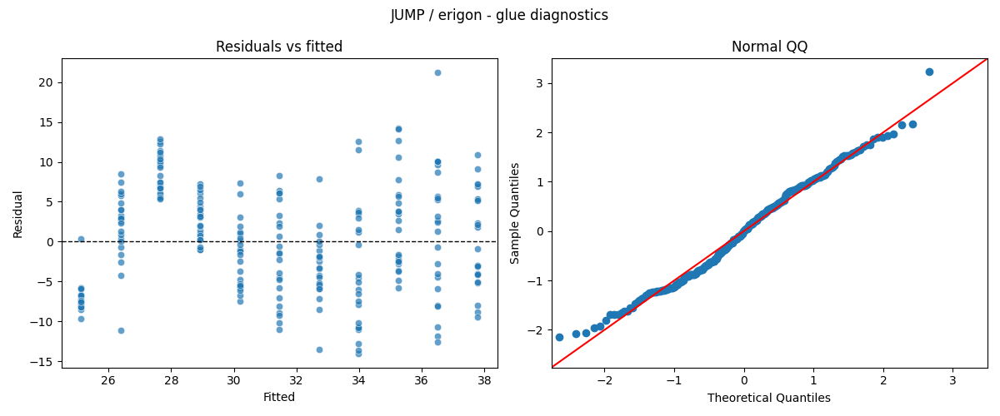

</details>

<details><summary><code>KECCAK256</code> · nobs=4048 · runtime_ms=1.3e-05 · p=1.00e-03 · R²=0.03418</summary>

```
==============================================================================
                           NNLS Regression Results                            
==============================================================================
Dep. Variable:          test_runtime_ms              R-squared:          0.034
Model:                  NNLS                    Adj. R-squared:          0.034
No. Observations:       4048                              RMSE:         137.33
Df Residuals:           4046                               MAE:         110.44
Df Model:               1      
==============================================================================
                      coef     std err     P-value      [0.025      0.975]
------------------------------------------------------------------------------
         const    379.5671      4.7375       0.001    370.4205    388.5968
     KECCAK256      0.0000      0.0000       0.001      0.0000      0.0000
==============================================================================
Notes: Non-negative least squares with bootstrap inference (1000 iterations)
==============================================================================
```

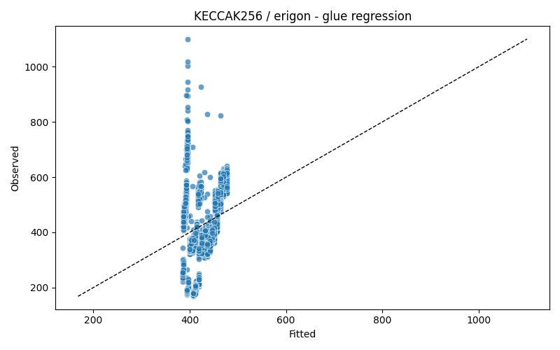

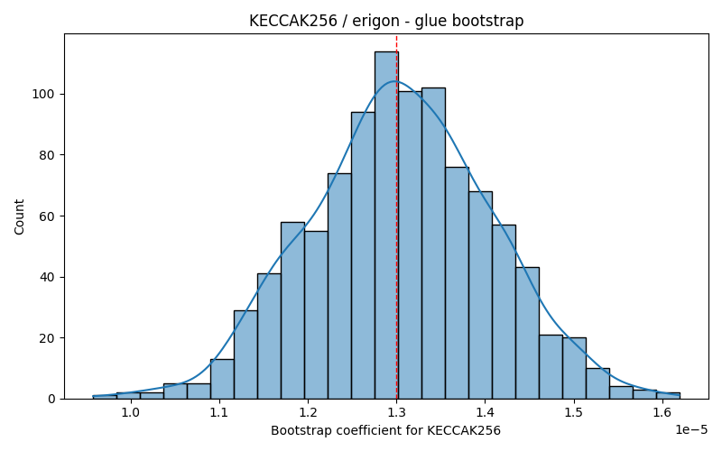

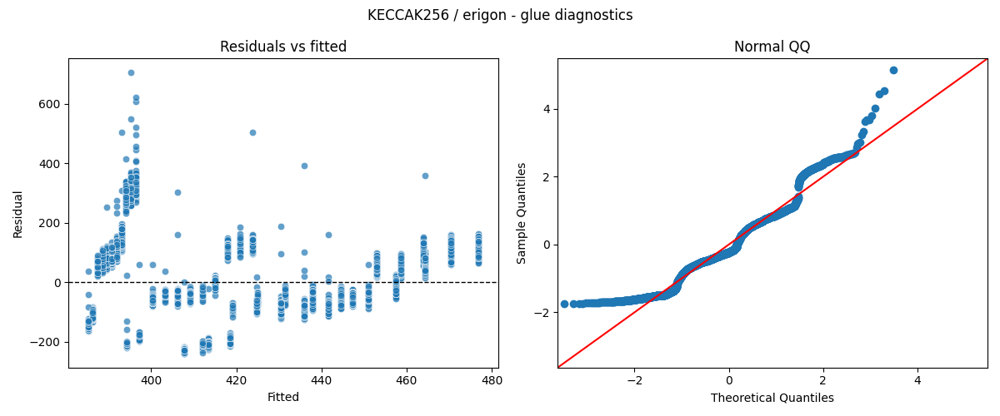

</details>

## ethrex

| glue_opcode | nobs | glue_runtime_ms | p_value | rsquared |
| --- | --- | --- | --- | --- |
| `ISZERO` | 1606 | 1.434e-06 | 1.00e-03 | 0.8404 |
| `JUMPDEST` | 1606 | 4.57e-07 | 1.00e-03 | 0.8416 |
| `SWAP` | 25696 | 7.062e-07 | 1.00e-03 | 0.8021 |
| `CALLDATASIZE` | 96371 | 4.478e-07 | 1.00e-03 | 0.8711 |
| `DUP` | 96371 | 4.908e-07 | 1.00e-03 | 0.8711 |
| `GAS` | 96371 | 4.984e-07 | 1.00e-03 | 0.8711 |
| `MLOAD` | 96371 | 1.161e-06 | 1.00e-03 | 0.8711 |
| `PUSH` | 96371 | 6.573e-07 | 1.00e-03 | 0.8711 |
| `PUSH0` | 96371 | 4.513e-07 | 1.00e-03 | 0.8711 |
| `STATICCALL` | 96371 | 7.489e-05 | 1.00e-03 | 0.8711 |
| `ADD` | 1606 | 6.192e-07 | 1.00e-03 | 0.5438 |
| `AND` | 1606 | 6.005e-07 | 1.00e-03 | 0.1523 |
| `CALLDATACOPY` | 38544 | 9.479e-07 | 1.00e-03 | 0.4956 |
| `CALLDATALOAD` | 6424 | 2.2e-05 | 1.00e-03 | 0.267 |
| `DIV` | 1606 | 8.843e-06 | 1.00e-03 | 0.8251 |
| `EXP` | 1606 | 0.0009206 | 1.00e-03 | 0.8276 |
| `GT` | 1606 | 5.774e-07 | 1.00e-03 | 0.5755 |
| `JUMPI` | 1606 | 6.822e-07 | 1.00e-03 | 0.4404 |
| `LT` | 1606 | 5.637e-07 | 1.00e-03 | 0.5569 |
| `MSTORE` | 8030 | 7.763e-07 | 1.00e-03 | 0.4389 |
| `MSTORE8` | 8030 | 6.725e-07 | 1.00e-03 | 0.363 |
| `MUL` | 1606 | 1.127e-06 | 1.00e-03 | 0.6818 |
| `PC` | 1606 | 4.852e-07 | 1.00e-03 | 0.781 |
| `RETURNDATASIZE` | 6424 | 9.415e-07 | 1.00e-03 | 0.7944 |
| `SELFBALANCE` | 1314 | 4.755e-06 | 1.00e-03 | 0.8119 |
| `SUB` | 1606 | 6.203e-07 | 1.00e-03 | 0.5558 |
| `JUMP` | 1606 | 2.101e-06 | 1.00e-03 | 0.5136 |
| `KECCAK256` | 25696 | 0 | 1.00e+00 | 0 |

### Cycle glue — joint fit · ethrex

<details><summary>Joint NNLS regression summary</summary>

```
==============================================================================
                           NNLS Regression Results                            
==============================================================================
Dep. Variable:          test_runtime_ms              R-squared:          0.871
Model:                  NNLS                    Adj. R-squared:          0.871
No. Observations:       96371                             RMSE:           7.41
Df Residuals:           96363                              MAE:           5.78
Df Model:               7      
==============================================================================
                      coef     std err     P-value      [0.025      0.975]
------------------------------------------------------------------------------
         const     13.6971      0.0771       0.001     13.5423     13.8521
  CALLDATASIZE      0.0000      0.0000       0.001      0.0000      0.0000
           DUP      0.0000      0.0000       0.001      0.0000      0.0000
           GAS      0.0000      0.0000       0.001      0.0000      0.0000
         MLOAD      0.0000      0.0000       0.001      0.0000      0.0000
          PUSH      0.0000      0.0000       0.001      0.0000      0.0000
         PUSH0      0.0000      0.0000       0.001      0.0000      0.0000
    STATICCALL      0.0001      0.0000       0.001      0.0001      0.0001
==============================================================================
Notes: Non-negative least squares with bootstrap inference (1000 iterations)
==============================================================================
```

</details>

<details><summary><code>CALLDATASIZE</code> · nobs=96371 · runtime_ms=4.478e-07 · p=1.00e-03 · R²=0.8711</summary>


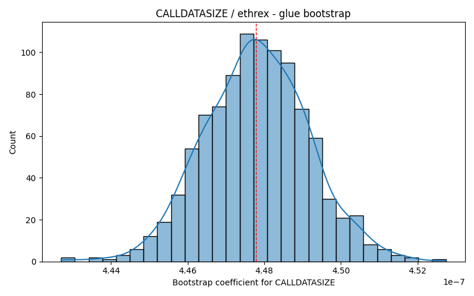

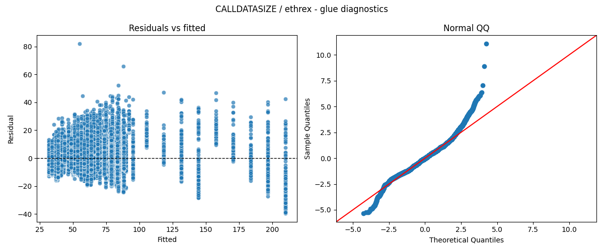

</details>

<details><summary><code>DUP</code> · nobs=96371 · runtime_ms=4.908e-07 · p=1.00e-03 · R²=0.8711</summary>


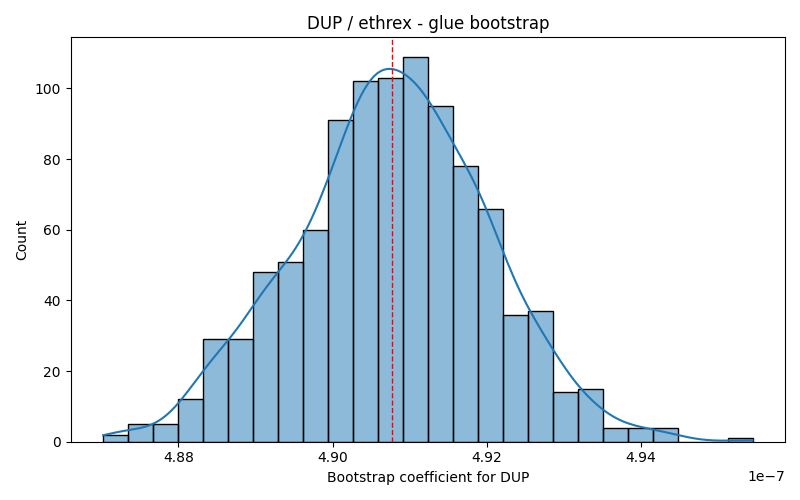


</details>

<details><summary><code>GAS</code> · nobs=96371 · runtime_ms=4.984e-07 · p=1.00e-03 · R²=0.8711</summary>

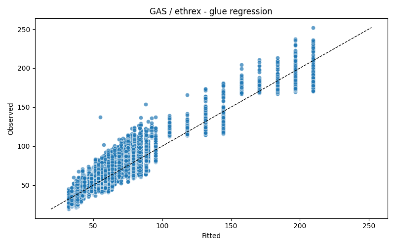


</details>

<details><summary><code>MLOAD</code> · nobs=96371 · runtime_ms=1.161e-06 · p=1.00e-03 · R²=0.8711</summary>


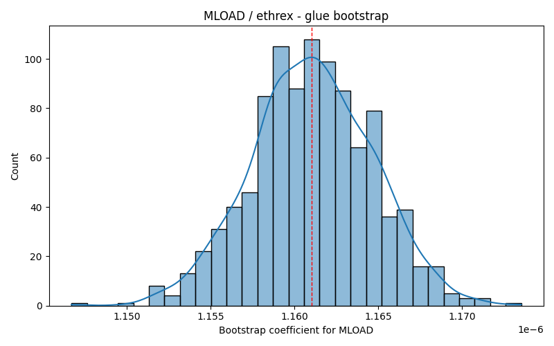

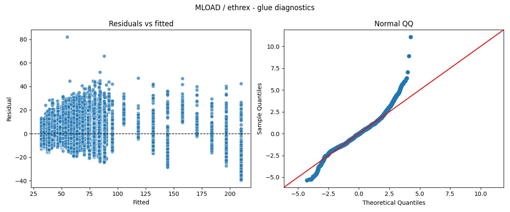

</details>

<details><summary><code>PUSH</code> · nobs=96371 · runtime_ms=6.573e-07 · p=1.00e-03 · R²=0.8711</summary>


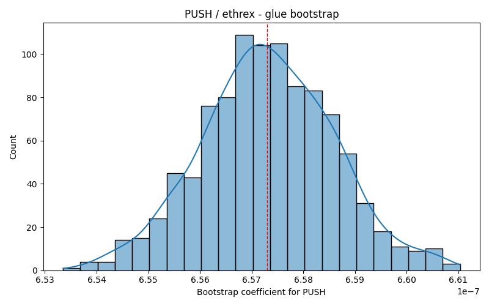


</details>

<details><summary><code>PUSH0</code> · nobs=96371 · runtime_ms=4.513e-07 · p=1.00e-03 · R²=0.8711</summary>

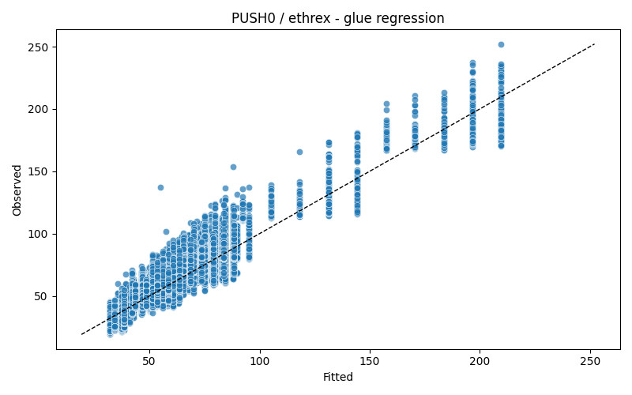

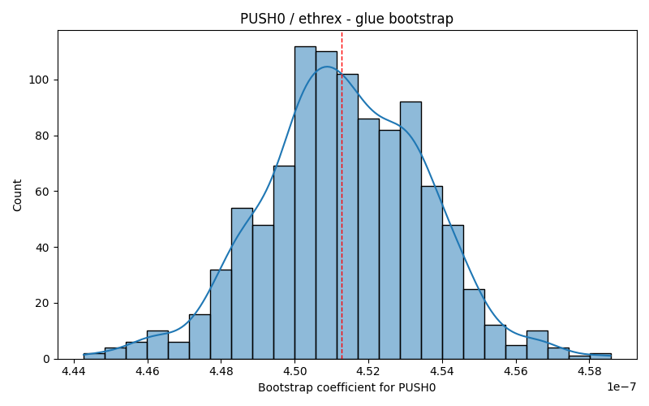


</details>

<details><summary><code>STATICCALL</code> · nobs=96371 · runtime_ms=7.489e-05 · p=1.00e-03 · R²=0.8711</summary>

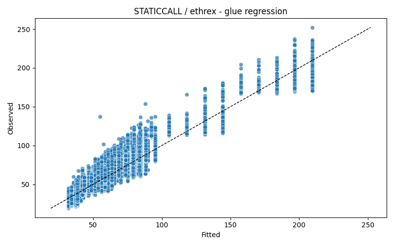

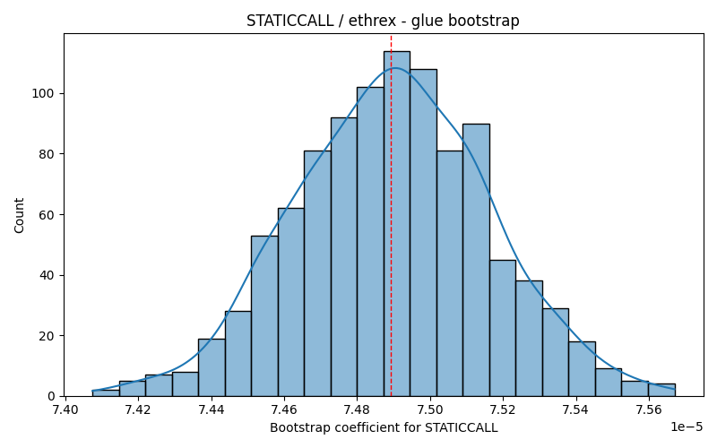


</details>

### Pure glue · ethrex

<details><summary><code>ISZERO</code> · nobs=1606 · runtime_ms=1.434e-06 · p=1.00e-03 · R²=0.8404</summary>

```
==============================================================================
                           NNLS Regression Results                            
==============================================================================
Dep. Variable:          test_runtime_ms              R-squared:          0.840
Model:                  NNLS                    Adj. R-squared:          0.840
No. Observations:       1606                              RMSE:          13.16
Df Residuals:           1604                               MAE:          11.04
Df Model:               1      
==============================================================================
                      coef     std err     P-value      [0.025      0.975]
------------------------------------------------------------------------------
         const     24.5738      1.1774       0.001     22.4010     26.8618
        ISZERO      0.0000      0.0000       0.001      0.0000      0.0000
==============================================================================
Notes: Non-negative least squares with bootstrap inference (1000 iterations)
==============================================================================
```

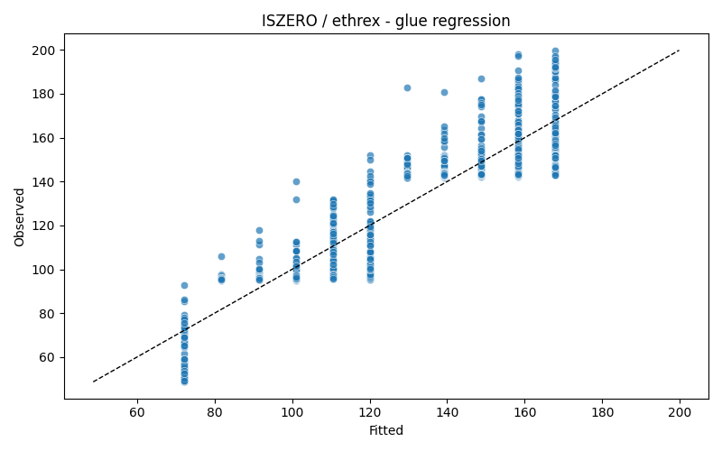

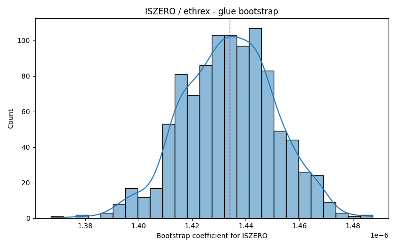

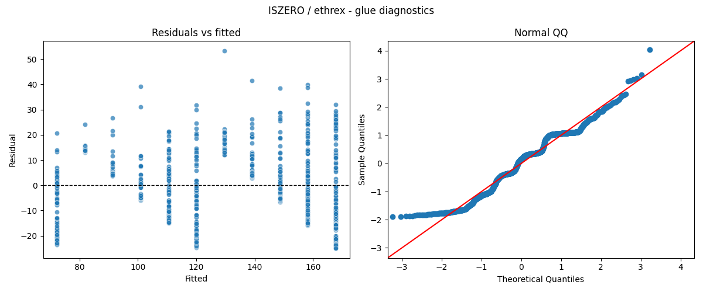

</details>

<details><summary><code>JUMPDEST</code> · nobs=1606 · runtime_ms=4.57e-07 · p=1.00e-03 · R²=0.8416</summary>

```
==============================================================================
                           NNLS Regression Results                            
==============================================================================
Dep. Variable:          test_runtime_ms              R-squared:          0.842
Model:                  NNLS                    Adj. R-squared:          0.842
No. Observations:       1606                              RMSE:          12.52
Df Residuals:           1604                               MAE:           9.70
Df Model:               1      
==============================================================================
                      coef     std err     P-value      [0.025      0.975]
------------------------------------------------------------------------------
         const     12.0949      0.9094       0.001     10.2835     13.8034
      JUMPDEST      0.0000      0.0000       0.001      0.0000      0.0000
==============================================================================
Notes: Non-negative least squares with bootstrap inference (1000 iterations)
==============================================================================
```

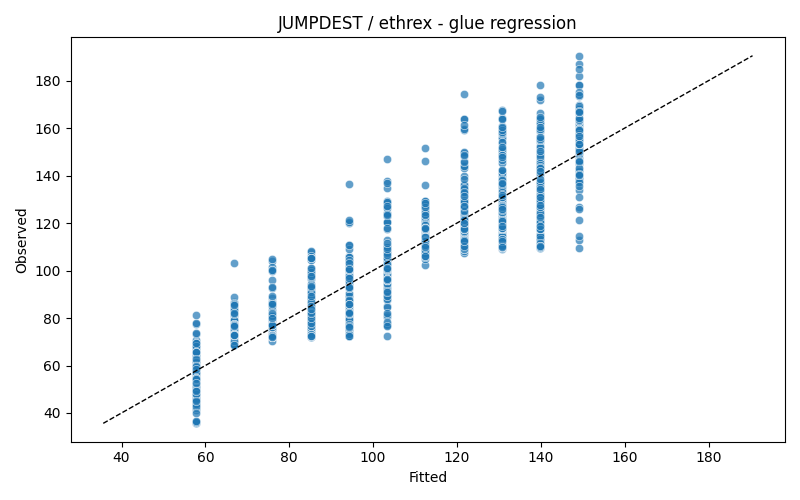

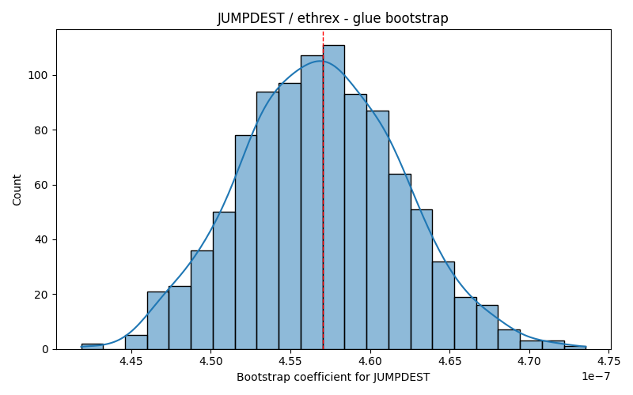

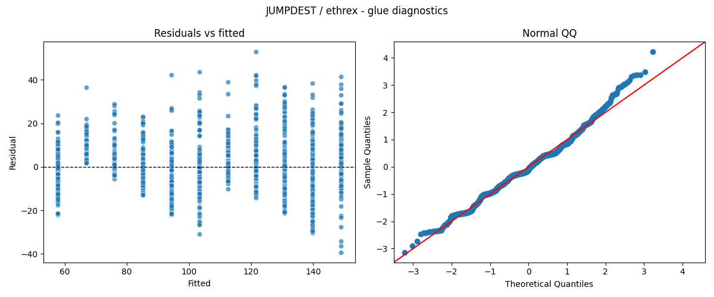

</details>

<details><summary><code>SWAP</code> · nobs=25696 · runtime_ms=7.062e-07 · p=1.00e-03 · R²=0.8021</summary>

```
==============================================================================
                           NNLS Regression Results                            
==============================================================================
Dep. Variable:          test_runtime_ms              R-squared:          0.802
Model:                  NNLS                    Adj. R-squared:          0.802
No. Observations:       25696                             RMSE:           7.38
Df Residuals:           25694                              MAE:           5.84
Df Model:               1      
==============================================================================
                      coef     std err     P-value      [0.025      0.975]
------------------------------------------------------------------------------
         const     15.7970      0.1577       0.001     15.4910     16.1158
          SWAP      0.0000      0.0000       0.001      0.0000      0.0000
==============================================================================
Notes: Non-negative least squares with bootstrap inference (1000 iterations)
==============================================================================
```

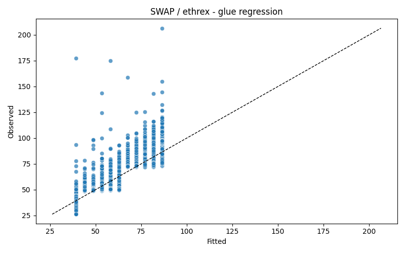

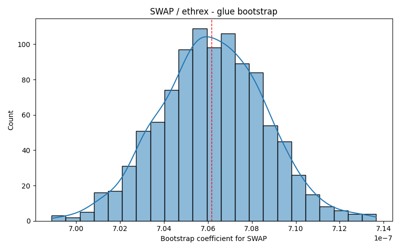

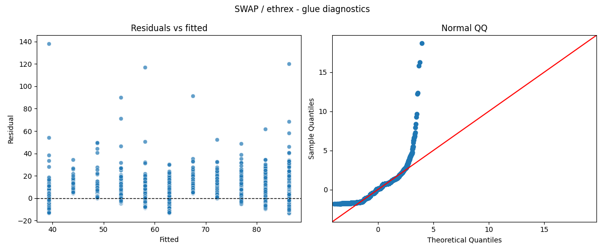

</details>

### Mixed glue (tier A) · ethrex

<details><summary><code>ADD</code> · nobs=1606 · runtime_ms=6.192e-07 · p=1.00e-03 · R²=0.5438</summary>

```
==============================================================================
                           NNLS Regression Results                            
==============================================================================
Dep. Variable:          test_runtime_ms              R-squared:          0.544
Model:                  NNLS                    Adj. R-squared:          0.544
No. Observations:       1606                              RMSE:           5.97
Df Residuals:           1604                               MAE:           4.67
Df Model:               1      
==============================================================================
                      coef     std err     P-value      [0.025      0.975]
------------------------------------------------------------------------------
         const     10.1721      0.4778       0.001      9.2614     11.1320
           ADD      0.0000      0.0000       0.001      0.0000      0.0000
==============================================================================
Notes: Non-negative least squares with bootstrap inference (1000 iterations)
==============================================================================
```

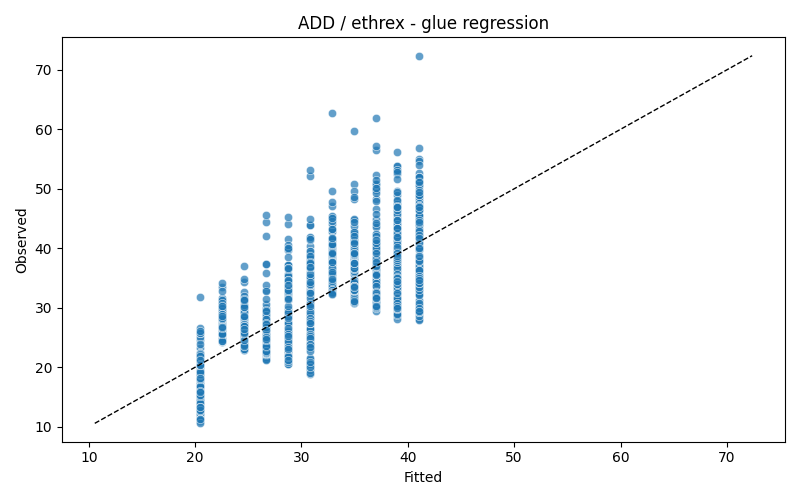

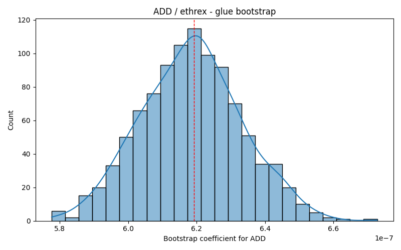

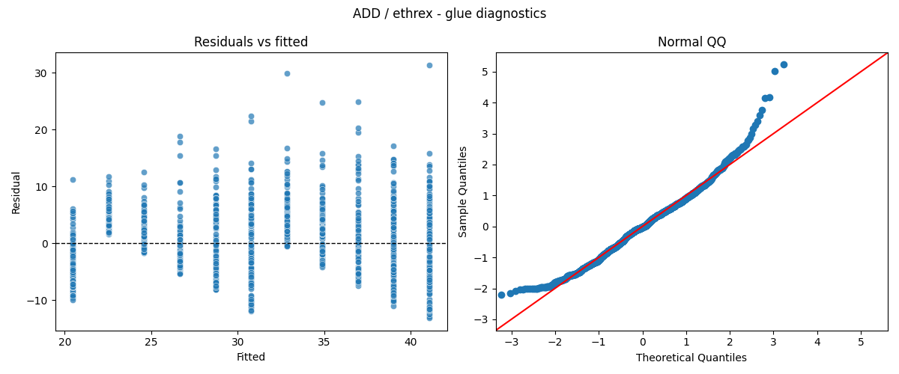

</details>

<details><summary><code>AND</code> · nobs=1606 · runtime_ms=6.005e-07 · p=1.00e-03 · R²=0.1523</summary>

```
==============================================================================
                           NNLS Regression Results                            
==============================================================================
Dep. Variable:          test_runtime_ms              R-squared:          0.152
Model:                  NNLS                    Adj. R-squared:          0.152
No. Observations:       1606                              RMSE:          14.91
Df Residuals:           1604                               MAE:          11.65
Df Model:               1      
==============================================================================
                      coef     std err     P-value      [0.025      0.975]
------------------------------------------------------------------------------
         const     15.7473      1.2226       0.001     13.4486     18.1093
           AND      0.0000      0.0000       0.001      0.0000      0.0000
==============================================================================
Notes: Non-negative least squares with bootstrap inference (1000 iterations)
==============================================================================
```

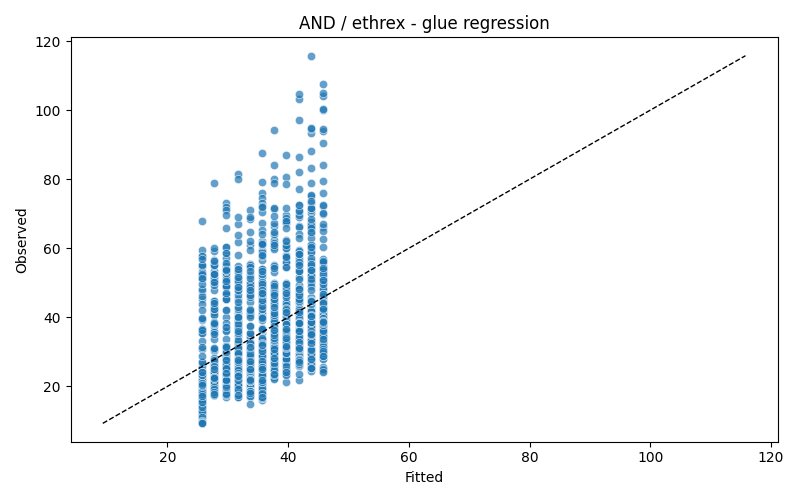

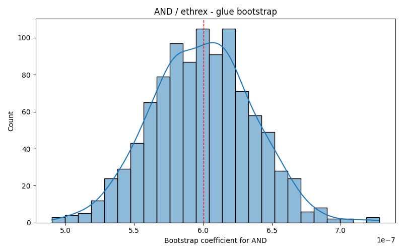

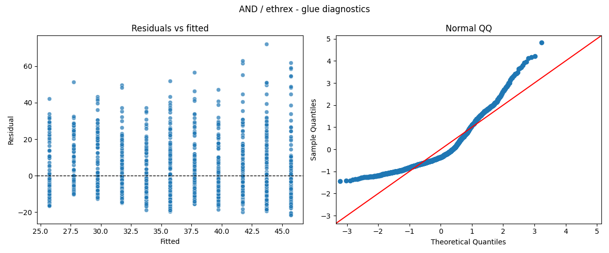

</details>

<details><summary><code>CALLDATACOPY</code> · nobs=38544 · runtime_ms=9.479e-07 · p=1.00e-03 · R²=0.4956</summary>

```
==============================================================================
                           NNLS Regression Results                            
==============================================================================
Dep. Variable:          test_runtime_ms              R-squared:          0.496
Model:                  NNLS                    Adj. R-squared:          0.496
No. Observations:       38544                             RMSE:           7.19
Df Residuals:           38542                              MAE:           5.23
Df Model:               1      
==============================================================================
                      coef     std err     P-value      [0.025      0.975]
------------------------------------------------------------------------------
         const     12.0748      0.0435       0.001     11.9877     12.1575
  CALLDATACOPY      0.0000      0.0000       0.001      0.0000      0.0000
==============================================================================
Notes: Non-negative least squares with bootstrap inference (1000 iterations)
==============================================================================
```

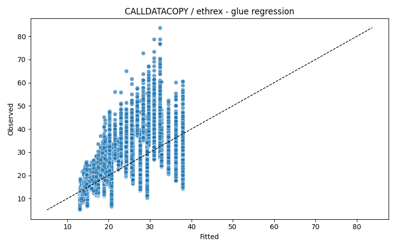

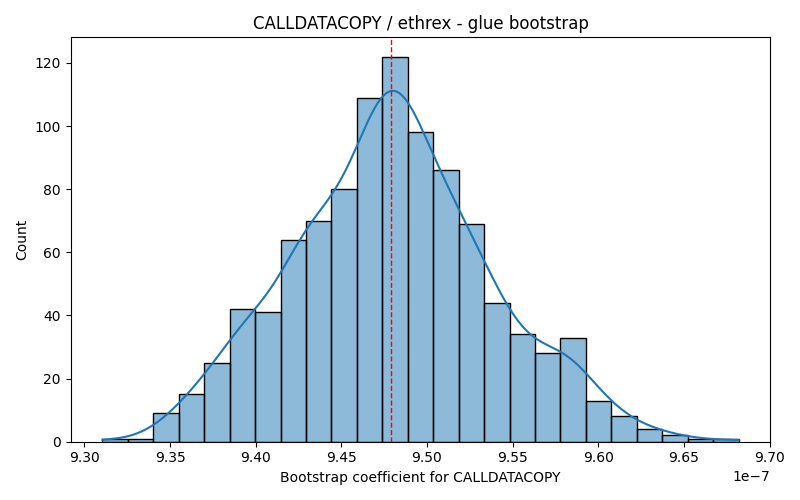

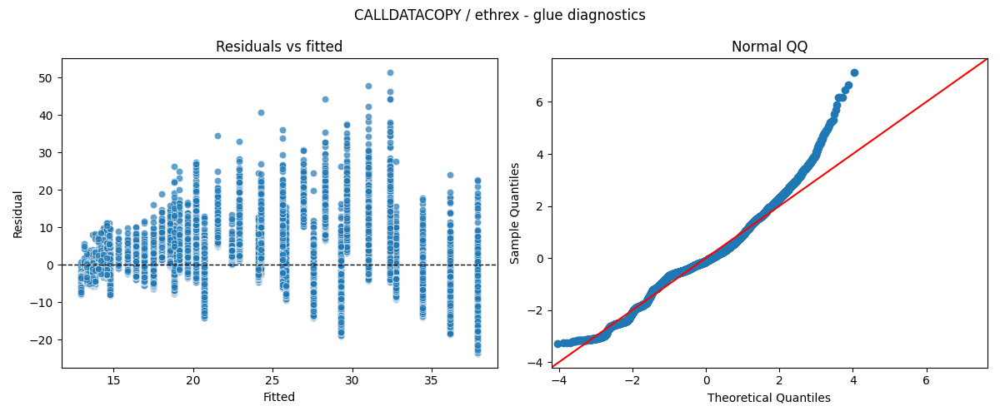

</details>

<details><summary><code>CALLDATALOAD</code> · nobs=6424 · runtime_ms=2.2e-05 · p=1.00e-03 · R²=0.267</summary>

```
==============================================================================
                           NNLS Regression Results                            
==============================================================================
Dep. Variable:          test_runtime_ms              R-squared:          0.267
Model:                  NNLS                    Adj. R-squared:          0.267
No. Observations:       6424                              RMSE:           0.14
Df Residuals:           6422                               MAE:           0.11
Df Model:               1      
==============================================================================
                      coef     std err     P-value      [0.025      0.975]
------------------------------------------------------------------------------
         const      2.4388      0.0057       0.001      2.4272      2.4500
  CALLDATALOAD      0.0000      0.0000       0.001      0.0000      0.0000
==============================================================================
Notes: Non-negative least squares with bootstrap inference (1000 iterations)
==============================================================================
```

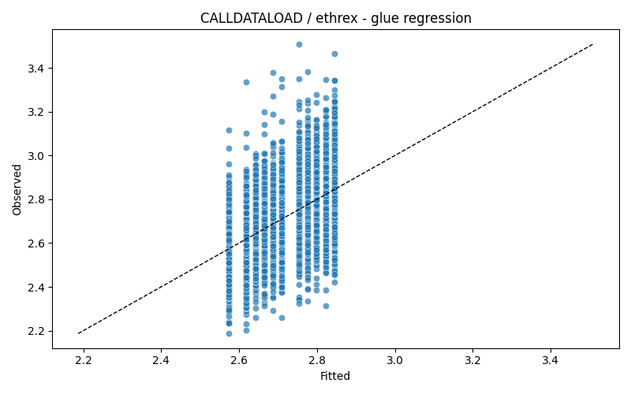

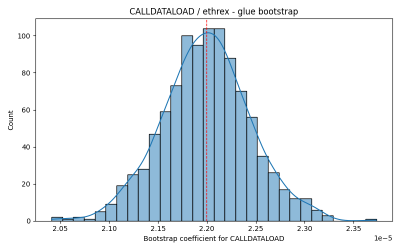

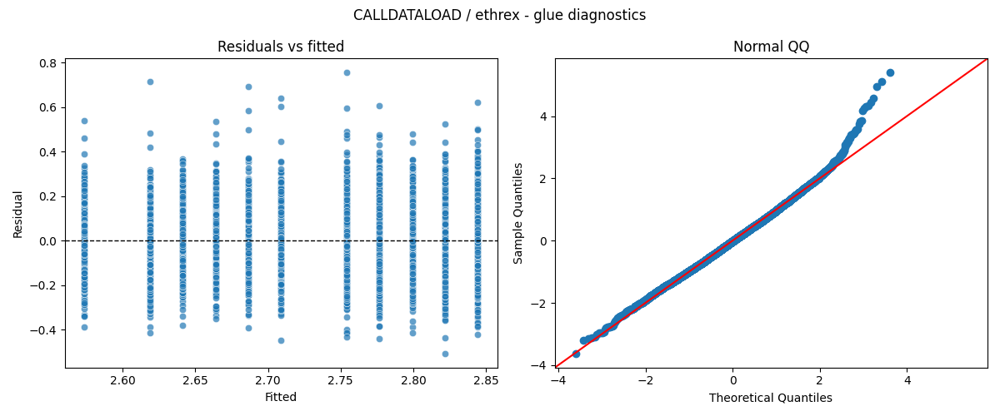

</details>

<details><summary><code>DIV</code> · nobs=1606 · runtime_ms=8.843e-06 · p=1.00e-03 · R²=0.8251</summary>

```
==============================================================================
                           NNLS Regression Results                            
==============================================================================
Dep. Variable:          test_runtime_ms              R-squared:          0.825
Model:                  NNLS                    Adj. R-squared:          0.825
No. Observations:       1606                              RMSE:          32.14
Df Residuals:           1604                               MAE:          27.06
Df Model:               1      
==============================================================================
                      coef     std err     P-value      [0.025      0.975]
------------------------------------------------------------------------------
         const     72.4363      3.1408       0.001     65.8982     78.6629
           DIV      0.0000      0.0000       0.001      0.0000      0.0000
==============================================================================
Notes: Non-negative least squares with bootstrap inference (1000 iterations)
==============================================================================
```

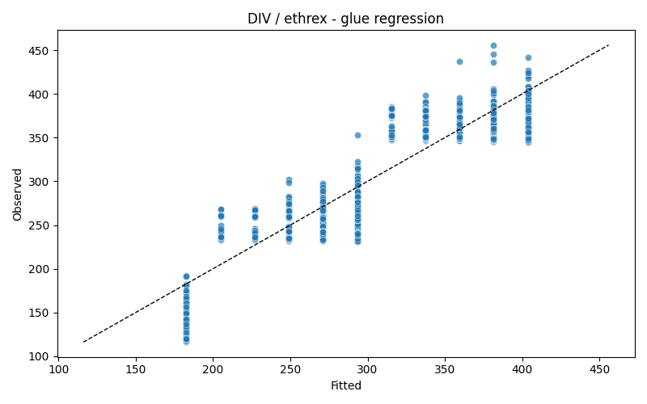

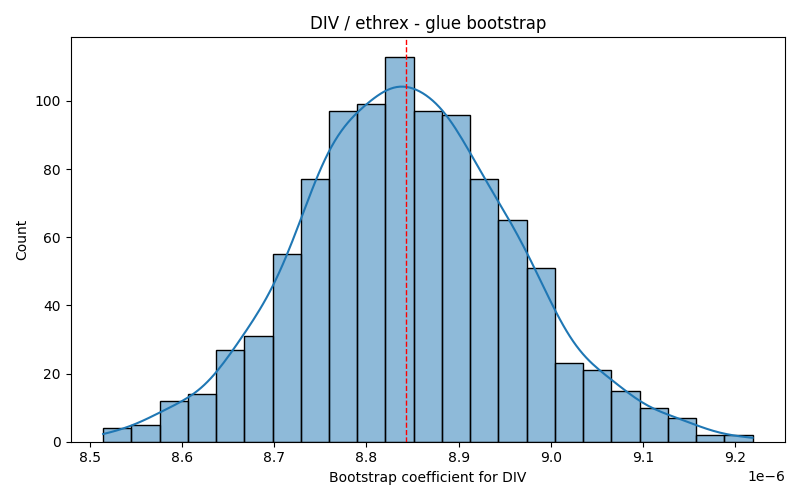

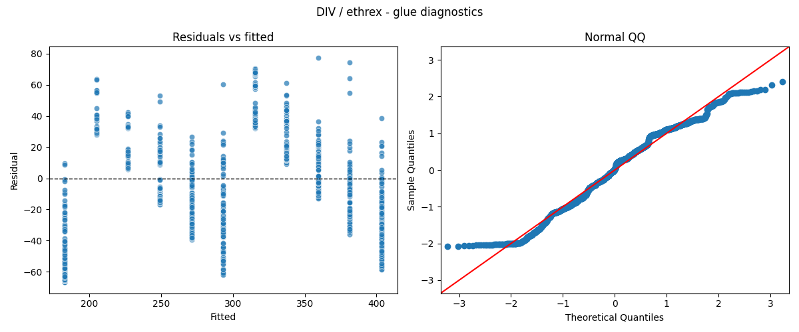

</details>

<details><summary><code>EXP</code> · nobs=1606 · runtime_ms=0.0009206 · p=1.00e-03 · R²=0.8276</summary>

```
==============================================================================
                           NNLS Regression Results                            
==============================================================================
Dep. Variable:          test_runtime_ms              R-squared:          0.828
Model:                  NNLS                    Adj. R-squared:          0.828
No. Observations:       1606                              RMSE:          16.45
Df Residuals:           1604                               MAE:          13.90
Df Model:               1      
==============================================================================
                      coef     std err     P-value      [0.025      0.975]
------------------------------------------------------------------------------
         const     35.4770      1.4875       0.001     32.8038     38.4641
           EXP      0.0009      0.0000       0.001      0.0009      0.0009
==============================================================================
Notes: Non-negative least squares with bootstrap inference (1000 iterations)
==============================================================================
```

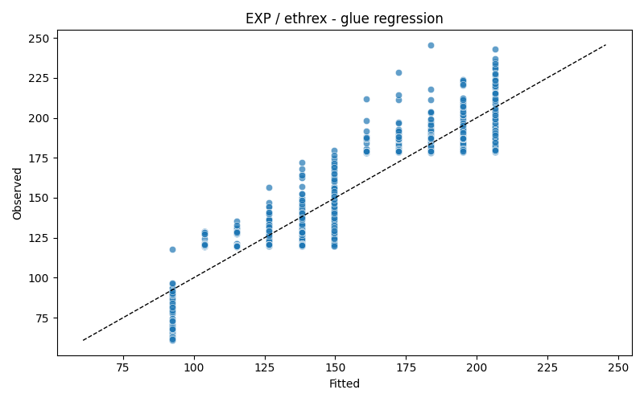

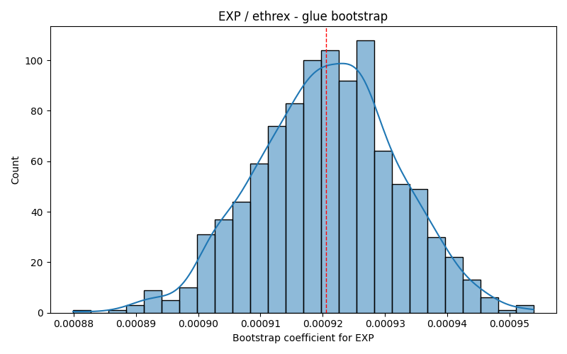

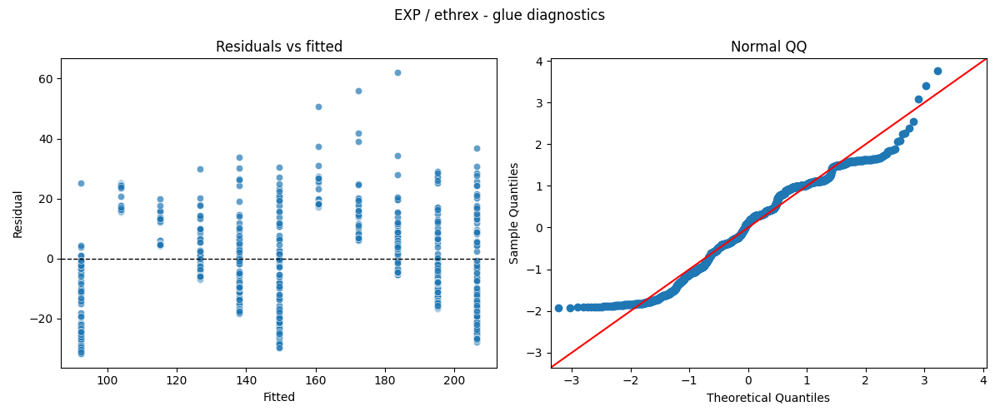

</details>

<details><summary><code>GT</code> · nobs=1606 · runtime_ms=5.774e-07 · p=1.00e-03 · R²=0.5755</summary>

```
==============================================================================
                           NNLS Regression Results                            
==============================================================================
Dep. Variable:          test_runtime_ms              R-squared:          0.575
Model:                  NNLS                    Adj. R-squared:          0.575
No. Observations:       1606                              RMSE:           5.22
Df Residuals:           1604                               MAE:           4.01
Df Model:               1      
==============================================================================
                      coef     std err     P-value      [0.025      0.975]
------------------------------------------------------------------------------
         const     10.3776      0.4164       0.001      9.5579     11.2097
            GT      0.0000      0.0000       0.001      0.0000      0.0000
==============================================================================
Notes: Non-negative least squares with bootstrap inference (1000 iterations)
==============================================================================
```

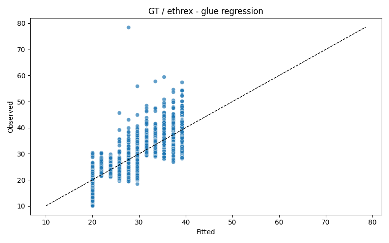

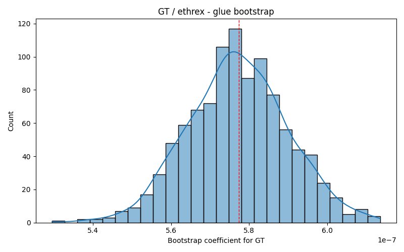

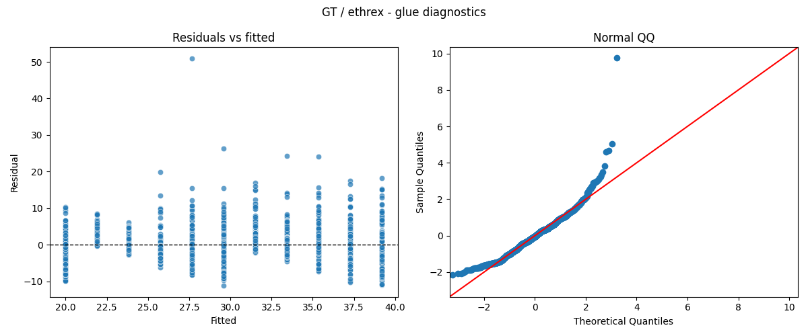

</details>

<details><summary><code>JUMPI</code> · nobs=1606 · runtime_ms=6.822e-07 · p=1.00e-03 · R²=0.4404</summary>

```
==============================================================================
                           NNLS Regression Results                            
==============================================================================
Dep. Variable:          test_runtime_ms              R-squared:          0.440
Model:                  NNLS                    Adj. R-squared:          0.440
No. Observations:       1606                              RMSE:           3.47
Df Residuals:           1604                               MAE:           2.65
Df Model:               1      
==============================================================================
                      coef     std err     P-value      [0.025      0.975]
------------------------------------------------------------------------------
         const      6.5848      0.2732       0.001      6.0486      7.1280
         JUMPI      0.0000      0.0000       0.001      0.0000      0.0000
==============================================================================
Notes: Non-negative least squares with bootstrap inference (1000 iterations)
==============================================================================
```

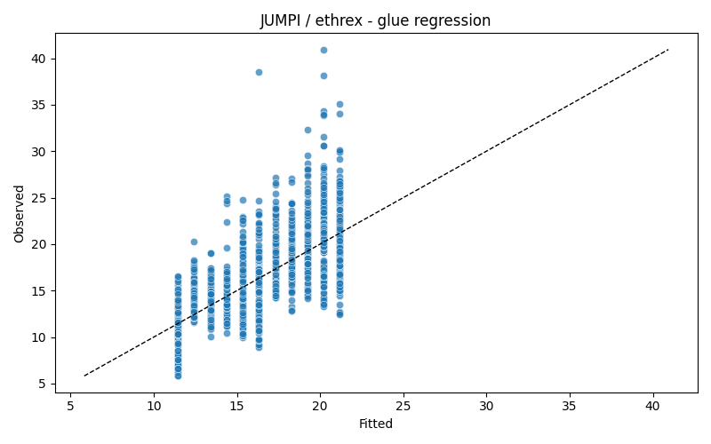

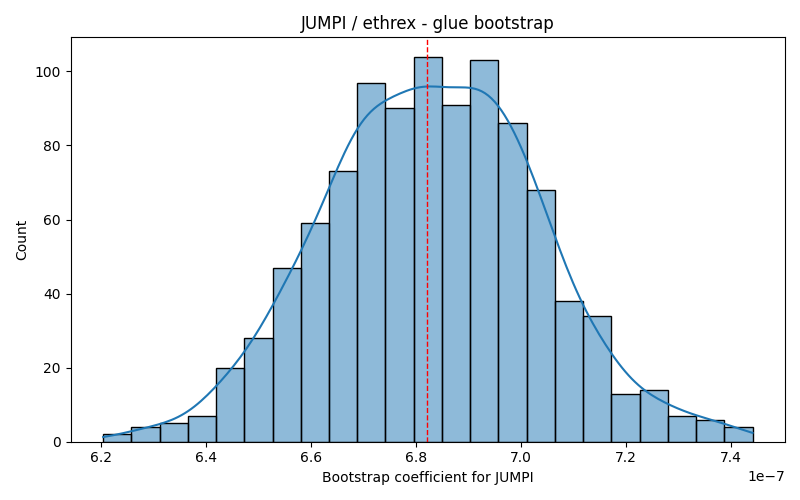

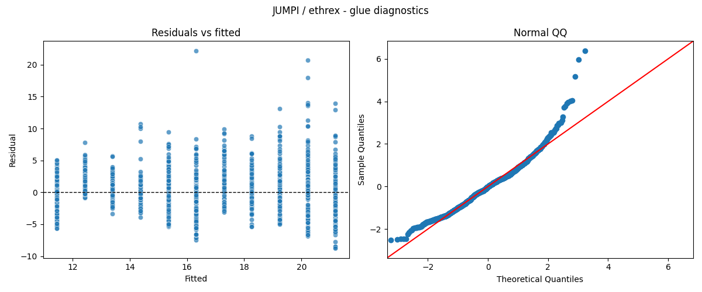

</details>

<details><summary><code>LT</code> · nobs=1606 · runtime_ms=5.637e-07 · p=1.00e-03 · R²=0.5569</summary>

```
==============================================================================
                           NNLS Regression Results                            
==============================================================================
Dep. Variable:          test_runtime_ms              R-squared:          0.557
Model:                  NNLS                    Adj. R-squared:          0.557
No. Observations:       1606                              RMSE:           5.29
Df Residuals:           1604                               MAE:           3.95
Df Model:               1      
==============================================================================
                      coef     std err     P-value      [0.025      0.975]
------------------------------------------------------------------------------
         const      9.9240      0.4355       0.001      9.0401     10.7425
            LT      0.0000      0.0000       0.001      0.0000      0.0000
==============================================================================
Notes: Non-negative least squares with bootstrap inference (1000 iterations)
==============================================================================
```


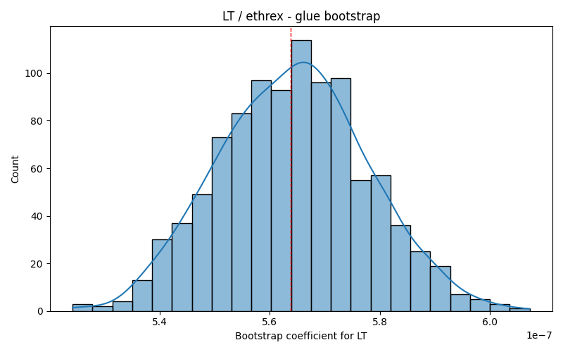

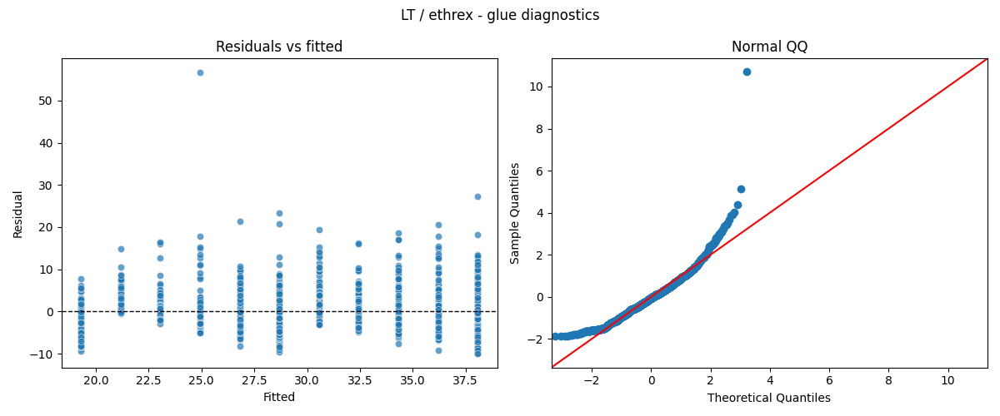

</details>

<details><summary><code>MSTORE</code> · nobs=8030 · runtime_ms=7.763e-07 · p=1.00e-03 · R²=0.4389</summary>

```
==============================================================================
                           NNLS Regression Results                            
==============================================================================
Dep. Variable:          test_runtime_ms              R-squared:          0.439
Model:                  NNLS                    Adj. R-squared:          0.439
No. Observations:       8030                              RMSE:           6.16
Df Residuals:           8028                               MAE:           4.62
Df Model:               1      
==============================================================================
                      coef     std err     P-value      [0.025      0.975]
------------------------------------------------------------------------------
         const     12.1857      0.2317       0.001     11.7097     12.6420
        MSTORE      0.0000      0.0000       0.001      0.0000      0.0000
==============================================================================
Notes: Non-negative least squares with bootstrap inference (1000 iterations)
==============================================================================
```

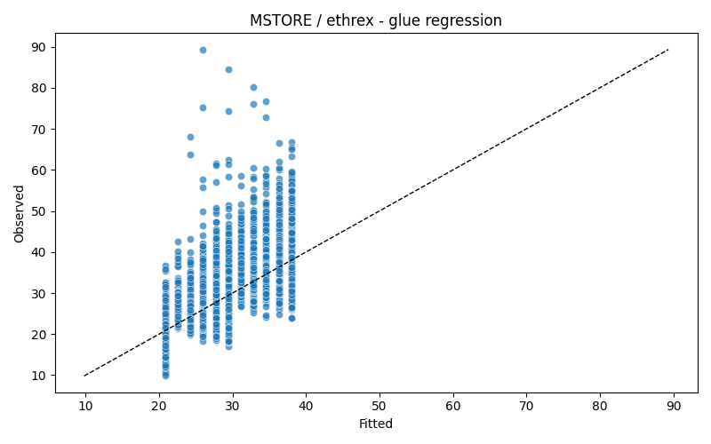

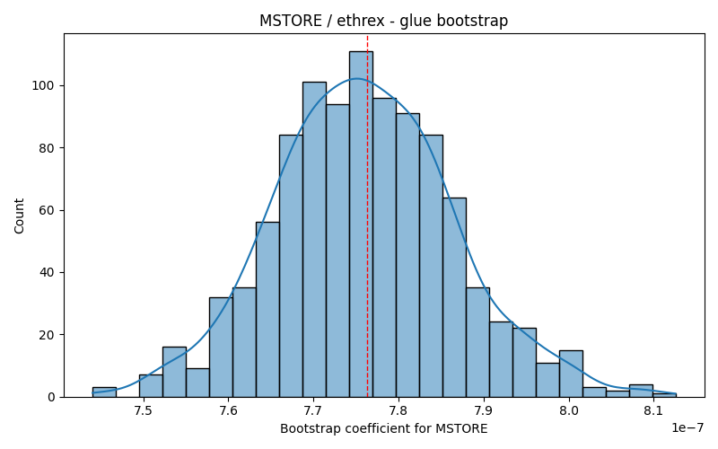

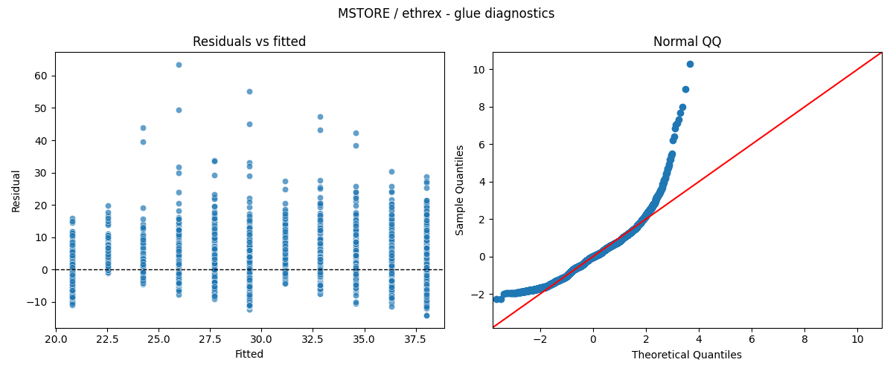

</details>

<details><summary><code>MSTORE8</code> · nobs=8030 · runtime_ms=6.725e-07 · p=1.00e-03 · R²=0.363</summary>

```
==============================================================================
                           NNLS Regression Results                            
==============================================================================
Dep. Variable:          test_runtime_ms              R-squared:          0.363
Model:                  NNLS                    Adj. R-squared:          0.363
No. Observations:       8030                              RMSE:           6.25
Df Residuals:           8028                               MAE:           4.66
Df Model:               1      
==============================================================================
                      coef     std err     P-value      [0.025      0.975]
------------------------------------------------------------------------------
         const     11.7992      0.2325       0.001     11.3630     12.2757
       MSTORE8      0.0000      0.0000       0.001      0.0000      0.0000
==============================================================================
Notes: Non-negative least squares with bootstrap inference (1000 iterations)
==============================================================================
```

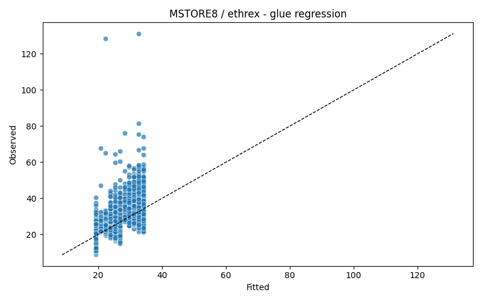

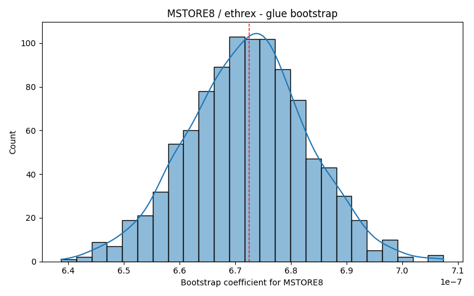

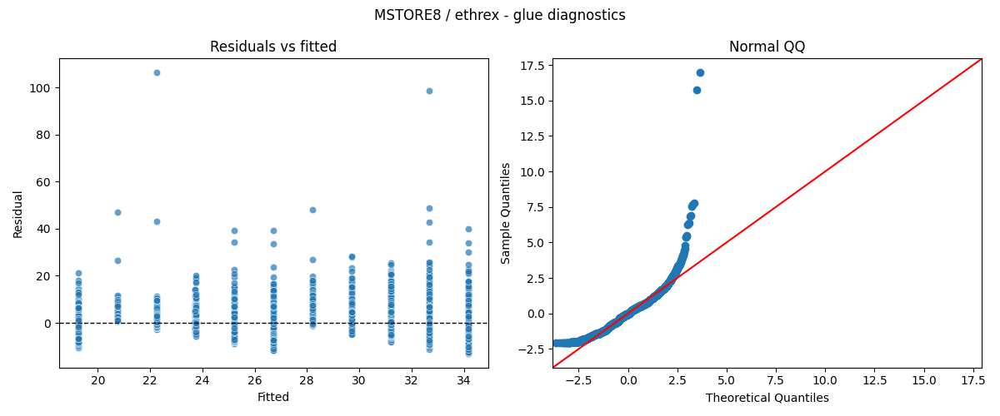

</details>

<details><summary><code>MUL</code> · nobs=1606 · runtime_ms=1.127e-06 · p=1.00e-03 · R²=0.6818</summary>

```
==============================================================================
                           NNLS Regression Results                            
==============================================================================
Dep. Variable:          test_runtime_ms              R-squared:          0.682
Model:                  NNLS                    Adj. R-squared:          0.682
No. Observations:       1606                              RMSE:           6.08
Df Residuals:           1604                               MAE:           4.90
Df Model:               1      
==============================================================================
                      coef     std err     P-value      [0.025      0.975]
------------------------------------------------------------------------------
         const     12.6672      0.5044       0.001     11.6249     13.6880
           MUL      0.0000      0.0000       0.001      0.0000      0.0000
==============================================================================
Notes: Non-negative least squares with bootstrap inference (1000 iterations)
==============================================================================
```

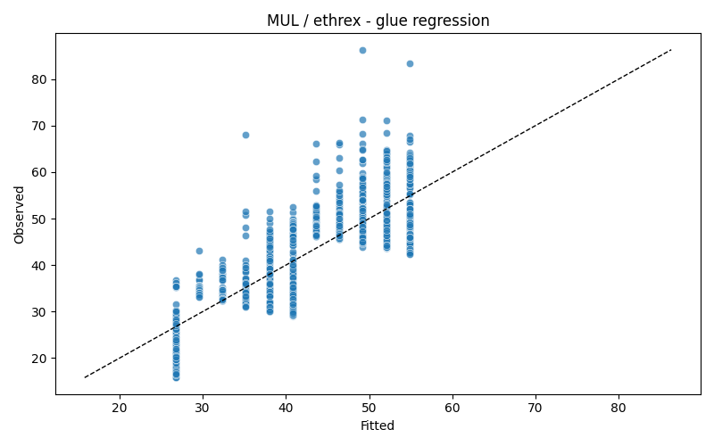

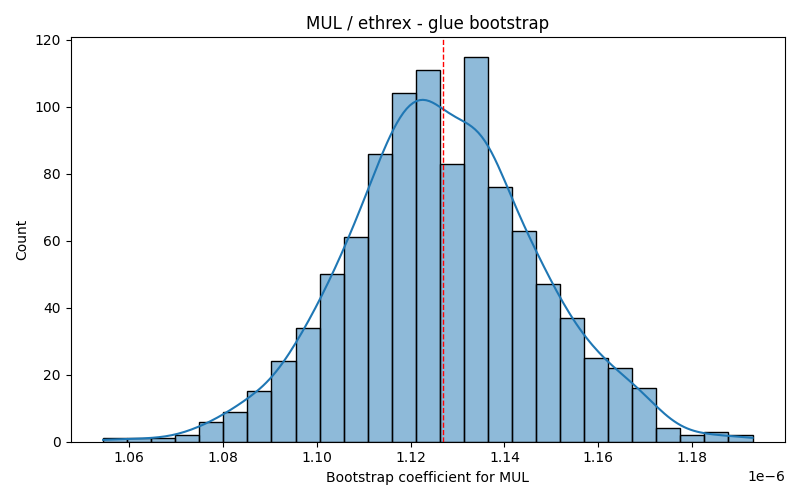

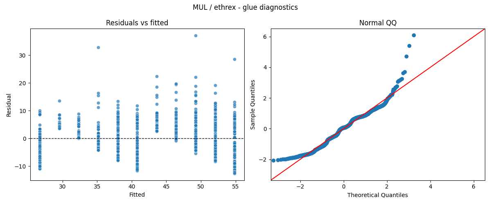

</details>

<details><summary><code>PC</code> · nobs=1606 · runtime_ms=4.852e-07 · p=1.00e-03 · R²=0.781</summary>

```
==============================================================================
                           NNLS Regression Results                            
==============================================================================
Dep. Variable:          test_runtime_ms              R-squared:          0.781
Model:                  NNLS                    Adj. R-squared:          0.781
No. Observations:       1606                              RMSE:           7.68
Df Residuals:           1604                               MAE:           6.16
Df Model:               1      
==============================================================================
                      coef     std err     P-value      [0.025      0.975]
------------------------------------------------------------------------------
         const     15.0074      0.6692       0.001     13.6959     16.2859
            PC      0.0000      0.0000       0.001      0.0000      0.0000
==============================================================================
Notes: Non-negative least squares with bootstrap inference (1000 iterations)
==============================================================================
```

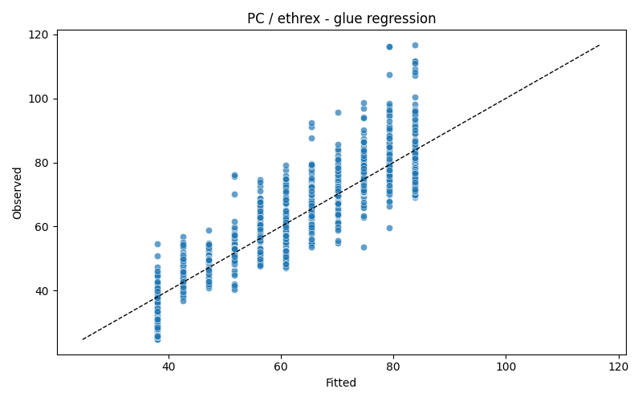

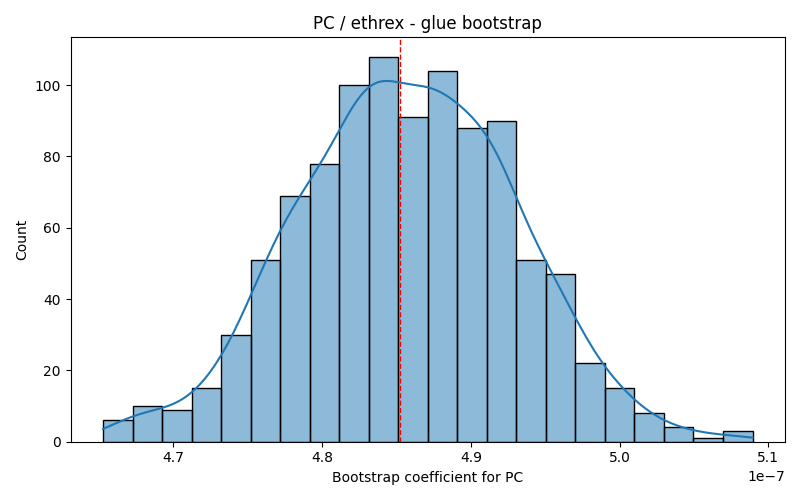

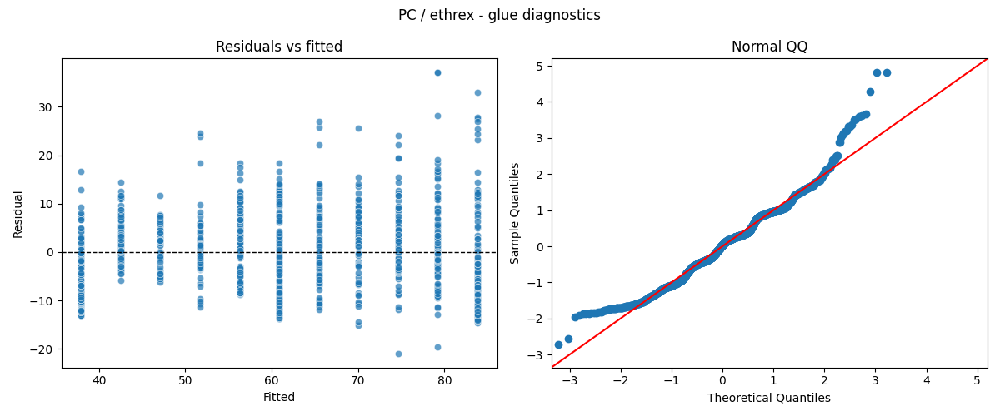

</details>

<details><summary><code>RETURNDATASIZE</code> · nobs=6424 · runtime_ms=9.415e-07 · p=1.00e-03 · R²=0.7944</summary>

```
==============================================================================
                           NNLS Regression Results                            
==============================================================================
Dep. Variable:          test_runtime_ms              R-squared:          0.794
Model:                  NNLS                    Adj. R-squared:          0.794
No. Observations:       6424                              RMSE:           7.56
Df Residuals:           6422                               MAE:           5.74
Df Model:               1      
==============================================================================
                      coef     std err     P-value      [0.025      0.975]
------------------------------------------------------------------------------
         const     12.8096      0.3158       0.001     12.1827     13.4164
RETURNDATASIZE      0.0000      0.0000       0.001      0.0000      0.0000
==============================================================================
Notes: Non-negative least squares with bootstrap inference (1000 iterations)
==============================================================================
```

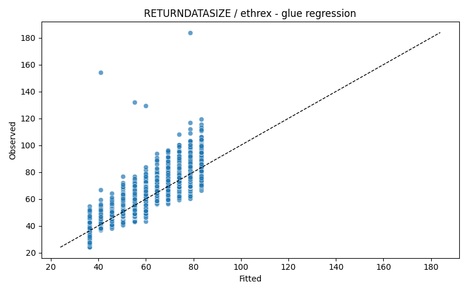

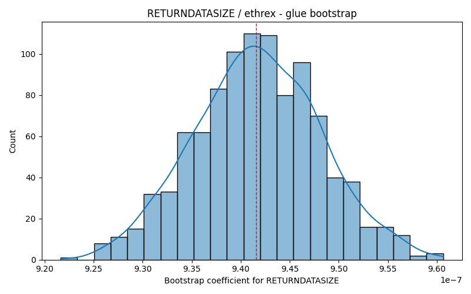

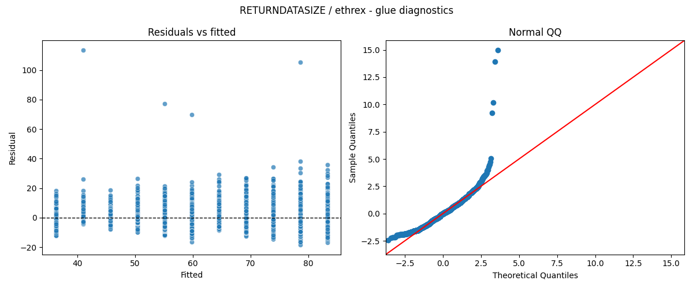

</details>

<details><summary><code>SELFBALANCE</code> · nobs=1314 · runtime_ms=4.755e-06 · p=1.00e-03 · R²=0.8119</summary>

```
==============================================================================
                           NNLS Regression Results                            
==============================================================================
Dep. Variable:          test_runtime_ms              R-squared:          0.812
Model:                  NNLS                    Adj. R-squared:          0.812
No. Observations:       1314                              RMSE:          23.09
Df Residuals:           1312                               MAE:          19.01
Df Model:               1      
==============================================================================
                      coef     std err     P-value      [0.025      0.975]
------------------------------------------------------------------------------
         const     77.1235      2.1010       0.001     73.0981     81.2249
   SELFBALANCE      0.0000      0.0000       0.001      0.0000      0.0000
==============================================================================
Notes: Non-negative least squares with bootstrap inference (1000 iterations)
==============================================================================
```

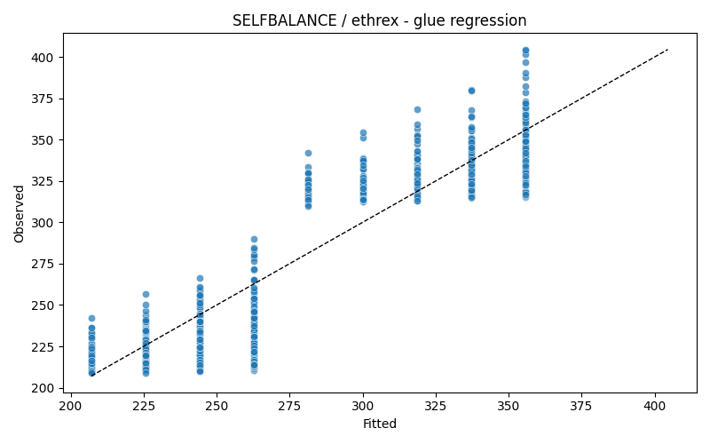

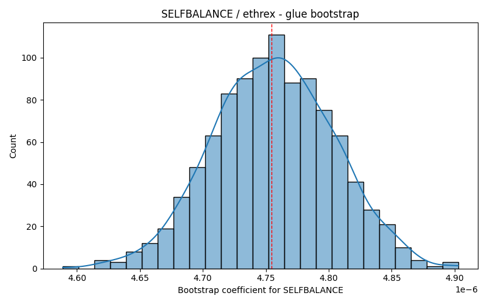

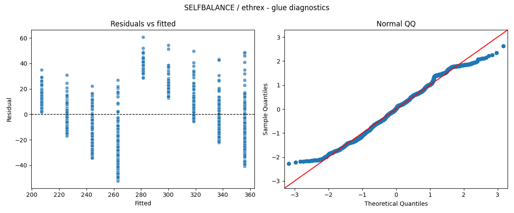

</details>

<details><summary><code>SUB</code> · nobs=1606 · runtime_ms=6.203e-07 · p=1.00e-03 · R²=0.5558</summary>

```
==============================================================================
                           NNLS Regression Results                            
==============================================================================
Dep. Variable:          test_runtime_ms              R-squared:          0.556
Model:                  NNLS                    Adj. R-squared:          0.556
No. Observations:       1606                              RMSE:           5.84
Df Residuals:           1604                               MAE:           4.64
Df Model:               1      
==============================================================================
                      coef     std err     P-value      [0.025      0.975]
------------------------------------------------------------------------------
         const     10.8848      0.4762       0.001      9.9924     11.8342
           SUB      0.0000      0.0000       0.001      0.0000      0.0000
==============================================================================
Notes: Non-negative least squares with bootstrap inference (1000 iterations)
==============================================================================
```

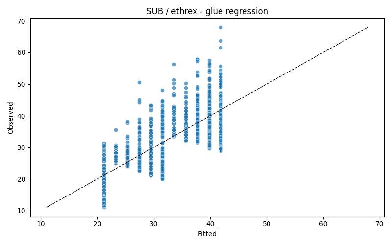

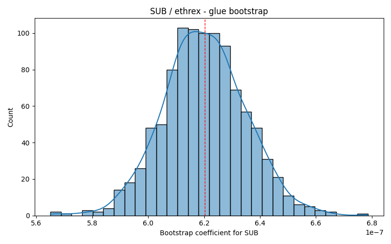

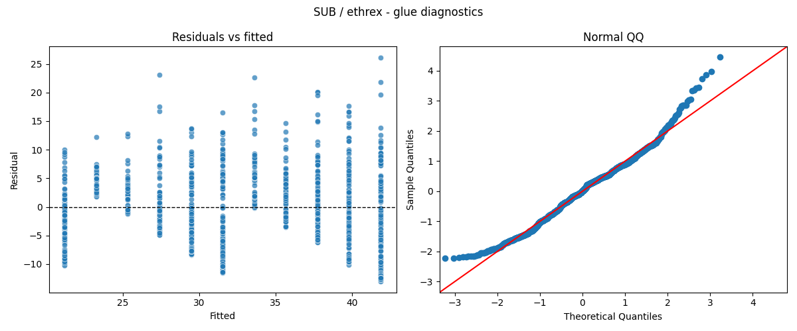

</details>

### Mixed glue (tier B) · ethrex

<details><summary><code>JUMP</code> · nobs=1606 · runtime_ms=2.101e-06 · p=1.00e-03 · R²=0.5136</summary>

```
==============================================================================
                           NNLS Regression Results                            
==============================================================================
Dep. Variable:          test_runtime_ms              R-squared:          0.514
Model:                  NNLS                    Adj. R-squared:          0.513
No. Observations:       1606                              RMSE:           7.60
Df Residuals:           1604                               MAE:           6.11
Df Model:               1      
==============================================================================
                      coef     std err     P-value      [0.025      0.975]
------------------------------------------------------------------------------
         const     18.1279      0.6217       0.001     16.9020     19.3567
          JUMP      0.0000      0.0000       0.001      0.0000      0.0000
==============================================================================
Notes: Non-negative least squares with bootstrap inference (1000 iterations)
==============================================================================
```

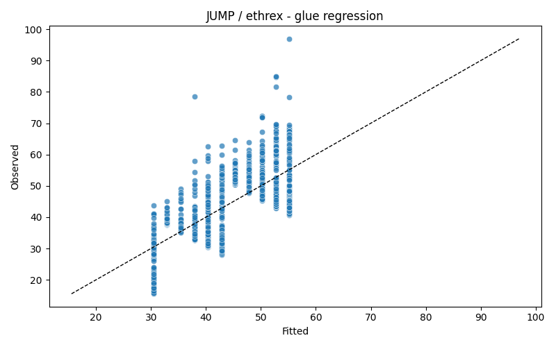

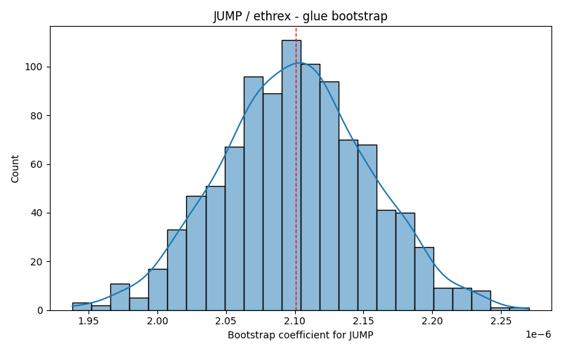

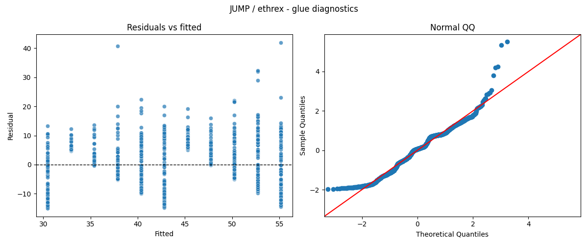

</details>

<details><summary><code>KECCAK256</code> · nobs=25696 · runtime_ms=0 · p=1.00e+00 · R²=0</summary>

```
==============================================================================
                           NNLS Regression Results                            
==============================================================================
Dep. Variable:          test_runtime_ms              R-squared:          0.000
Model:                  NNLS                    Adj. R-squared:         -0.000
No. Observations:       25696                             RMSE:         158.08
Df Residuals:           25694                              MAE:         130.61
Df Model:               1      
==============================================================================
                      coef     std err     P-value      [0.025      0.975]
------------------------------------------------------------------------------
         const    245.9525      1.0156       0.001    243.7871    247.7481
     KECCAK256      0.0000      0.0000       1.000      0.0000      0.0000
==============================================================================
Notes: Non-negative least squares with bootstrap inference (1000 iterations)
==============================================================================
```

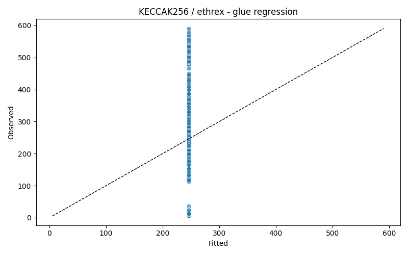


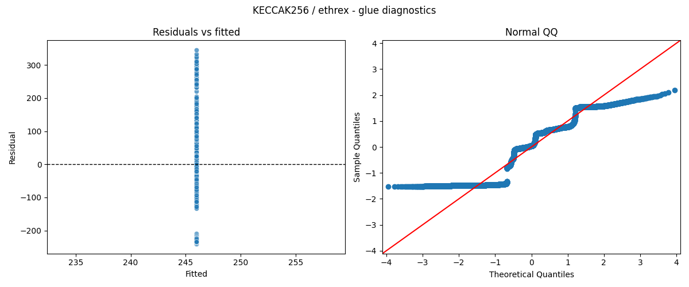

</details>

## geth

| glue_opcode | nobs | glue_runtime_ms | p_value | rsquared |
| --- | --- | --- | --- | --- |
| `ISZERO` | 4224 | 1.489e-06 | 1.00e-03 | 0.7685 |
| `JUMPDEST` | 4224 | 1.183e-06 | 1.00e-03 | 0.7201 |
| `SWAP` | 67584 | 1.552e-06 | 1.00e-03 | 0.7139 |
| `CALLDATASIZE` | 250514 | 1.465e-06 | 1.00e-03 | 0.8182 |
| `DUP` | 250514 | 1.554e-06 | 1.00e-03 | 0.8182 |
| `GAS` | 250514 | 1.49e-06 | 1.00e-03 | 0.8182 |
| `MLOAD` | 250514 | 5.268e-06 | 1.00e-03 | 0.8182 |
| `PUSH` | 250514 | 2.3e-06 | 1.00e-03 | 0.8182 |
| `PUSH0` | 250514 | 1.449e-06 | 1.00e-03 | 0.8182 |
| `STATICCALL` | 250514 | 0.0001653 | 1.00e-03 | 0.8182 |
| `ADD` | 4224 | 2.608e-06 | 1.00e-03 | 0.5217 |
| `AND` | 4224 | 2.292e-06 | 1.00e-03 | 0.4725 |
| `CALLDATACOPY` | 101376 | 6.965e-06 | 1.00e-03 | 0.8402 |
| `CALLDATALOAD` | 16896 | 4.932e-05 | 1.00e-03 | 0.02203 |
| `DIV` | 4224 | 7.946e-06 | 1.00e-03 | 0.735 |
| `EXP` | 4224 | 0.0003473 | 1.00e-03 | 0.6913 |
| `GT` | 4224 | 2.018e-06 | 1.00e-03 | 0.4444 |
| `JUMPI` | 4224 | 2.891e-06 | 1.00e-03 | 0.4243 |
| `LT` | 4224 | 2.911e-06 | 1.00e-03 | 0.5866 |
| `MSTORE` | 21120 | 4.677e-06 | 1.00e-03 | 0.5758 |
| `MSTORE8` | 21120 | 4.082e-06 | 1.00e-03 | 0.5178 |
| `MUL` | 4224 | 3.169e-06 | 1.00e-03 | 0.6443 |
| `PC` | 4224 | 1.477e-06 | 1.00e-03 | 0.7733 |
| `RETURNDATASIZE` | 16896 | 3.208e-06 | 1.00e-03 | 0.6336 |
| `SELFBALANCE` | 3456 | 7.511e-06 | 1.00e-03 | 0.7969 |
| `SUB` | 4224 | 2.427e-06 | 1.00e-03 | 0.4983 |
| `JUMP` | 4224 | 1.626e-06 | 1.00e-03 | 0.1005 |
| `KECCAK256` | 67584 | 2.931e-05 | 1.00e-03 | 0.2066 |

### Cycle glue — joint fit · geth

<details><summary>Joint NNLS regression summary</summary>

```
==============================================================================
                           NNLS Regression Results                            
==============================================================================
Dep. Variable:          test_runtime_ms              R-squared:          0.818
Model:                  NNLS                    Adj. R-squared:          0.818
No. Observations:       250514                            RMSE:          25.03
Df Residuals:           250506                             MAE:          19.28
Df Model:               7      
==============================================================================
                      coef     std err     P-value      [0.025      0.975]
------------------------------------------------------------------------------
         const     39.4723      0.1746       0.001     39.1134     39.8075
  CALLDATASIZE      0.0000      0.0000       0.001      0.0000      0.0000
           DUP      0.0000      0.0000       0.001      0.0000      0.0000
           GAS      0.0000      0.0000       0.001      0.0000      0.0000
         MLOAD      0.0000      0.0000       0.001      0.0000      0.0000
          PUSH      0.0000      0.0000       0.001      0.0000      0.0000
         PUSH0      0.0000      0.0000       0.001      0.0000      0.0000
    STATICCALL      0.0002      0.0000       0.001      0.0002      0.0002
==============================================================================
Notes: Non-negative least squares with bootstrap inference (1000 iterations)
==============================================================================
```

</details>

<details><summary><code>CALLDATASIZE</code> · nobs=250514 · runtime_ms=1.465e-06 · p=1.00e-03 · R²=0.8182</summary>


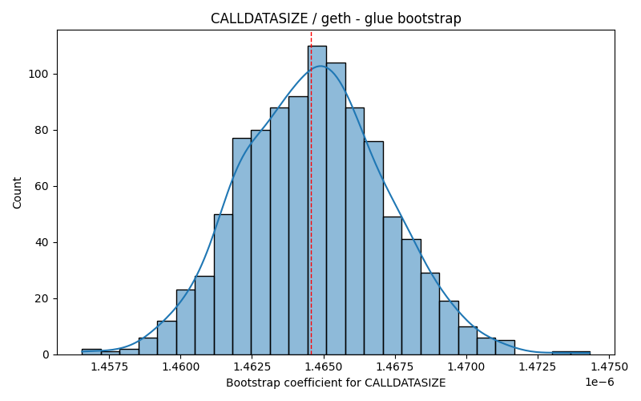

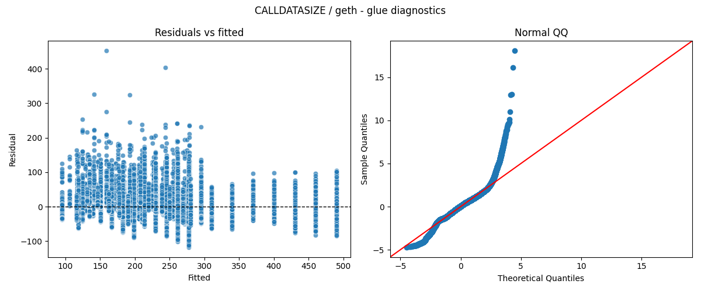

</details>

<details><summary><code>DUP</code> · nobs=250514 · runtime_ms=1.554e-06 · p=1.00e-03 · R²=0.8182</summary>


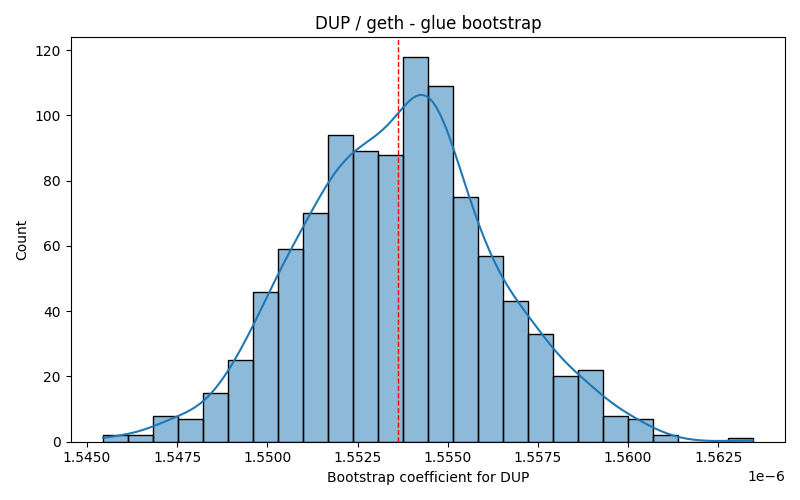


</details>

<details><summary><code>GAS</code> · nobs=250514 · runtime_ms=1.49e-06 · p=1.00e-03 · R²=0.8182</summary>


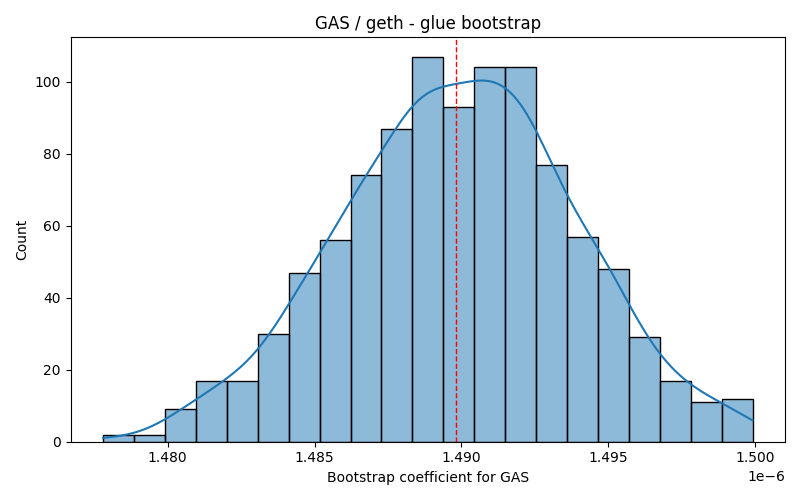

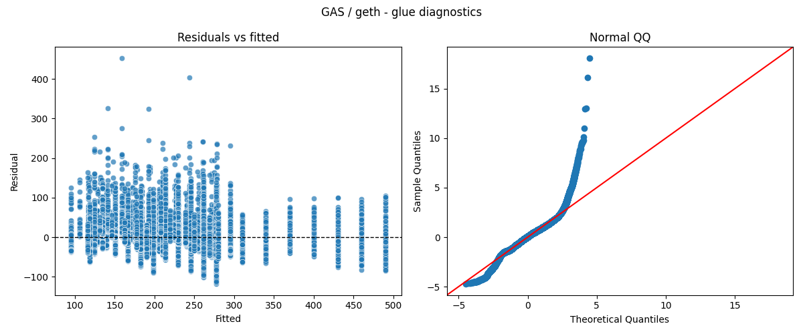

</details>

<details><summary><code>MLOAD</code> · nobs=250514 · runtime_ms=5.268e-06 · p=1.00e-03 · R²=0.8182</summary>


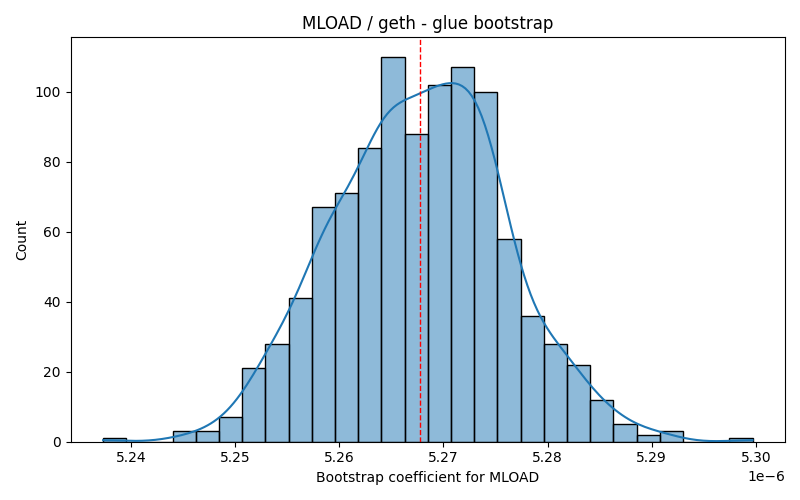


</details>

<details><summary><code>PUSH</code> · nobs=250514 · runtime_ms=2.3e-06 · p=1.00e-03 · R²=0.8182</summary>


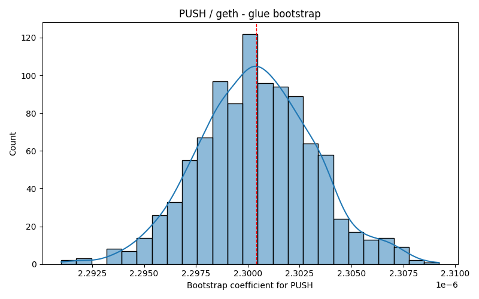


</details>

<details><summary><code>PUSH0</code> · nobs=250514 · runtime_ms=1.449e-06 · p=1.00e-03 · R²=0.8182</summary>

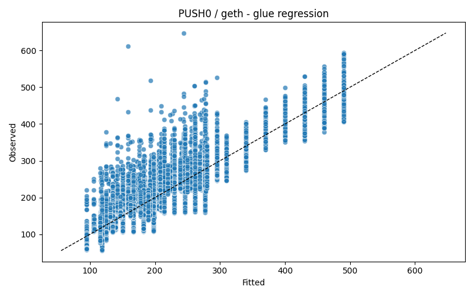

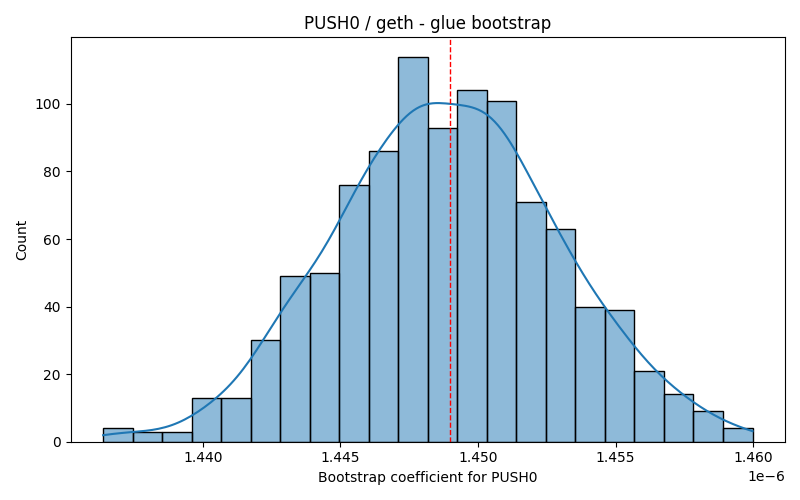


</details>

<details><summary><code>STATICCALL</code> · nobs=250514 · runtime_ms=0.0001653 · p=1.00e-03 · R²=0.8182</summary>


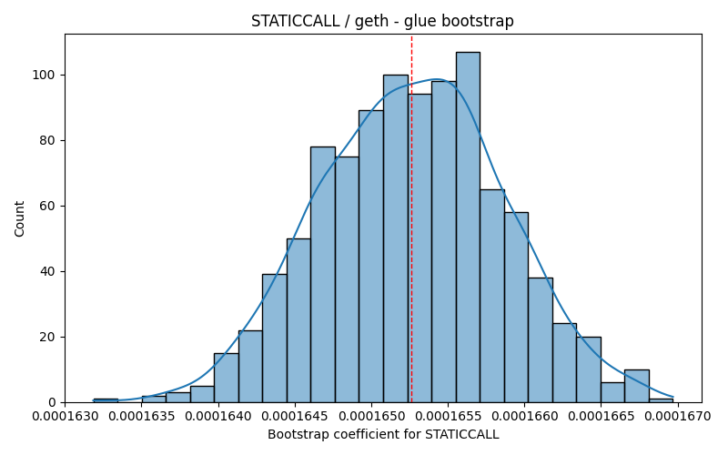

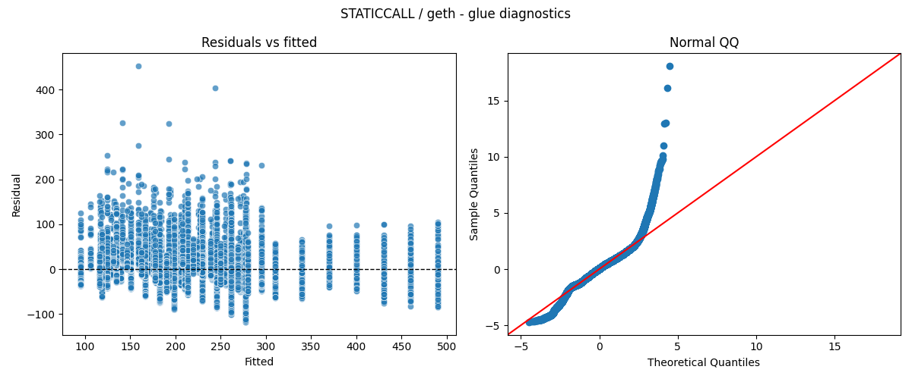

</details>

### Pure glue · geth

<details><summary><code>ISZERO</code> · nobs=4224 · runtime_ms=1.489e-06 · p=1.00e-03 · R²=0.7685</summary>

```
==============================================================================
                           NNLS Regression Results                            
==============================================================================
Dep. Variable:          test_runtime_ms              R-squared:          0.769
Model:                  NNLS                    Adj. R-squared:          0.768
No. Observations:       4224                              RMSE:          17.20
Df Residuals:           4222                               MAE:          12.58
Df Model:               1      
==============================================================================
                      coef     std err     P-value      [0.025      0.975]
------------------------------------------------------------------------------
         const     25.2281      0.9354       0.001     23.3919     27.0371
        ISZERO      0.0000      0.0000       0.001      0.0000      0.0000
==============================================================================
Notes: Non-negative least squares with bootstrap inference (1000 iterations)
==============================================================================
```

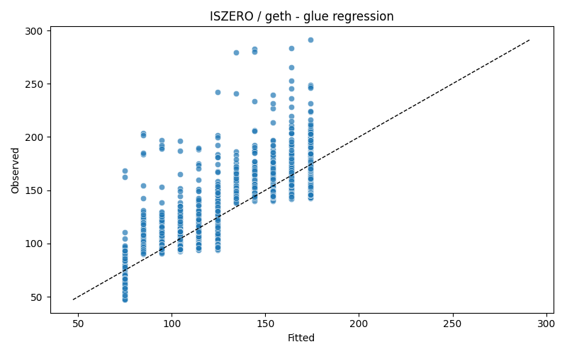

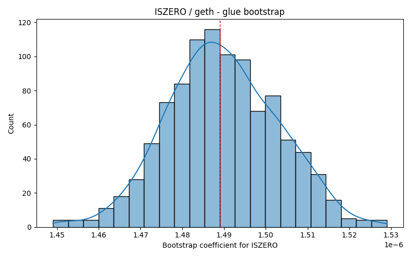

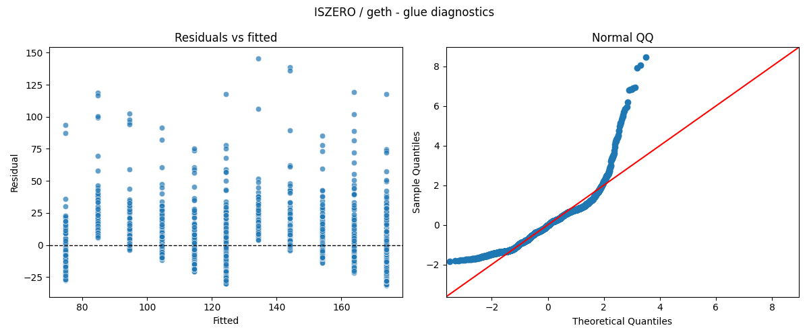

</details>

<details><summary><code>JUMPDEST</code> · nobs=4224 · runtime_ms=1.183e-06 · p=1.00e-03 · R²=0.7201</summary>

```
==============================================================================
                           NNLS Regression Results                            
==============================================================================
Dep. Variable:          test_runtime_ms              R-squared:          0.720
Model:                  NNLS                    Adj. R-squared:          0.720
No. Observations:       4224                              RMSE:          46.59
Df Residuals:           4222                               MAE:          29.31
Df Model:               1      
==============================================================================
                      coef     std err     P-value      [0.025      0.975]
------------------------------------------------------------------------------
         const     70.8015      2.6855       0.001     65.8528     76.2675
      JUMPDEST      0.0000      0.0000       0.001      0.0000      0.0000
==============================================================================
Notes: Non-negative least squares with bootstrap inference (1000 iterations)
==============================================================================
```

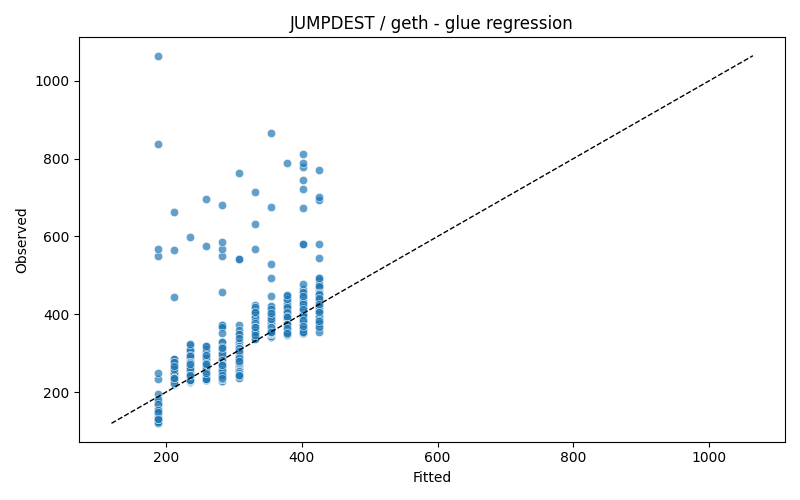

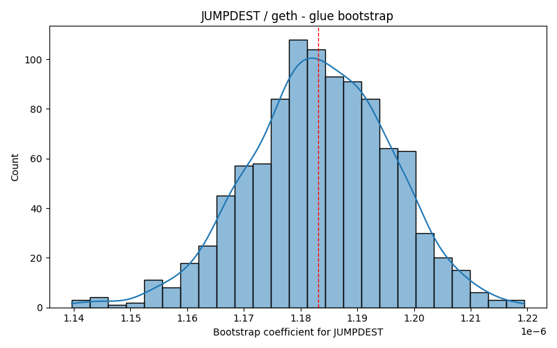

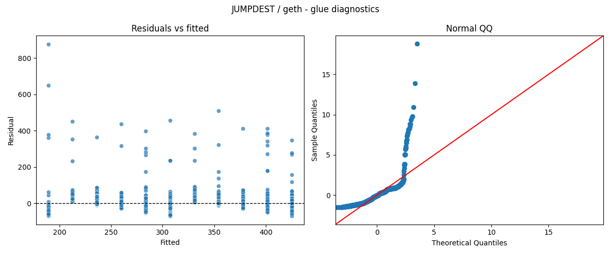

</details>

<details><summary><code>SWAP</code> · nobs=67584 · runtime_ms=1.552e-06 · p=1.00e-03 · R²=0.7139</summary>

```
==============================================================================
                           NNLS Regression Results                            
==============================================================================
Dep. Variable:          test_runtime_ms              R-squared:          0.714
Model:                  NNLS                    Adj. R-squared:          0.714
No. Observations:       67584                             RMSE:          20.68
Df Residuals:           67582                              MAE:          14.34
Df Model:               1      
==============================================================================
                      coef     std err     P-value      [0.025      0.975]
------------------------------------------------------------------------------
         const     32.6922      0.2670       0.001     32.1626     33.1908
          SWAP      0.0000      0.0000       0.001      0.0000      0.0000
==============================================================================
Notes: Non-negative least squares with bootstrap inference (1000 iterations)
==============================================================================
```

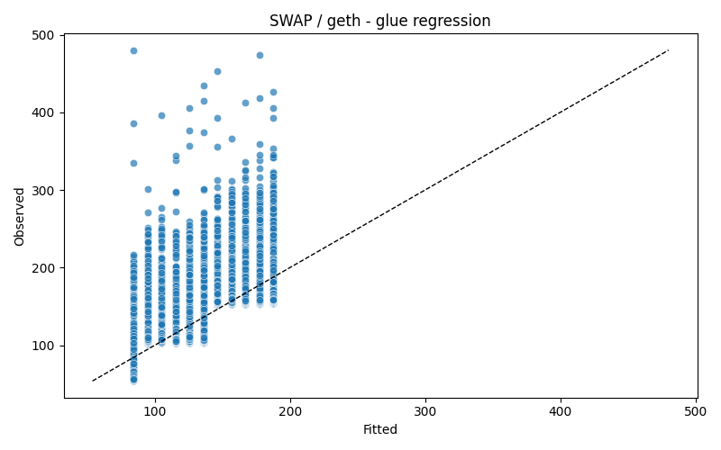

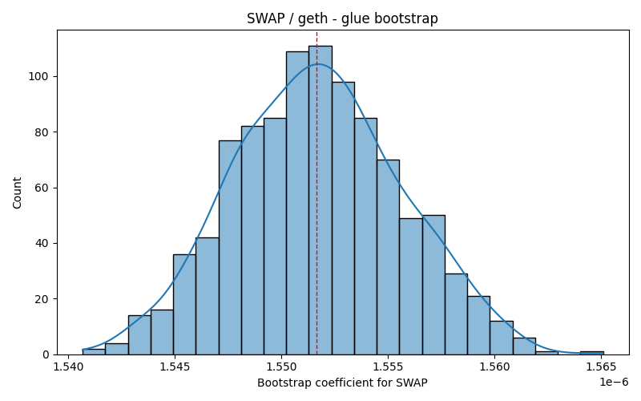

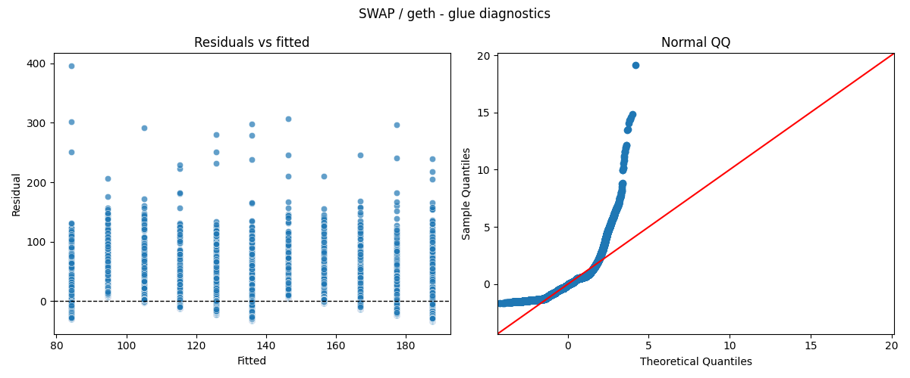

</details>

### Mixed glue (tier A) · geth

<details><summary><code>ADD</code> · nobs=4224 · runtime_ms=2.608e-06 · p=1.00e-03 · R²=0.5217</summary>

```
==============================================================================
                           NNLS Regression Results                            
==============================================================================
Dep. Variable:          test_runtime_ms              R-squared:          0.522
Model:                  NNLS                    Adj. R-squared:          0.522
No. Observations:       4224                              RMSE:          26.28
Df Residuals:           4222                               MAE:          19.08
Df Model:               1      
==============================================================================
                      coef     std err     P-value      [0.025      0.975]
------------------------------------------------------------------------------
         const     45.1248      1.3052       0.001     42.5938     47.6455
           ADD      0.0000      0.0000       0.001      0.0000      0.0000
==============================================================================
Notes: Non-negative least squares with bootstrap inference (1000 iterations)
==============================================================================
```

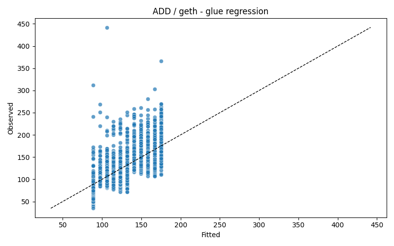

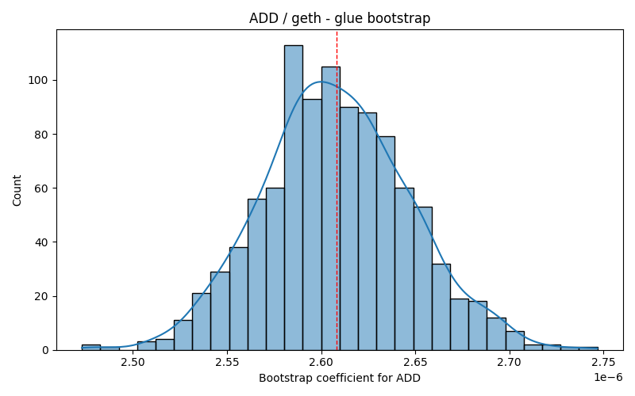

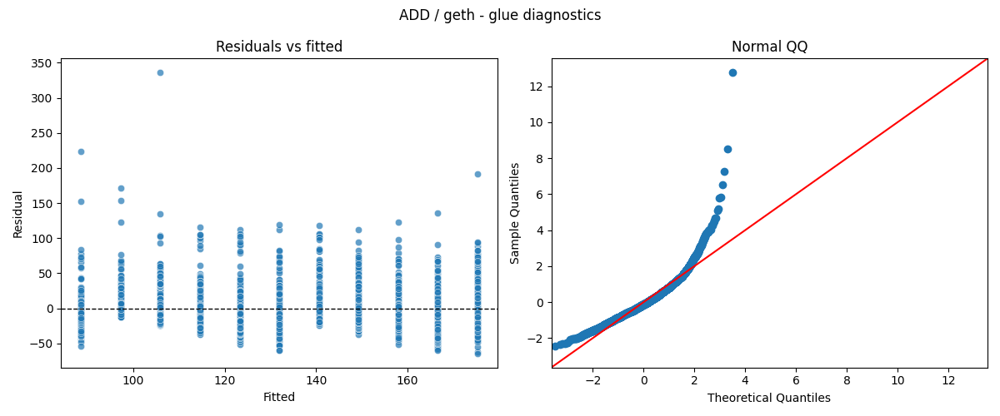

</details>

<details><summary><code>AND</code> · nobs=4224 · runtime_ms=2.292e-06 · p=1.00e-03 · R²=0.4725</summary>

```
==============================================================================
                           NNLS Regression Results                            
==============================================================================
Dep. Variable:          test_runtime_ms              R-squared:          0.473
Model:                  NNLS                    Adj. R-squared:          0.472
No. Observations:       4224                              RMSE:          25.49
Df Residuals:           4222                               MAE:          18.76
Df Model:               1      
==============================================================================
                      coef     std err     P-value      [0.025      0.975]
------------------------------------------------------------------------------
         const     45.3079      1.2368       0.001     42.9690     47.8165
           AND      0.0000      0.0000       0.001      0.0000      0.0000
==============================================================================
Notes: Non-negative least squares with bootstrap inference (1000 iterations)
==============================================================================
```

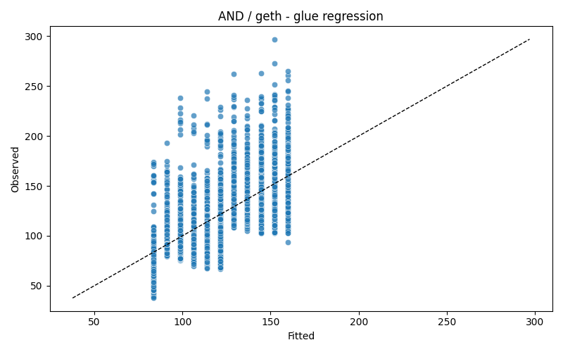

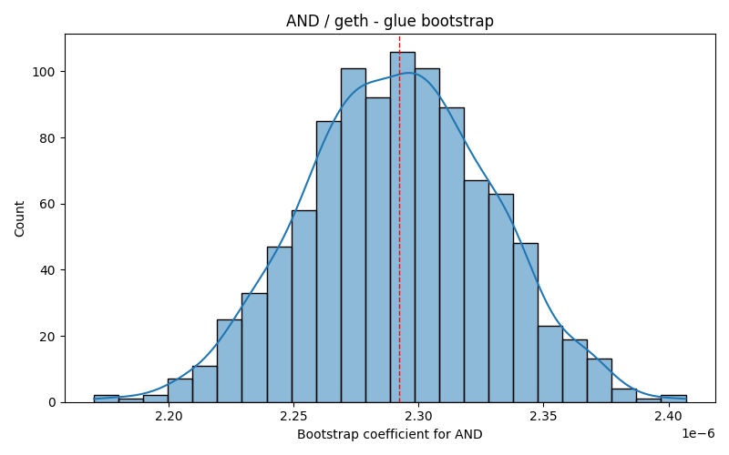

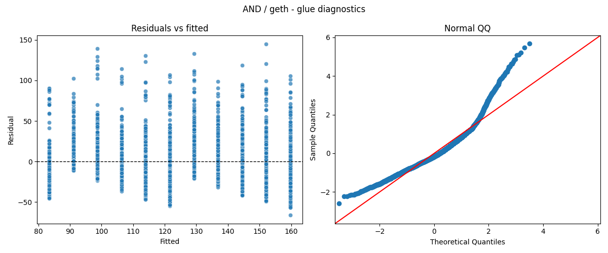

</details>

<details><summary><code>CALLDATACOPY</code> · nobs=101376 · runtime_ms=6.965e-06 · p=1.00e-03 · R²=0.8402</summary>

```
==============================================================================
                           NNLS Regression Results                            
==============================================================================
Dep. Variable:          test_runtime_ms              R-squared:          0.840
Model:                  NNLS                    Adj. R-squared:          0.840
No. Observations:       101376                            RMSE:          22.85
Df Residuals:           101374                             MAE:          16.51
Df Model:               1      
==============================================================================
                      coef     std err     P-value      [0.025      0.975]
------------------------------------------------------------------------------
         const     20.7709      0.0916       0.001     20.5954     20.9499
  CALLDATACOPY      0.0000      0.0000       0.001      0.0000      0.0000
==============================================================================
Notes: Non-negative least squares with bootstrap inference (1000 iterations)
==============================================================================
```

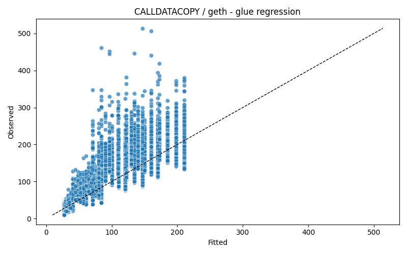

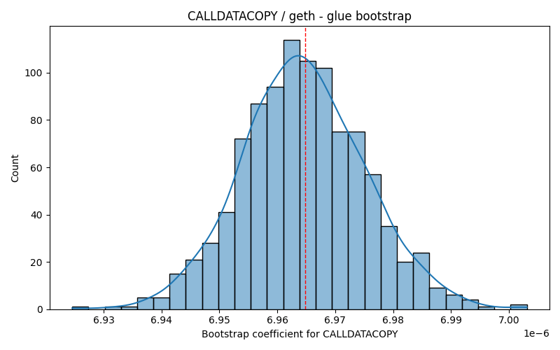

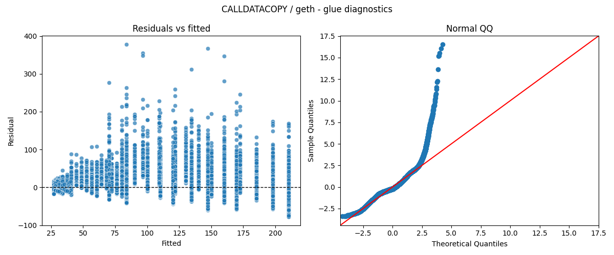

</details>

<details><summary><code>CALLDATALOAD</code> · nobs=16896 · runtime_ms=4.932e-05 · p=1.00e-03 · R²=0.02203</summary>

```
==============================================================================
                           NNLS Regression Results                            
==============================================================================
Dep. Variable:          test_runtime_ms              R-squared:          0.022
Model:                  NNLS                    Adj. R-squared:          0.022
No. Observations:       16896                             RMSE:           1.26
Df Residuals:           16894                              MAE:           0.63
Df Model:               1      
==============================================================================
                      coef     std err     P-value      [0.025      0.975]
------------------------------------------------------------------------------
         const      2.6966      0.0306       0.001      2.6389      2.7563
  CALLDATALOAD      0.0000      0.0000       0.001      0.0000      0.0001
==============================================================================
Notes: Non-negative least squares with bootstrap inference (1000 iterations)
==============================================================================
```

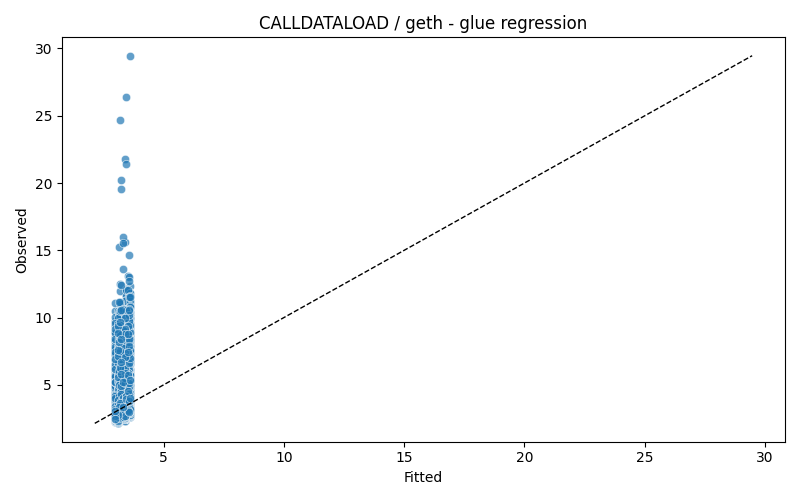

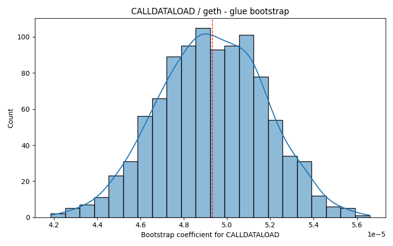

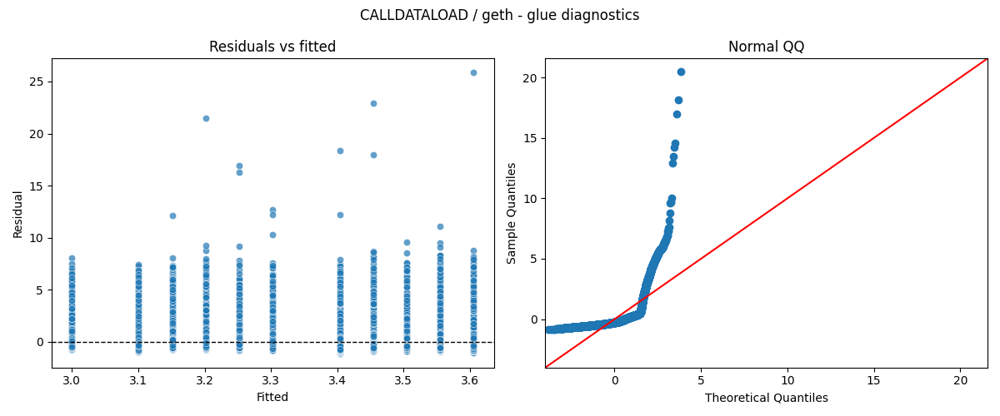

</details>

<details><summary><code>DIV</code> · nobs=4224 · runtime_ms=7.946e-06 · p=1.00e-03 · R²=0.735</summary>

```
==============================================================================
                           NNLS Regression Results                            
==============================================================================
Dep. Variable:          test_runtime_ms              R-squared:          0.735
Model:                  NNLS                    Adj. R-squared:          0.735
No. Observations:       4224                              RMSE:          37.66
Df Residuals:           4222                               MAE:          30.78
Df Model:               1      
==============================================================================
                      coef     std err     P-value      [0.025      0.975]
------------------------------------------------------------------------------
         const     75.5336      2.0125       0.001     71.7994     79.5681
           DIV      0.0000      0.0000       0.001      0.0000      0.0000
==============================================================================
Notes: Non-negative least squares with bootstrap inference (1000 iterations)
==============================================================================
```

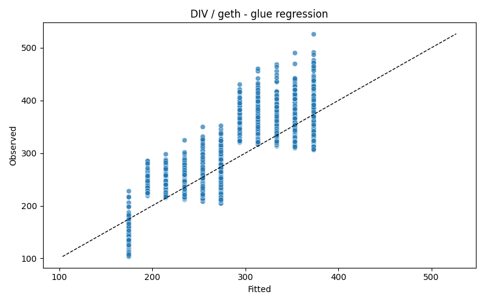

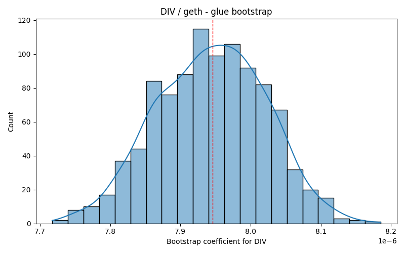

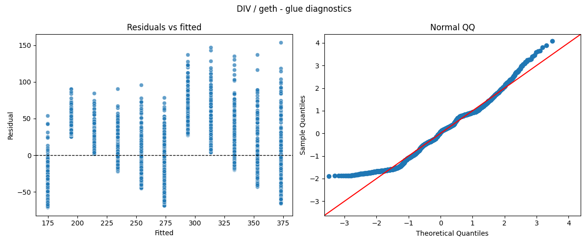

</details>

<details><summary><code>EXP</code> · nobs=4224 · runtime_ms=0.0003473 · p=1.00e-03 · R²=0.6913</summary>

```
==============================================================================
                           NNLS Regression Results                            
==============================================================================
Dep. Variable:          test_runtime_ms              R-squared:          0.691
Model:                  NNLS                    Adj. R-squared:          0.691
No. Observations:       4224                              RMSE:           9.09
Df Residuals:           4222                               MAE:           6.95
Df Model:               1      
==============================================================================
                      coef     std err     P-value      [0.025      0.975]
------------------------------------------------------------------------------
         const     13.6155      0.4782       0.001     12.6608     14.5849
           EXP      0.0003      0.0000       0.001      0.0003      0.0004
==============================================================================
Notes: Non-negative least squares with bootstrap inference (1000 iterations)
==============================================================================
```

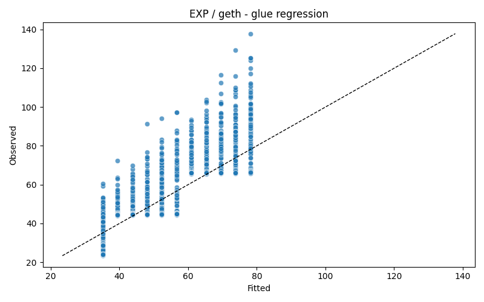

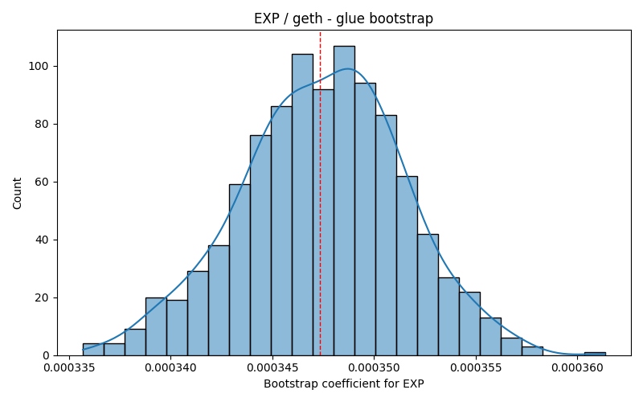

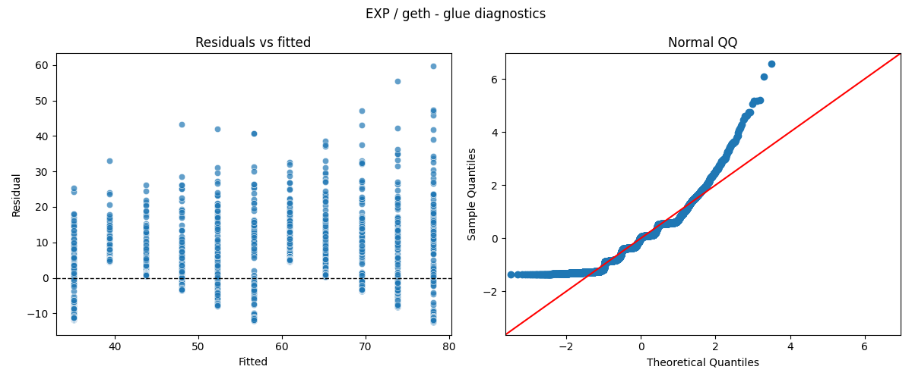

</details>

<details><summary><code>GT</code> · nobs=4224 · runtime_ms=2.018e-06 · p=1.00e-03 · R²=0.4444</summary>

```
==============================================================================
                           NNLS Regression Results                            
==============================================================================
Dep. Variable:          test_runtime_ms              R-squared:          0.444
Model:                  NNLS                    Adj. R-squared:          0.444
No. Observations:       4224                              RMSE:          23.75
Df Residuals:           4222                               MAE:          16.39
Df Model:               1      
==============================================================================
                      coef     std err     P-value      [0.025      0.975]
------------------------------------------------------------------------------
         const     36.5966      1.1729       0.001     34.3072     38.7061
            GT      0.0000      0.0000       0.001      0.0000      0.0000
==============================================================================
Notes: Non-negative least squares with bootstrap inference (1000 iterations)
==============================================================================
```

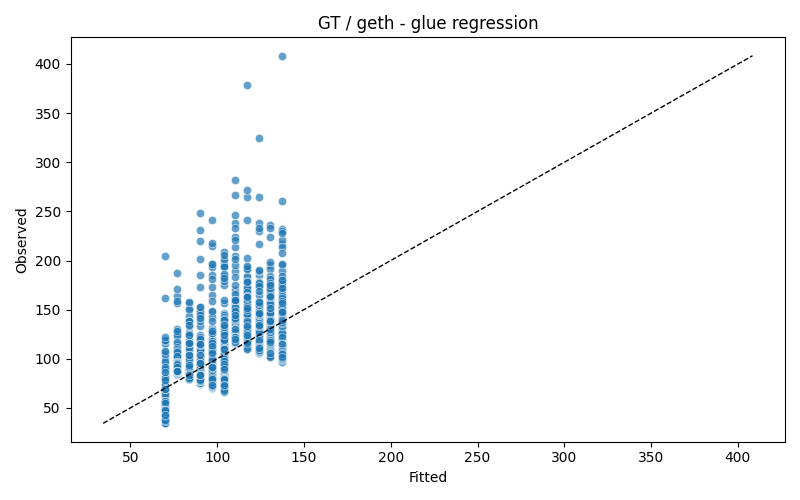

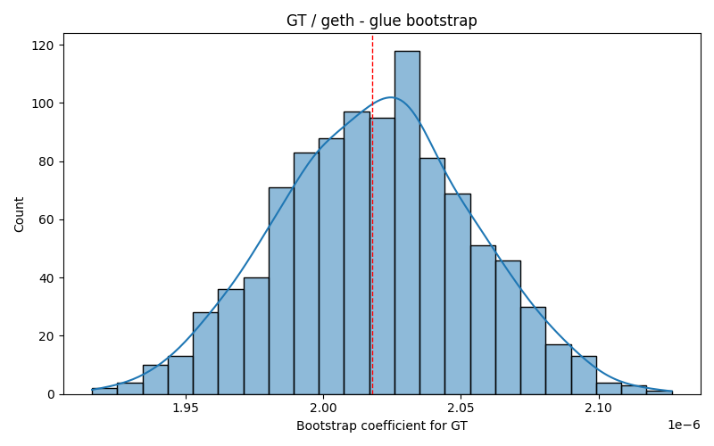

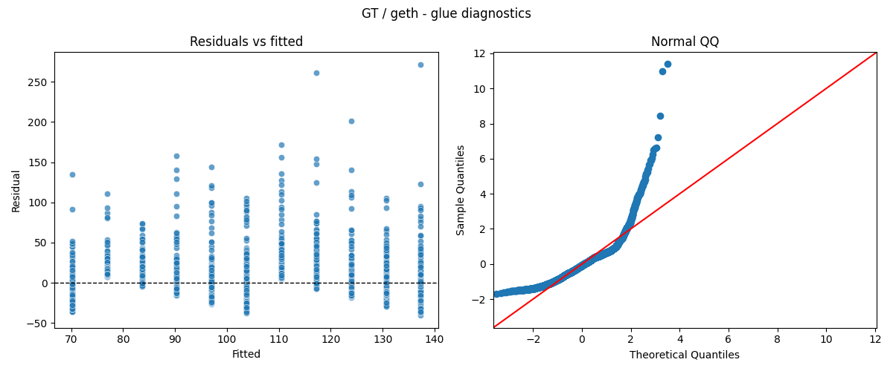

</details>

<details><summary><code>JUMPI</code> · nobs=4224 · runtime_ms=2.891e-06 · p=1.00e-03 · R²=0.4243</summary>

```
==============================================================================
                           NNLS Regression Results                            
==============================================================================
Dep. Variable:          test_runtime_ms              R-squared:          0.424
Model:                  NNLS                    Adj. R-squared:          0.424
No. Observations:       4224                              RMSE:          15.19
Df Residuals:           4222                               MAE:          10.88
Df Model:               1      
==============================================================================
                      coef     std err     P-value      [0.025      0.975]
------------------------------------------------------------------------------
         const     21.1569      0.7467       0.001     19.7921     22.6362
         JUMPI      0.0000      0.0000       0.001      0.0000      0.0000
==============================================================================
Notes: Non-negative least squares with bootstrap inference (1000 iterations)
==============================================================================
```

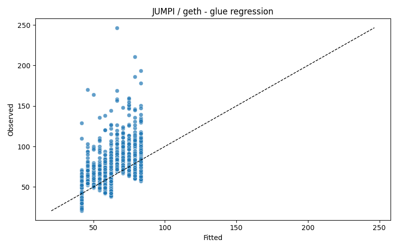

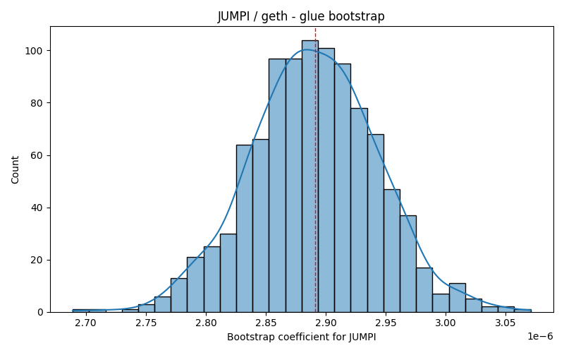

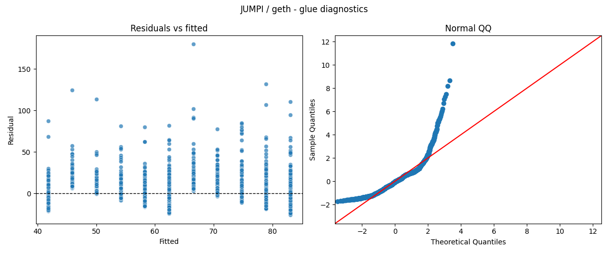

</details>

<details><summary><code>LT</code> · nobs=4224 · runtime_ms=2.911e-06 · p=1.00e-03 · R²=0.5866</summary>

```
==============================================================================
                           NNLS Regression Results                            
==============================================================================
Dep. Variable:          test_runtime_ms              R-squared:          0.587
Model:                  NNLS                    Adj. R-squared:          0.587
No. Observations:       4224                              RMSE:          25.72
Df Residuals:           4222                               MAE:          18.85
Df Model:               1      
==============================================================================
                      coef     std err     P-value      [0.025      0.975]
------------------------------------------------------------------------------
         const     42.4911      1.3079       0.001     39.9934     44.8491
            LT      0.0000      0.0000       0.001      0.0000      0.0000
==============================================================================
Notes: Non-negative least squares with bootstrap inference (1000 iterations)
==============================================================================
```

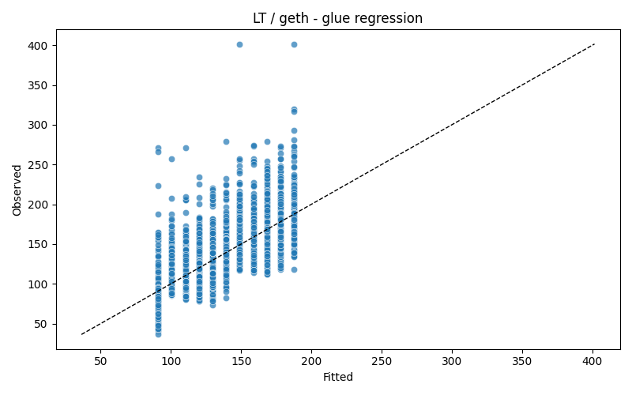

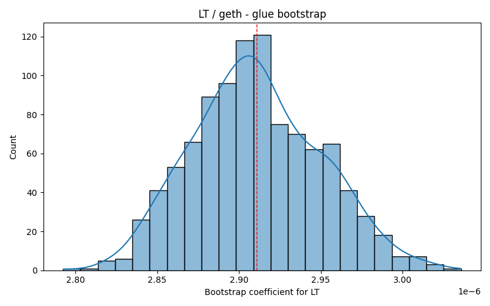

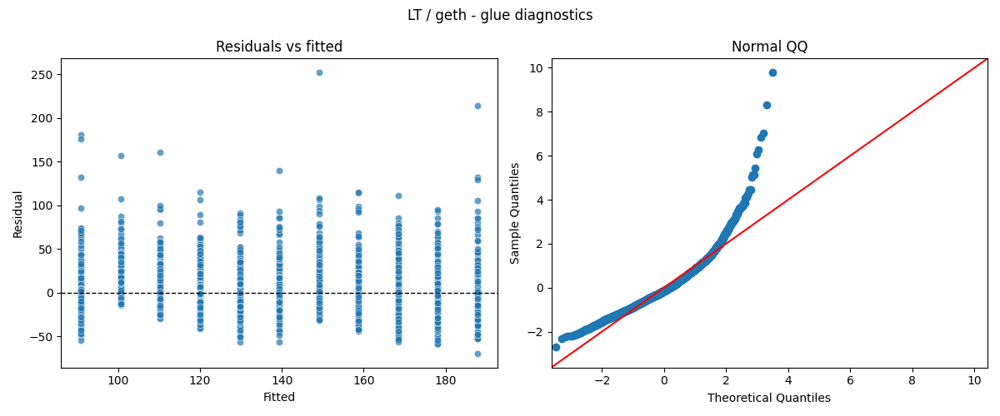

</details>

<details><summary><code>MSTORE</code> · nobs=21120 · runtime_ms=4.677e-06 · p=1.00e-03 · R²=0.5758</summary>

```
==============================================================================
                           NNLS Regression Results                            
==============================================================================
Dep. Variable:          test_runtime_ms              R-squared:          0.576
Model:                  NNLS                    Adj. R-squared:          0.576
No. Observations:       21120                             RMSE:          28.17
Df Residuals:           21118                              MAE:          21.71
Df Model:               1      
==============================================================================
                      coef     std err     P-value      [0.025      0.975]
------------------------------------------------------------------------------
         const     53.8759      0.7149       0.001     52.4948     55.2474
        MSTORE      0.0000      0.0000       0.001      0.0000      0.0000
==============================================================================
Notes: Non-negative least squares with bootstrap inference (1000 iterations)
==============================================================================
```

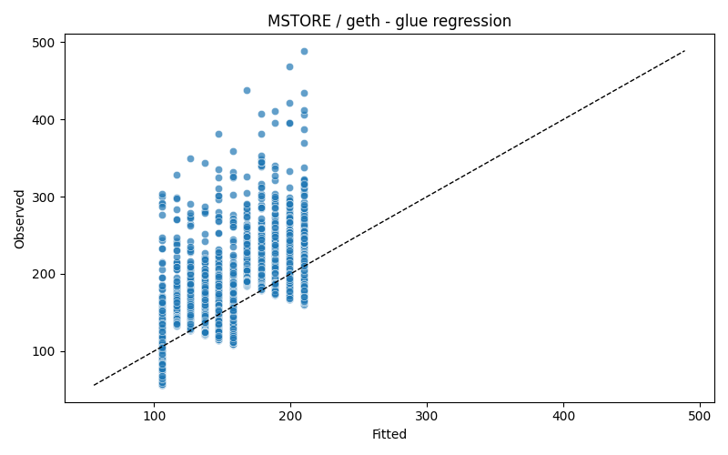

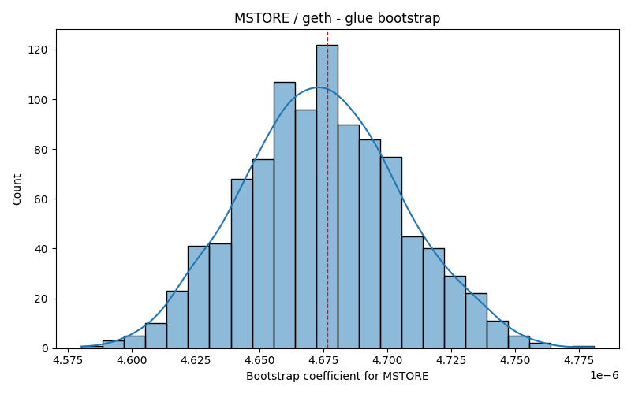

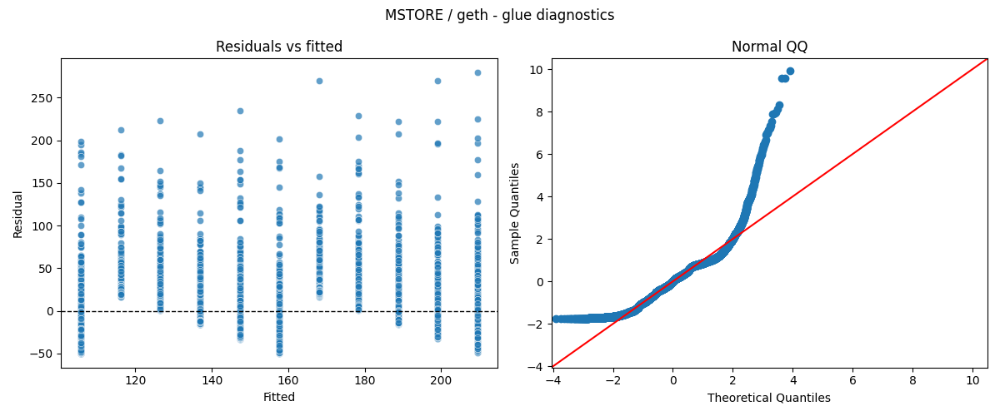

</details>

<details><summary><code>MSTORE8</code> · nobs=21120 · runtime_ms=4.082e-06 · p=1.00e-03 · R²=0.5178</summary>

```
==============================================================================
                           NNLS Regression Results                            
==============================================================================
Dep. Variable:          test_runtime_ms              R-squared:          0.518
Model:                  NNLS                    Adj. R-squared:          0.518
No. Observations:       21120                             RMSE:          27.65
Df Residuals:           21118                              MAE:          20.56
Df Model:               1      
==============================================================================
                      coef     std err     P-value      [0.025      0.975]
------------------------------------------------------------------------------
         const     50.0595      0.6853       0.001     48.7894     51.3870
       MSTORE8      0.0000      0.0000       0.001      0.0000      0.0000
==============================================================================
Notes: Non-negative least squares with bootstrap inference (1000 iterations)
==============================================================================
```

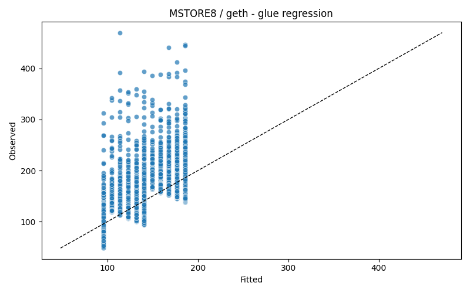

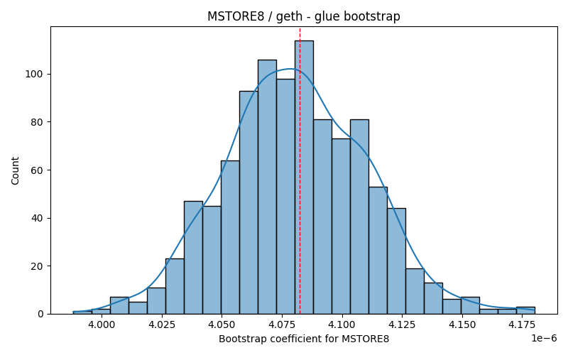

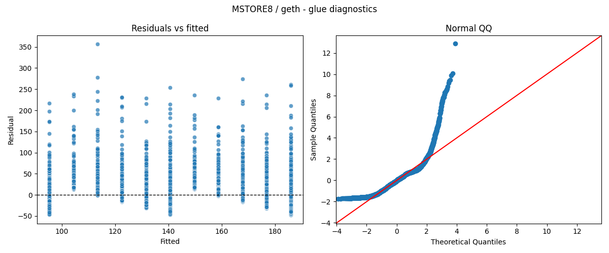

</details>

<details><summary><code>MUL</code> · nobs=4224 · runtime_ms=3.169e-06 · p=1.00e-03 · R²=0.6443</summary>

```
==============================================================================
                           NNLS Regression Results                            
==============================================================================
Dep. Variable:          test_runtime_ms              R-squared:          0.644
Model:                  NNLS                    Adj. R-squared:          0.644
No. Observations:       4224                              RMSE:          18.59
Df Residuals:           4222                               MAE:          13.86
Df Model:               1      
==============================================================================
                      coef     std err     P-value      [0.025      0.975]
------------------------------------------------------------------------------
         const     38.2333      0.9605       0.001     36.3002     40.2982
           MUL      0.0000      0.0000       0.001      0.0000      0.0000
==============================================================================
Notes: Non-negative least squares with bootstrap inference (1000 iterations)
==============================================================================
```

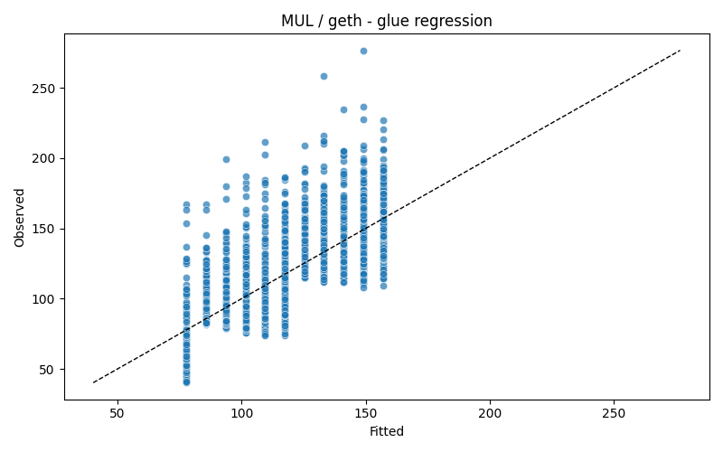

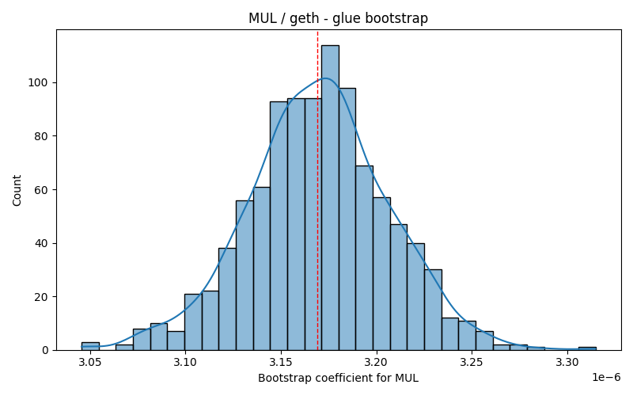

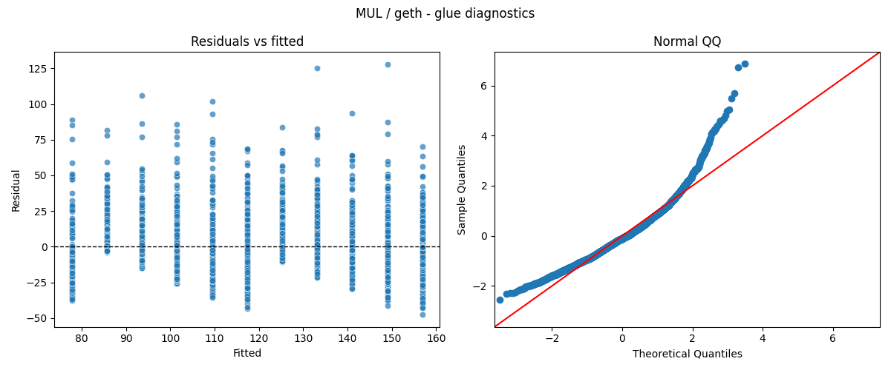

</details>

<details><summary><code>PC</code> · nobs=4224 · runtime_ms=1.477e-06 · p=1.00e-03 · R²=0.7733</summary>

```
==============================================================================
                           NNLS Regression Results                            
==============================================================================
Dep. Variable:          test_runtime_ms              R-squared:          0.773
Model:                  NNLS                    Adj. R-squared:          0.773
No. Observations:       4224                              RMSE:          23.91
Df Residuals:           4222                               MAE:          18.79
Df Model:               1      
==============================================================================
                      coef     std err     P-value      [0.025      0.975]
------------------------------------------------------------------------------
         const     40.7178      1.3436       0.001     37.9955     43.2195
            PC      0.0000      0.0000       0.001      0.0000      0.0000
==============================================================================
Notes: Non-negative least squares with bootstrap inference (1000 iterations)
==============================================================================
```

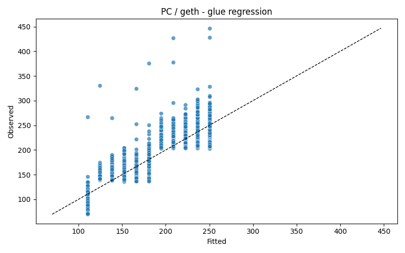

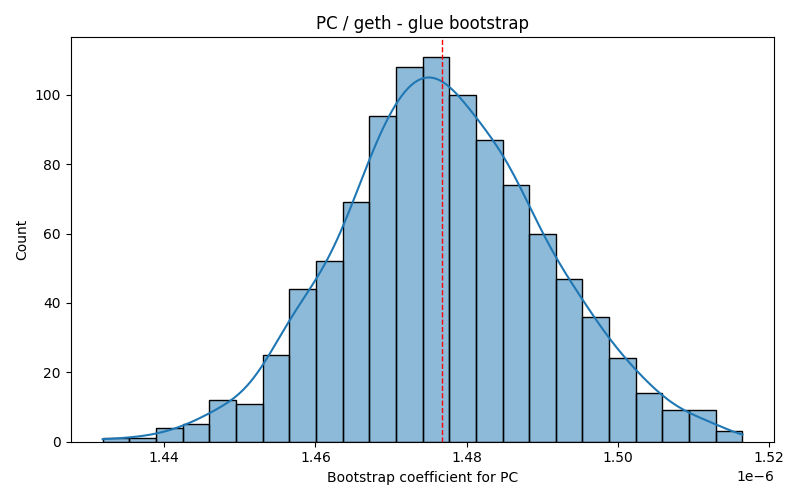

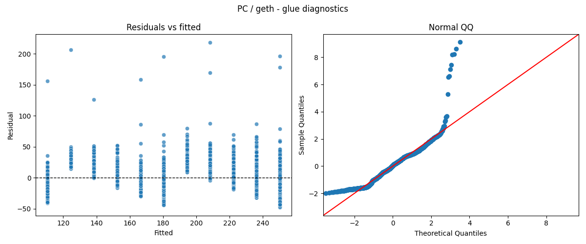

</details>

<details><summary><code>RETURNDATASIZE</code> · nobs=16896 · runtime_ms=3.208e-06 · p=1.00e-03 · R²=0.6336</summary>

```
==============================================================================
                           NNLS Regression Results                            
==============================================================================
Dep. Variable:          test_runtime_ms              R-squared:          0.634
Model:                  NNLS                    Adj. R-squared:          0.634
No. Observations:       16896                             RMSE:          38.52
Df Residuals:           16894                              MAE:          27.26
Df Model:               1      
==============================================================================
                      coef     std err     P-value      [0.025      0.975]
------------------------------------------------------------------------------
         const     51.7612      0.9571       0.001     49.9061     53.5755
RETURNDATASIZE      0.0000      0.0000       0.001      0.0000      0.0000
==============================================================================
Notes: Non-negative least squares with bootstrap inference (1000 iterations)
==============================================================================
```

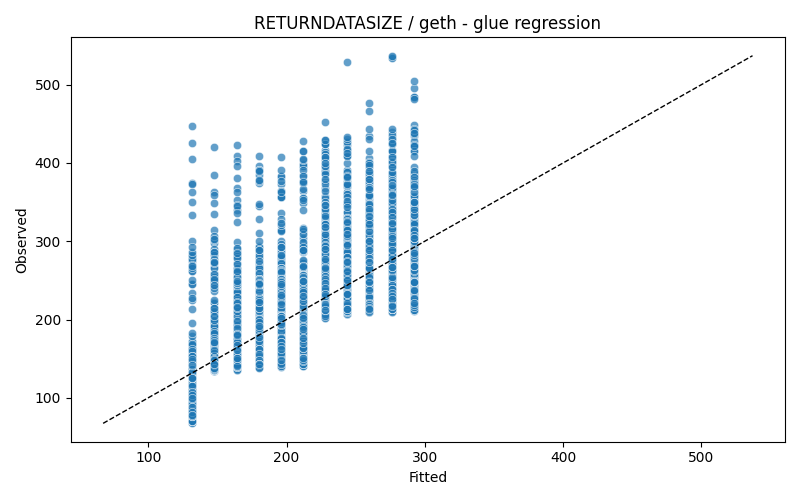

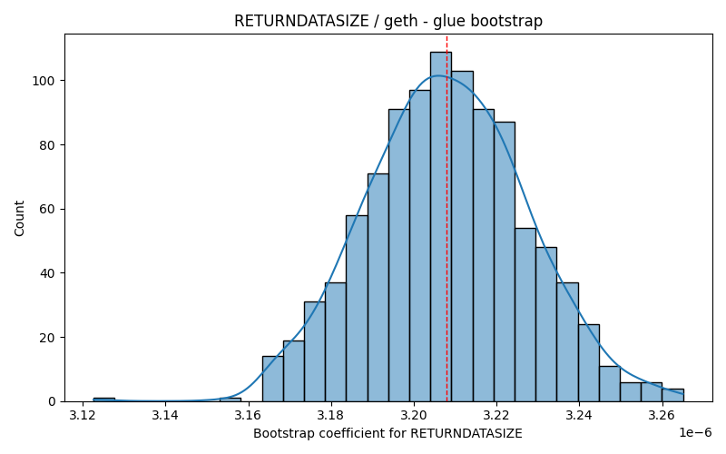

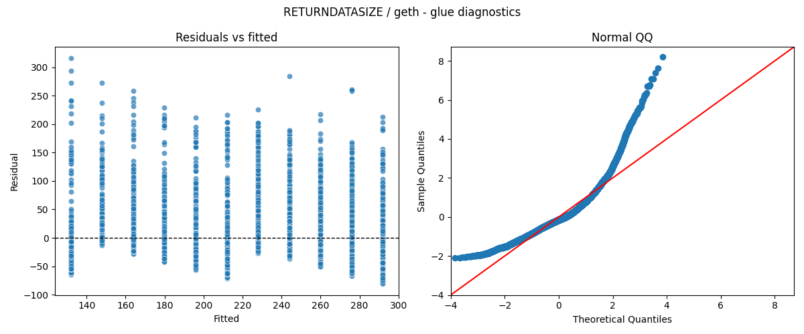

</details>

<details><summary><code>SELFBALANCE</code> · nobs=3456 · runtime_ms=7.511e-06 · p=1.00e-03 · R²=0.7969</summary>

```
==============================================================================
                           NNLS Regression Results                            
==============================================================================
Dep. Variable:          test_runtime_ms              R-squared:          0.797
Model:                  NNLS                    Adj. R-squared:          0.797
No. Observations:       3456                              RMSE:          38.24
Df Residuals:           3454                               MAE:          31.64
Df Model:               1      
==============================================================================
                      coef     std err     P-value      [0.025      0.975]
------------------------------------------------------------------------------
         const    116.3618      2.4341       0.001    111.2944    120.9854
   SELFBALANCE      0.0000      0.0000       0.001      0.0000      0.0000
==============================================================================
Notes: Non-negative least squares with bootstrap inference (1000 iterations)
==============================================================================
```

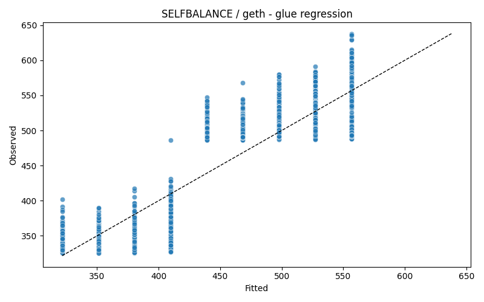

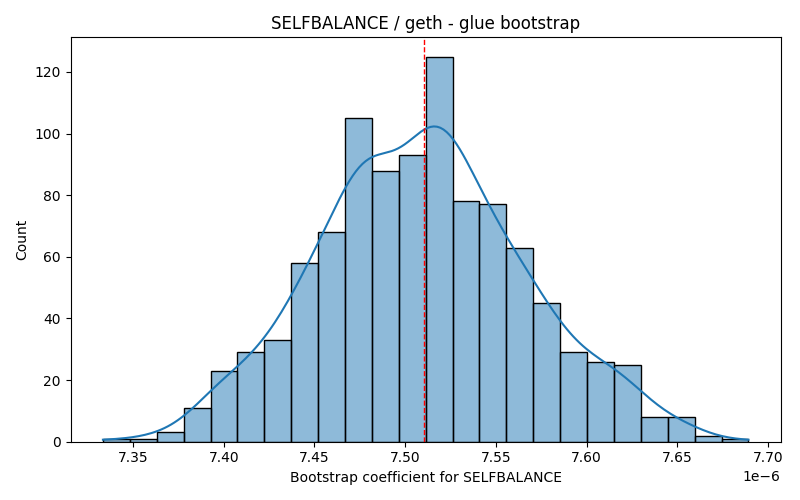

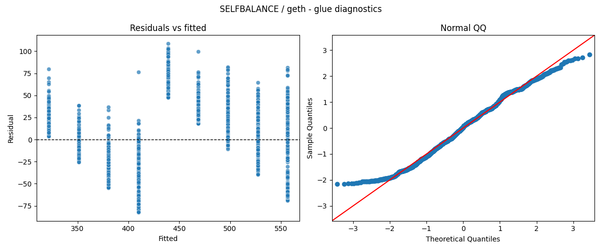

</details>

<details><summary><code>SUB</code> · nobs=4224 · runtime_ms=2.427e-06 · p=1.00e-03 · R²=0.4983</summary>

```
==============================================================================
                           NNLS Regression Results                            
==============================================================================
Dep. Variable:          test_runtime_ms              R-squared:          0.498
Model:                  NNLS                    Adj. R-squared:          0.498
No. Observations:       4224                              RMSE:          25.63
Df Residuals:           4222                               MAE:          18.93
Df Model:               1      
==============================================================================
                      coef     std err     P-value      [0.025      0.975]
------------------------------------------------------------------------------
         const     47.6906      1.3099       0.001     45.1166     50.1886
           SUB      0.0000      0.0000       0.001      0.0000      0.0000
==============================================================================
Notes: Non-negative least squares with bootstrap inference (1000 iterations)
==============================================================================
```

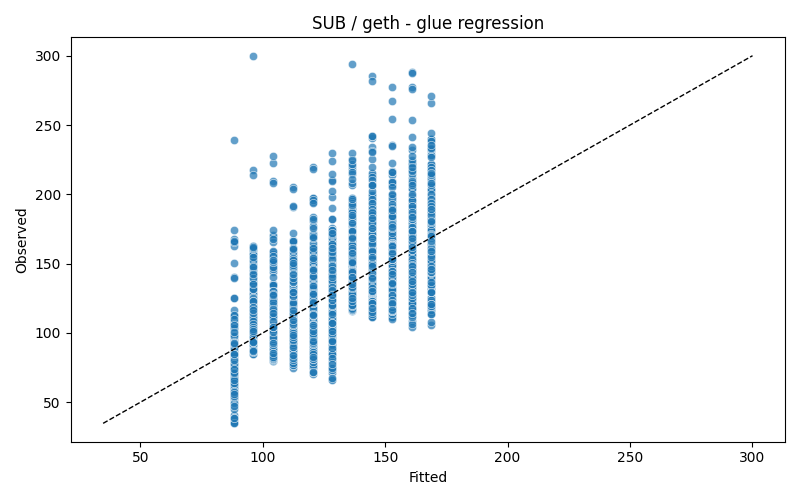

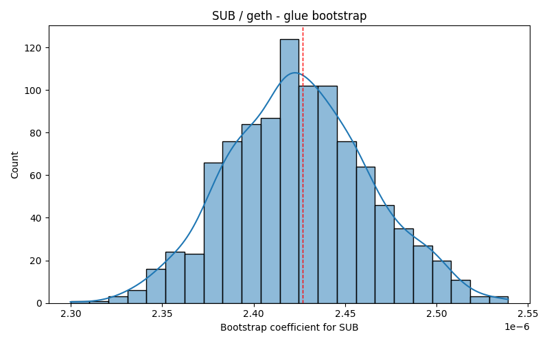

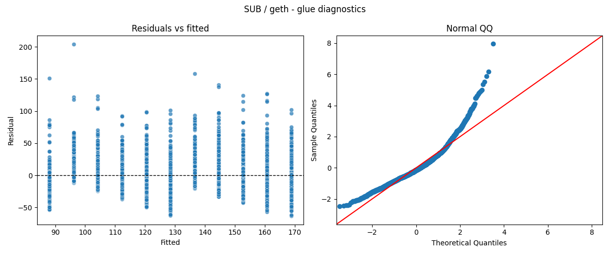

</details>

### Mixed glue (tier B) · geth

<details><summary><code>JUMP</code> · nobs=4224 · runtime_ms=1.626e-06 · p=1.00e-03 · R²=0.1005</summary>

```
==============================================================================
                           NNLS Regression Results                            
==============================================================================
Dep. Variable:          test_runtime_ms              R-squared:          0.100
Model:                  NNLS                    Adj. R-squared:          0.100
No. Observations:       4224                              RMSE:          18.08
Df Residuals:           4222                               MAE:          13.77
Df Model:               1      
==============================================================================
                      coef     std err     P-value      [0.025      0.975]
------------------------------------------------------------------------------
         const     35.4190      1.0166       0.001     33.4742     37.3847
          JUMP      0.0000      0.0000       0.001      0.0000      0.0000
==============================================================================
Notes: Non-negative least squares with bootstrap inference (1000 iterations)
==============================================================================
```

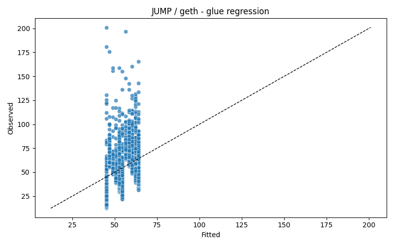

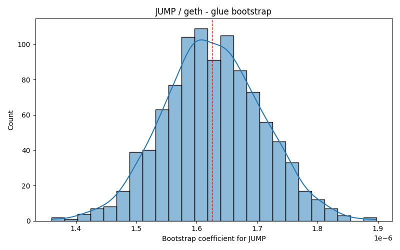

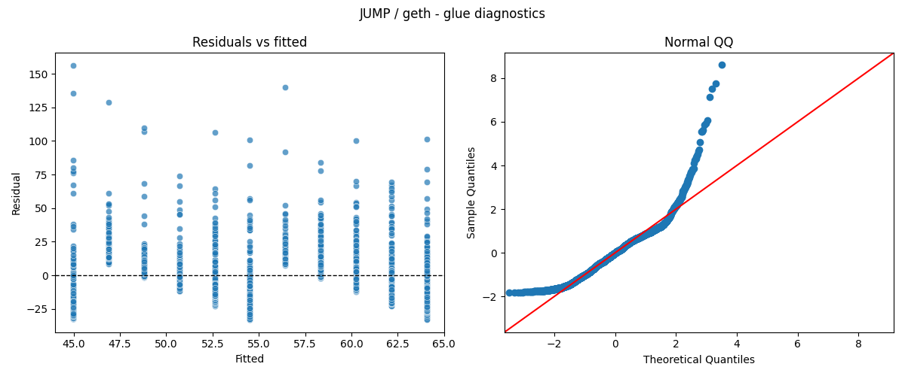

</details>

<details><summary><code>KECCAK256</code> · nobs=67584 · runtime_ms=2.931e-05 · p=1.00e-03 · R²=0.2066</summary>

```
==============================================================================
                           NNLS Regression Results                            
==============================================================================
Dep. Variable:          test_runtime_ms              R-squared:          0.207
Model:                  NNLS                    Adj. R-squared:          0.207
No. Observations:       67584                             RMSE:         114.15
Df Residuals:           67582                              MAE:          89.75
Df Model:               1      
==============================================================================
                      coef     std err     P-value      [0.025      0.975]
------------------------------------------------------------------------------
         const    360.7277      0.9569       0.001    358.8285    362.6499
     KECCAK256      0.0000      0.0000       0.001      0.0000      0.0000
==============================================================================
Notes: Non-negative least squares with bootstrap inference (1000 iterations)
==============================================================================
```

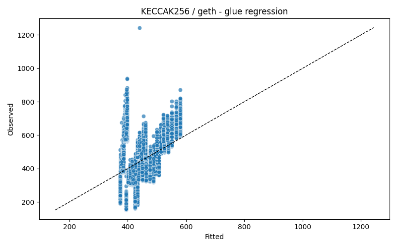

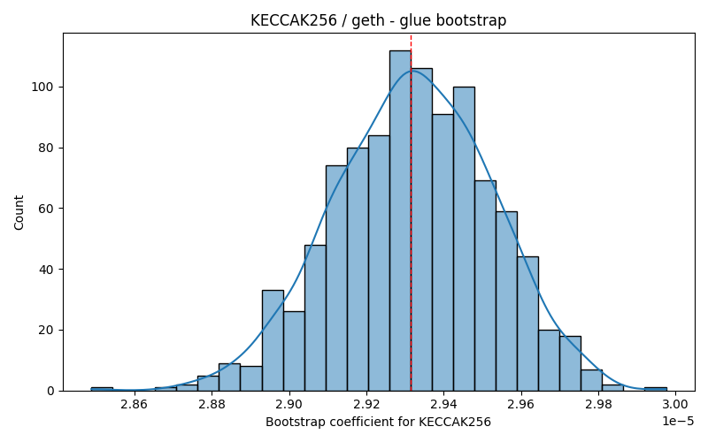

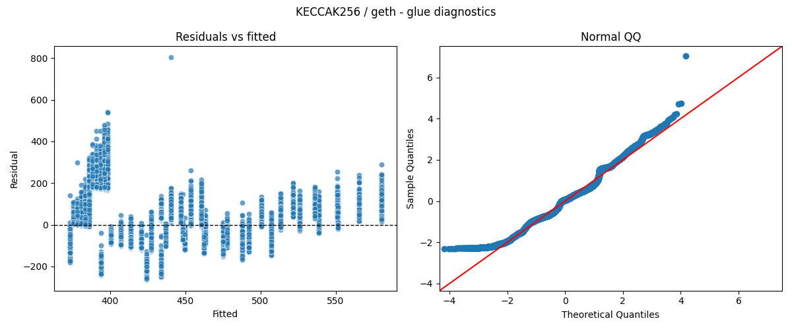

</details>

## nethermind

| glue_opcode | nobs | glue_runtime_ms | p_value | rsquared |
| --- | --- | --- | --- | --- |
| `ISZERO` | 1177 | 8.088e-07 | 1.00e-03 | 0.8037 |
| `JUMPDEST` | 1177 | 4.207e-07 | 1.00e-03 | 0.7224 |
| `SWAP` | 18832 | 5.22e-07 | 1.00e-03 | 0.5312 |
| `CALLDATASIZE` | 70059 | 3.766e-07 | 1.00e-03 | 0.9541 |
| `DUP` | 70059 | 3.421e-07 | 1.00e-03 | 0.9541 |
| `GAS` | 70059 | 3.615e-07 | 1.00e-03 | 0.9541 |
| `MLOAD` | 70059 | 1.238e-06 | 1.00e-03 | 0.9541 |
| `PUSH` | 70059 | 4.052e-07 | 1.00e-03 | 0.9541 |
| `PUSH0` | 70059 | 2.99e-07 | 1.00e-03 | 0.9541 |
| `STATICCALL` | 70059 | 0.0004068 | 1.00e-03 | 0.9541 |
| `ADD` | 1177 | 2.123e-06 | 1.00e-03 | 0.7972 |
| `AND` | 1177 | 8.556e-07 | 1.00e-03 | 0.5038 |
| `CALLDATACOPY` | 28248 | 2.722e-06 | 1.00e-03 | 0.5447 |
| `CALLDATALOAD` | 4708 | 2.89e-05 | 1.00e-03 | 0.0007697 |
| `DIV` | 1177 | 7.412e-06 | 1.00e-03 | 0.6203 |
| `EXP` | 1177 | 0 | 1.00e+00 | -2.22e-16 |
| `GT` | 1177 | 1.114e-06 | 1.00e-03 | 0.6159 |
| `JUMPI` | 1177 | 1.176e-06 | 1.00e-03 | 0.4098 |
| `LT` | 1177 | 9.987e-07 | 1.00e-03 | 0.6249 |
| `MSTORE` | 5885 | 1.358e-06 | 1.00e-03 | 0.5218 |
| `MSTORE8` | 5885 | 1.281e-06 | 1.00e-03 | 0.5035 |
| `MUL` | 1177 | 5.193e-06 | 1.00e-03 | 0.8343 |
| `PC` | 1177 | 3.763e-07 | 1.00e-03 | 0.6383 |
| `RETURNDATASIZE` | 4708 | 7.591e-07 | 1.00e-03 | 0.6556 |
| `SELFBALANCE` | 963 | 5.01e-06 | 1.00e-03 | 0.2859 |
| `SUB` | 1177 | 2.135e-06 | 1.00e-03 | 0.7831 |
| `JUMP` | 1177 | 1.938e-06 | 1.00e-03 | 0.4754 |
| `KECCAK256` | 18832 | 0 | 1.00e+00 | 0 |

### Cycle glue — joint fit · nethermind

<details><summary>Joint NNLS regression summary</summary>

```
==============================================================================
                           NNLS Regression Results                            
==============================================================================
Dep. Variable:          test_runtime_ms              R-squared:          0.954
Model:                  NNLS                    Adj. R-squared:          0.954
No. Observations:       70059                             RMSE:          14.00
Df Residuals:           70051                              MAE:           6.19
Df Model:               7      
==============================================================================
                      coef     std err     P-value      [0.025      0.975]
------------------------------------------------------------------------------
         const     17.3393      0.1695       0.001     17.0148     17.6786
  CALLDATASIZE      0.0000      0.0000       0.001      0.0000      0.0000
           DUP      0.0000      0.0000       0.001      0.0000      0.0000
           GAS      0.0000      0.0000       0.001      0.0000      0.0000
         MLOAD      0.0000      0.0000       0.001      0.0000      0.0000
          PUSH      0.0000      0.0000       0.001      0.0000      0.0000
         PUSH0      0.0000      0.0000       0.001      0.0000      0.0000
    STATICCALL      0.0004      0.0000       0.001      0.0004      0.0004
==============================================================================
Notes: Non-negative least squares with bootstrap inference (1000 iterations)
==============================================================================
```

</details>

<details><summary><code>CALLDATASIZE</code> · nobs=70059 · runtime_ms=3.766e-07 · p=1.00e-03 · R²=0.9541</summary>

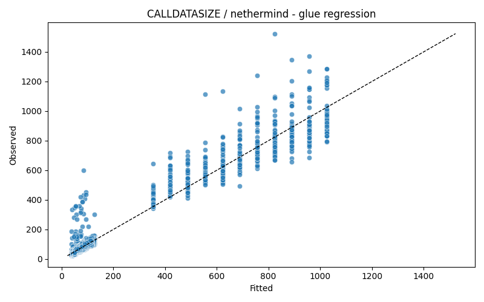

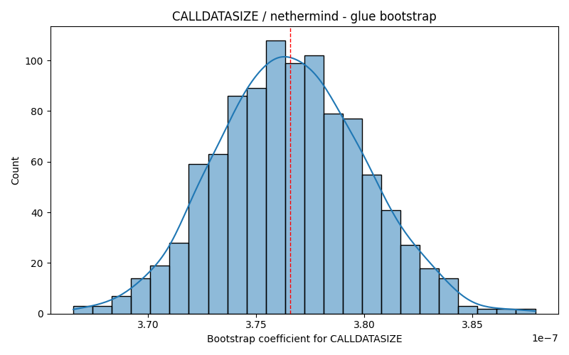

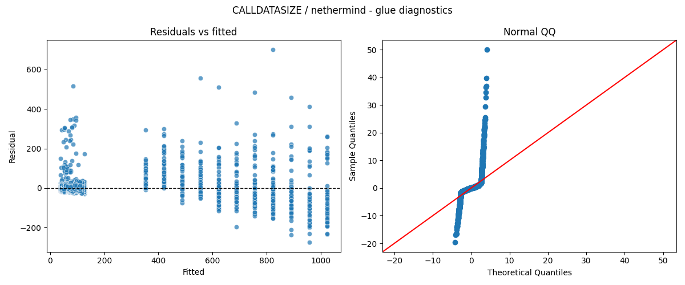

</details>

<details><summary><code>DUP</code> · nobs=70059 · runtime_ms=3.421e-07 · p=1.00e-03 · R²=0.9541</summary>

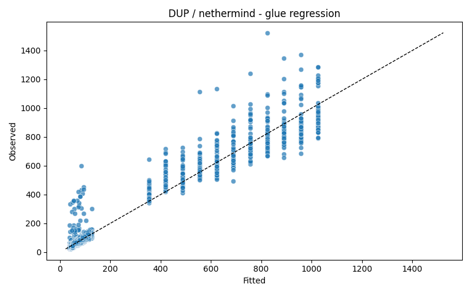

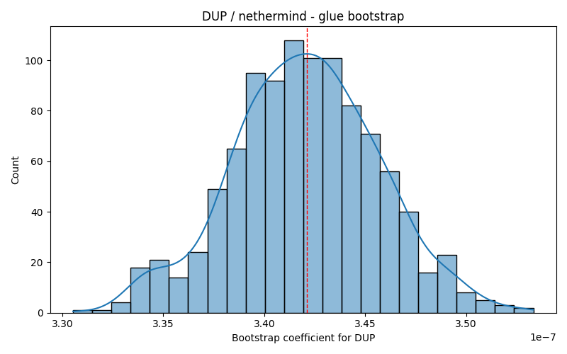

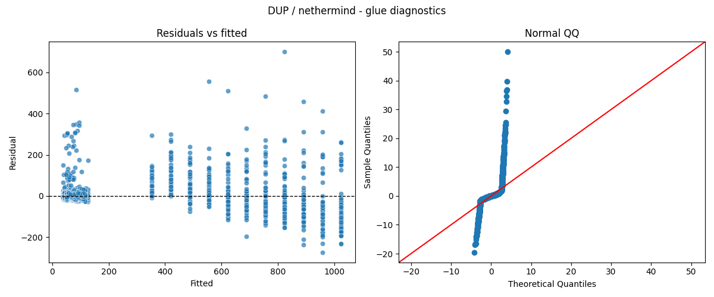

</details>

<details><summary><code>GAS</code> · nobs=70059 · runtime_ms=3.615e-07 · p=1.00e-03 · R²=0.9541</summary>


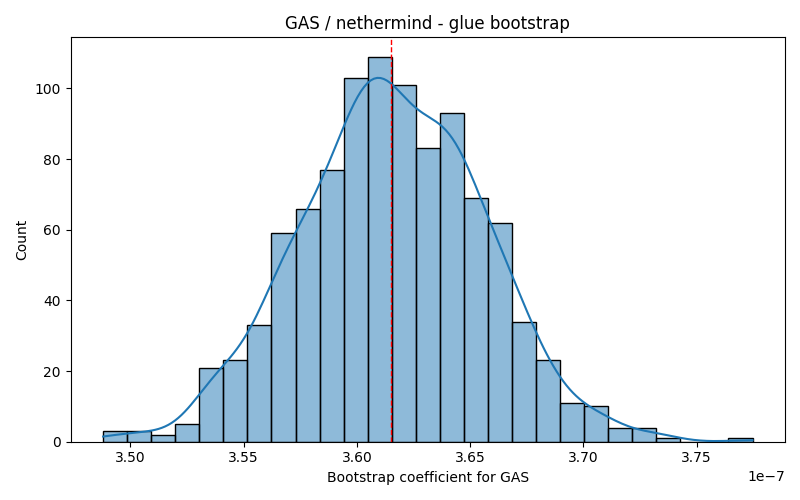


</details>

<details><summary><code>MLOAD</code> · nobs=70059 · runtime_ms=1.238e-06 · p=1.00e-03 · R²=0.9541</summary>

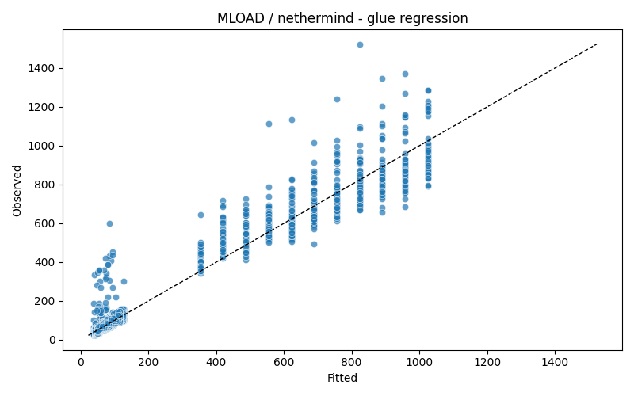

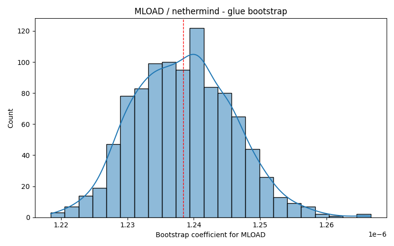

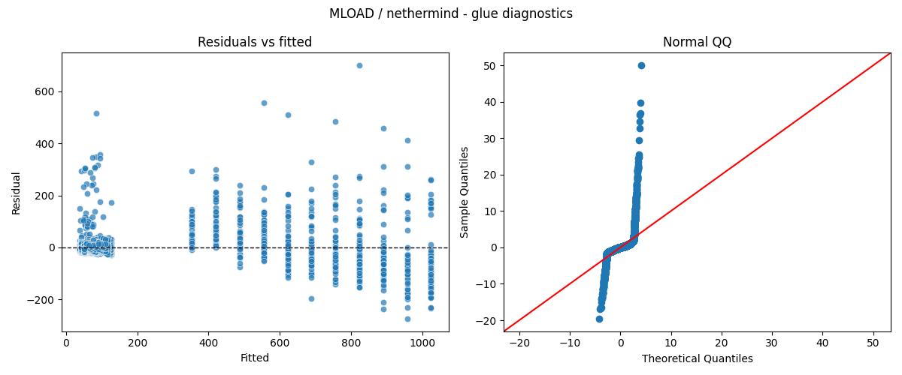

</details>

<details><summary><code>PUSH</code> · nobs=70059 · runtime_ms=4.052e-07 · p=1.00e-03 · R²=0.9541</summary>


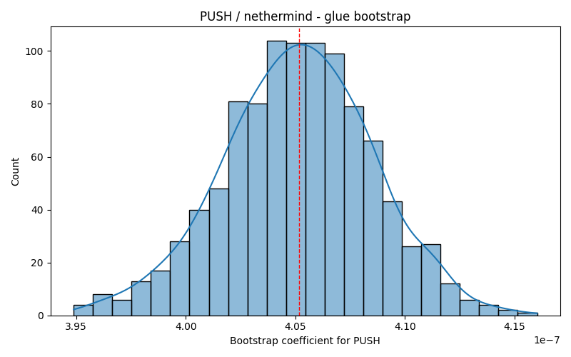


</details>

<details><summary><code>PUSH0</code> · nobs=70059 · runtime_ms=2.99e-07 · p=1.00e-03 · R²=0.9541</summary>


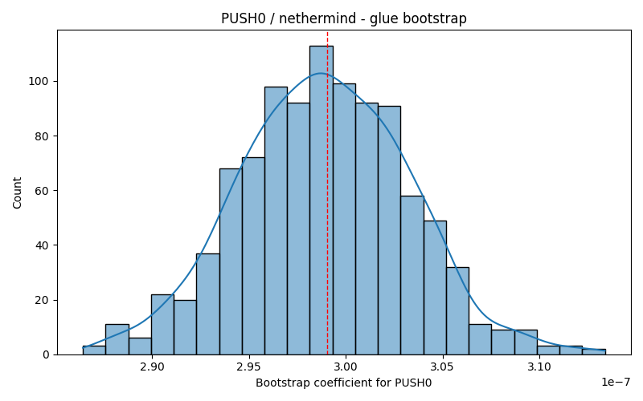


</details>

<details><summary><code>STATICCALL</code> · nobs=70059 · runtime_ms=0.0004068 · p=1.00e-03 · R²=0.9541</summary>


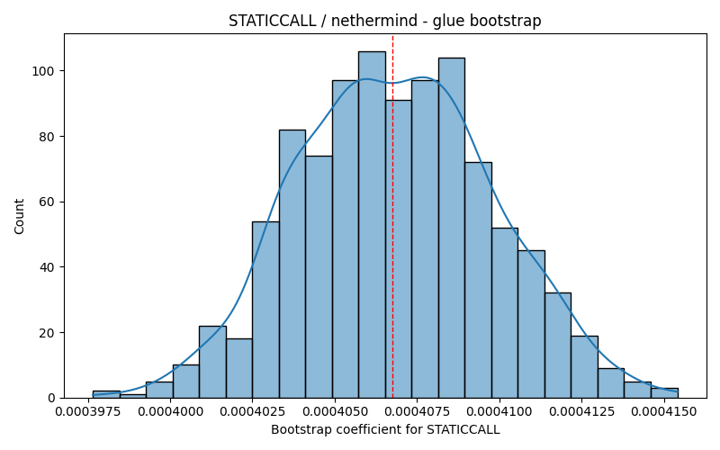


</details>

### Pure glue · nethermind

<details><summary><code>ISZERO</code> · nobs=1177 · runtime_ms=8.088e-07 · p=1.00e-03 · R²=0.8037</summary>

```
==============================================================================
                           NNLS Regression Results                            
==============================================================================
Dep. Variable:          test_runtime_ms              R-squared:          0.804
Model:                  NNLS                    Adj. R-squared:          0.804
No. Observations:       1177                              RMSE:           8.41
Df Residuals:           1175                               MAE:           5.69
Df Model:               1      
==============================================================================
                      coef     std err     P-value      [0.025      0.975]
------------------------------------------------------------------------------
         const     16.3803      0.8266       0.001     14.7604     17.9369
        ISZERO      0.0000      0.0000       0.001      0.0000      0.0000
==============================================================================
Notes: Non-negative least squares with bootstrap inference (1000 iterations)
==============================================================================
```

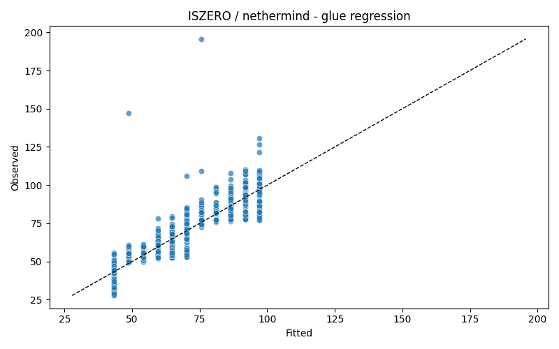

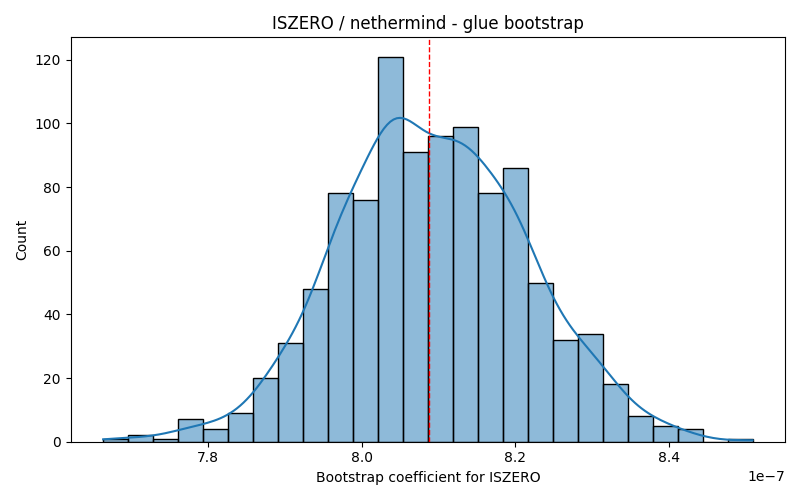

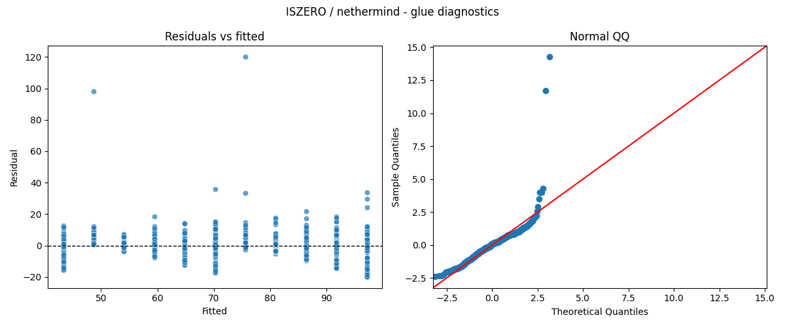

</details>

<details><summary><code>JUMPDEST</code> · nobs=1177 · runtime_ms=4.207e-07 · p=1.00e-03 · R²=0.7224</summary>

```
==============================================================================
                           NNLS Regression Results                            
==============================================================================
Dep. Variable:          test_runtime_ms              R-squared:          0.722
Model:                  NNLS                    Adj. R-squared:          0.722
No. Observations:       1177                              RMSE:          16.47
Df Residuals:           1175                               MAE:          12.57
Df Model:               1      
==============================================================================
                      coef     std err     P-value      [0.025      0.975]
------------------------------------------------------------------------------
         const     19.1114      1.4366       0.001     15.9491     21.8202
      JUMPDEST      0.0000      0.0000       0.001      0.0000      0.0000
==============================================================================
Notes: Non-negative least squares with bootstrap inference (1000 iterations)
==============================================================================
```

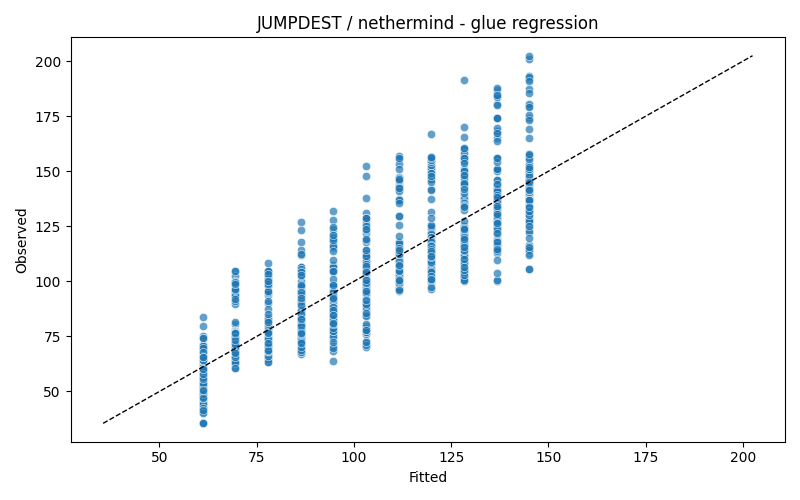

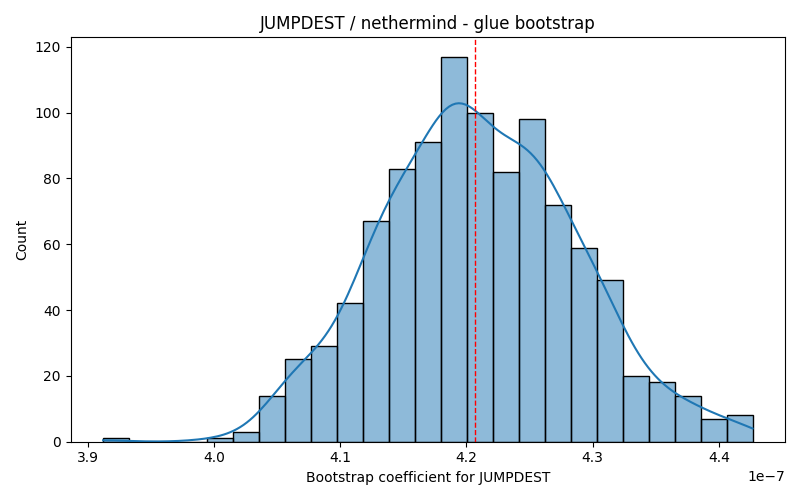

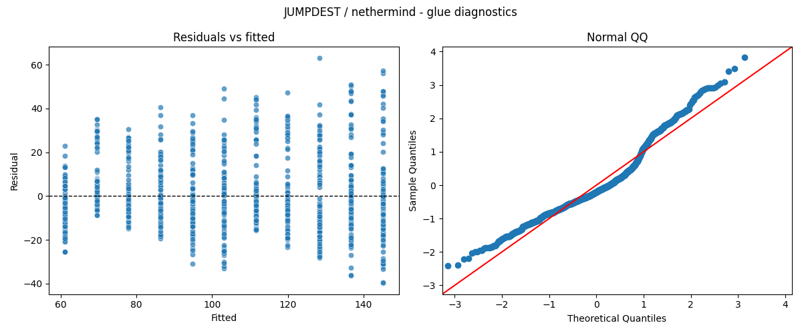

</details>

<details><summary><code>SWAP</code> · nobs=18832 · runtime_ms=5.22e-07 · p=1.00e-03 · R²=0.5312</summary>

```
==============================================================================
                           NNLS Regression Results                            
==============================================================================
Dep. Variable:          test_runtime_ms              R-squared:          0.531
Model:                  NNLS                    Adj. R-squared:          0.531
No. Observations:       18832                             RMSE:          10.32
Df Residuals:           18830                              MAE:           4.65
Df Model:               1      
==============================================================================
                      coef     std err     P-value      [0.025      0.975]
------------------------------------------------------------------------------
         const     15.8349      0.2245       0.001     15.3828     16.2598
          SWAP      0.0000      0.0000       0.001      0.0000      0.0000
==============================================================================
Notes: Non-negative least squares with bootstrap inference (1000 iterations)
==============================================================================
```

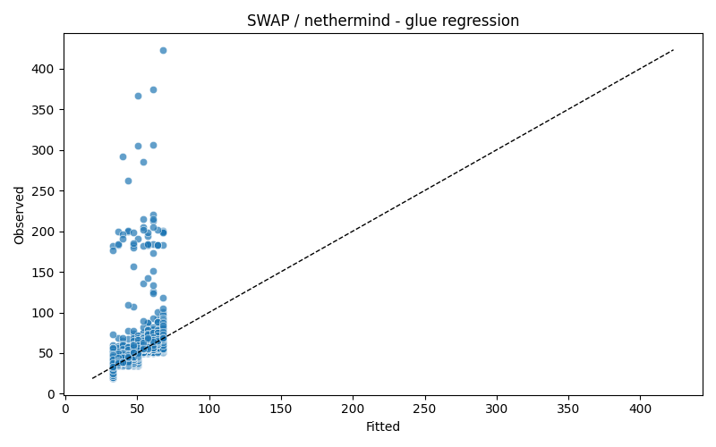

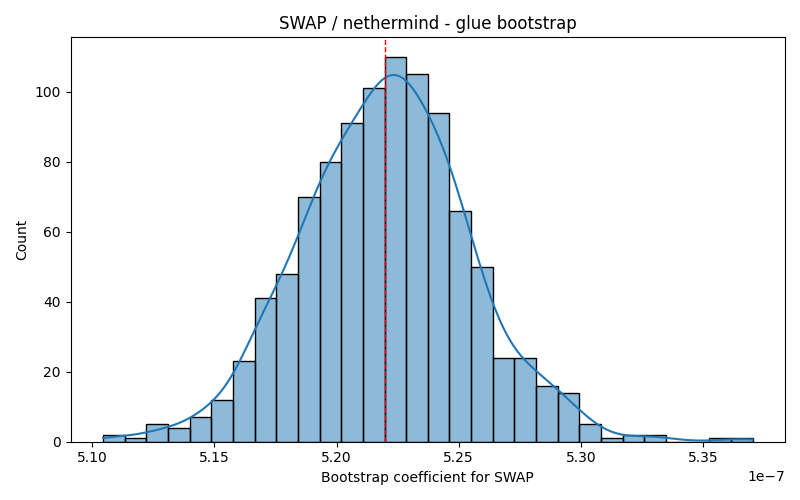

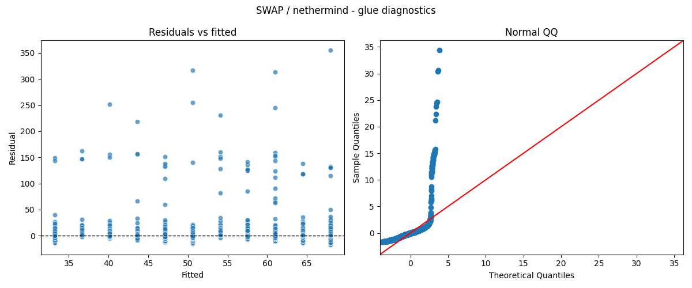

</details>

### Mixed glue (tier A) · nethermind

<details><summary><code>ADD</code> · nobs=1177 · runtime_ms=2.123e-06 · p=1.00e-03 · R²=0.7972</summary>

```
==============================================================================
                           NNLS Regression Results                            
==============================================================================
Dep. Variable:          test_runtime_ms              R-squared:          0.797
Model:                  NNLS                    Adj. R-squared:          0.797
No. Observations:       1177                              RMSE:          11.27
Df Residuals:           1175                               MAE:           7.44
Df Model:               1      
==============================================================================
                      coef     std err     P-value      [0.025      0.975]
------------------------------------------------------------------------------
         const     17.5486      1.2977       0.001     15.2980     20.3335
           ADD      0.0000      0.0000       0.001      0.0000      0.0000
==============================================================================
Notes: Non-negative least squares with bootstrap inference (1000 iterations)
==============================================================================
```

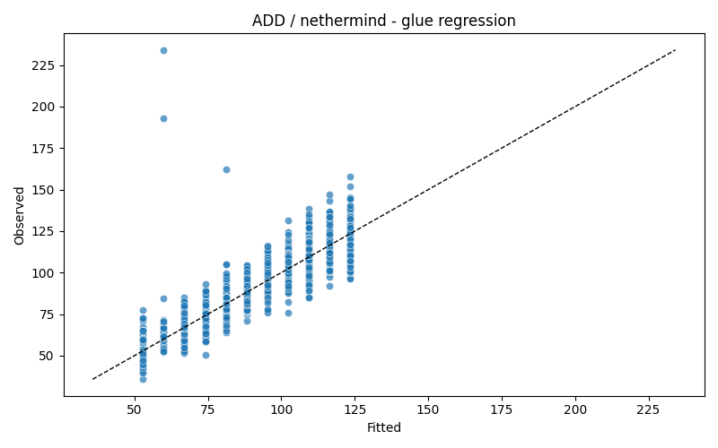

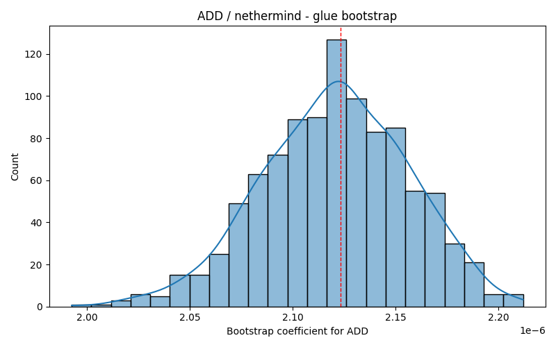

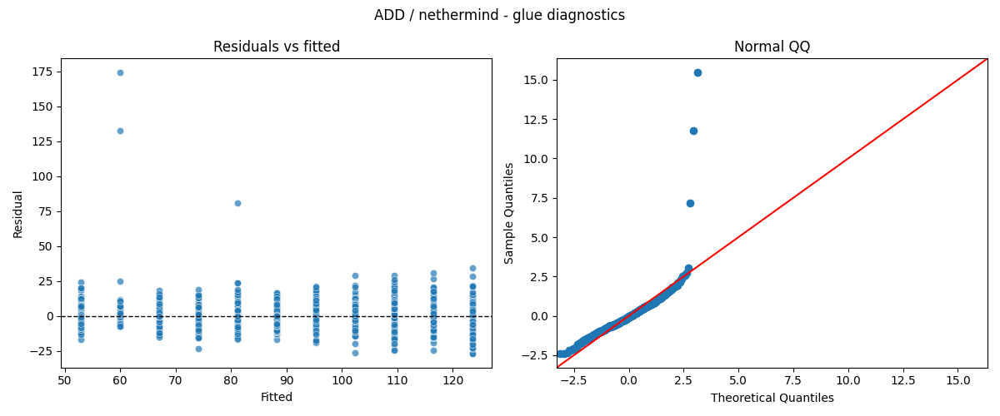

</details>

<details><summary><code>AND</code> · nobs=1177 · runtime_ms=8.556e-07 · p=1.00e-03 · R²=0.5038</summary>

```
==============================================================================
                           NNLS Regression Results                            
==============================================================================
Dep. Variable:          test_runtime_ms              R-squared:          0.504
Model:                  NNLS                    Adj. R-squared:          0.503
No. Observations:       1177                              RMSE:           8.94
Df Residuals:           1175                               MAE:           4.74
Df Model:               1      
==============================================================================
                      coef     std err     P-value      [0.025      0.975]
------------------------------------------------------------------------------
         const     15.3385      0.9995       0.001     13.5733     17.4323
           AND      0.0000      0.0000       0.001      0.0000      0.0000
==============================================================================
Notes: Non-negative least squares with bootstrap inference (1000 iterations)
==============================================================================
```

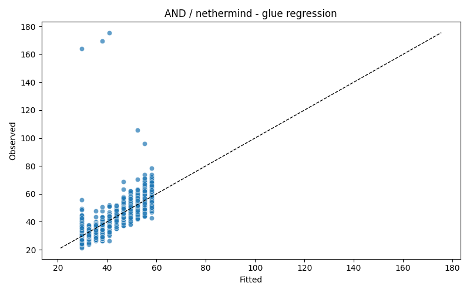

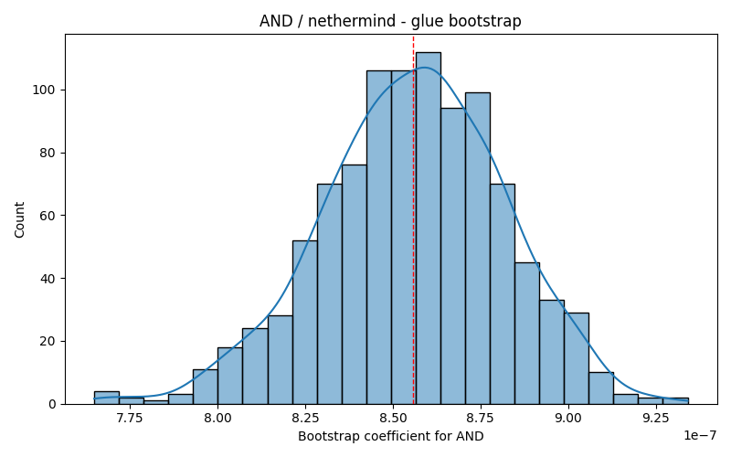

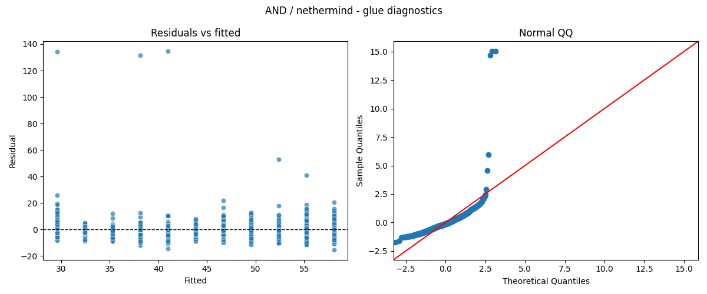

</details>

<details><summary><code>CALLDATACOPY</code> · nobs=28248 · runtime_ms=2.722e-06 · p=1.00e-03 · R²=0.5447</summary>

```
==============================================================================
                           NNLS Regression Results                            
==============================================================================
Dep. Variable:          test_runtime_ms              R-squared:          0.545
Model:                  NNLS                    Adj. R-squared:          0.545
No. Observations:       28248                             RMSE:          18.71
Df Residuals:           28246                              MAE:          14.64
Df Model:               1      
==============================================================================
                      coef     std err     P-value      [0.025      0.975]
------------------------------------------------------------------------------
         const     23.3045      0.1397       0.001     23.0276     23.5869
  CALLDATACOPY      0.0000      0.0000       0.001      0.0000      0.0000
==============================================================================
Notes: Non-negative least squares with bootstrap inference (1000 iterations)
==============================================================================
```

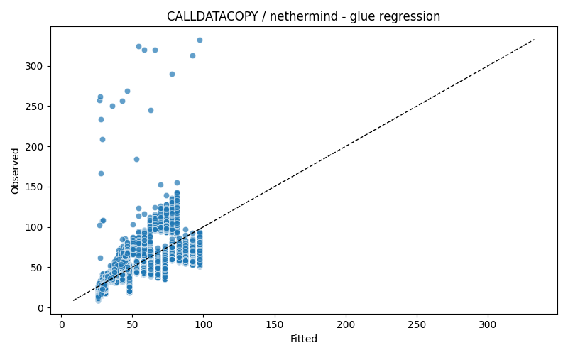

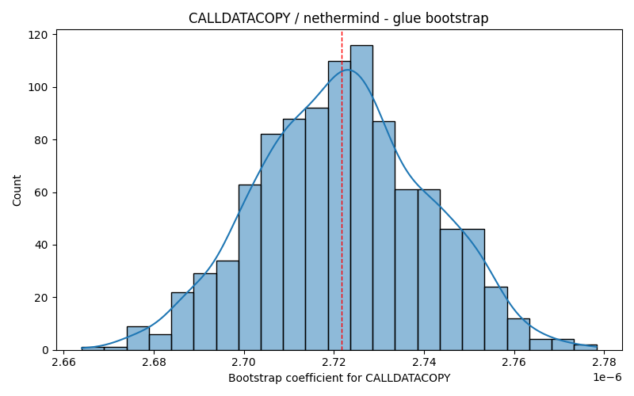

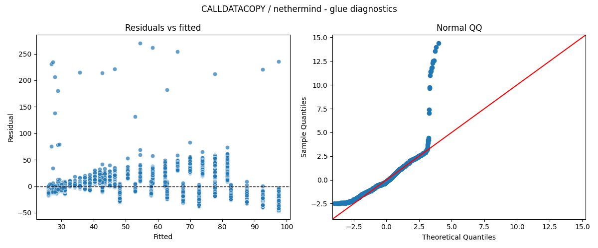

</details>

<details><summary><code>CALLDATALOAD</code> · nobs=4708 · runtime_ms=2.89e-05 · p=1.00e-03 · R²=0.0007697</summary>

```
==============================================================================
                           NNLS Regression Results                            
==============================================================================
Dep. Variable:          test_runtime_ms              R-squared:          0.001
Model:                  NNLS                    Adj. R-squared:          0.001
No. Observations:       4708                              RMSE:           4.00
Df Residuals:           4706                               MAE:           0.27
Df Model:               1      
==============================================================================
                      coef     std err     P-value      [0.025      0.975]
------------------------------------------------------------------------------
         const      2.1395      0.1240       0.001      1.8861      2.3977
  CALLDATALOAD      0.0000      0.0000       0.001      0.0000      0.0001
==============================================================================
Notes: Non-negative least squares with bootstrap inference (1000 iterations)
==============================================================================
```

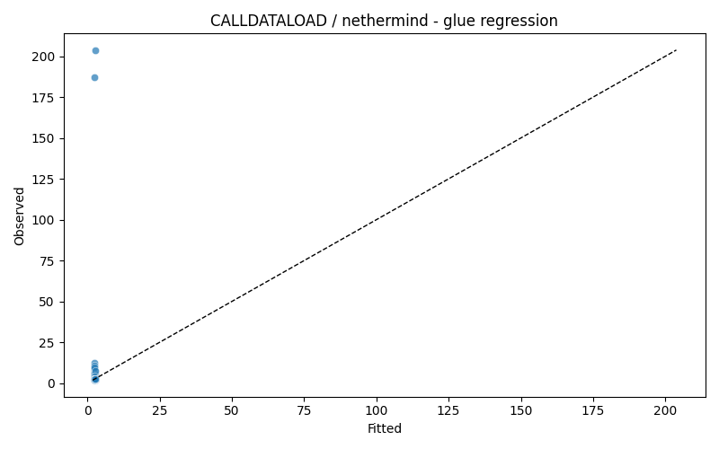

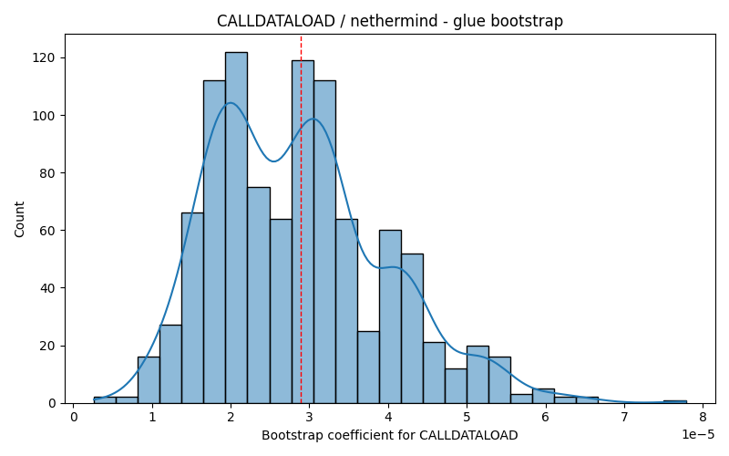

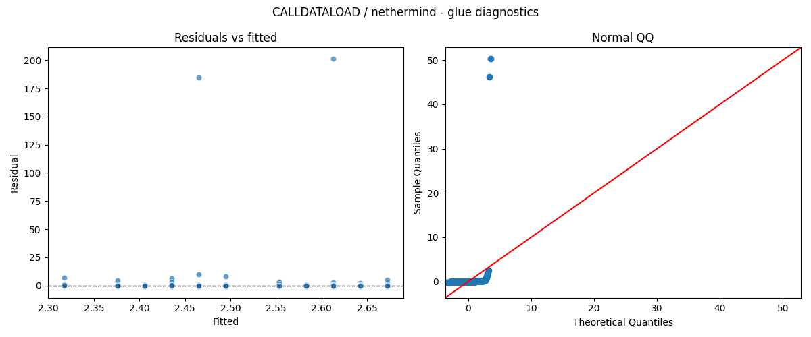

</details>

<details><summary><code>DIV</code> · nobs=1177 · runtime_ms=7.412e-06 · p=1.00e-03 · R²=0.6203</summary>

```
==============================================================================
                           NNLS Regression Results                            
==============================================================================
Dep. Variable:          test_runtime_ms              R-squared:          0.620
Model:                  NNLS                    Adj. R-squared:          0.620
No. Observations:       1177                              RMSE:          45.78
Df Residuals:           1175                               MAE:          36.39
Df Model:               1      
==============================================================================
                      coef     std err     P-value      [0.025      0.975]
------------------------------------------------------------------------------
         const    129.0331      6.2919       0.001    116.3457    140.4218
           DIV      0.0000      0.0000       0.001      0.0000      0.0000
==============================================================================
Notes: Non-negative least squares with bootstrap inference (1000 iterations)
==============================================================================
```

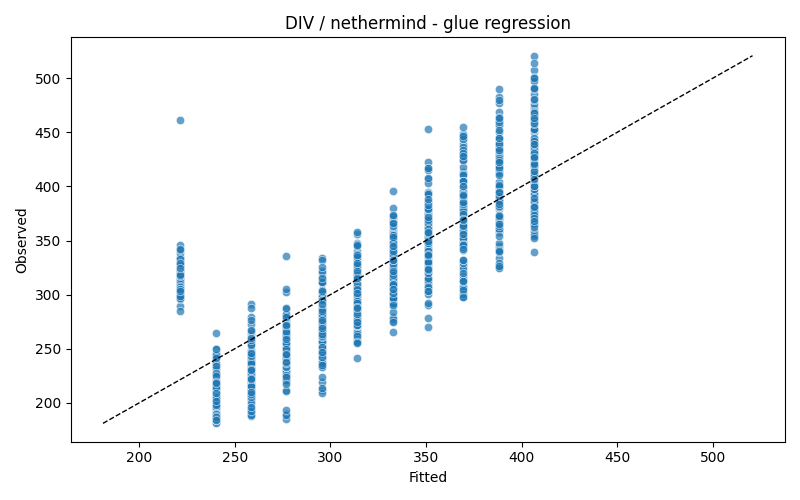

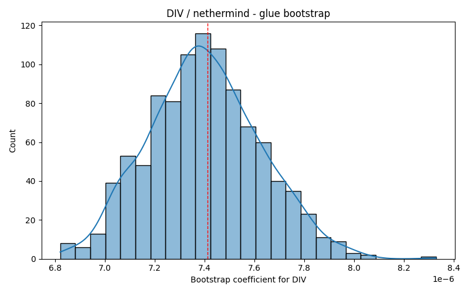

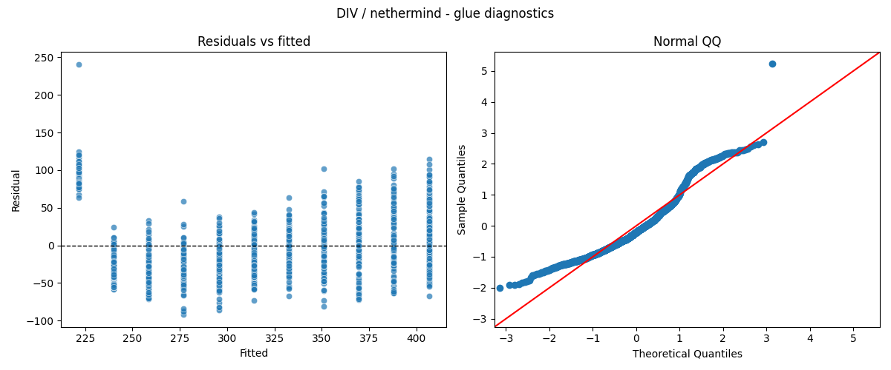

</details>

<details><summary><code>EXP</code> · nobs=1177 · runtime_ms=0 · p=1.00e+00 · R²=-2.22e-16</summary>

```
==============================================================================
                           NNLS Regression Results                            
==============================================================================
Dep. Variable:          test_runtime_ms              R-squared:         -0.000
Model:                  NNLS                    Adj. R-squared:         -0.001
No. Observations:       1177                              RMSE:          47.90
Df Residuals:           1175                               MAE:          32.98
Df Model:               1      
==============================================================================
                      coef     std err     P-value      [0.025      0.975]
------------------------------------------------------------------------------
         const    108.5101      1.9669       0.001    102.7796    111.1978
           EXP      0.0000      0.0000       1.000      0.0000      0.0000
==============================================================================
Notes: Non-negative least squares with bootstrap inference (1000 iterations)
==============================================================================
```

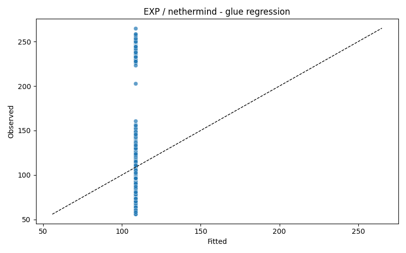

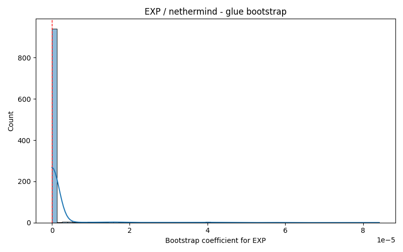

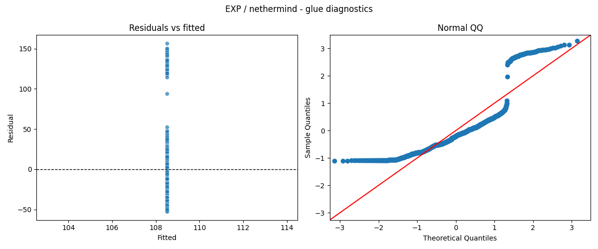

</details>

<details><summary><code>GT</code> · nobs=1177 · runtime_ms=1.114e-06 · p=1.00e-03 · R²=0.6159</summary>

```
==============================================================================
                           NNLS Regression Results                            
==============================================================================
Dep. Variable:          test_runtime_ms              R-squared:          0.616
Model:                  NNLS                    Adj. R-squared:          0.616
No. Observations:       1177                              RMSE:           9.26
Df Residuals:           1175                               MAE:           5.32
Df Model:               1      
==============================================================================
                      coef     std err     P-value      [0.025      0.975]
------------------------------------------------------------------------------
         const     13.5524      0.6808       0.001     12.3225     14.8717
            GT      0.0000      0.0000       0.001      0.0000      0.0000
==============================================================================
Notes: Non-negative least squares with bootstrap inference (1000 iterations)
==============================================================================
```

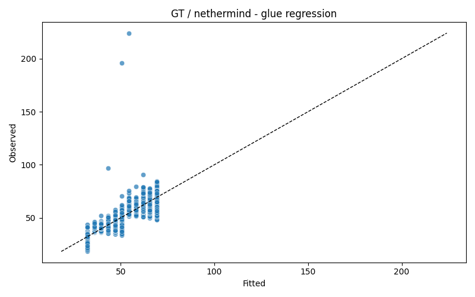

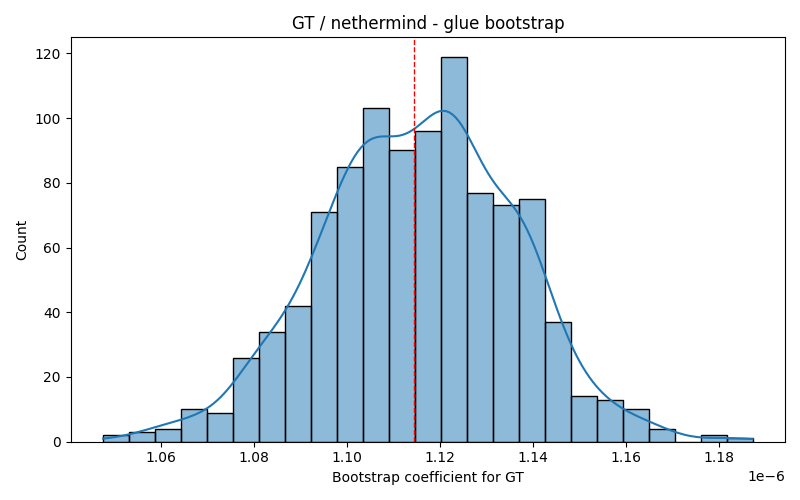

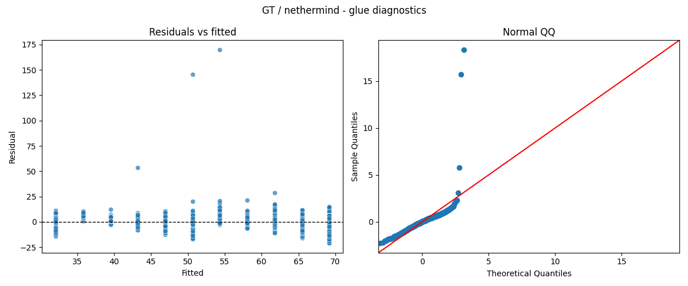

</details>

<details><summary><code>JUMPI</code> · nobs=1177 · runtime_ms=1.176e-06 · p=1.00e-03 · R²=0.4098</summary>

```
==============================================================================
                           NNLS Regression Results                            
==============================================================================
Dep. Variable:          test_runtime_ms              R-squared:          0.410
Model:                  NNLS                    Adj. R-squared:          0.409
No. Observations:       1177                              RMSE:           6.37
Df Residuals:           1175                               MAE:           3.18
Df Model:               1      
==============================================================================
                      coef     std err     P-value      [0.025      0.975]
------------------------------------------------------------------------------
         const      8.8386      0.4439       0.001      8.0014      9.7065
         JUMPI      0.0000      0.0000       0.001      0.0000      0.0000
==============================================================================
Notes: Non-negative least squares with bootstrap inference (1000 iterations)
==============================================================================
```

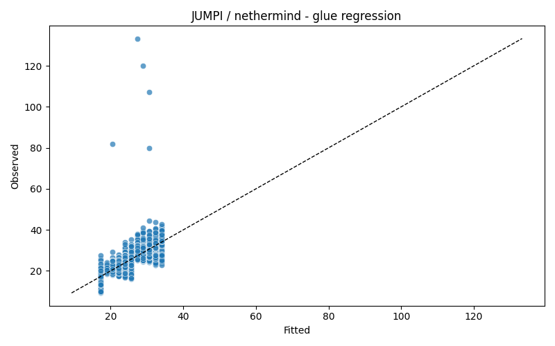

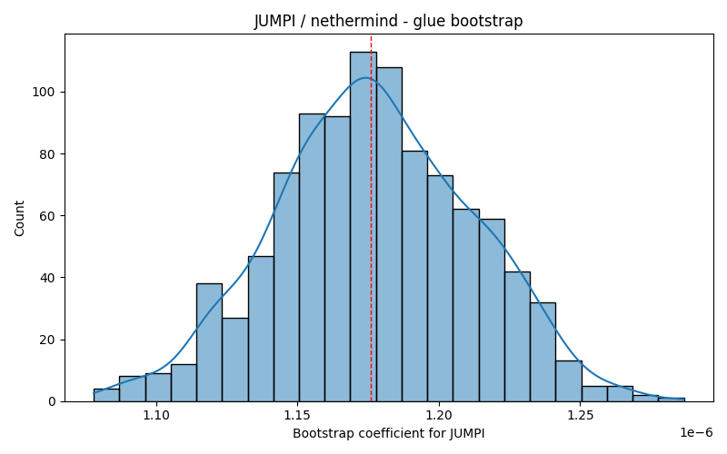

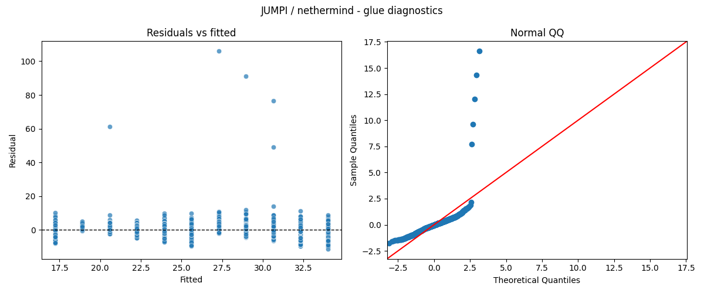

</details>

<details><summary><code>LT</code> · nobs=1177 · runtime_ms=9.987e-07 · p=1.00e-03 · R²=0.6249</summary>

```
==============================================================================
                           NNLS Regression Results                            
==============================================================================
Dep. Variable:          test_runtime_ms              R-squared:          0.625
Model:                  NNLS                    Adj. R-squared:          0.625
No. Observations:       1177                              RMSE:           8.14
Df Residuals:           1175                               MAE:           5.18
Df Model:               1      
==============================================================================
                      coef     std err     P-value      [0.025      0.975]
------------------------------------------------------------------------------
         const     18.7244      0.8604       0.001     17.0236     20.2922
            LT      0.0000      0.0000       0.001      0.0000      0.0000
==============================================================================
Notes: Non-negative least squares with bootstrap inference (1000 iterations)
==============================================================================
```

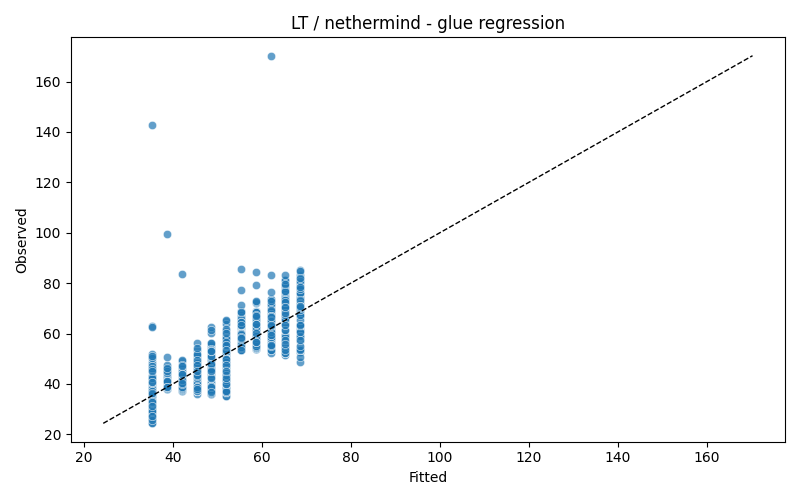

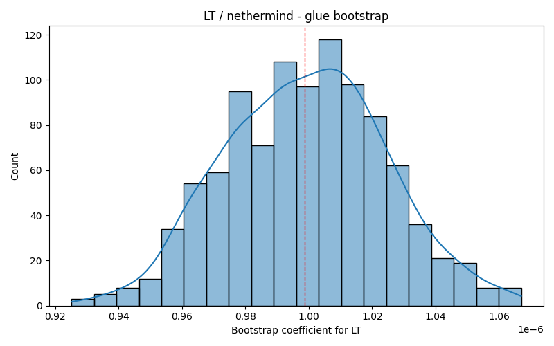

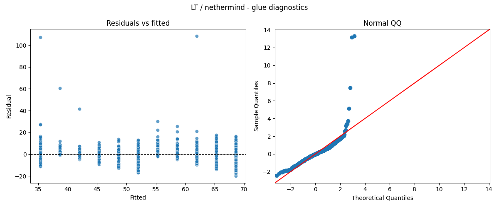

</details>

<details><summary><code>MSTORE</code> · nobs=5885 · runtime_ms=1.358e-06 · p=1.00e-03 · R²=0.5218</summary>

```
==============================================================================
                           NNLS Regression Results                            
==============================================================================
Dep. Variable:          test_runtime_ms              R-squared:          0.522
Model:                  NNLS                    Adj. R-squared:          0.522
No. Observations:       5885                              RMSE:           9.13
Df Residuals:           5883                               MAE:           4.95
Df Model:               1      
==============================================================================
                      coef     std err     P-value      [0.025      0.975]
------------------------------------------------------------------------------
         const     14.5490      0.3665       0.001     13.8288     15.3067
        MSTORE      0.0000      0.0000       0.001      0.0000      0.0000
==============================================================================
Notes: Non-negative least squares with bootstrap inference (1000 iterations)
==============================================================================
```


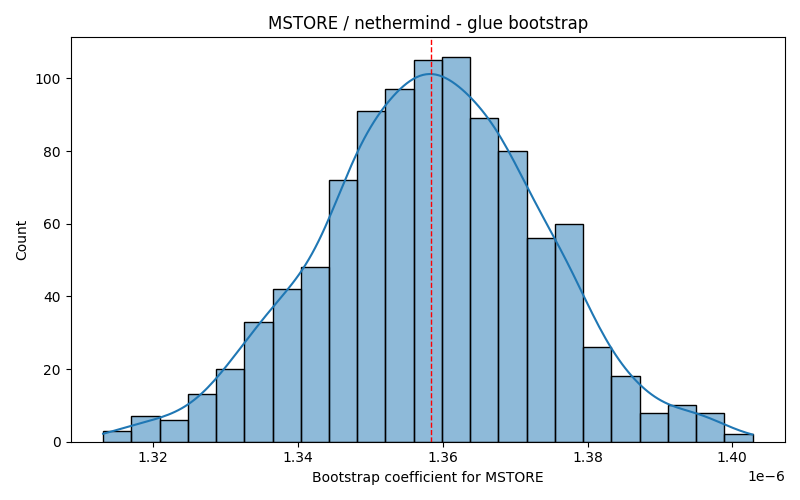

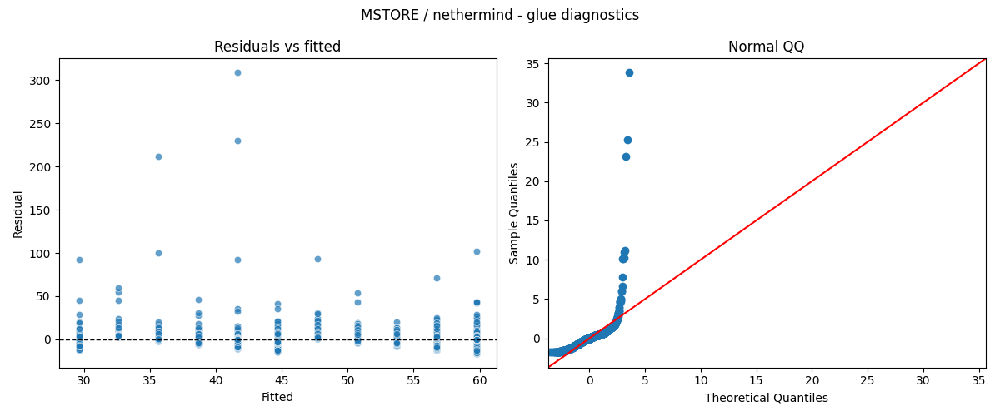

</details>

<details><summary><code>MSTORE8</code> · nobs=5885 · runtime_ms=1.281e-06 · p=1.00e-03 · R²=0.5035</summary>

```
==============================================================================
                           NNLS Regression Results                            
==============================================================================
Dep. Variable:          test_runtime_ms              R-squared:          0.503
Model:                  NNLS                    Adj. R-squared:          0.503
No. Observations:       5885                              RMSE:           8.93
Df Residuals:           5883                               MAE:           4.86
Df Model:               1      
==============================================================================
                      coef     std err     P-value      [0.025      0.975]
------------------------------------------------------------------------------
         const     14.3064      0.3866       0.001     13.5925     15.0976
       MSTORE8      0.0000      0.0000       0.001      0.0000      0.0000
==============================================================================
Notes: Non-negative least squares with bootstrap inference (1000 iterations)
==============================================================================
```

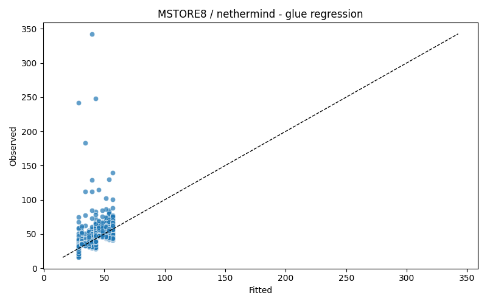

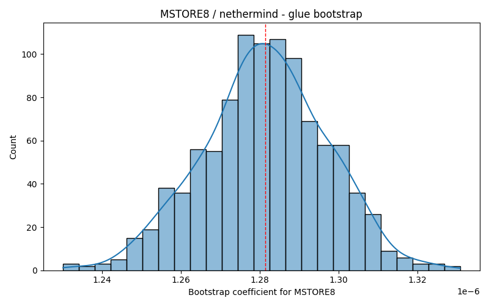

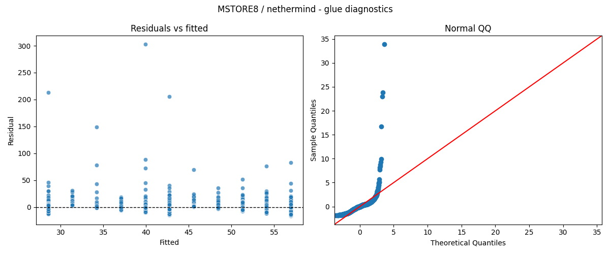

</details>

<details><summary><code>MUL</code> · nobs=1177 · runtime_ms=5.193e-06 · p=1.00e-03 · R²=0.8343</summary>

```
==============================================================================
                           NNLS Regression Results                            
==============================================================================
Dep. Variable:          test_runtime_ms              R-squared:          0.834
Model:                  NNLS                    Adj. R-squared:          0.834
No. Observations:       1177                              RMSE:          18.27
Df Residuals:           1175                               MAE:          14.50
Df Model:               1      
==============================================================================
                      coef     std err     P-value      [0.025      0.975]
------------------------------------------------------------------------------
         const     26.5303      1.5134       0.001     23.4971     29.4930
           MUL      0.0000      0.0000       0.001      0.0000      0.0000
==============================================================================
Notes: Non-negative least squares with bootstrap inference (1000 iterations)
==============================================================================
```

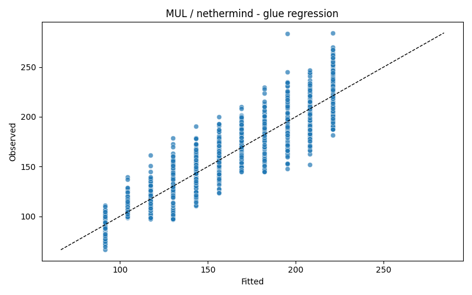

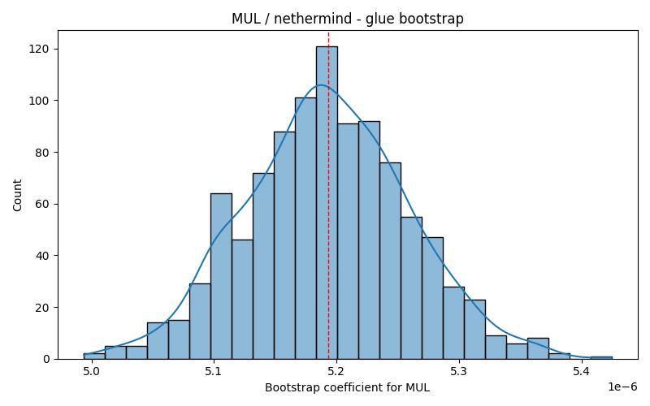

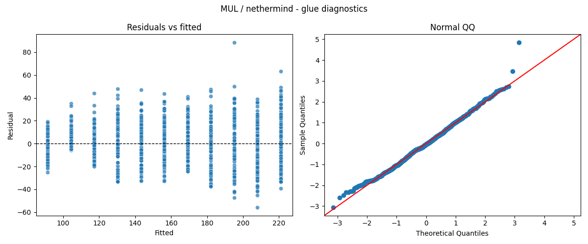

</details>

<details><summary><code>PC</code> · nobs=1177 · runtime_ms=3.763e-07 · p=1.00e-03 · R²=0.6383</summary>

```
==============================================================================
                           NNLS Regression Results                            
==============================================================================
Dep. Variable:          test_runtime_ms              R-squared:          0.638
Model:                  NNLS                    Adj. R-squared:          0.638
No. Observations:       1177                              RMSE:           8.47
Df Residuals:           1175                               MAE:           6.54
Df Model:               1      
==============================================================================
                      coef     std err     P-value      [0.025      0.975]
------------------------------------------------------------------------------
         const     16.8922      0.8633       0.001     15.2302     18.5873
            PC      0.0000      0.0000       0.001      0.0000      0.0000
==============================================================================
Notes: Non-negative least squares with bootstrap inference (1000 iterations)
==============================================================================
```

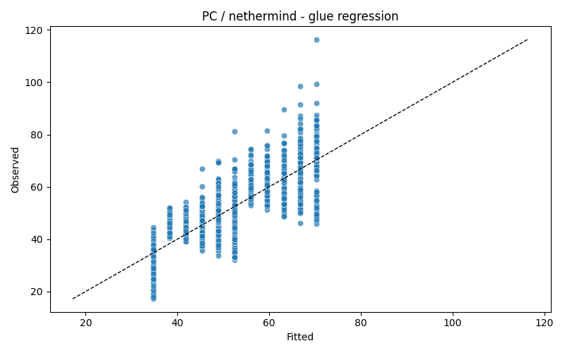

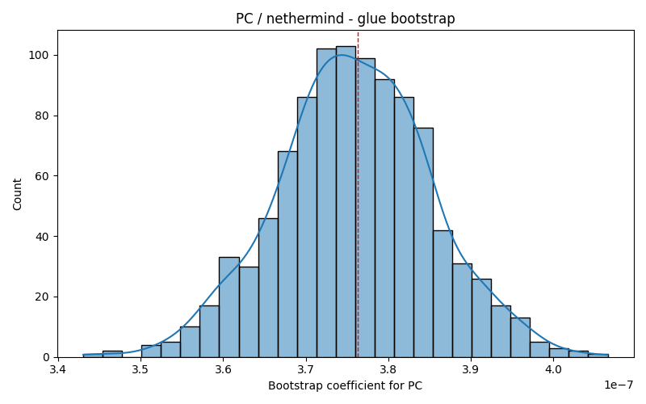

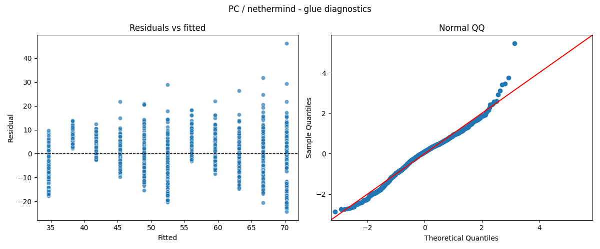

</details>

<details><summary><code>RETURNDATASIZE</code> · nobs=4708 · runtime_ms=7.591e-07 · p=1.00e-03 · R²=0.6556</summary>

```
==============================================================================
                           NNLS Regression Results                            
==============================================================================
Dep. Variable:          test_runtime_ms              R-squared:          0.656
Model:                  NNLS                    Adj. R-squared:          0.655
No. Observations:       4708                              RMSE:           8.69
Df Residuals:           4706                               MAE:           4.58
Df Model:               1      
==============================================================================
                      coef     std err     P-value      [0.025      0.975]
------------------------------------------------------------------------------
         const     11.1691      0.4265       0.001     10.3095     11.9993
RETURNDATASIZE      0.0000      0.0000       0.001      0.0000      0.0000
==============================================================================
Notes: Non-negative least squares with bootstrap inference (1000 iterations)
==============================================================================
```

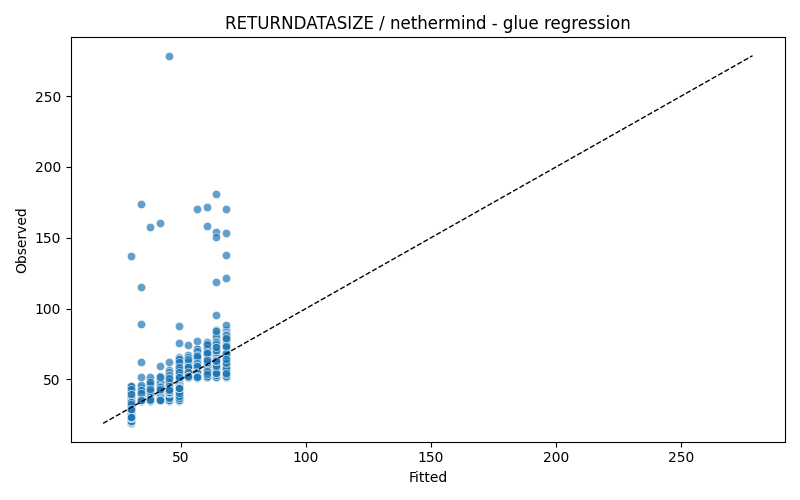

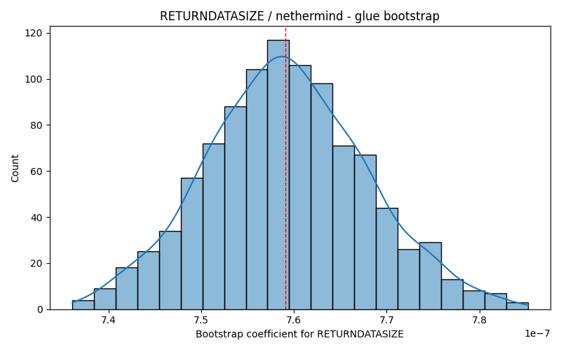

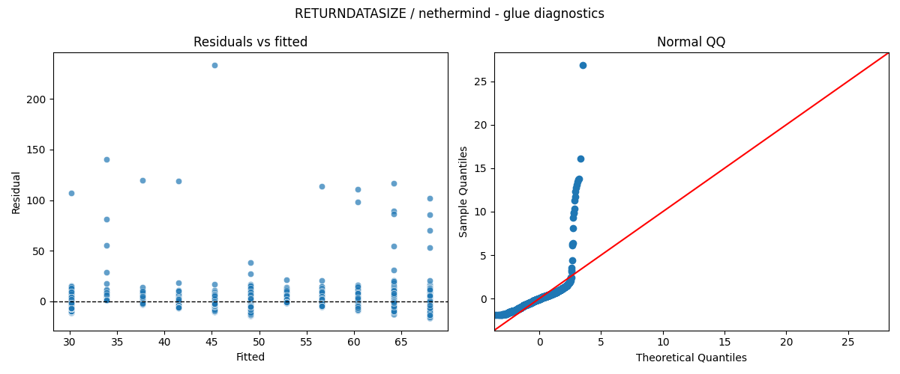

</details>

<details><summary><code>SELFBALANCE</code> · nobs=963 · runtime_ms=5.01e-06 · p=1.00e-03 · R²=0.2859</summary>

```
==============================================================================
                           NNLS Regression Results                            
==============================================================================
Dep. Variable:          test_runtime_ms              R-squared:          0.286
Model:                  NNLS                    Adj. R-squared:          0.285
No. Observations:       963                               RMSE:          79.87
Df Residuals:           961                                MAE:          52.30
Df Model:               1      
==============================================================================
                      coef     std err     P-value      [0.025      0.975]
------------------------------------------------------------------------------
         const    112.7550     10.9029       0.001     90.9700    134.1302
   SELFBALANCE      0.0000      0.0000       0.001      0.0000      0.0000
==============================================================================
Notes: Non-negative least squares with bootstrap inference (1000 iterations)
==============================================================================
```

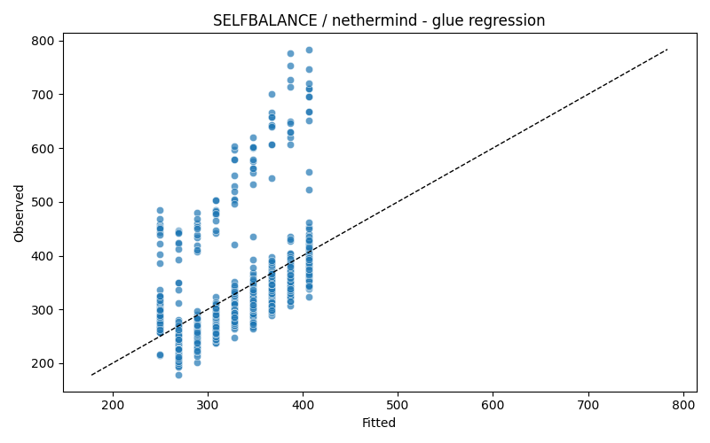

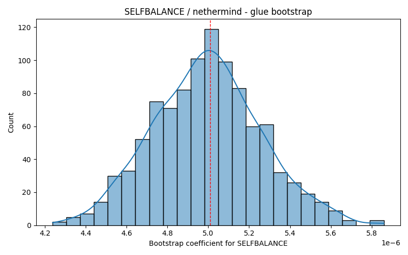

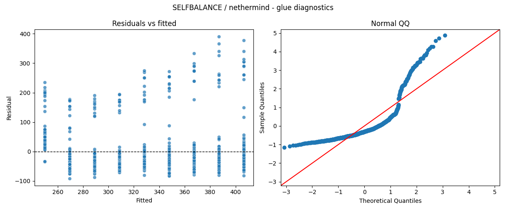

</details>

<details><summary><code>SUB</code> · nobs=1177 · runtime_ms=2.135e-06 · p=1.00e-03 · R²=0.7831</summary>

```
==============================================================================
                           NNLS Regression Results                            
==============================================================================
Dep. Variable:          test_runtime_ms              R-squared:          0.783
Model:                  NNLS                    Adj. R-squared:          0.783
No. Observations:       1177                              RMSE:          11.83
Df Residuals:           1175                               MAE:           8.73
Df Model:               1      
==============================================================================
                      coef     std err     P-value      [0.025      0.975]
------------------------------------------------------------------------------
         const     16.8080      1.0092       0.001     14.8187     18.8073
           SUB      0.0000      0.0000       0.001      0.0000      0.0000
==============================================================================
Notes: Non-negative least squares with bootstrap inference (1000 iterations)
==============================================================================
```

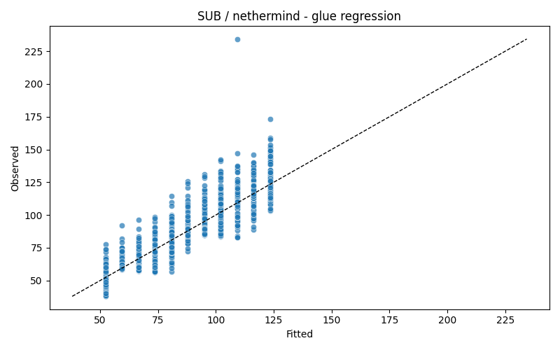

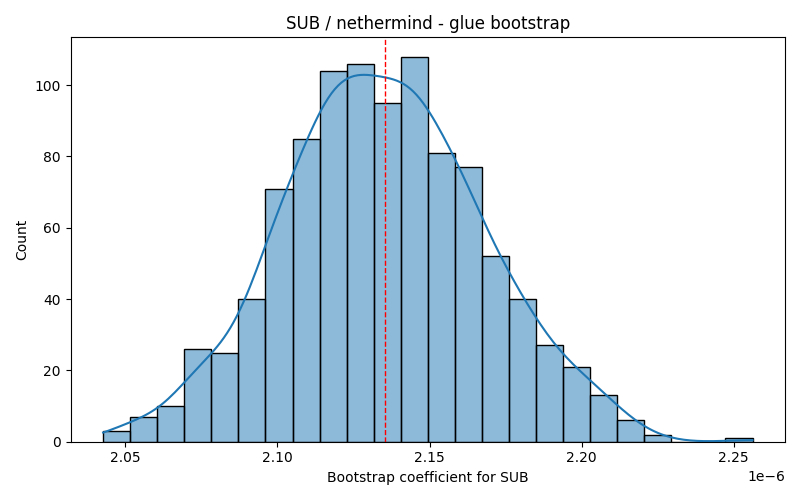

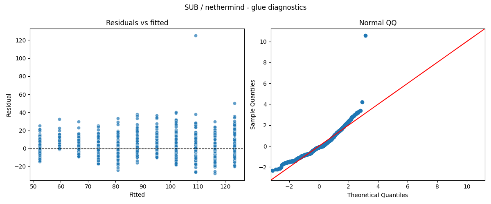

</details>

### Mixed glue (tier B) · nethermind

<details><summary><code>JUMP</code> · nobs=1177 · runtime_ms=1.938e-06 · p=1.00e-03 · R²=0.4754</summary>

```
==============================================================================
                           NNLS Regression Results                            
==============================================================================
Dep. Variable:          test_runtime_ms              R-squared:          0.475
Model:                  NNLS                    Adj. R-squared:          0.475
No. Observations:       1177                              RMSE:           7.56
Df Residuals:           1175                               MAE:           6.04
Df Model:               1      
==============================================================================
                      coef     std err     P-value      [0.025      0.975]
------------------------------------------------------------------------------
         const     15.7407      0.8045       0.001     14.2159     17.3484
          JUMP      0.0000      0.0000       0.001      0.0000      0.0000
==============================================================================
Notes: Non-negative least squares with bootstrap inference (1000 iterations)
==============================================================================
```

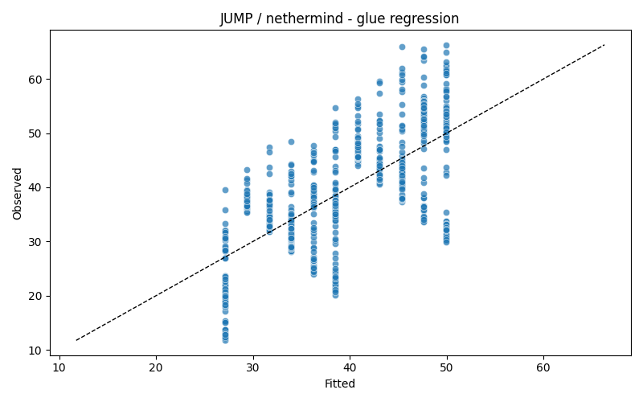

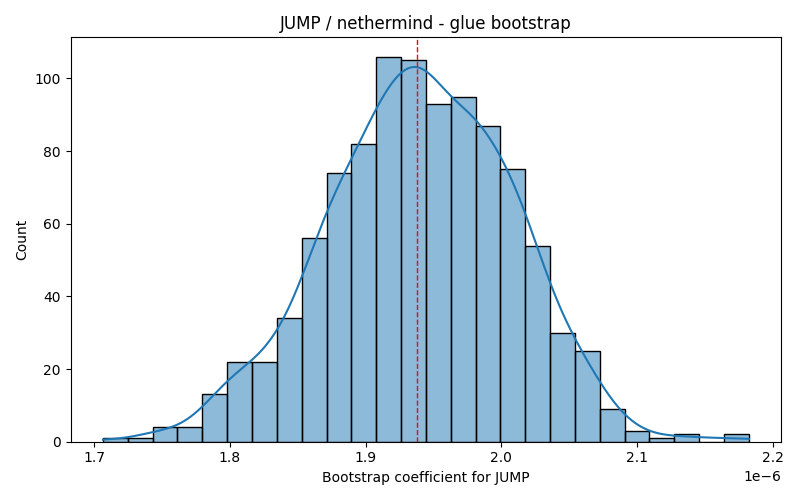

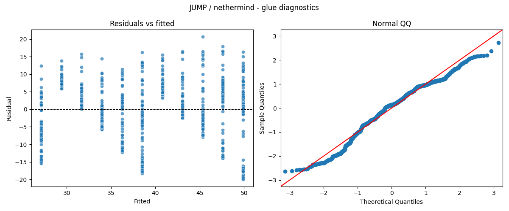

</details>

<details><summary><code>KECCAK256</code> · nobs=18832 · runtime_ms=0 · p=1.00e+00 · R²=0</summary>

```
==============================================================================
                           NNLS Regression Results                            
==============================================================================
Dep. Variable:          test_runtime_ms              R-squared:          0.000
Model:                  NNLS                    Adj. R-squared:         -0.000
No. Observations:       18832                             RMSE:         291.41
Df Residuals:           18830                              MAE:         239.16
Df Model:               1      
==============================================================================
                      coef     std err     P-value      [0.025      0.975]
------------------------------------------------------------------------------
         const    435.3843      2.0676       0.001    431.2972    439.2797
     KECCAK256      0.0000      0.0000       1.000      0.0000      0.0000
==============================================================================
Notes: Non-negative least squares with bootstrap inference (1000 iterations)
==============================================================================
```

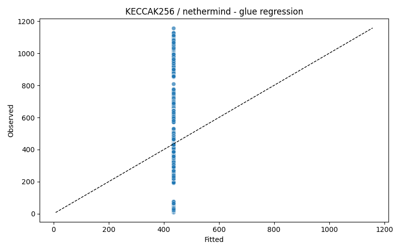


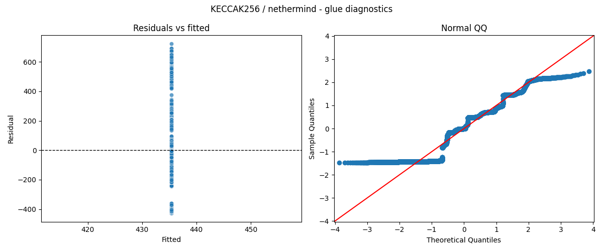

</details>

## reth

| glue_opcode | nobs | glue_runtime_ms | p_value | rsquared |
| --- | --- | --- | --- | --- |
| `ISZERO` | 99 | 3.91e-07 | 1.00e-03 | 0.8047 |
| `JUMPDEST` | 99 | 2.849e-07 | 1.00e-03 | 0.8688 |
| `SWAP` | 1760 | 4.776e-07 | 1.00e-03 | 0.7873 |
| `CALLDATASIZE` | 6338 | 4.976e-07 | 1.00e-03 | 0.8433 |
| `DUP` | 6338 | 4.175e-07 | 1.00e-03 | 0.8433 |
| `GAS` | 6338 | 4.494e-07 | 1.00e-03 | 0.8433 |
| `MLOAD` | 6338 | 1.626e-06 | 1.00e-03 | 0.8433 |
| `PUSH` | 6338 | 4.459e-07 | 1.00e-03 | 0.8433 |
| `PUSH0` | 6338 | 3.457e-07 | 1.00e-03 | 0.8433 |
| `STATICCALL` | 6338 | 4.59e-05 | 1.00e-03 | 0.8433 |
| `ADD` | 99 | 5.511e-07 | 1.00e-03 | 0.5385 |
| `AND` | 99 | 4.818e-07 | 1.00e-03 | 0.5149 |
| `CALLDATACOPY` | 2376 | 8.486e-07 | 1.00e-03 | 0.3661 |
| `CALLDATALOAD` | 396 | 4.219e-05 | 1.00e-03 | 0.4552 |
| `DIV` | 99 | 6.593e-06 | 1.00e-03 | 0.8125 |
| `EXP` | 99 | 0.000336 | 1.00e-03 | 0.8142 |
| `GT` | 99 | 5.473e-07 | 1.00e-03 | 0.5688 |
| `JUMPI` | 99 | 6.08e-07 | 1.00e-03 | 0.2965 |
| `LT` | 99 | 5.048e-07 | 1.00e-03 | 0.5257 |
| `MSTORE` | 495 | 1.883e-06 | 1.00e-03 | 0.1527 |
| `MSTORE8` | 495 | 4.232e-07 | 1.00e-03 | 0.1335 |
| `MUL` | 99 | 6.95e-07 | 1.00e-03 | 0.6244 |
| `PC` | 99 | 5.606e-07 | 1.00e-03 | 0.9071 |
| `RETURNDATASIZE` | 396 | 9.056e-07 | 1.00e-03 | 0.8551 |
| `SELFBALANCE` | 81 | 3.844e-06 | 1.00e-03 | 0.8252 |
| `SUB` | 99 | 5.337e-07 | 1.00e-03 | 0.527 |
| `JUMP` | 99 | 1.859e-07 | 6.60e-02 | 0.0268 |
| `KECCAK256` | 1584 | 0 | 1.00e+00 | 0 |

### Cycle glue — joint fit · reth

<details><summary>Joint NNLS regression summary</summary>

```
==============================================================================
                           NNLS Regression Results                            
==============================================================================
Dep. Variable:          test_runtime_ms              R-squared:          0.843
Model:                  NNLS                    Adj. R-squared:          0.843
No. Observations:       6338                              RMSE:           7.16
Df Residuals:           6330                               MAE:           4.95
Df Model:               7      
==============================================================================
                      coef     std err     P-value      [0.025      0.975]
------------------------------------------------------------------------------
         const     11.6529      0.2849       0.001     11.0607     12.1878
  CALLDATASIZE      0.0000      0.0000       0.001      0.0000      0.0000
           DUP      0.0000      0.0000       0.001      0.0000      0.0000
           GAS      0.0000      0.0000       0.001      0.0000      0.0000
         MLOAD      0.0000      0.0000       0.001      0.0000      0.0000
          PUSH      0.0000      0.0000       0.001      0.0000      0.0000
         PUSH0      0.0000      0.0000       0.001      0.0000      0.0000
    STATICCALL      0.0000      0.0000       0.001      0.0000      0.0000
==============================================================================
Notes: Non-negative least squares with bootstrap inference (1000 iterations)
==============================================================================
```

</details>

<details><summary><code>CALLDATASIZE</code> · nobs=6338 · runtime_ms=4.976e-07 · p=1.00e-03 · R²=0.8433</summary>


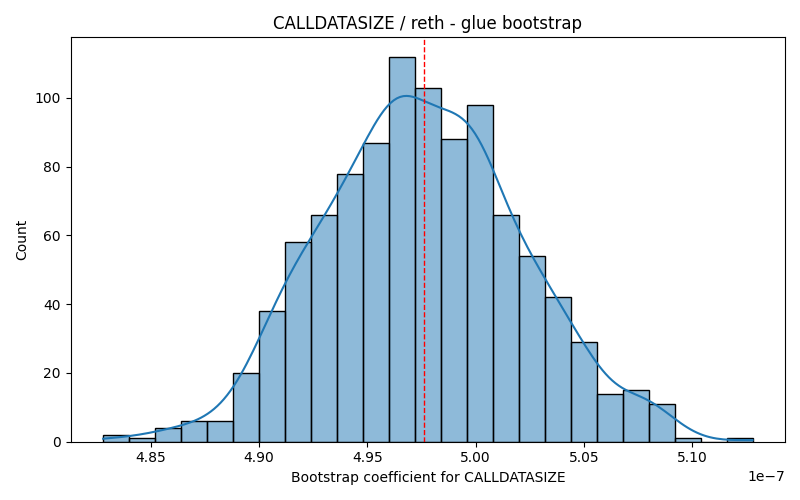

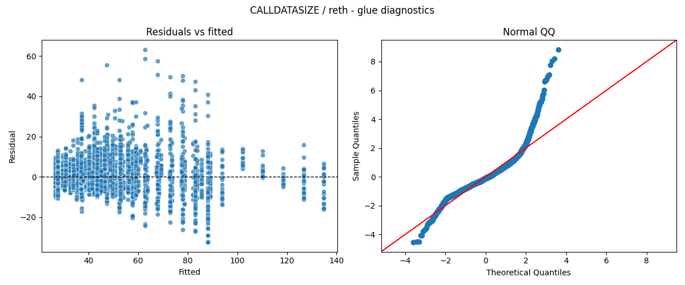

</details>

<details><summary><code>DUP</code> · nobs=6338 · runtime_ms=4.175e-07 · p=1.00e-03 · R²=0.8433</summary>


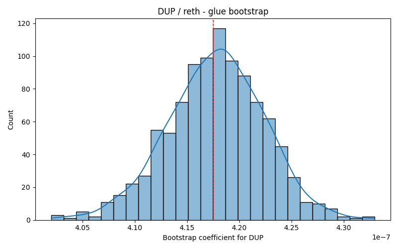


</details>

<details><summary><code>GAS</code> · nobs=6338 · runtime_ms=4.494e-07 · p=1.00e-03 · R²=0.8433</summary>


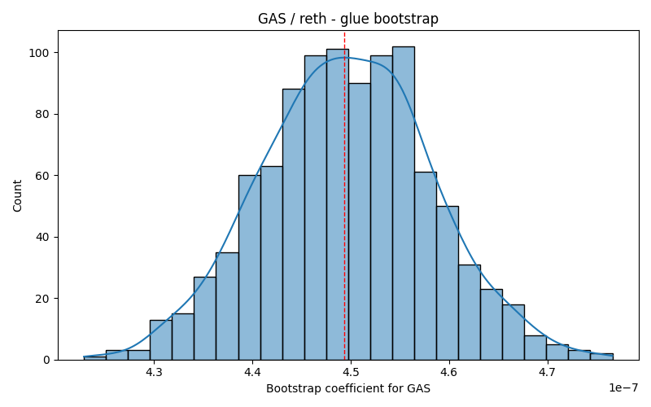


</details>

<details><summary><code>MLOAD</code> · nobs=6338 · runtime_ms=1.626e-06 · p=1.00e-03 · R²=0.8433</summary>

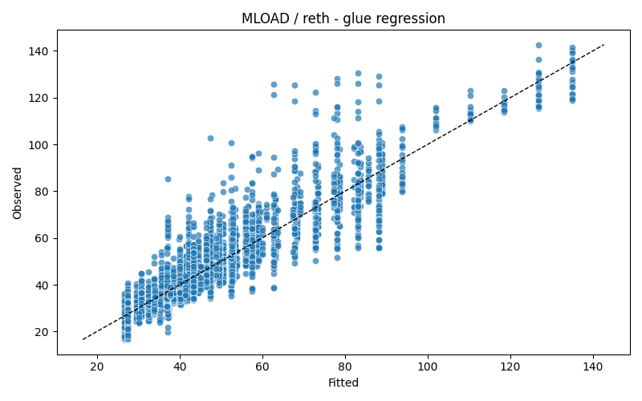

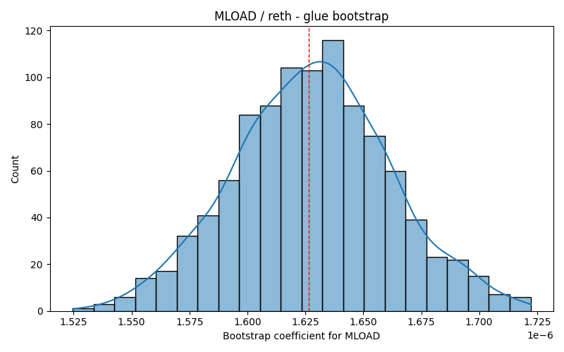


</details>

<details><summary><code>PUSH</code> · nobs=6338 · runtime_ms=4.459e-07 · p=1.00e-03 · R²=0.8433</summary>


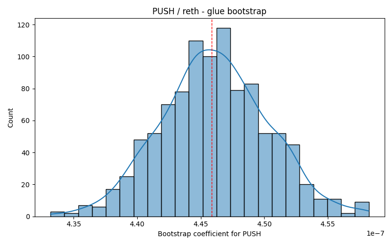


</details>

<details><summary><code>PUSH0</code> · nobs=6338 · runtime_ms=3.457e-07 · p=1.00e-03 · R²=0.8433</summary>


</details>

<details><summary><code>STATICCALL</code> · nobs=6338 · runtime_ms=4.59e-05 · p=1.00e-03 · R²=0.8433</summary>

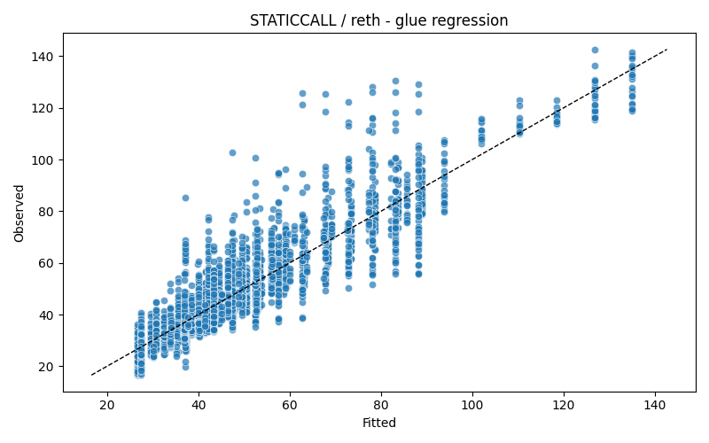

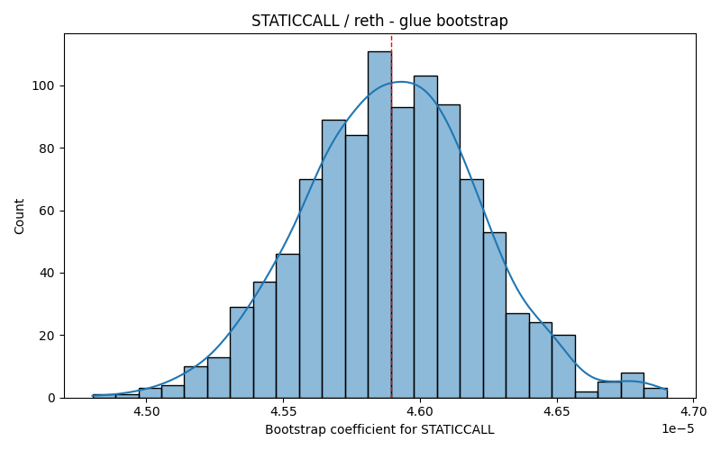

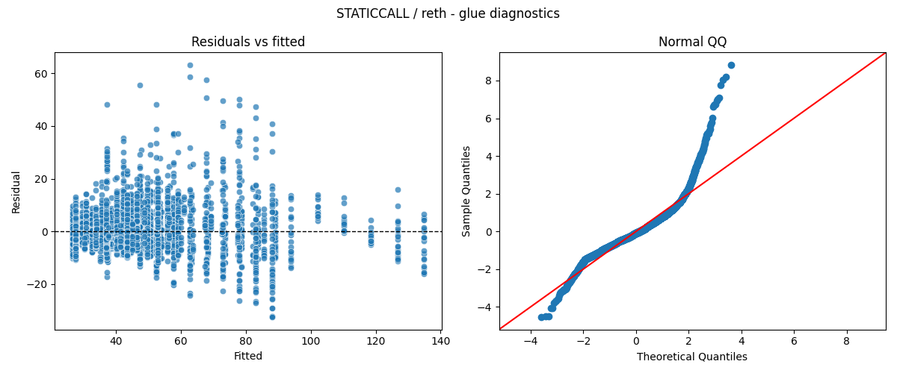

</details>

### Pure glue · reth

<details><summary><code>ISZERO</code> · nobs=99 · runtime_ms=3.91e-07 · p=1.00e-03 · R²=0.8047</summary>

```
==============================================================================
                           NNLS Regression Results                            
==============================================================================
Dep. Variable:          test_runtime_ms              R-squared:          0.805
Model:                  NNLS                    Adj. R-squared:          0.803
No. Observations:       99                                RMSE:           4.06
Df Residuals:           97                                 MAE:           3.03
Df Model:               1      
==============================================================================
                      coef     std err     P-value      [0.025      0.975]
------------------------------------------------------------------------------
         const      8.6134      1.2767       0.001      6.2558     11.1102
        ISZERO      0.0000      0.0000       0.001      0.0000      0.0000
==============================================================================
Notes: Non-negative least squares with bootstrap inference (1000 iterations)
==============================================================================
```

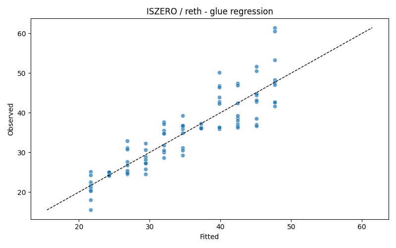

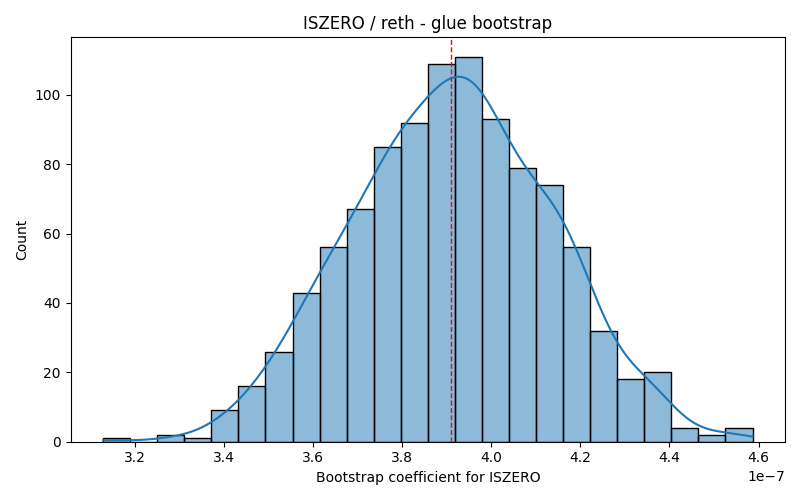

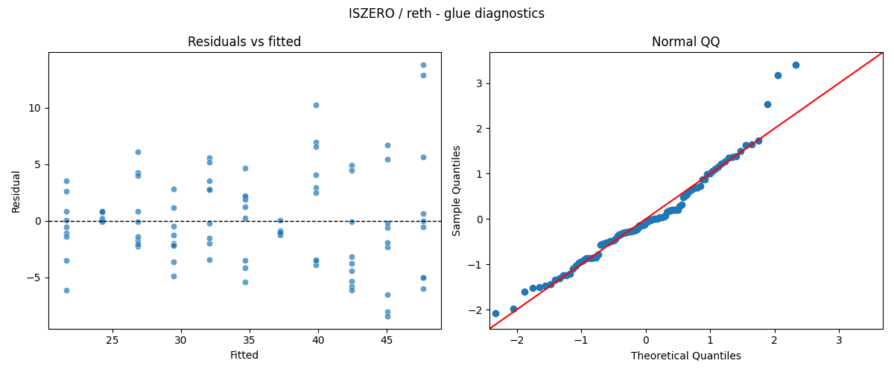

</details>

<details><summary><code>JUMPDEST</code> · nobs=99 · runtime_ms=2.849e-07 · p=1.00e-03 · R²=0.8688</summary>

```
==============================================================================
                           NNLS Regression Results                            
==============================================================================
Dep. Variable:          test_runtime_ms              R-squared:          0.869
Model:                  NNLS                    Adj. R-squared:          0.867
No. Observations:       99                                RMSE:           6.99
Df Residuals:           97                                 MAE:           5.32
Df Model:               1      
==============================================================================
                      coef     std err     P-value      [0.025      0.975]
------------------------------------------------------------------------------
         const     12.3229      2.3814       0.001      7.4238     16.9563
      JUMPDEST      0.0000      0.0000       0.001      0.0000      0.0000
==============================================================================
Notes: Non-negative least squares with bootstrap inference (1000 iterations)
==============================================================================
```

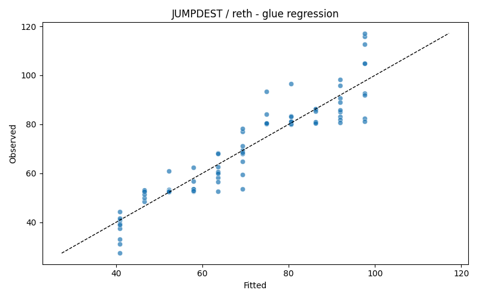

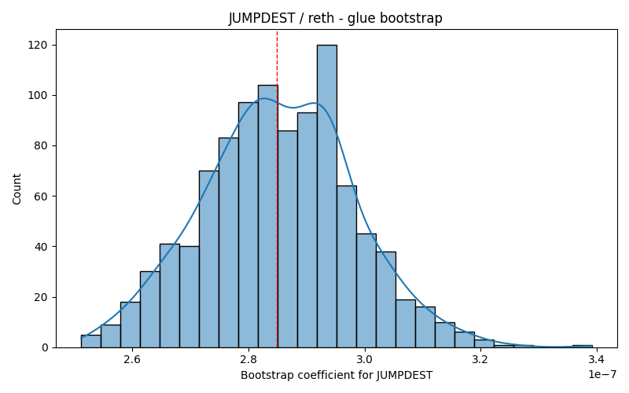


</details>

<details><summary><code>SWAP</code> · nobs=1760 · runtime_ms=4.776e-07 · p=1.00e-03 · R²=0.7873</summary>

```
==============================================================================
                           NNLS Regression Results                            
==============================================================================
Dep. Variable:          test_runtime_ms              R-squared:          0.787
Model:                  NNLS                    Adj. R-squared:          0.787
No. Observations:       1760                              RMSE:           5.23
Df Residuals:           1758                               MAE:           4.07
Df Model:               1      
==============================================================================
                      coef     std err     P-value      [0.025      0.975]
------------------------------------------------------------------------------
         const     11.0908      0.4065       0.001     10.2392     11.8584
          SWAP      0.0000      0.0000       0.001      0.0000      0.0000
==============================================================================
Notes: Non-negative least squares with bootstrap inference (1000 iterations)
==============================================================================
```

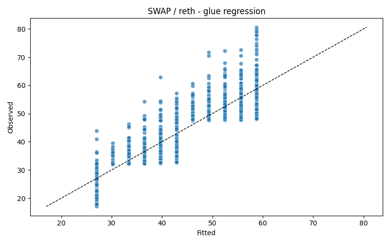

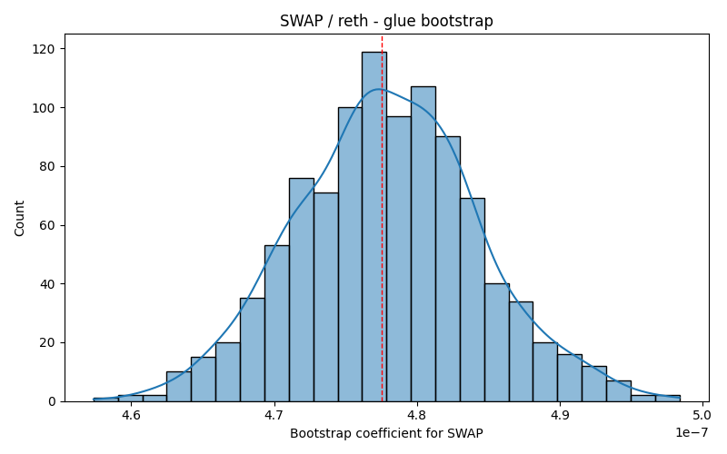

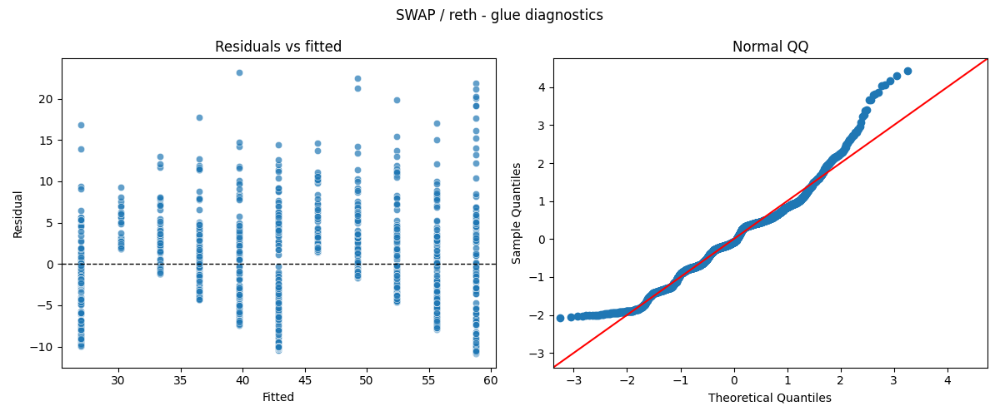

</details>

### Mixed glue (tier A) · reth

<details><summary><code>ADD</code> · nobs=99 · runtime_ms=5.511e-07 · p=1.00e-03 · R²=0.5385</summary>

```
==============================================================================
                           NNLS Regression Results                            
==============================================================================
Dep. Variable:          test_runtime_ms              R-squared:          0.538
Model:                  NNLS                    Adj. R-squared:          0.534
No. Observations:       99                                RMSE:           5.37
Df Residuals:           97                                 MAE:           3.94
Df Model:               1      
==============================================================================
                      coef     std err     P-value      [0.025      0.975]
------------------------------------------------------------------------------
         const      7.6759      1.3720       0.001      5.0522     10.3686
           ADD      0.0000      0.0000       0.001      0.0000      0.0000
==============================================================================
Notes: Non-negative least squares with bootstrap inference (1000 iterations)
==============================================================================
```

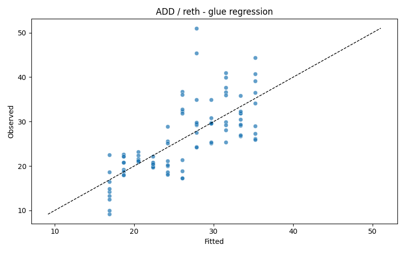

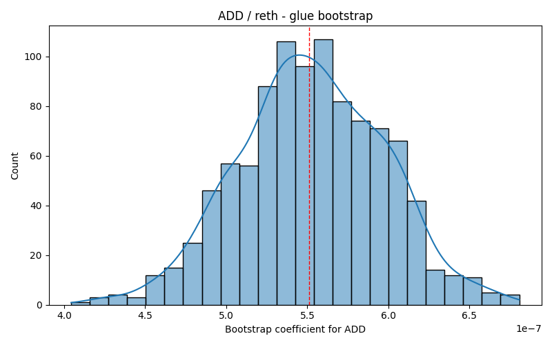

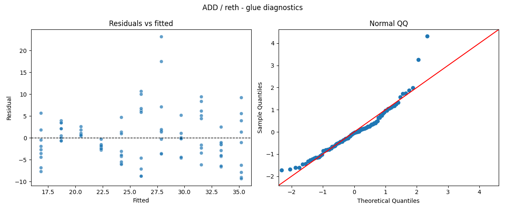

</details>

<details><summary><code>AND</code> · nobs=99 · runtime_ms=4.818e-07 · p=1.00e-03 · R²=0.5149</summary>

```
==============================================================================
                           NNLS Regression Results                            
==============================================================================
Dep. Variable:          test_runtime_ms              R-squared:          0.515
Model:                  NNLS                    Adj. R-squared:          0.510
No. Observations:       99                                RMSE:           4.92
Df Residuals:           97                                 MAE:           3.45
Df Model:               1      
==============================================================================
                      coef     std err     P-value      [0.025      0.975]
------------------------------------------------------------------------------
         const      9.2346      1.5900       0.001      6.0725     12.4320
           AND      0.0000      0.0000       0.001      0.0000      0.0000
==============================================================================
Notes: Non-negative least squares with bootstrap inference (1000 iterations)
==============================================================================
```

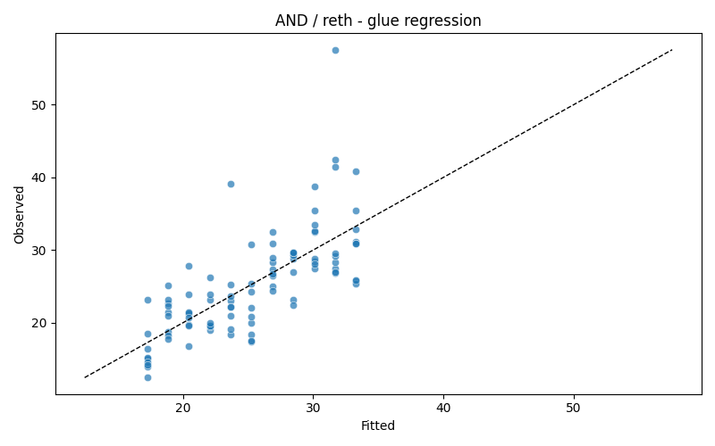


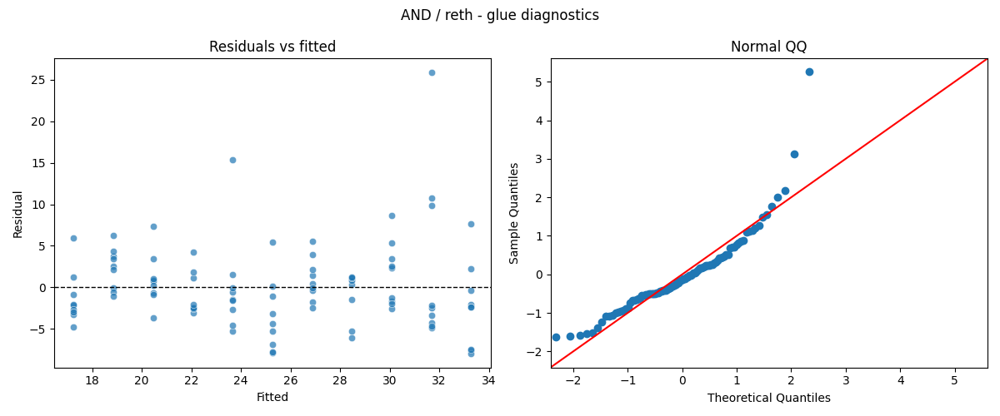

</details>

<details><summary><code>CALLDATACOPY</code> · nobs=2376 · runtime_ms=8.486e-07 · p=1.00e-03 · R²=0.3661</summary>

```
==============================================================================
                           NNLS Regression Results                            
==============================================================================
Dep. Variable:          test_runtime_ms              R-squared:          0.366
Model:                  NNLS                    Adj. R-squared:          0.366
No. Observations:       2376                              RMSE:           8.40
Df Residuals:           2374                               MAE:           6.40
Df Model:               1      
==============================================================================
                      coef     std err     P-value      [0.025      0.975]
------------------------------------------------------------------------------
         const     12.4734      0.2129       0.001     12.0629     12.8966
  CALLDATACOPY      0.0000      0.0000       0.001      0.0000      0.0000
==============================================================================
Notes: Non-negative least squares with bootstrap inference (1000 iterations)
==============================================================================
```

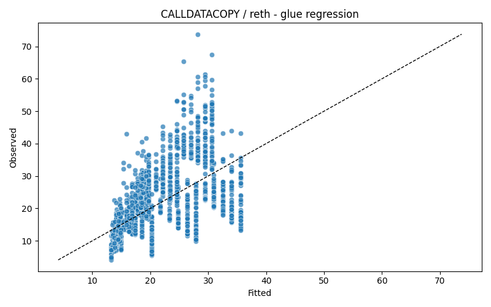

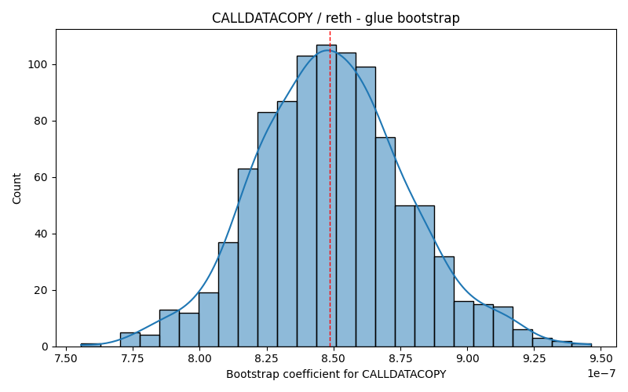

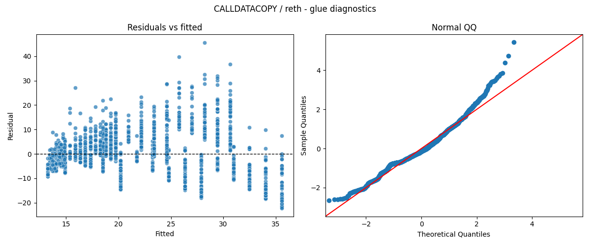

</details>

<details><summary><code>CALLDATALOAD</code> · nobs=396 · runtime_ms=4.219e-05 · p=1.00e-03 · R²=0.4552</summary>

```
==============================================================================
                           NNLS Regression Results                            
==============================================================================
Dep. Variable:          test_runtime_ms              R-squared:          0.455
Model:                  NNLS                    Adj. R-squared:          0.454
No. Observations:       396                               RMSE:           0.18
Df Residuals:           394                                MAE:           0.13
Df Model:               1      
==============================================================================
                      coef     std err     P-value      [0.025      0.975]
------------------------------------------------------------------------------
         const      1.1973      0.0274       0.001      1.1421      1.2509
  CALLDATALOAD      0.0000      0.0000       0.001      0.0000      0.0000
==============================================================================
Notes: Non-negative least squares with bootstrap inference (1000 iterations)
==============================================================================
```

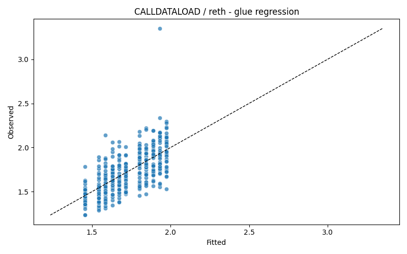

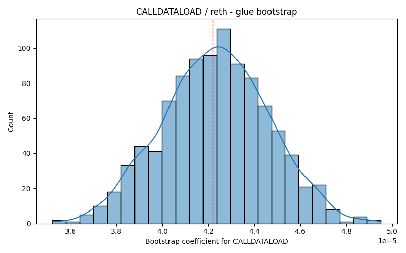

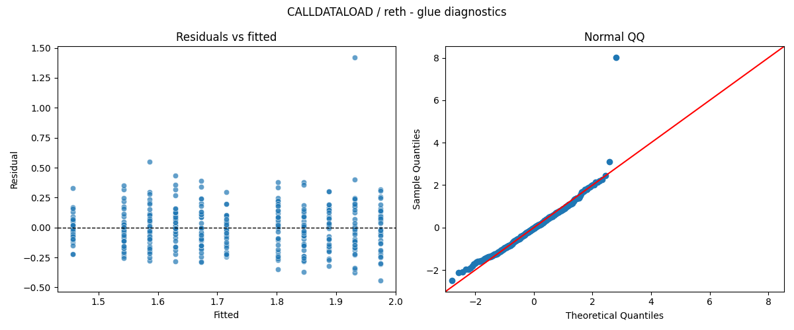

</details>

<details><summary><code>DIV</code> · nobs=99 · runtime_ms=6.593e-06 · p=1.00e-03 · R²=0.8125</summary>

```
==============================================================================
                           NNLS Regression Results                            
==============================================================================
Dep. Variable:          test_runtime_ms              R-squared:          0.812
Model:                  NNLS                    Adj. R-squared:          0.811
No. Observations:       99                                RMSE:          25.00
Df Residuals:           97                                 MAE:          21.02
Df Model:               1      
==============================================================================
                      coef     std err     P-value      [0.025      0.975]
------------------------------------------------------------------------------
         const     55.0211      9.3538       0.001     36.6781     74.0580
           DIV      0.0000      0.0000       0.001      0.0000      0.0000
==============================================================================
Notes: Non-negative least squares with bootstrap inference (1000 iterations)
==============================================================================
```

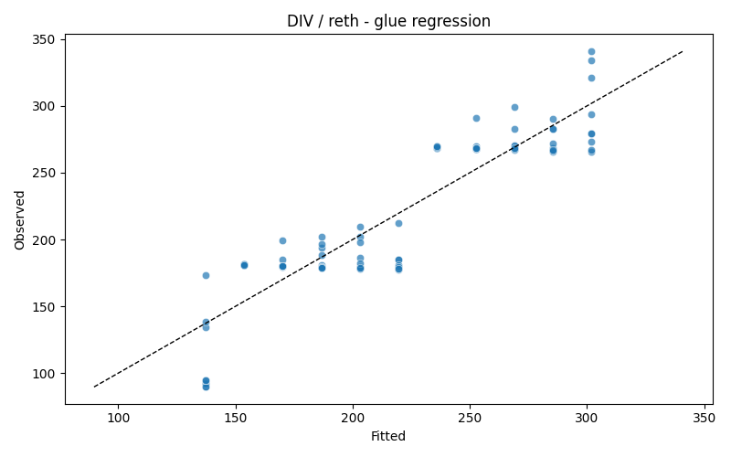


</details>

<details><summary><code>EXP</code> · nobs=99 · runtime_ms=0.000336 · p=1.00e-03 · R²=0.8142</summary>

```
==============================================================================
                           NNLS Regression Results                            
==============================================================================
Dep. Variable:          test_runtime_ms              R-squared:          0.814
Model:                  NNLS                    Adj. R-squared:          0.812
No. Observations:       99                                RMSE:           6.28
Df Residuals:           97                                 MAE:           4.85
Df Model:               1      
==============================================================================
                      coef     std err     P-value      [0.025      0.975]
------------------------------------------------------------------------------
         const     21.4310      2.0224       0.001     17.3797     25.4185
           EXP      0.0003      0.0000       0.001      0.0003      0.0004
==============================================================================
Notes: Non-negative least squares with bootstrap inference (1000 iterations)
==============================================================================
```

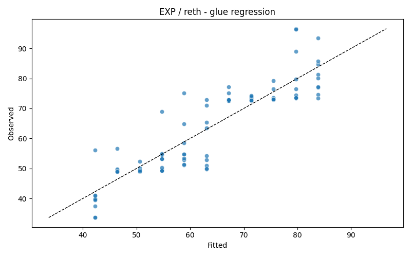

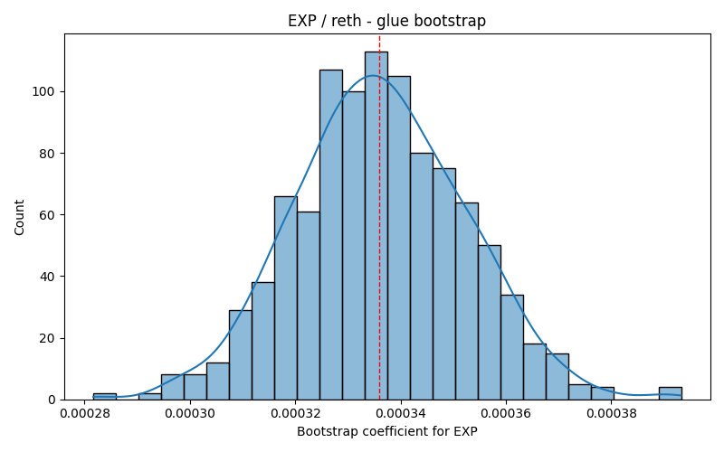

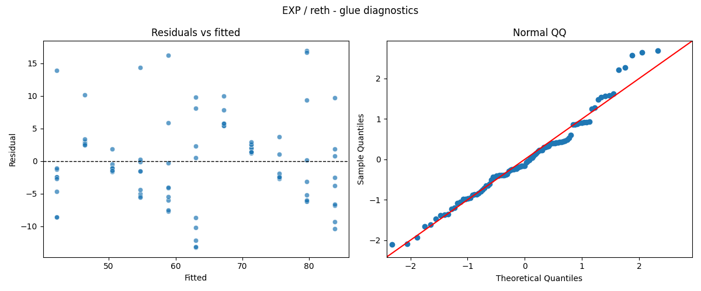

</details>

<details><summary><code>GT</code> · nobs=99 · runtime_ms=5.473e-07 · p=1.00e-03 · R²=0.5688</summary>

```
==============================================================================
                           NNLS Regression Results                            
==============================================================================
Dep. Variable:          test_runtime_ms              R-squared:          0.569
Model:                  NNLS                    Adj. R-squared:          0.564
No. Observations:       99                                RMSE:           5.02
Df Residuals:           97                                 MAE:           3.80
Df Model:               1      
==============================================================================
                      coef     std err     P-value      [0.025      0.975]
------------------------------------------------------------------------------
         const     11.1700      1.3798       0.001      8.5178     13.8672
            GT      0.0000      0.0000       0.001      0.0000      0.0000
==============================================================================
Notes: Non-negative least squares with bootstrap inference (1000 iterations)
==============================================================================
```

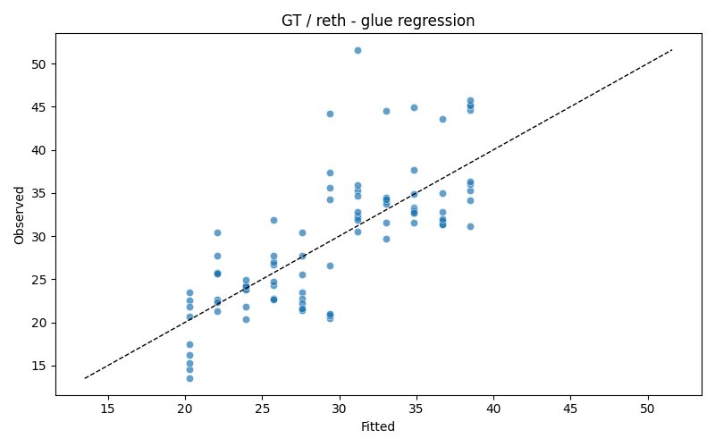

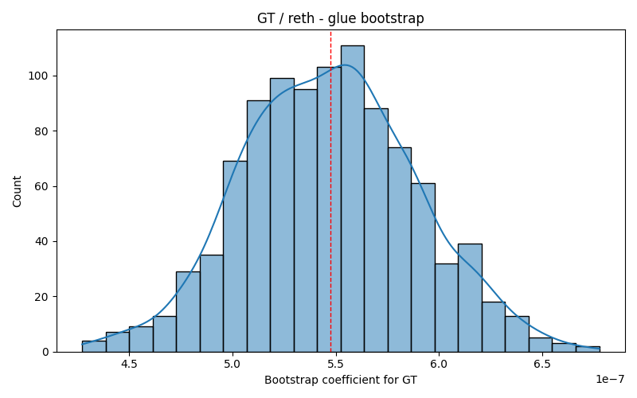

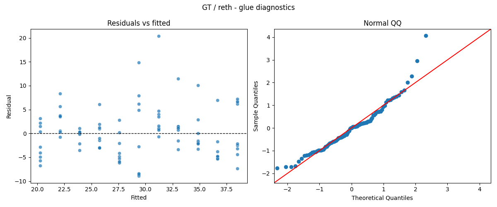

</details>

<details><summary><code>JUMPI</code> · nobs=99 · runtime_ms=6.08e-07 · p=1.00e-03 · R²=0.2965</summary>

```
==============================================================================
                           NNLS Regression Results                            
==============================================================================
Dep. Variable:          test_runtime_ms              R-squared:          0.296
Model:                  NNLS                    Adj. R-squared:          0.289
No. Observations:       99                                RMSE:           4.23
Df Residuals:           97                                 MAE:           2.54
Df Model:               1      
==============================================================================
                      coef     std err     P-value      [0.025      0.975]
------------------------------------------------------------------------------
         const      5.6254      1.5526       0.005      2.1968      8.0696
         JUMPI      0.0000      0.0000       0.001      0.0000      0.0000
==============================================================================
Notes: Non-negative least squares with bootstrap inference (1000 iterations)
==============================================================================
```

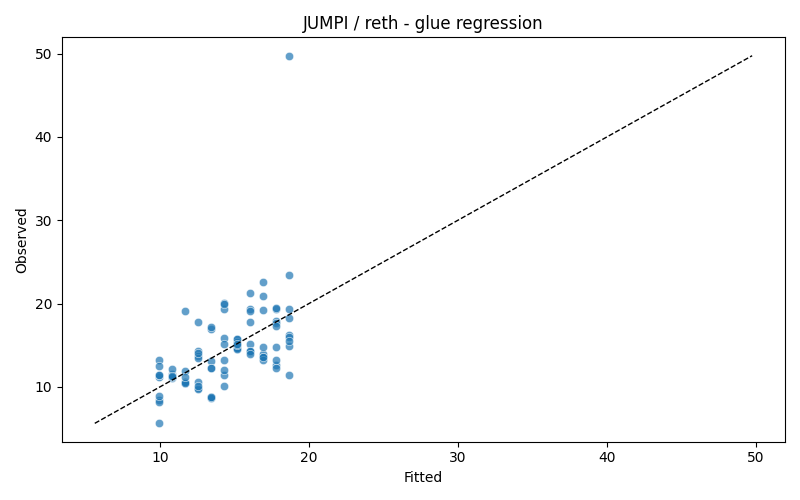

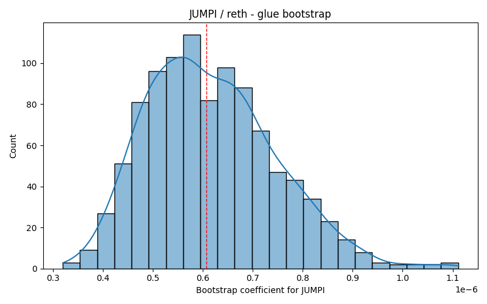

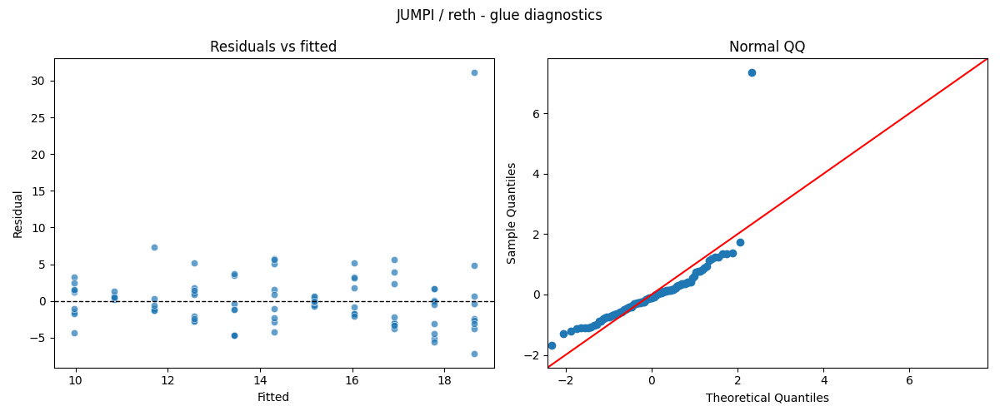

</details>

<details><summary><code>LT</code> · nobs=99 · runtime_ms=5.048e-07 · p=1.00e-03 · R²=0.5257</summary>

```
==============================================================================
                           NNLS Regression Results                            
==============================================================================
Dep. Variable:          test_runtime_ms              R-squared:          0.526
Model:                  NNLS                    Adj. R-squared:          0.521
No. Observations:       99                                RMSE:           5.05
Df Residuals:           97                                 MAE:           3.55
Df Model:               1      
==============================================================================
                      coef     std err     P-value      [0.025      0.975]
------------------------------------------------------------------------------
         const      9.9322      1.5258       0.001      7.0382     12.9171
            LT      0.0000      0.0000       0.001      0.0000      0.0000
==============================================================================
Notes: Non-negative least squares with bootstrap inference (1000 iterations)
==============================================================================
```

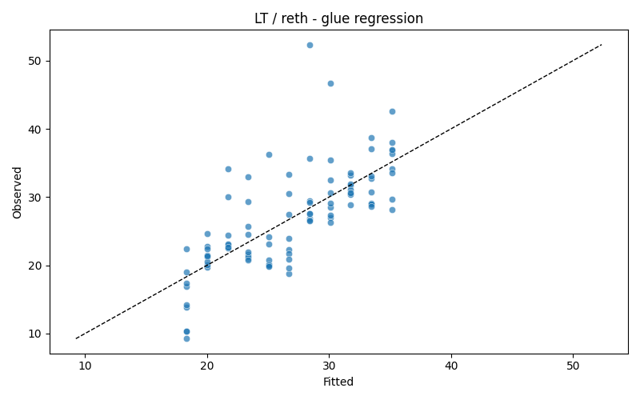

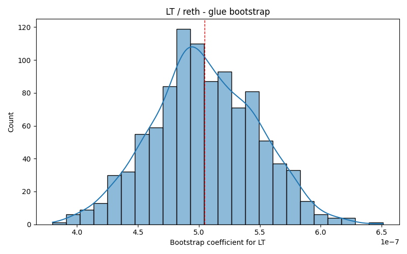

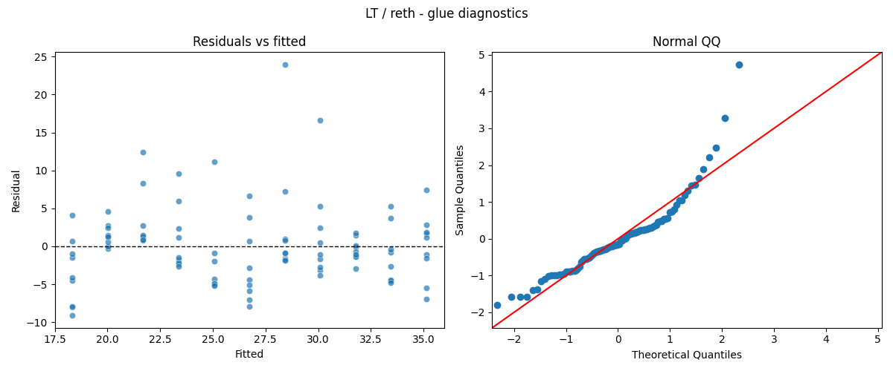

</details>

<details><summary><code>MSTORE</code> · nobs=495 · runtime_ms=1.883e-06 · p=1.00e-03 · R²=0.1527</summary>

```
==============================================================================
                           NNLS Regression Results                            
==============================================================================
Dep. Variable:          test_runtime_ms              R-squared:          0.153
Model:                  NNLS                    Adj. R-squared:          0.151
No. Observations:       495                               RMSE:          31.13
Df Residuals:           493                                MAE:          28.31
Df Model:               1      
==============================================================================
                      coef     std err     P-value      [0.025      0.975]
------------------------------------------------------------------------------
         const     20.4485      4.0682       0.001     12.5974     28.4746
        MSTORE      0.0000      0.0000       0.001      0.0000      0.0000
==============================================================================
Notes: Non-negative least squares with bootstrap inference (1000 iterations)
==============================================================================
```

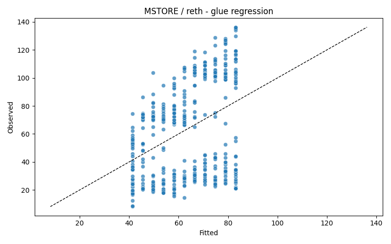

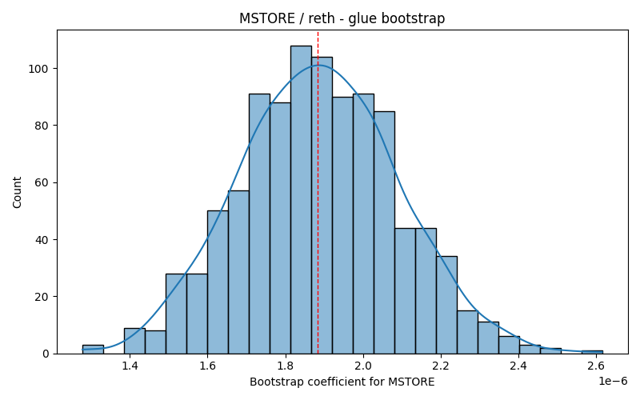

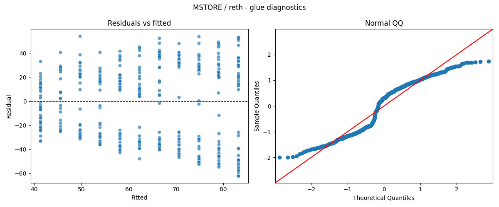

</details>

<details><summary><code>MSTORE8</code> · nobs=495 · runtime_ms=4.232e-07 · p=1.00e-03 · R²=0.1335</summary>

```
==============================================================================
                           NNLS Regression Results                            
==============================================================================
Dep. Variable:          test_runtime_ms              R-squared:          0.133
Model:                  NNLS                    Adj. R-squared:          0.132
No. Observations:       495                               RMSE:           7.57
Df Residuals:           493                                MAE:           4.66
Df Model:               1      
==============================================================================
                      coef     std err     P-value      [0.025      0.975]
------------------------------------------------------------------------------
         const     13.0196      1.3337       0.001     10.7597     15.7752
       MSTORE8      0.0000      0.0000       0.001      0.0000      0.0000
==============================================================================
Notes: Non-negative least squares with bootstrap inference (1000 iterations)
==============================================================================
```

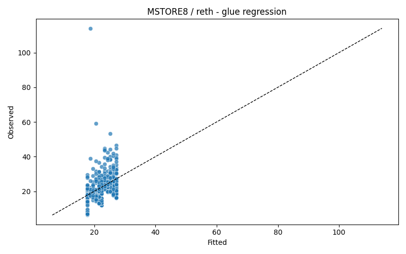

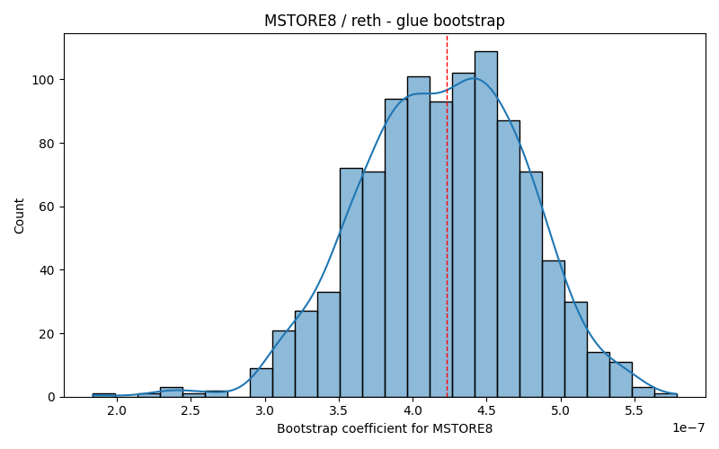

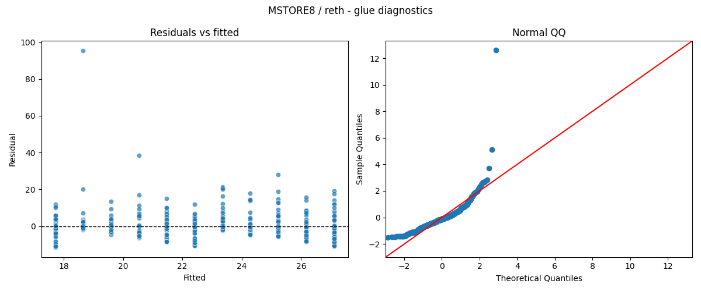

</details>

<details><summary><code>MUL</code> · nobs=99 · runtime_ms=6.95e-07 · p=1.00e-03 · R²=0.6244</summary>

```
==============================================================================
                           NNLS Regression Results                            
==============================================================================
Dep. Variable:          test_runtime_ms              R-squared:          0.624
Model:                  NNLS                    Adj. R-squared:          0.621
No. Observations:       99                                RMSE:           4.26
Df Residuals:           97                                 MAE:           3.30
Df Model:               1      
==============================================================================
                      coef     std err     P-value      [0.025      0.975]
------------------------------------------------------------------------------
         const     10.4012      1.2830       0.001      7.6552     12.8283
           MUL      0.0000      0.0000       0.001      0.0000      0.0000
==============================================================================
Notes: Non-negative least squares with bootstrap inference (1000 iterations)
==============================================================================
```

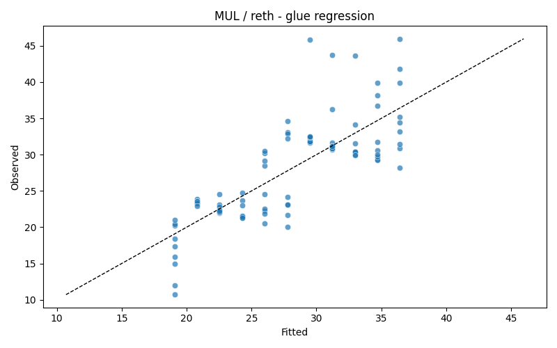

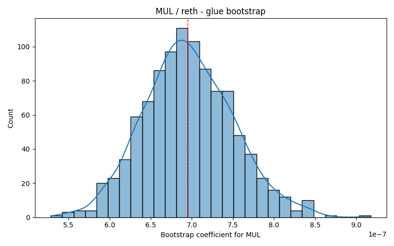

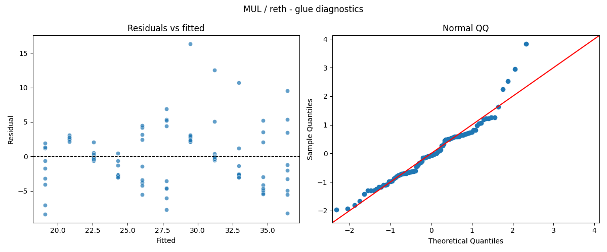

</details>

<details><summary><code>PC</code> · nobs=99 · runtime_ms=5.606e-07 · p=1.00e-03 · R²=0.9071</summary>

```
==============================================================================
                           NNLS Regression Results                            
==============================================================================
Dep. Variable:          test_runtime_ms              R-squared:          0.907
Model:                  NNLS                    Adj. R-squared:          0.906
No. Observations:       99                                RMSE:           5.36
Df Residuals:           97                                 MAE:           3.98
Df Model:               1      
==============================================================================
                      coef     std err     P-value      [0.025      0.975]
------------------------------------------------------------------------------
         const     12.9515      1.9104       0.001      9.4289     16.8012
            PC      0.0000      0.0000       0.001      0.0000      0.0000
==============================================================================
Notes: Non-negative least squares with bootstrap inference (1000 iterations)
==============================================================================
```

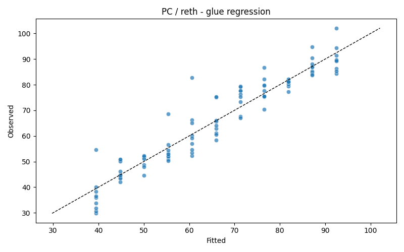

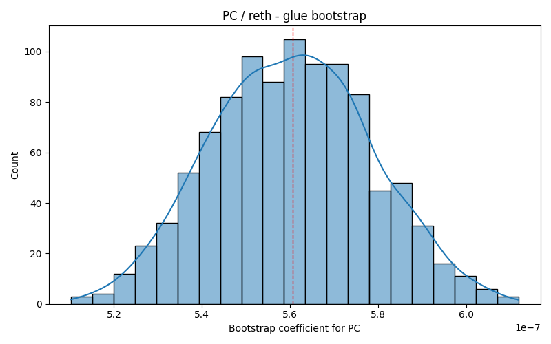

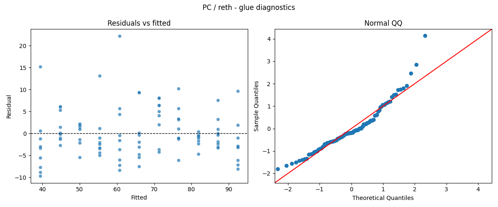

</details>

<details><summary><code>RETURNDATASIZE</code> · nobs=396 · runtime_ms=9.056e-07 · p=1.00e-03 · R²=0.8551</summary>

```
==============================================================================
                           NNLS Regression Results                            
==============================================================================
Dep. Variable:          test_runtime_ms              R-squared:          0.855
Model:                  NNLS                    Adj. R-squared:          0.855
No. Observations:       396                               RMSE:           5.89
Df Residuals:           394                                MAE:           4.61
Df Model:               1      
==============================================================================
                      coef     std err     P-value      [0.025      0.975]
------------------------------------------------------------------------------
         const     11.6661      0.9771       0.001      9.7777     13.5606
RETURNDATASIZE      0.0000      0.0000       0.001      0.0000      0.0000
==============================================================================
Notes: Non-negative least squares with bootstrap inference (1000 iterations)
==============================================================================
```

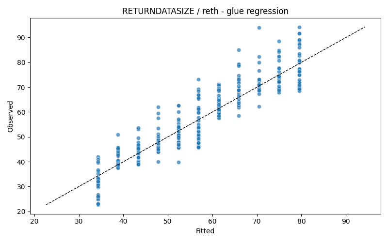

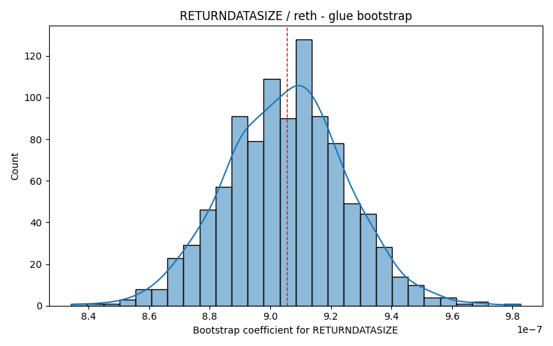

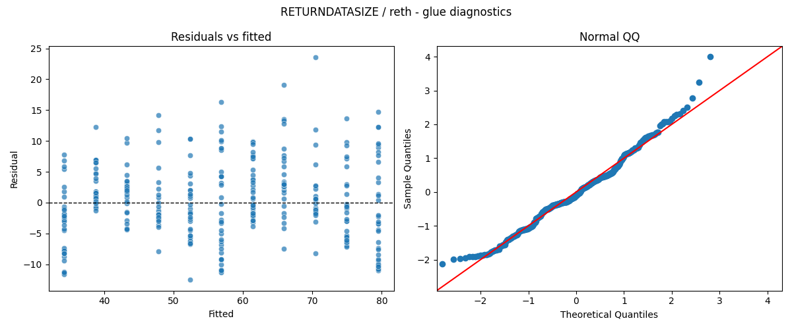

</details>

<details><summary><code>SELFBALANCE</code> · nobs=81 · runtime_ms=3.844e-06 · p=1.00e-03 · R²=0.8252</summary>

```
==============================================================================
                           NNLS Regression Results                            
==============================================================================
Dep. Variable:          test_runtime_ms              R-squared:          0.825
Model:                  NNLS                    Adj. R-squared:          0.823
No. Observations:       81                                RMSE:          17.85
Df Residuals:           79                                 MAE:          14.78
Df Model:               1      
==============================================================================
                      coef     std err     P-value      [0.025      0.975]
------------------------------------------------------------------------------
         const     54.2400      6.6605       0.001     40.5920     66.8323
   SELFBALANCE      0.0000      0.0000       0.001      0.0000      0.0000
==============================================================================
Notes: Non-negative least squares with bootstrap inference (1000 iterations)
==============================================================================
```

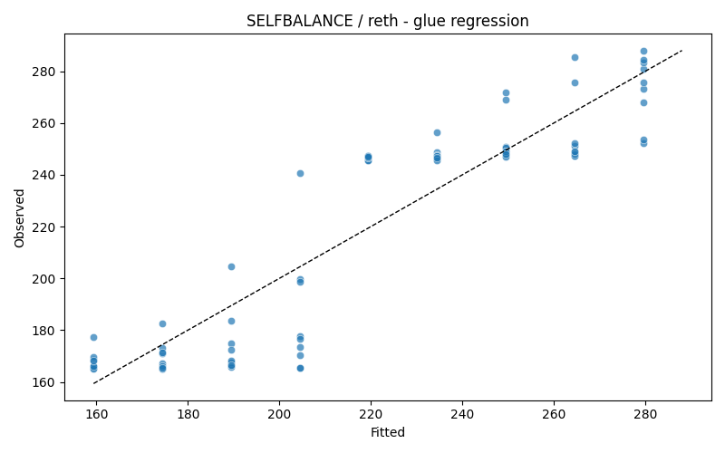

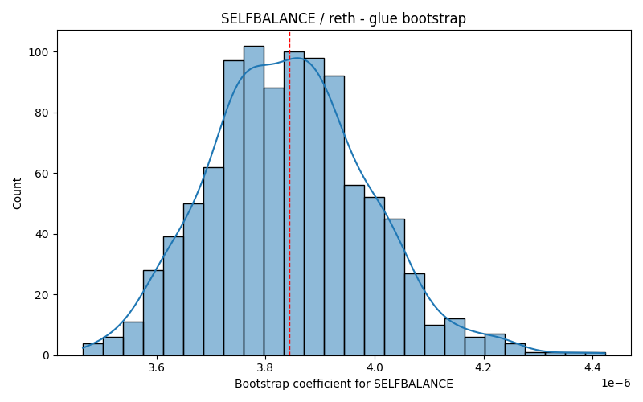

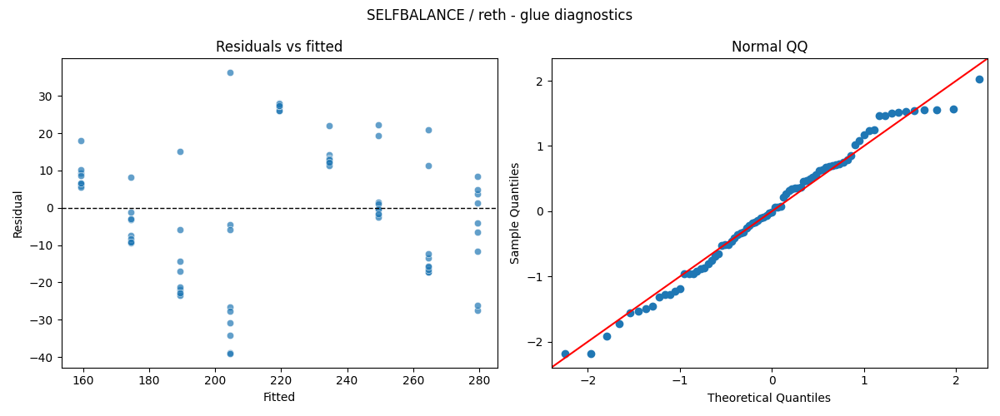

</details>

<details><summary><code>SUB</code> · nobs=99 · runtime_ms=5.337e-07 · p=1.00e-03 · R²=0.527</summary>

```
==============================================================================
                           NNLS Regression Results                            
==============================================================================
Dep. Variable:          test_runtime_ms              R-squared:          0.527
Model:                  NNLS                    Adj. R-squared:          0.522
No. Observations:       99                                RMSE:           5.32
Df Residuals:           97                                 MAE:           3.99
Df Model:               1      
==============================================================================
                      coef     std err     P-value      [0.025      0.975]
------------------------------------------------------------------------------
         const     10.1394      1.5645       0.001      6.9463     13.1352
           SUB      0.0000      0.0000       0.001      0.0000      0.0000
==============================================================================
Notes: Non-negative least squares with bootstrap inference (1000 iterations)
==============================================================================
```

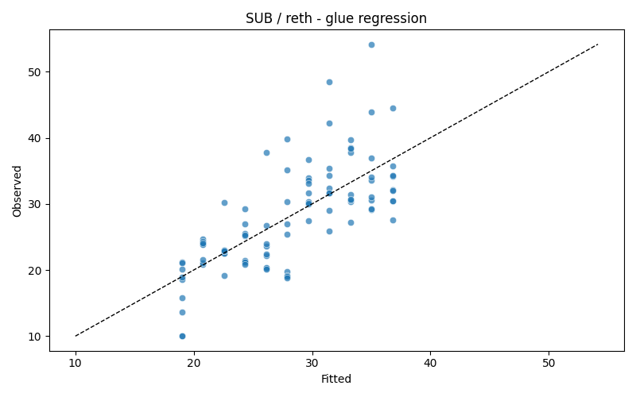

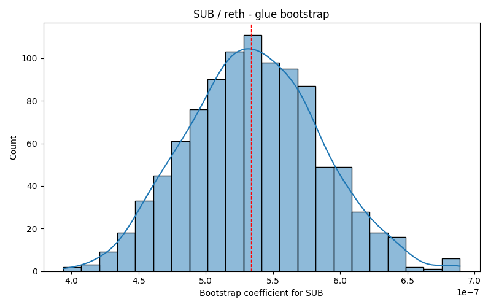

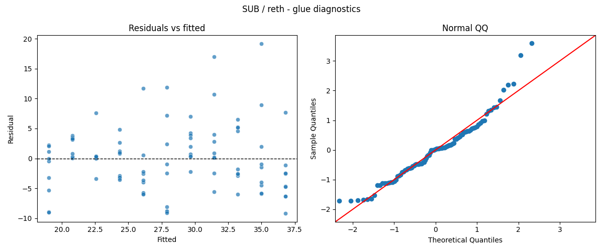

</details>

### Mixed glue (tier B) · reth

<details><summary><code>JUMP</code> · nobs=99 · runtime_ms=1.859e-07 · p=6.60e-02 · R²=0.0268</summary>

```
==============================================================================
                           NNLS Regression Results                            
==============================================================================
Dep. Variable:          test_runtime_ms              R-squared:          0.027
Model:                  NNLS                    Adj. R-squared:          0.017
No. Observations:       99                                RMSE:           4.16
Df Residuals:           97                                 MAE:           3.26
Df Model:               1      
==============================================================================
                      coef     std err     P-value      [0.025      0.975]
------------------------------------------------------------------------------
         const     10.7673      1.4712       0.001      7.6693     13.2927
          JUMP      0.0000      0.0000       0.066      0.0000      0.0000
==============================================================================
Notes: Non-negative least squares with bootstrap inference (1000 iterations)
==============================================================================
```

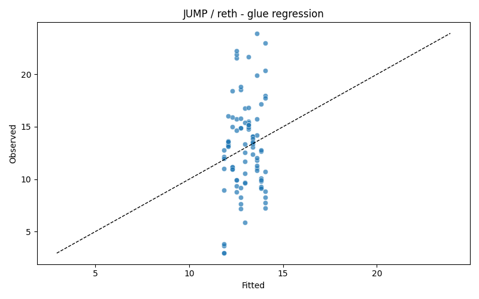

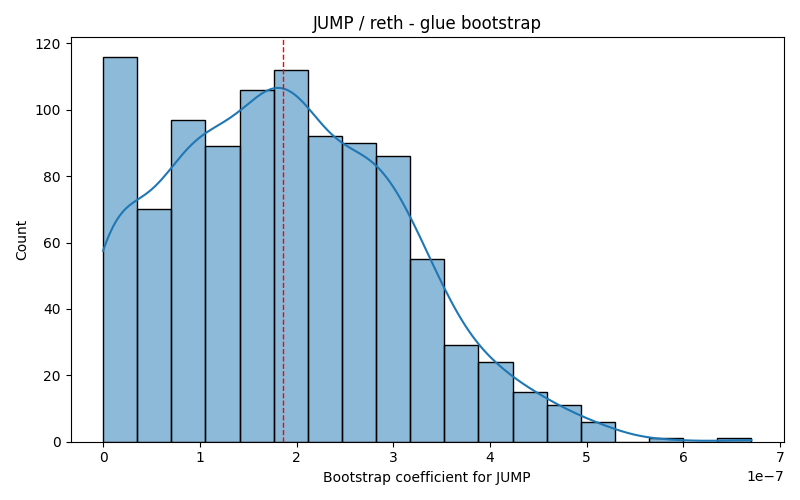

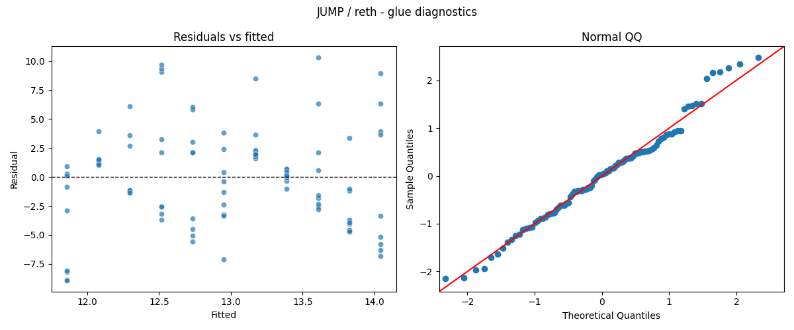

</details>

<details><summary><code>KECCAK256</code> · nobs=1584 · runtime_ms=0 · p=1.00e+00 · R²=0</summary>

```
==============================================================================
                           NNLS Regression Results                            
==============================================================================
Dep. Variable:          test_runtime_ms              R-squared:          0.000
Model:                  NNLS                    Adj. R-squared:         -0.001
No. Observations:       1584                              RMSE:         162.01
Df Residuals:           1582                               MAE:         136.74
Df Model:               1      
==============================================================================
                      coef     std err     P-value      [0.025      0.975]
------------------------------------------------------------------------------
         const    249.7528      4.0703       0.001    241.9457    257.7491
     KECCAK256      0.0000      0.0000       1.000      0.0000      0.0000
==============================================================================
Notes: Non-negative least squares with bootstrap inference (1000 iterations)
==============================================================================
```

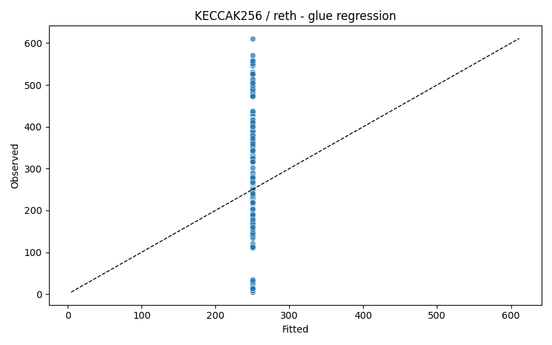


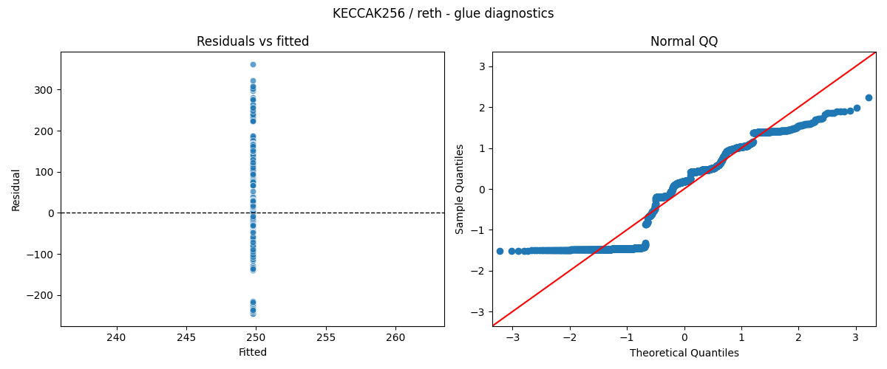

</details>
